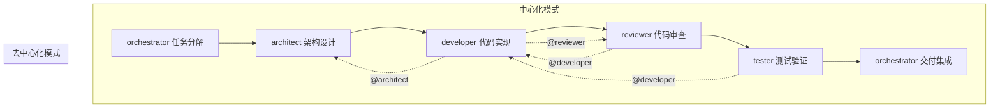

# 角色协作场景

本章定义多智能体协作系统的运行模式，说明角色如何基于 [角色定义](./) 与 [协作协议](../protocols/) 自动组队并完成工作。

## 场景概述

系统支持两种协作模式，两种模式可并存互补：中心化模式保障整体流程有序推进，去中心化模式提升局部协作效率。

- **中心化模式**：由 [orchestrator](orchestrator.md) 主导组队，依据任务分解结果向各角色分配工作并协调全流程，适用于跨角色的大型任务。
- **去中心化模式**：任意角色在执行过程中遇到超出自身职责边界的问题时，可通过 `@角色名` 语法直接向其他角色发起协作请求，适用于执行过程中的局部协作需求。

## 触发条件

### 中心化模式触发

orchestrator 接收复杂任务且任务超出单角色能力范围。例如"实现新功能模块"需同时涉及架构设计、代码实现、代码审查与测试验证，由 orchestrator 统一分解并分配。

### 去中心化模式触发

任意角色在执行过程中遇到超出自身职责边界的问题。典型示例如下：

- developer 完成代码实现后 `@reviewer` 请求代码审查
- developer 遇到架构决策问题时 `@architect` 请求方案评审
- reviewer 发现安全漏洞时 `@developer` 反馈修复请求
- tester 发现缺陷时 `@developer` 请求修复

## 团队成员选择机制

orchestrator 依据角色 frontmatter 的 `Responsibilities` 字段匹配所需角色，依据 `Non-Goals` 字段排除不相关角色，确保任务分配精准且不越界。

| 任务类型 | 主导角色 | 协作角色 | 排除角色（依据 Non-Goals） |
|---|---|---|---|
| 任务分解与分配 | orchestrator | — | developer/architect/tester/reviewer |
| 架构设计与决策 | architect | orchestrator | developer/tester/reviewer |
| 代码实现与重构 | developer | architect | orchestrator/reviewer/tester |
| 代码质量审查 | reviewer | developer | orchestrator/architect/tester |
| 测试用例与验收 | tester | developer | orchestrator/architect/reviewer |

## 协作流程

协作流程包含六个环节，各环节主导角色依次为：任务分解（orchestrator）→ 架构设计（architect）→ 代码实现（developer）→ 代码审查（reviewer）→ 测试验证（tester）→ 交付集成（orchestrator）。

## 任务分配方式

orchestrator 依据角色 frontmatter 的 `bindings.rules` 绑定的协作协议进行任务交接。例如 orchestrator 绑定了 [handoff.md](../protocols/handoff.md) 与 [messaging.md](../protocols/messaging.md)，交接时采用 YAML 格式记录任务上下文、已完成工作与待办事项。

| 任务示例 | 分配给 | 交接协议 | 优先级 |
|---|---|---|---|
| 设计新模块架构方案 | architect | handoff.md | high |
| 实现用户认证模块 | developer | handoff.md | high |
| 审查 PR #42 代码质量 | reviewer | messaging.md | medium |
| 编写认证模块测试用例 | tester | handoff.md | medium |

角色相互 @ 时遵循 [messaging.md](../protocols/messaging.md) 协议进行直接通信，消息类型包括 `question`、`review_request`、`status_update`、`conflict_report` 等。

## 角色相互 @ 机制

任意角色可使用 `@角色名` 语法直接发起协作请求，无需经 orchestrator 中转，但需遵循 messaging 协议留存消息记录。

### @ 语法示例

- `@architect 请求架构评审：用户认证模块技术选型`
- `@reviewer 请求代码审查：PR #42 已就绪`
- `@developer 请求修复：reviewer 发现 SQL 注入漏洞`
- `@tester 请求验收：认证模块已通过自测`

### 协作矩阵表

| 发起方 @ 接收方 | 目的 | 消息类型 |
|---|---|---|
| developer @ architect | 架构决策咨询 | question |
| developer @ reviewer | 请求代码审查 | review_request |
| reviewer @ developer | 反馈审查问题 | status_update |
| tester @ developer | 报告缺陷与修复请求 | conflict_report |
| architect @ developer | 同步设计变更 | status_update |

## 预期工作成果

协作完成后产出以下交付物，由各角色依据自身职责维护并留存备查：

| 交付物 | 产出角色 | 存放位置 |
|---|---|---|
| 架构方案 | architect | docs/knowledge/decisions/ |
| 实现代码 | developer | src/ |
| 审查报告 | reviewer | docs/reviews/ |
| 测试用例 | tester | tests/ |
| 技术文档 | developer | docs/ |

所有交付物须通过 reviewer 的质量审查与 tester 的验收测试后方可纳入版本控制，确保协作成果符合项目规范。
