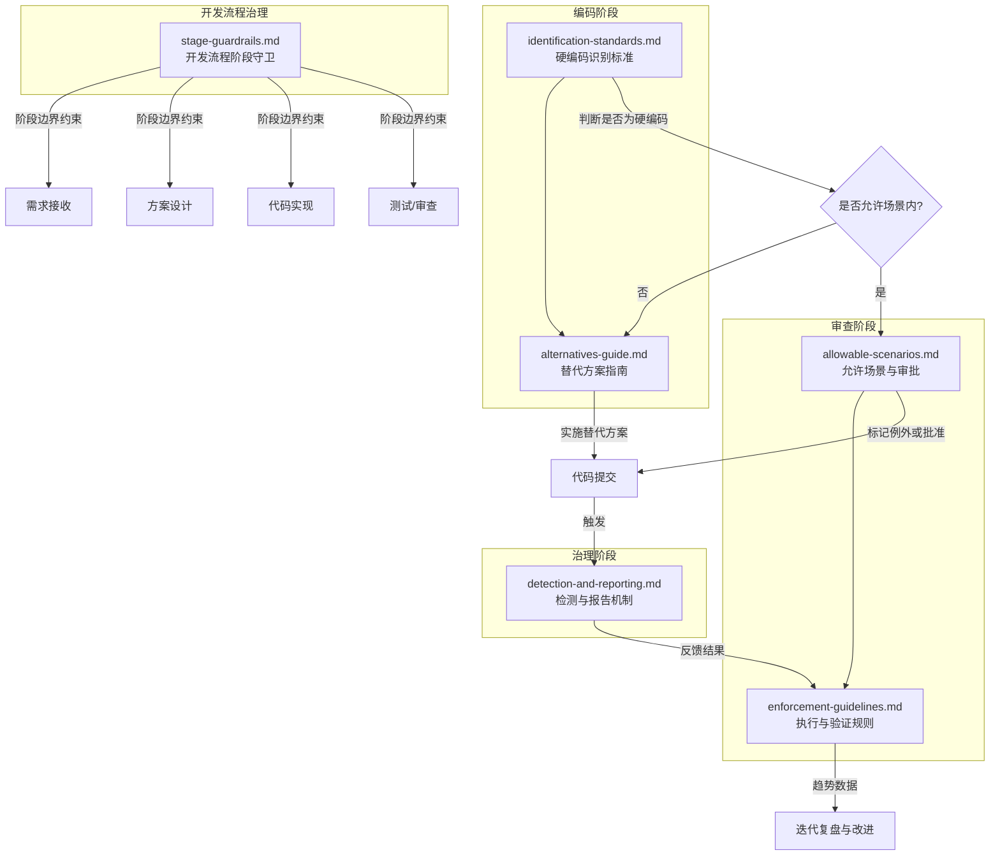
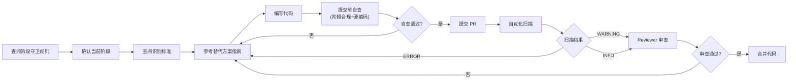
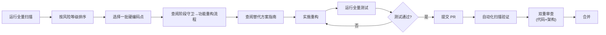
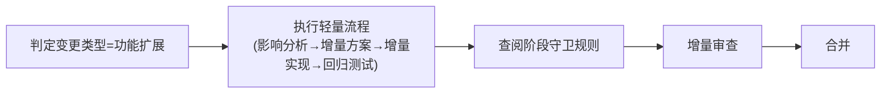

# 治理规则体系

本目录收录了项目的完整治理规则体系，涵盖硬编码治理、开发流程阶段守卫两大核心模块。所有开发者和智能体在编写代码、执行开发任务时，均应参照本规则体系确保开发过程得到系统性约束。

## 规则体系架构

## 规则文档清单

| 文档 | 用途 | 适用阶段 | 适用角色 |
|---|---|---|---|
| [stage-guardrails.md](./stage-guardrails.md) | 开发流程阶段守卫规则：阶段边界定义、跨阶段拦截机制、阶段跳转审批流程 | 全阶段 | 全部角色 |
| [spec-writing-guide.md](./spec-writing-guide.md) | Spec 文档编写指南（标准章节结构、必需元素、编写规范与示例） | 编码、规范编写 | developer, reviewer |
| [spec-version-control.md](./spec-version-control.md) | Spec 文档版本控制规范（版本号规则、变更日志、弃用流程） | 编码、版本管理 | developer, reviewer |
| [identification-standards.md](./identification-standards.md) | 定义 8 大类硬编码的识别标准、正例反例、检测要点 | 编码、审查 | developer, reviewer |
| [allowable-scenarios.md](./allowable-scenarios.md) | 规定允许硬编码的 4 类场景、例外审批流程、例外清单模板 | 审查 | developer, reviewer, architect, orchestrator |
| [alternatives-guide.md](./alternatives-guide.md) | 提供 7 种替代方案的实施指南、代码示例、模板脚手架 | 编码、重构 | developer |
| [detection-and-reporting.md](./detection-and-reporting.md) | 建立三层检测体系（自动化扫描、人工审查、定期报告）的规范 | 全阶段 | developer, reviewer, orchestrator |
| [enforcement-guidelines.md](./enforcement-guidelines.md) | 定义 6 条可执行治理规则、验证手段、合规等级 | 全阶段 | 全部角色 |

## 快速导航

### 按场景导航

| 场景 | 应查阅的文档 |
|---|---|
| 我要执行一个开发任务，需要遵守什么流程？ | [stage-guardrails.md](./stage-guardrails.md) |
| 我不确定现在是否可以开始编码？ | [stage-guardrails.md](./stage-guardrails.md)（阶段边界与拦截规则） |
| 我需要跳过某个阶段或回退到上一阶段？ | [stage-guardrails.md](./stage-guardrails.md)（阶段跳转审批流程） |
| 我要编写一个新的 spec 文档 | [spec-writing-guide.md](./spec-writing-guide.md) |
| 我需要管理 spec 文档的版本变更 | [spec-version-control.md](./spec-version-control.md) |
| 我不确定这段代码算不算硬编码 | [identification-standards.md](./identification-standards.md) |
| 我需要写一段包含固定值的代码，怎么替代？ | [alternatives-guide.md](./alternatives-guide.md) |
| 我这个硬编码确实无法替代，怎么申请例外？ | [allowable-scenarios.md](./allowable-scenarios.md) |
| 我作为 reviewer 怎么审查硬编码问题？ | [identification-standards.md](./identification-standards.md) + [enforcement-guidelines.md](./enforcement-guidelines.md) |
| 我想知道项目硬编码的整体趋势 | [detection-and-reporting.md](./detection-and-reporting.md) |
| 我想建立自动化硬编码检测 | [detection-and-reporting.md](./detection-and-reporting.md) |
| 我不遵守规则会有什么后果？ | [enforcement-guidelines.md](./enforcement-guidelines.md) + [stage-guardrails.md](./stage-guardrails.md) |

### 按角色导航

| 角色 | 流程治理 | 编码阶段 | 审查阶段 | 治理阶段 |
|---|---|---|---|---|
| **developer** | stage-guardrails.md | identification-standards.md alternatives-guide.md | allowable-scenarios.md enforcement-guidelines.md | detection-and-reporting.md |
| **reviewer** | stage-guardrails.md | identification-standards.md | allowable-scenarios.md enforcement-guidelines.md | - |
| **architect** | stage-guardrails.md | - | allowable-scenarios.md enforcement-guidelines.md | detection-and-reporting.md |
| **orchestrator** | stage-guardrails.md | - | allowable-scenarios.md | detection-and-reporting.md enforcement-guidelines.md |
| **tester** | stage-guardrails.md | - | enforcement-guidelines.md | - |

## 规则体系使用流程

### 流程一：新功能开发

### 流程二：存量重构

### 流程三：功能扩展

## 与现有体系的关联

本规则体系与 `.agents/` 目录下的其他规范存在以下关联：

| 关联规范 | 关联方式 |
|---|---|
| `.agents/workflows/feature-development.md` | 阶段守卫规则定义了功能开发流程的阶段边界，工作流每个步骤嵌入守卫检查点 |
| `.agents/protocols/pre-document-reading.md` | 前置文档强制读取是阶段守卫的进入条件之一 |
| `.agents/workflows/code-review.md` | 硬编码检查与阶段合规性检查均已纳入代码审查清单 |
| `.agents/protocols/conflict-resolution.md` | 例外审批争议与阶段跳转分歧可升级至冲突解决协议 |
| `.agents/scripts/ci-check.ps1` / `ci-check.sh` | 自动化扫描建议集成至 CI 综合检查 |
| `docs/retrospective/hardcode/` | 历史复盘数据为硬编码规则制定提供依据 |
| `.agents/roles/` | 各角色 Non-Goals 中已纳入阶段守卫相关约束 |
| `AGENTS.md` | 路由表包含本规则体系的入口 |

## 规则维护

- 规则新增或变更应经过 architect 评审，并通过 orchestrator 通知所有相关智能体
- 每季度审查规则有效性，根据实际使用反馈调整识别标准和阈值
- 自动化扫描规则集应与 `.agents/scripts/` 下的检测脚本保持同步
- 例外清单应纳入版本控制，定期清理过期项
- 阶段守卫规则在功能演进实践中持续优化，如有频繁的合理越界场景应考虑调整阶段定义
