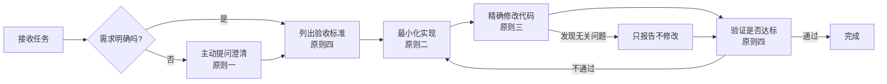

# AI 编码行为准则

> **来源**：蒸馏自 Andrej Karpathy 对 LLM 编程陷阱的观察，整合至 SpecWeave 规范体系
>
> **适用对象**：所有执行编码任务的 AI 智能体与使用 AI 辅助编程的开发者
>
> **核心理念**：明确目标、简约设计、精确修改、主动沟通——让 AI 成为靠谱的协作伙伴而非乱改代码的"猪队友"

---

## ⚡ 一分钟速查表

| 原则 | 口诀 | 核心要求 | 一句话反例 |
|------|------|---------|-----------|
| **1. 歧义主动澄清** | **不清楚就问，别瞎猜** | 不确定时停下来提问；有多种理解时列选项；发现更优方案主动说 | 你只说"加个验证"，我就写了全套企业级认证系统 |
| **2. 简约至上** | **能50行解决就别写200行** | 未要求的功能不写；只用一次的代码不抽象；未要求的灵活性不加；不可能的错误不处理 | 你要个Hello World，我给你搭了微服务架构 |
| **3. 精确编辑** | **让改哪就改哪，别顺手摸别的** | 只动被要求的部分；匹配现有风格；无关问题只提不改；自己造成的孤儿代码自己清 | 你让我修个bug，我重构了整个模块还删了你的注释 |
| **4. 目标驱动** | **给验收标准，别给步骤** | 描述"要什么"而非"怎么做"；用测试用例定义成功；复杂任务列计划带验证 | 你说"写个函数实现X"，结果写出来不对我也不知道怎么验证 |

---

## 📖 详细原则说明

### 原则一：歧义主动澄清（Think Before Coding）

**问题根源**：AI 倾向于"猜测意图并直接执行"，而不是承认自己不确定。用户说"加个验证功能"，AI 不会问验证什么、严格程度如何，而是直接猜一个最复杂的方案写一大堆代码，整个过程不表现出任何犹豫。

**具体要求**：

1. **不确定时必须停下来问**，禁止自行猜测意图并直接实施
2. **存在多种理解时列出选项**供用户选择，而不是替用户做决定
3. **发现更简单的方案时主动说出来**，该推回来就推回来，不要硬着头皮做复杂方案
4. **澄清成本远低于返工成本**——提前澄清30秒，可能避免40分钟的错误分支执行

**反例 vs 正例**：

| 场景 | ❌ 错误做法 | ✅ 正确做法 |
|------|-----------|-----------|
| 用户说"优化一下性能" | 直接开始重构数据库查询、加缓存、改架构 | 提问："请问需要优化哪个模块的性能？当前遇到了什么性能问题？目标响应时间是多少？" |
| 用户说"加个登录功能" | 实现JWT认证、OAuth2.0、短信验证、密码找回全套 | 提问："需要支持哪些登录方式？需要记住登录状态吗？需要权限分级吗？" |
| 发现用户方案可能有问题 | 按用户说的做，做完才说"其实我觉得那样更好" | 直接说："按照你说的方案可以实现，但我发现有个更简单的方式：[方案简述]，你看用哪个？" |

**关联规范**：
- [global-core-rules.md - 歧义主动澄清](../global-core-rules.md)
- [protocols/pre-document-reading.md](../protocols/pre-document-reading.md)（前置文档读取也是减少歧义的手段）

---

### 原则二：简约至上（Simplicity First）

**问题根源**：AI 特别容易过度设计——要一个简单功能，它给你写出一整套企业级架构，附带登录认证、安全校验、流量控制。你说"能简单点吗"，它立刻砍掉大半，还说"当然可以！"——说明它一开始就知道不用写那么多，但就是忍不住。

**具体要求**：

1. **不做未被要求的功能**：只实现明确要求的功能，不"顺手添加"自以为有用的额外特性（YAGNI原则）
2. **不提前抽象**：只用一次的代码不建立抽象层（函数、类、模块等）；当代码第二次被复用时再考虑抽象
3. **不添加未要求的灵活性**：没人要求的"可配置性""扩展性""灵活性"一律不加
4. **不过度处理错误**：不可能发生的异常场景不做防御性错误处理；仅处理合理可预期的错误路径
5. **复杂度检验标准**：写完代码后自问——"一个资深工程师看了会不会说'这太复杂了'？"如果答案是会，立即重构简化

**反例 vs 正例**：

| 场景 | ❌ 错误做法 | ✅ 正确做法 |
|------|-----------|-----------|
| 写一个读取配置的函数 | 做个配置类、支持环境变量、支持多环境、支持热更新、写接口和实现分离 | 先写个简单函数读配置文件；以后真需要多环境支持时再重构 |
| 处理用户输入 | 写10层校验：长度、格式、类型、SQL注入、XSS、特殊字符…… | 根据实际使用场景只做必要校验；明显不可能发生的场景不写防御代码 |
| 实现一个工具脚本 | 用argparse解析参数、加日志系统、写配置文件、加错误重试机制 | 先把核心逻辑写出来跑通；真需要这些功能时再加 |

**检验口诀**：如果能50行解决，就不要写200行。

**关联规范**：
- [docs/development-standards.md - 简约设计原则](../../docs/development-standards.md)
- [scripts/lib/README.md](../scripts/lib/README.md)（共享库复用，避免重复造轮子）
- [check-duplication.py](../scripts/check-duplication.py)（重复代码检测）

---

### 原则三：精确编辑（Surgical Changes）

**问题根源**：AI 改代码时喜欢"顺手优化"——让它修一个bug，它改完bug顺手把旁边的代码也重构了，变量名换了，注释删了，代码风格也按它自己的偏好改了。最后对比改动记录，改了30处，其中25处跟需求毫无关系。

**具体要求**：

1. **只动被要求动的部分**：每一行代码变更都应该能直接追溯到用户的具体需求
2. **严格匹配现有代码风格**：即使你认为现有风格可以改进，也不要擅自变更；保持项目一致性比个人审美更重要
3. **看到不相关的问题只提不改**：发现遗留问题或可改进点时，向用户报告说明即可，不要自行修改
4. **清理自己造成的孤儿代码**：因你的修改导致未使用的导入、变量、函数必须清理；但之前就存在的死代码没人让改就不要碰

**反例 vs 正例**：

| 场景 | ❌ 错误做法 | ✅ 正确做法 |
|------|-----------|-----------|
| 修一个空指针bug | 修完bug后，顺手把旁边的函数重命名了、删了几个注释、调整了一下代码格式 | 只修改导致空指针的那一行；发现旁边函数命名不规范时说一句"顺便提一下，旁边那个函数命名可能不太规范，需要改吗？" |
| 加一个新功能 | 发现原有代码有重复逻辑，顺便重构了一下抽了个公共函数 | 只加新功能；发现重复逻辑时提一句"我发现这里有重复代码，可以抽成公共函数，需要我一起重构吗？" |
| 修改后发现有未使用的import | 觉得可能还有用就留着了；或者把整个文件里所有未使用的import都清了 | 只清理由你的修改直接导致的未使用import；原有的未使用import不要动（除非用户明确要求清理） |

**检验标准**：提交前看diff——如果有任何一行改动跟当前任务无关，那就是改多了。

**关联规范**：
- [roles/developer.md - 外科手术式精确编辑](../roles/developer.md)
- [capability-boundaries.md](../capability-boundaries.md)（角色职责边界）
- [docs/development-standards.md - 代码风格](../../docs/development-standards.md)

---

### 原则四：目标驱动（Goal-Driven Execution）

**问题根源**：告诉AI具体步骤，它可能亦步亦趋但达不到最终效果；AI特别擅长"循环到达标为止"这件事，所以应该给它验收标准，让它自己跑。

**具体要求**：

1. **给验收标准而非实现步骤**：描述"要什么"而不是"怎么做"
2. **用测试用例定义成功**：
   - "加验证功能" → "先写测试用例覆盖各种无效输入，然后让所有测试通过"
   - "修bug" → "先写一个能复现这个bug的测试，然后让它通过"
   - "重构" → "确保重构前后所有测试都通过"
3. **复杂任务先列计划**：每一步都带上验证方式（如"1. 做X → 验证：检查Y"）
4. **验收标准越清晰，AI独立工作时间越长**：你需要介入的频率就越低

**反例 vs 正例**：

| 场景 | ❌ 错误做法（给步骤） | ✅ 正确做法（给目标） |
|------|---------------------|---------------------|
| 加个排序功能 | "打开这个文件，在第50行加个sort函数，用快排算法，接收一个数组参数，返回排序后的数组" | "给列表加排序功能，要求：按时间倒序排列，空值排最后。先写测试用例，然后实现功能让测试通过。" |
| 修bug | "找到auth.py里的login函数，把第30行的==改成is，然后重新运行" | "用户反映登录时输错密码有时还能登录，这是个bug。先写一个能复现这个bug的测试用例，然后修复它让测试通过。" |
| 重构一个模块 | "把A函数拆成B和C，把D类移到新文件，然后改所有import" | "这个模块现在职责不清晰，需要重构。要求：1. 用户相关逻辑移到user.py；2. 工具函数移到utils.py；3. 重构前后所有测试必须通过。先列个计划带验证点。" |

**核心洞察**：强验收标准（如测试通过）让AI可以独立循环迭代；弱标准（如"让它工作"）需要你不断介入澄清。

**关联规范**：
- [workflows/testing.md](../workflows/testing.md)
- [docs/development-standards.md - 测试要求](../../docs/development-standards.md)
- [workflows/feature-development.md](../workflows/feature-development.md)

---

## 🔄 工作流整合

这四条原则应该融入日常开发工作流的每个阶段：

---

## ❌ 常见陷阱速查

| 陷阱 | 对应原则 | 怎么避免 |
|------|---------|---------|
| "我以为你要的是……" | 原则一 | 不确定就问，别猜 |
| "这个地方我顺手给你优化了" | 原则三 | 不是你的活别干 |
| "我给你加了个配置，方便以后扩展" | 原则二 | YAGNI，以后真需要时再加 |
| "我按你说的做了，但好像不对" | 原则四 | 要给验收标准，不是光给步骤 |
| "代码写多了总比写少了好" | 原则二 | 资深工程师标准：会不会说太复杂？会就砍 |
| "我把整个文件都格式化了一下" | 原则三 | 只改该改的行 |

---

## 📚 溯源与参考

- 原始灵感来源：[Andrej Karpathy on X](https://x.com/karpathy)（2026年1月26日 LLM 编程陷阱长帖）
- 原始 CLAUDE.md：[andrej-karpathy-skills](https://github.com/forrestchang/andrej-karpathy-skills)
- 整合至 SpecWeave 时间：2026-07-02
- 整合位置：
  - [global-core-rules.md](../global-core-rules.md) - 原则一（歧义主动澄清）
  - [roles/developer.md](../roles/developer.md) - 原则三（精确编辑）
  - [docs/development-standards.md](../../docs/development-standards.md) - 原则二、四（简约至上、目标驱动）
