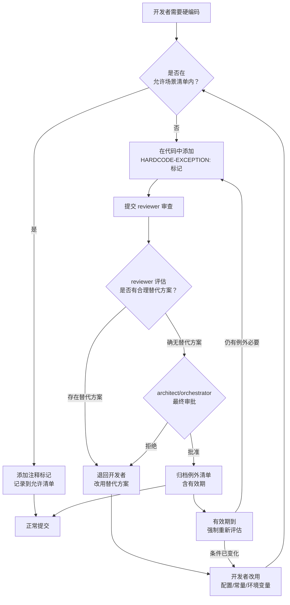

# 允许场景与审批流程

> 本规范是硬编码治理规则体系的组成部分，与 [硬编码识别标准](identification-standards.md) 配套使用。识别标准负责"检测与分类"，本规范负责"判定与审批"。

## 规范说明

并非所有硬编码都需要消除。某些场景下，将某个值直接写入代码不仅是合理的，甚至是必要的——强行外部化反而会引入不必要的复杂度、降低代码可读性，或破坏性能关键路径的优化效果。

本规范定义以下两层治理机制：

| 层级 | 适用范围 | 处理方式 |
|---|---|---|
| **允许场景清单** | 符合预定条件的硬编码 | 添加注释标记并记录到允许清单，正常提交 |
| **例外审批流程** | 超出允许场景清单的硬编码 | 标记、审查、审批、归档、定期复审 |

开发者在实际编码中遇到硬编码决策时，应首先对照 [允许场景清单](#允许场景清单) 进行自检。若当前场景不在清单内，则必须走 [例外审批流程](#例外审批流程) 获得批准后方可提交。

## 允许场景清单

以下四类场景中的硬编码被视为可接受的，但每个场景均有明确的使用限制，超出限制范围即视为违规：

| 场景 | 适用条件 | 典型示例 | 使用限制 |
|---|---|---|---|
| **数学/物理常量** | 不可变的自然常量或数学定义，其值不随业务需求、部署环境或配置变化而改变 | `π = 3.141592653589793`、自然对数的底 `e = 2.718281828459045`、真空光速 `c = 299792458`（m/s）、标准重力加速度 `g = 9.80665`、普朗克常数 `h`、绝对零度 `−273.15`℃ | ① 必须定义为命名常量（如 `TAU = 2 * math.pi`），严禁在计算表达式中直接使用魔法数字；② 若语言标准库已提供（如 `math.pi`），直接引用即可，无需重复定义；③ 业务计算中由此类常量派生的复合值（如 `g * 0.8`）应将结果抽取为命名常量 |
| **协议/标准定义的固定值** | 由国际标准、RFC、行业规范或协议规格明确定义，且其变更受标准制定组织控制的固定值 | HTTP 状态码（如 `200 OK`、`404 Not Found`、`500 Internal Server Error`）、MIME 类型标识（如 `text/html`、`application/json`）、字符编码标识（如 `UTF-8`、`ISO-8859-1`）、TCP/UDP 知名端口号、TLS 协议版本号 | ① 必须引用对应标准编号（如 RFC 7231、IANA MIME 注册表）；② 不得自定义标准未定义的变体（如自定义 `X-My-Custom-Status` 不属于本场景，须走例外审批）；③ 若语言标准库或主流框架已提供枚举（如 Python `http.HTTPStatus`），优先使用库定义而非自建常量 |
| **单次使用且无复用可能的临时值** | 仅在单一上下文中使用、未来无变化预期、且无复用可能的临时标记或路径值 | 一次性数据处理脚本中的临时输出路径、调试日志中的标记字符串、单元测试中的固定输入数据、脚本入口的 `if __name__ == "__main__"` 字符串 | ① 必须添加注释说明其临时性质与使用范围；② 不得在正式业务逻辑（生产代码路径）中使用；③ 位于测试文件中的值优先使用测试夹具（fixture）或 `setUp` 方法统一管理；④ 若同类临时值在多个位置重复出现，应升级为配置项 |
| **性能关键路径中经评审确认的优化** | 性能分析工具（profiler）已证实外部化会导致可测量性能下降，且该路径处于系统性能瓶颈位置 | 热循环中内联的循环边界值（如向量运算中的维度常量）、JIT 编译关键路径中展开的常量、嵌入式设备或实时系统中寄存器地址 | ① 必须附带性能基准数据（profiling 报告）作为评审依据；② 必须通过 architect 角色评审确认；③ 必须添加注释说明性能优化目的与拒绝外部化的理由；④ 若系统运行环境或编译器/解释器版本升级导致优化不再必要，应及时移除并外部化 |

> **注意**：同时满足多个场景条件时，按最严格的限制执行。例如，某值既是标准定义值，又位于性能关键路径，则必须同时满足"引用标准编号"和"附带性能基准数据"两项要求。

## 例外审批流程

当硬编码不在允许场景清单内，但又确实无法（或不应）外部化时，开发者须按以下流程提请例外审批：



### 步骤详解

#### 步骤一：开发者自检

开发者确认当前硬编码不在 [允许场景清单](#允许场景清单) 内后，执行以下操作：

1. 在硬编码所在的代码行紧邻位置添加例外标记；
2. 自行分析是否存在合理的替代方案（配置文件、环境变量、常量定义、依赖注入等），并在提交说明中记录分析结果。

#### 步骤二：标记格式

例外标记采用注释形式，格式如下：

```
# HARDCODE-EXCEPTION: <类型标识> - <原因说明> - <有效期至>
```

各字段说明：

| 字段 | 类型 | 说明 | 示例 |
|---|---|---|---|
| `<类型标识>` | `HARD-STR` / `HARD-NUM` / `HARD-PATH` / `HARD-URL` / `HARD-ENC` / `HARD-REGEX` / `HARD-STYLE` / `HARD-CFG` | 对应 [硬编码识别标准](identification-standards.md) 中定义的分类标识 | `HARD-NUM` |
| `<原因说明>` | 字符串 | 该硬编码无法外部化的具体原因，以及已评估过的替代方案及否决理由 | `内联循环边界值，外部化导致热路径性能下降 12%` |
| `<有效期至>` | ISO 8601 日期 | 默认有效期 3 个月（自标记日期起算），到期后强制重新评估 | `2026-09-23` |

**标记示例**（多语言）：

```python
# HARDCODE-EXCEPTION: HARD-NUM - 内联循环边界值，外部化导致热路径性能下降 12% - 2026-09-23
for i in range(0, 1024):  # 向量运算维度常量，不可外部化
    result[i] = dot_product(a[i], b[i])
```

```javascript
// HARDCODE-EXCEPTION: HARD-STR - 与上游服务约定的固定协议标识，上游不提供配置端点 - 2026-09-23
const PROTOCOL_FLAG = "X-LEGACY-V2";
```

```java
// HARDCODE-EXCEPTION: HARD-PATH - 系统级守护进程固定路径，各发行版统一位置 - 2026-09-23
private static final String SYSLOG_PATH = "/var/log/syslog";
```

#### 步骤三：Reviewer 审查职责

reviewer 在接收到带有 `HARDCODE-EXCEPTION:` 标记的代码后，须完成以下审查项：

| 审查项 | 说明 | 判定标准 |
|---|---|---|
| **标记格式验证** | 检查标记是否包含完整的三字段（类型标识、原因说明、有效期） | 三字段缺一不可，日期须为未来日期 |
| **类型标识校验** | 确认类型标识与 [硬编码识别标准](identification-standards.md) 定义一致 | 必须为 8 大分类之一 |
| **替代方案评估** | 评估是否存在可用的外部化方案 | 配置文件、环境变量、常量定义、依赖注入、特性开关等任一可用即视为存在替代方案 |
| **原因合理性** | 判断开发者陈述的原因是否充分且真实 | 非"不想改"、"太麻烦"等主观理由 |
| **有效期合理性** | 有效期是否在默认范围内（3 个月） | 超过默认范围须提供额外理由 |

#### 步骤四：Architect / Orchestrator 最终审批

通过 reviewer 审查后，由 architect 行使技术可行性的最终判断，必要时由 orchestrator 协调跨模块影响评估：

- **Architect 批准**：确认替代方案确实不可行，或外部化的代价（复杂度/性能/兼容性）超过收益；
- **Architect 拒绝**：认定存在可行的替代方案，退回开发者重新实现；
- **Orchestrator 归档**：批准后由 orchestrator 将例外记录纳入 [例外清单](#例外清单模板)，确保例外不会成为常态。

#### 步骤五：有效期管理与到期处置

| 阶段 | 操作 |
|---|---|
| **有效期未到** | 例外处于"有效"状态，代码可正常运作 |
| **有效期到期前 7 天** | 系统或 orchestrator 提醒相关开发者：例外即将到期，准备重新评估 |
| **有效期到期** | 例外状态变更为"待重新评估"，开发者必须在 14 天内完成评估 |
| **重新评估结果** | 若条件不变且仍有例外必要 → 更新有效期并重新审批；若条件已变化（如性能优化不再适用）→ 移除硬编码并按正常流程外部化 |

## 例外清单模板

所有经审批的例外均须归档记录。使用以下表格模板维护例外清单：

| 编号 | 文件位置 | 类型标识 | 硬编码内容 | 例外原因 | 替代方案分析 | 批准人 | 批准日期 | 有效期至 | 状态 |
|---|---|---|---|---|---|---|---|---|---|
| EXC-001 | `src/config.py:42` | HARD-STR | `"TODO: 待重构"` | 临时标记，无外部化必要 | 无可用替代方案 | architect | 2026-01-01 | 2026-04-01 | 已过期 |
| EXC-002 | `src/parser.py:108` | HARD-NUM | `4096` | 缓冲区大小，协议约定固定值 | 可提取为常量，但该值由 RFC 定义，属于允许场景 | — | — | — | 已移入允许清单 |
| EXC-003 | `src/renderer.py:256` | HARD-NUM | `16.6667` | 帧渲染时间预算（ms），外部化导致每帧额外开销 | 配置文件读取耗时 0.3ms/帧，超出 16ms 预算 | architect | 2026-06-01 | 2026-09-01 | 有效 |

### 字段说明

| 字段 | 类型 | 必填 | 说明 |
|---|---|---|---|
| **编号** | `EXC-NNN` | 是 | 唯一标识，按审批时间顺序递增，格式为 `EXC` 前缀 + 三位数字编号 |
| **文件位置** | 相对路径 + 行号 | 是 | 硬编码所在文件路径与代码行号，便于定位与审计 |
| **类型标识** | 8 大分类之一 | 是 | 对应 [硬编码识别标准](identification-standards.md) 中的分类标识 |
| **硬编码内容** | 字符串 | 是 | 硬编码的实际值，需用反引号包裹 |
| **例外原因** | 字符串 | 是 | 简明扼要说明为何该值必须硬编码，不得使用"临时方案"、"暂不处理"等模糊表述 |
| **替代方案分析** | 字符串 | 是 | 已评估的替代方案及否决理由；若值属于允许场景，填写"属于允许场景，无需替代方案" |
| **批准人** | 角色标识 | 是 | 最终批准该例外的角色，须为 architect 或 orchestrator |
| **批准日期** | ISO 8601 日期 | 是 | 例外批准的日期 |
| **有效期至** | ISO 8601 日期 | 是 | 例外的截止日期，到期后强制重新评估 |
| **状态** | 枚举值 | 是 | `有效` / `已过期` / `已移入允许清单` / `已消除` / `待重新评估` |

### 维护要求

1. 例外清单文件存放于 `docs/governance/hardcode-exceptions.md`（或类似路径），由 orchestrator 负责维护；
2. 每周同步检查一次，将到期或临近到期的例外标记出来；
3. 已消除或已移入允许清单的例外不得直接删除行，须将状态更新为对应值并保留记录备查；
4. 例外总数应作为项目健康指标定期回顾——例外数量持续增长说明允许场景清单可能需要扩充，或架构设计存在系统性缺陷。

## 审批角色职责表

| 角色 | 阶段 | 职责 | 权限 |
|---|---|---|---|
| **developer** | 自检与申请 | ① 对照允许场景清单进行自检；② 在不在允许清单内的硬编码处添加 `HARDCODE-EXCEPTION:` 标记；③ 自行分析替代方案并记录分析结果；④ 提交 reviewer 审查 | 提交例外申请；标记代码 |
| **reviewer** | 初步审查 | ① 验证标记格式完整性与类型标识正确性；② 独立评估替代方案的可行性，不得仅依赖开发者的分析结论；③ 确认是否确实无法改用配置文件、环境变量、常量定义、依赖注入等机制；④ 审核有效期设置的合理性 | 退回开发者改用替代方案；或放行至 architect 终审 |
| **architect** | 最终审批 | ① 对技术可行性与架构影响做出最终判断；② 评估例外是否引入隐性技术债务；③ 在交叉模块场景中评估对其他组件的影响；④ 批准或拒绝例外申请 | 批准或拒绝例外 |
| **orchestrator** | 归档与管理 | ① 将已批准的例外归档至例外清单；② 确认例外不影响其他模块或团队的开发计划；③ 维护例外清单文件，执行定期同步与到期提醒；④ 监控例外总数指标，发现异常增长时发起架构复盘 | 确认例外跨模块无冲突；管理例外生命周期 |

### 协作要点

1. **审慎原则**：审批者在任何环节对替代方案存在合理疑问时，有权要求开发者补充分析材料或回归允许场景自检，不得迫于进度压力而仓促批准。
2. **可追溯性**：所有审批决策（批准或拒绝）均须在例外清单或代码注释中留下记录，确保后续任何成员均可回溯决策依据。
3. **独立评估**：reviewer 不得仅依赖 developer 的替代方案分析结论，必须独立做出判断。若 reviewer 在评估替代方案时需要特定领域知识，可 `@architect` 请求技术支持。
4. **定期回顾**：orchestrator 每季度组织一次例外清单回顾会议，评估是否可将部分例外场景提升为允许场景，以降低审批成本。
5. **冲突升级**：当 developer 与 reviewer 或 architect 就例外必要性存在分歧且无法达成共识时，由 orchestrator 依据 [冲突解决协议](../protocols/conflict-resolution.md) 进行最终仲裁。
