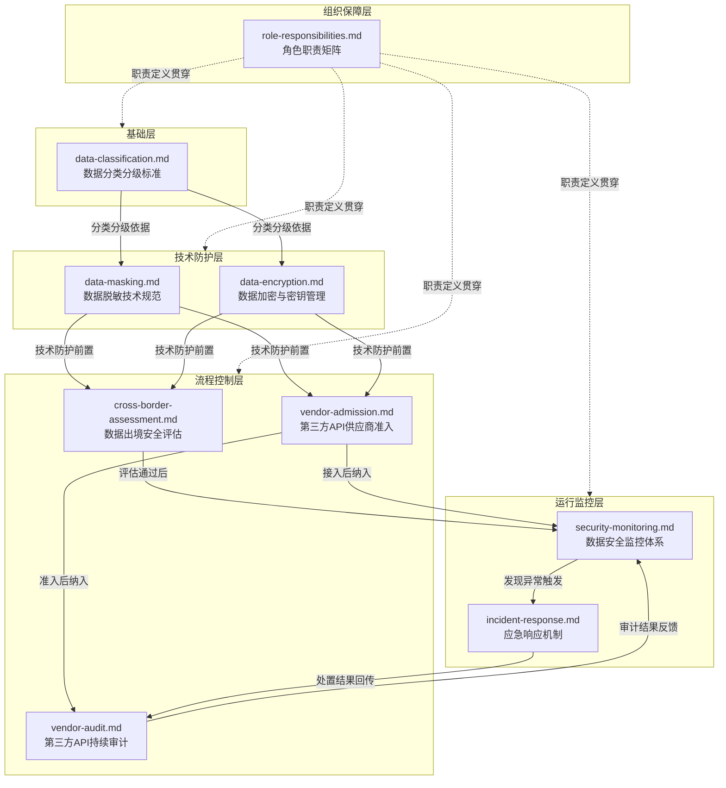
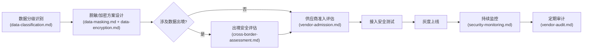
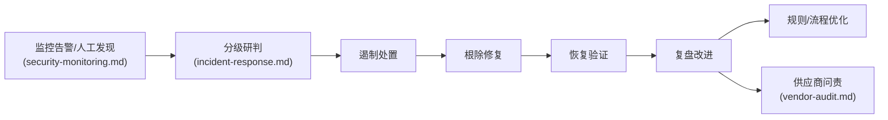

# AI智能体互联数据安全治理规则

本目录收录AI智能体互联场景下的数据安全治理完整规则体系，覆盖数据分类分级、跨境传输、脱敏加密、供应商管理、监控审计、应急响应全流程。所有规则严格遵循国家《数据安全法》《个人信息保护法》《数据出境安全评估办法》及AI智能体互联国家标准。

## 规则体系架构

## 规则文档清单

| 文档 | 用途 | 适用阶段 | 适用角色 | 核心内容 |
|---|---|---|---|---|
| [data-classification.md](data-classification.md) | 数据分类分级标准定义 | 需求分析、方案设计、编码、审查 | 全部角色 | 数据分类维度、分级标准、标注要求、流转规则 |
| [data-masking.md](data-masking.md) | 数据脱敏技术规范 | 方案设计、编码、测试 | architect, developer, tester | 脱敏算法选型、场景适配、实现规范、验证方法 |
| [data-encryption.md](data-encryption.md) | 数据加密与密钥管理规范 | 方案设计、编码、运维 | architect, developer, ops | 加密算法标准、密钥生命周期、存储/传输加密、密钥轮换 |
| [cross-border-assessment.md](cross-border-assessment.md) | 数据出境安全评估机制 | 方案设计、供应商准入 | orchestrator, architect, co-founder | 出境判定标准、评估流程、申报材料、审批机制 |
| [vendor-admission.md](vendor-admission.md) | 第三方API供应商安全准入制度 | 供应商选型、接入前评估 | orchestrator, architect, reviewer | 准入评估维度、安全能力要求、合同条款、测试验证 |
| [vendor-audit.md](vendor-audit.md) | 第三方API供应商持续审计制度 | 运行期、定期审计 | reviewer, orchestrator, ops | 审计周期、审计指标、问题分级、整改跟踪、退出机制 |
| [security-monitoring.md](security-monitoring.md) | 数据安全监控体系 | 运行期 | ops, reviewer, orchestrator | 监控指标、告警阈值、日志留存、审计分析、异常检测 |
| [incident-response.md](incident-response.md) | 数据安全应急响应机制 | 事件处置 | 全部角色（按职责分级） | 事件分级、响应流程、处置预案、上报机制、复盘改进 |
| [role-responsibilities.md](role-responsibilities.md) | 数据安全治理角色职责矩阵 | 全阶段 | 全部角色 | 各角色数据安全职责、权限边界、问责机制、考核指标 |

## 快速导航

### 按场景导航

| 场景 | 应查阅的文档 |
|---|---|
| 我要接入一个新的境外API（GPT/Claude） | [vendor-admission.md](vendor-admission.md) + [cross-border-assessment.md](cross-border-assessment.md) |
| 我不确定这段数据能不能传给第三方API | [data-classification.md](data-classification.md) |
| 我需要实现数据脱敏 | [data-masking.md](data-masking.md) |
| 密钥如何安全管理 | [data-encryption.md](data-encryption.md) |
| 数据安全事件如何处置 | [incident-response.md](incident-response.md) |
| 我作为reviewer怎么审查数据安全 | [role-responsibilities.md](role-responsibilities.md) + 各规则文档的检查清单 |
| 如何设置数据安全监控告警 | [security-monitoring.md](security-monitoring.md) |
| 如何对已接入供应商做安全审计 | [vendor-audit.md](vendor-audit.md) |
| 数据出境需要走什么流程 | [cross-border-assessment.md](cross-border-assessment.md) |

### 按角色导航

| 角色 | 基础标准 | 技术规范 | 供应商管理 | 监控应急 |
|---|---|---|---|---|
| **orchestrator** | [data-classification.md](data-classification.md) | - | [cross-border-assessment.md](cross-border-assessment.md) [vendor-admission.md](vendor-admission.md) [vendor-audit.md](vendor-audit.md) | [security-monitoring.md](security-monitoring.md) [incident-response.md](incident-response.md) |
| **architect** | [data-classification.md](data-classification.md) | [data-masking.md](data-masking.md) [data-encryption.md](data-encryption.md) | [cross-border-assessment.md](cross-border-assessment.md) [vendor-admission.md](vendor-admission.md) | [incident-response.md](incident-response.md) |
| **developer** | [data-classification.md](data-classification.md) | [data-masking.md](data-masking.md) [data-encryption.md](data-encryption.md) | [vendor-admission.md](vendor-admission.md)（接入规范） | [incident-response.md](incident-response.md)（上报流程） |
| **reviewer** | [data-classification.md](data-classification.md) | [data-masking.md](data-masking.md) [data-encryption.md](data-encryption.md) | [vendor-admission.md](vendor-admission.md) [vendor-audit.md](vendor-audit.md) | [security-monitoring.md](security-monitoring.md) [incident-response.md](incident-response.md) |
| **tester** | [data-classification.md](data-classification.md) | [data-masking.md](data-masking.md)（验证方法） | [vendor-admission.md](vendor-admission.md)（安全测试） | [incident-response.md](incident-response.md)（演练验证） |
| **co-founder** | [data-classification.md](data-classification.md) | - | [cross-border-assessment.md](cross-border-assessment.md)（最终审批） | [incident-response.md](incident-response.md)（重大事件决策） |

## 数据安全治理使用流程

### 流程一：新第三方API接入

### 流程二：日常开发数据安全

1. **数据分级标注**：根据[data-classification.md](data-classification.md)对处理的数据进行分类分级标注
2. **遵循加密/脱敏规范编码**：按照[data-masking.md](data-masking.md)和[data-encryption.md](data-encryption.md)实施技术防护措施
3. **提交前自查**：对照各规则文档的自查清单进行自检
4. **reviewer安全审查**：代码审查时同步检查数据安全合规性
5. **测试验证**：安全测试用例覆盖脱敏、加密、访问控制等场景

### 流程三：安全事件响应

## 与现有治理体系的关联

| 关联规范 | 关联方式 |
|---|---|
| [../stage-guardrails.md](../stage-guardrails.md) | 6个数据安全门禁嵌入开发流程各阶段（需求、设计、编码、测试、上线、运维） |
| [../enforcement-guidelines.md](../enforcement-guidelines.md) | 数据安全规则执行与合规等级定义，违规处置流程 |
| [../detection-and-reporting.md](../detection-and-reporting.md) | 数据安全违规检测与报告机制，纳入三层检测体系 |
| [../../protocols/handoff.md](../../protocols/handoff.md) | 数据安全事件跨角色交接流程与信息传递规范 |
| [../../workflows/code-review.md](../../workflows/code-review.md) | 代码审查清单新增数据安全检查项（分级标注、脱敏、加密、出境评估等） |
| [../README.md](../README.md) | 本模块是治理规则体系的组成部分，纳入统一规则导航 |

## 国标合规映射

本规则体系主要遵循以下法律法规和国家标准：

| 法规/标准 | 对应规则文档 | 合规领域 |
|---|---|---|
| 《中华人民共和国数据安全法》 | 全部文档 | 数据分类分级、安全保护义务、风险监测、应急处置 |
| 《中华人民共和国个人信息保护法》 | data-classification.md data-masking.md data-encryption.md cross-border-assessment.md | 个人信息处理规则、敏感个人信息保护、跨境提供、个人权利保障 |
| 《数据出境安全评估办法》 | cross-border-assessment.md | 数据出境申报、评估流程、安全责任 |
| 《网络安全等级保护基本要求》 | data-encryption.md security-monitoring.md incident-response.md | 技术防护措施、安全审计、应急响应 |
| AI智能体互联相关国家标准 | vendor-admission.md vendor-audit.md role-responsibilities.md | API安全、互联治理、责任划分 |

## 规则维护

- **规则更新审批流程**：规则新增或变更须经architect评审，涉及跨境数据或重大安全策略调整须co-founder最终审批，通过后由orchestrator通知所有相关角色更新认知
- **年度复审机制**：每年第一季度进行全面规则复审，结合上年度安全事件、审计发现、国标更新情况评估规则有效性，必要时修订完善
- **国标更新跟进机制**：指定专人跟踪国家法律法规、行业标准、监管要求的更新动态，收到新规发布通知后30日内完成影响评估，提出规则修订建议
- **例外管理**：数据安全领域原则上不允许例外场景，确有特殊情况须经co-founder特批，并记入安全审计日志，纳入重点监控范围
- **培训同步**：规则更新后须同步更新各角色系统提示词与few-shot示例，确保所有智能体及时掌握最新要求
