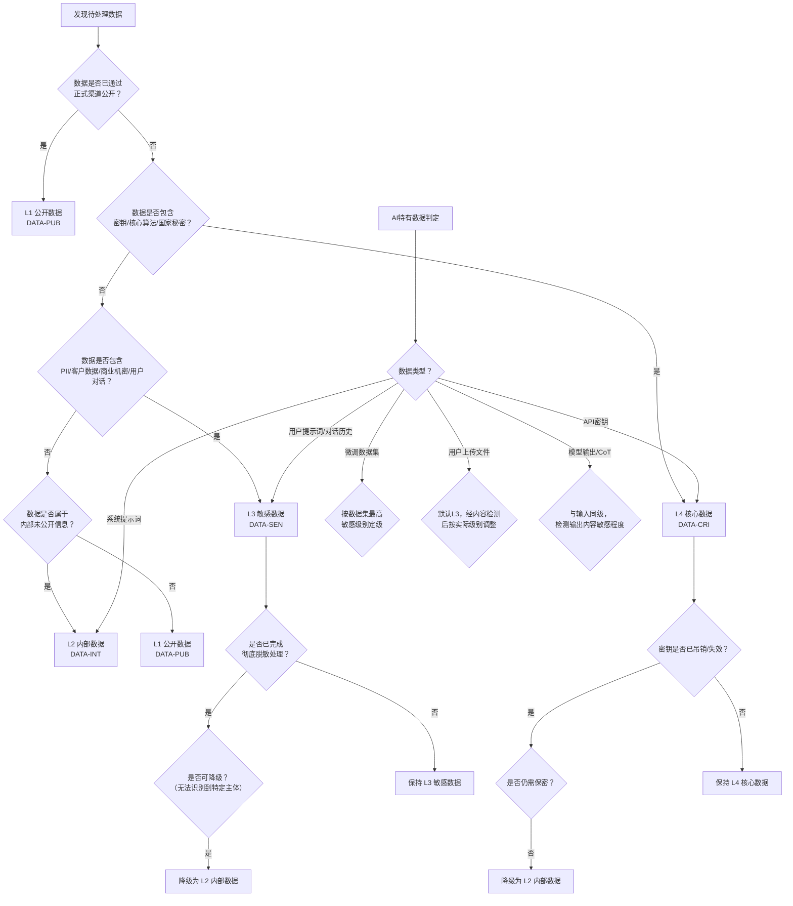

# 数据分类分级标准

> 本规范是AI智能体互联数据安全治理体系的基础模块，定义企业在接入GPT、Claude等国内外第三方大模型API时的数据分类分级标准、流转限制规则与保护要求矩阵。

## 规范说明

### 目的

本规范旨在建立统一的数据分类分级体系，保障跨模型数据流转安全，明确不同级别数据在AI智能体互联场景下的保护要求、流转边界与处理规范，防范数据泄露、滥用与合规风险。

### 适用范围

本规范适用于TRAE系统接入第三方AI API的全场景，包括但不限于：

- 国内大模型API接入（如豆包、文心一言、通义千问等）
- 境外大模型API接入（如GPT、Claude、Gemini等）
- 用户提示词处理、对话历史存储、模型输入输出管理
- 微调数据集上传、系统提示词配置、API密钥管理
- 多智能体协作场景下的数据共享与流转

### 分级原则

- **就高不就低**：当一份数据同时包含多个级别特征时，按最高级别定级
- **场景定级**：同一数据在不同场景下可能适用不同级别，需结合具体使用场景判定
- **动态调整**：数据级别可随时间、业务状态、公开程度变化进行升降级
- **可审计**：所有分级判定与级别变更必须留痕，支持事后审计

### 与国标合规关系

本规范在《数据安全法》《个人信息保护法》《网络安全法》及《数据出境安全评估办法》等法律法规框架下制定，与GB/T 35273《信息安全技术 个人信息安全规范》、GB/T 37973《信息安全技术 大数据安全管理指南》等国家标准保持一致，并针对AI智能体互联场景做了专项细化。

## 四级数据分类定义表

| 级别 | 标识码 | 名称 | 典型数据类型 | 泄露影响 | 保护等级 |
|---|---|---|---|---|---|
| L1 | `DATA-PUB` | 公开数据 | 已公开的营销材料、公开文档、开源代码、公开模型卡片、公开新闻资讯 | 极低：无任何负面影响，信息已完全公开 | 常规保护 |
| L2 | `DATA-INT` | 内部数据 | 内部流程文档、未公开产品规划、团队知识库、一般业务数据、非敏感会议纪要 | 低：可能造成轻微内部管理不便，无实质损害 | 内部管控 |
| L3 | `DATA-SEN` | 敏感数据 | 个人信息（PII）、客户数据、商业机密、未公开财务数据、用户对话内容、合同文本 | 高：可能造成用户权益损害、商业损失、合规风险 | 严格保护 |
| L4 | `DATA-CRI` | 核心数据 | 核心算法/模型权重、密钥/凭证、核心源代码、国家安全相关数据、未公开核心技术方案 | 极高：可能造成重大经济损失、严重合规处罚、国家安全风险 | 最高等级保护 |

## 各类别详细说明

### L1 公开数据（DATA-PUB）

**定义与判定标准**：已通过正式渠道向社会公众公开，任何人都可以合法获取的数据。此类数据不具有保密性要求，其公开不损害任何主体的合法权益。

**AI场景典型示例**：
- 公开发布的产品介绍、营销文案、帮助文档
- 已开源的代码仓库及文档
- 官方发布的模型卡片（Model Card）、技术博客
- 公开的新闻资讯、行业报告、学术论文（已公开版本）
- 公开发布的API文档、开发者指南

**正例（属于L1）**：
- 公司官网发布的产品功能介绍页面
- GitHub上公开仓库的源代码与README
- arXiv上公开发表的预印本论文
- 模型厂商公开发布的模型使用文档

**反例（不属于L1）**：
- 内部编写但尚未发布的营销草稿（属于L2）
- 开源仓库中的未合并PR或私有分支代码（属于L2）
- 标注"内部使用"的技术文档（即使内容已在外部流传）（属于L2）

---

### L2 内部数据（DATA-INT）

**定义与判定标准**：仅在企业内部公开、不对外披露的一般性数据。此类数据泄露可能造成内部管理不便，但不会造成实质性商业损害或合规风险。

**AI场景典型示例**：
- 内部流程文档、工作规范、团队Wiki
- 未公开的产品路线图、功能规划草稿
- 内部会议纪要（不含敏感议题）
- 一般业务数据、非敏感统计报表
- 内部测试用例、开发环境配置（不含密钥）
- 脱敏后的示例数据（用于模型调试）

**正例（属于L2）**：
- 团队内部的周会纪要、站会记录
- 产品经理编写的需求文档（不含客户信息）
- 内部技术分享的PPT与讲义
- 开发环境的非敏感配置模板

**反例（不属于L2）**：
- 包含客户真实姓名/联系方式的需求文档（属于L3）
- 标注"机密"的商业谈判策略（属于L3）
- 内部API密钥、数据库密码（属于L4）

---

### L3 敏感数据（DATA-SEN）

**定义与判定标准**：涉及个人信息、商业秘密，一旦泄露或滥用可能对个人权益、企业利益造成损害的数据。此类数据受《个人信息保护法》等法律法规严格约束。

**AI场景典型示例**：
- 个人信息（PII）：姓名、身份证号、手机号、邮箱、地址、银行卡号
- 客户数据：客户名单、合同信息、交易记录、客户沟通内容
- 商业机密：未公开的财务数据、定价策略、合作协议
- 用户对话内容：用户与AI的完整对话历史、提问内容、上传的个人文档
- 员工敏感信息：薪资数据、绩效评估、人事档案
- 包含个人信息的日志、埋点数据

**正例（属于L3）**：
- 用户在对话中提供的身份证号、手机号
- 客户上传的合同扫描件、业务报表
- 包含真实用户数据的对话日志
- 未公开的季度财务报表

**反例（不属于L3）**：
- 已脱敏处理、无法识别到特定个人的数据（可降级为L2）
- 已公开的工商注册信息、企业年报（属于L1）
- 泛化的统计数据（如"本月活跃用户100万"，不含个体信息）（可降级为L2）

---

### L4 核心数据（DATA-CRI）

**定义与判定标准**：企业核心资产或涉及国家安全的数据，一旦泄露将造成重大经济损失、严重合规处罚或危害国家安全。此类数据必须实施最严格的保护措施。

**AI场景典型示例**：
- 密钥与凭证：API Key、Secret Key、访问令牌、数据库密码、加密私钥
- 核心算法与模型权重：自研模型权重文件、核心算法源代码、模型训练核心代码
- 核心源代码：产品核心业务逻辑、关键专利技术实现代码
- 国家安全相关数据：涉及国家秘密、关键信息基础设施相关的敏感数据
- 未公开的核心技术方案：架构设计文档、核心算法专利草稿、并购计划

**正例（属于L4）**：
- 大模型API的密钥（如sk-xxxxxx、sk-ant-xxxxxx）
- 企业自研模型的权重检查点文件（.ckpt、.safetensors）
- 核心交易系统的关键业务逻辑代码
- 标注"绝密""机密"的国家秘密载体

**反例（不属于L4）**：
- 已公开的开源模型权重（如Llama 2开源版本）（属于L1）
- 通用工具函数、非核心业务代码（属于L2）
- 公开的API文档中示例用的假密钥（属于L1）

## AI智能体场景特有数据归类规则

本章节针对AI智能体互联场景中的特有数据类型，给出默认分级与可调整条件。

### 用户提示词（Prompt）

- **默认分级**：L3 敏感数据
- **判定依据**：用户提示词通常包含用户的真实意图、业务场景、可能涉及个人信息或商业敏感信息
- **可调整条件**：
  - 若用户明确声明提示词内容为公开信息，且经检查确实无敏感内容 → 可降级为L2
  - 若提示词中包含身份证号、银行卡号等明确PII或商业机密 → 升级为L3（保持不变）
  - 若提示词中包含API密钥、核心代码片段 → 升级为L4

### 对话历史（Conversation History）

- **默认分级**：L3 敏感数据
- **判定依据**：对话历史是多轮交互的完整上下文，累积了用户的大量信息，敏感程度随轮次增加而升高
- **可调整条件**：
  - 若对话历史已完成脱敏处理（去除所有PII和敏感信息）→ 可降级为L2用于模型优化
  - 若对话中涉及核心代码、密钥交换等内容 → 相关片段升级为L4
  - 用户主动公开的对话内容（如用户截图发布到社交媒体）→ 相关片段降级为L1

### 微调/训练数据集（Fine-tuning Data）

- **默认分级**：按数据集中最高级别数据定级，至少L3
- **判定依据**：微调数据集通常包含大量业务场景数据，可能隐含敏感模式
- **可调整条件**：
  - 完全由公开数据构建的微调数据集（如公开维基百科、开源代码）→ 可定级为L1
  - 内部脱敏数据构建的数据集（不含可识别个人信息）→ 可定级为L2
  - 包含真实用户数据、客户业务数据的数据集 → 定级为L3
  - 包含核心代码、核心算法样本的数据集 → 定级为L4

### 用户上传文件与附件

- **默认分级**：L3 敏感数据（作为用户提供的内容，默认按敏感处理）
- **判定依据**：用户上传的文件可能包含任意类型的敏感信息，无法预判内容
- **可调整条件**：
  - 经内容检测确认是公开文档（如公开发布的标准PDF）→ 可降级为L1
  - 经检测是内部非敏感文档（如内部流程模板）→ 可降级为L2
  - 检测到包含密钥、核心代码、国家秘密 → 升级为L4
  - 检测到大量个人信息、客户合同 → 保持L3

### 系统提示词/指令（System Prompt）

- **默认分级**：L2 内部数据
- **判定依据**：系统提示词属于企业内部产品配置，包含产品定位、能力边界、指令逻辑等内部信息
- **可调整条件**：
  - 已对外公开的系统提示词（如官方文档中展示的示例）→ 可降级为L1
  - 系统提示词中包含内部业务规则、风控策略、核心算法提示 → 升级为L3
  - 系统提示词中硬编码了API密钥、凭证信息 → 升级为L4（同时属于安全漏洞）

### API密钥与认证凭证

- **默认分级**：L4 核心数据
- **判定依据**：API密钥是访问第三方AI服务的凭证，泄露可能导致被盗用、产生巨额费用、数据泄露
- **可调整条件**：
  - 已失效、已吊销的密钥 → 可降级为L2（仍建议不要公开传播）
  - 公开文档中用于示例的假密钥（如`sk-xxxxxxxxxxxx`）→ 可定级为L1
  - **注意：任何真实有效的API密钥一律为L4，不得降级**

### 模型输出结果（含思维链CoT）

- **默认分级**：按输出内容的敏感程度定级，默认L2
- **判定依据**：模型输出可能复述或推理出输入中的敏感信息，思维链（Chain-of-Thought）可能暴露更多隐含信息
- **可调整条件**：
  - 输出内容为通用知识、公开信息汇总 → 可定级为L1
  - 输出中包含输入提供的PII或商业机密 → 升级为L3
  - 输出中推理或生成了核心代码、密钥、敏感算法细节 → 升级为L4
  - 思维链内容（即使最终输出脱敏）→ 至少与输入同级别，因为可能包含敏感推理过程

## 数据流转限制规则矩阵

| 数据级别 | 可传入国内API | 可传入境外API（需出境评估） | 禁止传入任何第三方API | 可存储在云端 | 必须本地存储 | 传输加密要求 | 是否需脱敏 |
|---|---|---|---|---|---|---|---|
| **L1 公开数据** | ✅ 允许 | ✅ 允许 | — | ✅ 允许 | — | 🔒 建议HTTPS | — |
| **L2 内部数据** | ✅ 允许 | ⚠️ 需评估 | — | ✅ 允许 | — | 🔒 必须HTTPS | 🎭 建议脱敏 |
| **L3 敏感数据** | ⚠️ 需评估+签署DPA | ❌ 禁止（原则上） | ✅ 高风险场景禁止 | ⚠️ 需加密存储 | 🔒 建议本地 | 🔒 必须端到端加密 | 🎭 必须脱敏 |
| **L4 核心数据** | ❌ 禁止 | ❌ 禁止 | ✅ 绝对禁止 | ❌ 禁止 | 🔒 必须本地离线存储 | 🔒 最高等级加密 | 🎭 禁止外传 |

### 补充说明

- **DPA**：数据处理协议（Data Processing Agreement），与API厂商签署明确数据保护责任的法律协议
- **出境评估**：按照《数据出境安全评估办法》要求，通过国家网信部门组织的安全评估
- **端到端加密**：数据在客户端加密后传输，服务端无法解密明文内容
- **脱敏处理**：采用假名化、去标识化、数据掩码等技术处理，确保无法识别到特定个人或实体

## 分级判定决策流程

## 分类分级检查清单

| 序号 | 检查项 | 判定方法 | 对应级别 |
|---|---|---|---|
| 1 | 数据是否已通过官方渠道公开发布？ | 检查数据来源是否为公开发布渠道（官网、官微、公开仓库、正式出版物） | L1 |
| 2 | 数据是否仅在内部流转、未对外披露？ | 检查数据是否标注"内部使用"，是否仅内部人员可访问 | L2 |
| 3 | 数据是否包含个人可识别信息（PII）？ | 扫描是否包含姓名、身份证号、手机号、邮箱、地址、银行卡号等字段 | L3 |
| 4 | 数据是否包含客户信息或商业机密？ | 检查是否有客户名单、合同、定价策略、未公开财务数据等 | L3 |
| 5 | 数据是否为用户对话内容或上传文件？ | 识别是否为用户与AI的交互内容或用户主动上传的附件 | L3（默认） |
| 6 | 数据是否为API密钥、访问凭证或加密私钥？ | 检查是否符合常见密钥格式（sk-、API_KEY、BEGIN PRIVATE KEY等） | L4 |
| 7 | 数据是否包含核心算法、模型权重或核心源代码？ | 检查是否为模型权重文件、核心业务逻辑代码、关键技术方案 | L4 |
| 8 | 数据是否涉及国家安全或国家秘密？ | 检查是否标注"秘密""机密""绝密"，是否涉及关键信息基础设施 | L4 |
| 9 | 数据是否已完成脱敏处理？ | 验证是否已去除所有可识别个人信息和敏感实体，验证重识别风险 | 可降级 |
| 10 | 多级别混合数据是否按最高级别定级？ | 检查数据集中是否包含不同级别数据，确认是否遵循"就高不就低"原则 | 按最高级 |
| 11 | 系统提示词是否包含内部敏感规则？ | 审查系统提示词内容，是否包含风控策略、内部业务逻辑 | L2→L3 |
| 12 | 模型输出是否复述了输入中的敏感信息？ | 检查模型输出结果，是否包含或推理出了输入中的敏感内容 | 与输入同级 |

## 级别变更管理

### 级别升级条件

数据出现以下情况时，应及时升级保护级别：

1. **内容变化**：数据中新增了更高敏感级别的内容（如L2文档中新增了客户PII信息）
2. **场景变化**：数据使用场景从公开场景变为内部/敏感场景
3. **聚合效应**：多份低级别数据聚合后可推断出敏感信息（如多份匿名数据交叉识别到个人）
4. **合规要求变化**：法律法规更新导致原有保护级别不足
5. **密钥泄露风险**：密钥疑似泄露或存在泄露风险时，即使未确认泄露也应按L4应急处理

### 级别降级条件

数据满足以下条件时，可申请降级：

1. **公开披露**：数据通过正式渠道向社会公开（如产品发布、论文发表）
2. **脱敏完成**：通过可靠的脱敏技术处理，经评估确认无法识别到特定主体且无重识别风险
3. **时效过期**：数据时效性已过，敏感属性自然消除（如已公开的财报、过期的合同）
4. **密钥失效**：API密钥已正式吊销并确认无法使用，且无其他关联风险
5. **授权公开**：获得数据主体明确授权同意公开，且公开内容无其他敏感信息

### 审批流程

级别变更必须遵循以下审批流程：

1. **申请**：数据处理人员提交《数据级别变更申请表》，说明变更原因、变更前后级别、风险评估
2. **评估**：数据安全负责人对变更申请进行风险评估，必要时组织技术、法务、合规联合评审
3. **审批**：
   - L1↔L2变更：数据安全负责人审批
   - L2↔L3变更：部门负责人+数据安全负责人联合审批
   - 涉及L4的任何变更：CTO/CIO+数据安全负责人+法务负责人联合审批
4. **实施**：审批通过后，更新数据分级标签，调整访问控制、加密策略、流转权限
5. **记录**：所有变更操作记录留存至少3年，支持审计追溯

### 定期复审机制

- **复审周期**：
  - L4数据：每季度复审一次
  - L3数据：每半年复审一次
  - L2数据：每年复审一次
  - L1数据：每两年复审一次
- **复审内容**：数据级别是否仍然准确、保护措施是否有效、是否存在未授权访问、是否需要级别调整
- **专项复审**：发生数据安全事件、法律法规重大更新、业务场景重大变化时，立即启动专项复审
- **复审输出**：每次复审生成《数据分级复审报告》，记录复审结论、问题清单、整改计划

## 相关模式

- [四层渐进治理](../../../docs/retrospective/patterns/methodology-patterns/governance-strategy/governance-four-layer-progressive.md)
