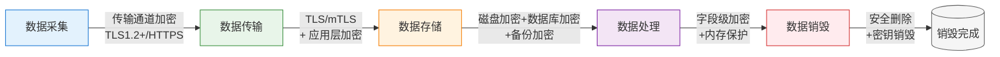
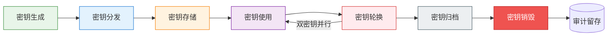

# 数据加密与密钥管理规范

> 本规范是AI智能体互联数据安全治理体系的技术防护核心模块，与[数据分类分级标准](data-classification.md)、[数据脱敏技术规范](data-masking.md)配套使用，定义传输加密、存储加密、字段级加密技术规范及全生命周期密钥管理要求，覆盖与第三方AI API通信的加密要求。

## 规范说明

### 目的
本规范旨在建立统一的数据加密技术标准与密钥管理体系，确保数据在采集、传输、存储、处理、销毁全生命周期中的机密性、完整性与可用性，防范数据泄露、篡改、未授权访问等安全风险，满足《网络安全法》《数据安全法》《个人信息保护法》及国家密码管理相关法规要求。

### 适用范围
本规范适用于AI智能体互联项目中所有涉及数据处理的系统、应用、服务及与第三方AI API的通信场景，包括但不限于：
- 数据采集接口与传输通道
- 数据库、对象存储、文件系统等存储介质
- 核心业务处理逻辑与内存数据
- 备份与归档系统
- 与大模型API、第三方服务的外部通信

### 基本原则

| 原则 | 说明 |
|---|---|
| 合规性原则 | 加密算法与密钥管理必须符合国家密码管理局相关标准，支持SM2/SM3/SM4国密算法，满足等保2.0及行业监管要求 |
| 纵深防御原则 | 建立多层加密防护体系，传输层、存储层、应用层加密相互补充，避免单一防线失效导致整体安全失守 |
| 最小权限原则 | 密钥访问权限严格按需分配，仅授予必要人员、服务、进程最小范围的密钥使用权限 |
| 密钥分离原则 | 不同用途、不同数据级别的密钥必须分离管理，禁止一钥多用；加密密钥与数据本身物理/逻辑分离存储 |
| 全程可审计原则 | 密钥生成、分发、使用、轮换、归档、销毁全流程必须留痕，支持完整审计追溯 |

### 加密与脱敏的关系
加密与脱敏是数据安全防护的两种互补手段：
- **加密**：通过密码学变换保护数据机密性，具备可逆性（持有密钥可解密），适用于数据存储、传输场景，保护数据在非受控环境下的安全
- **脱敏**：通过数据变形隐藏敏感信息，通常不可逆（或需特殊映射表），适用于数据使用、共享场景，在保持数据可用性的同时降低敏感等级
- **协同策略**：L4级核心数据存储必须加密、对外输出必须脱敏；L3级重要数据传输存储加密、测试环境脱敏；L2/L1级数据按需采用相应措施。

## 加密体系总览



| 生命周期阶段 | 核心加密措施 | 防护目标 | 适用数据级别 |
|---|---|---|---|
| 采集阶段 | 传输通道加密、采集端证书验证 | 防止采集过程数据被窃听 | L2及以上 |
| 传输阶段 | TLS/mTLS双向认证、可选应用层加密、签名防篡改 | 防止链路窃听、中间人攻击、重放攻击 | L1及以上（强制） |
| 存储阶段 | 磁盘加密(AES-256-XTS/SM4-XTS)、数据库TDE、备份加密、对象存储SSE-KMS | 防止存储介质失窃、未授权访问、备份泄露 | L2及以上（强制） |
| 处理阶段 | 字段级加密(AES-256-GCM/SM4-GCM)、内存敏感数据清零、安全计算环境 | 防止内存dump、应用层数据泄露 | L3及以上核心字段（强制） |
| 销毁阶段 | 数据安全覆写、密钥安全销毁、介质消磁/物理销毁 | 防止数据恢复残留、密钥泄露 | L3及以上（强制） |

## 传输加密规范

### TLS版本要求
- **强制禁用**：SSLv2、SSLv3、TLS1.0、TLS1.1（存在POODLE、BEAST、CRIME等已知漏洞）
- **强制要求**：最低TLS1.2，优先使用TLS1.3
- **配置检测**：部署前必须使用SSL Labs、testssl.sh等工具验证TLS配置，评级不低于B级

### 密码套件要求

**批准的安全密码套件（TLS1.2）：**
```
TLS_ECDHE_ECDSA_WITH_AES_256_GCM_SHA384
TLS_ECDHE_RSA_WITH_AES_256_GCM_SHA384
TLS_ECDHE_ECDSA_WITH_AES_128_GCM_SHA256
TLS_ECDHE_RSA_WITH_AES_128_GCM_SHA256
TLS_ECDHE_ECDSA_WITH_CHACHA20_POLY1305_SHA256
TLS_ECDHE_RSA_WITH_CHACHA20_POLY1305_SHA256
TLS_ECDHE_SM4_CBC_SM3（国密套件）
TLS_ECDHE_SM4_GCM_SM3（国密套件）
```

**TLS1.3批准密码套件：**
```
TLS_AES_256_GCM_SHA384
TLS_CHACHA20_POLY1305_SHA256
TLS_AES_128_GCM_SHA256
TLS_SM4_GCM_SM3（国密套件）
```

**严格禁止**：RC4、3DES、DES、AES-CBC（TLS1.2下不推荐）、MD5、SHA1、EXPORT级密码、NULL加密、匿名密钥交换。

### mTLS适用场景
以下场景**必须**使用双向TLS认证（mTLS）：
1. L4级绝密数据的跨节点/跨服务传输
2. 核心服务间API对接（服务网格内部通信）
3. 管理后台、运维通道的访问入口
4. 与第三方合作方的专线/VPN对接
5. 支付、密钥管理、身份认证等核心接口
6. Kafka、Redis、数据库等中间件的跨主机访问

### 证书管理
- **CA选择**：优先使用国家认可的CA机构签发证书；内部服务可使用企业私有CA，根CA证书必须离线安全存储；国密场景使用SM2证书
- **证书有效期**：服务器证书有效期不超过90天（推荐），最长不超过1年；根CA证书不超过5年；禁止签发超过有效期上限的证书
- **证书轮换流程**：证书到期前30天启动轮换流程，新旧证书并行过渡期不少于7天；支持自动轮换（ACME协议），轮换过程零停机
- **私钥保护要求**：私钥必须加密存储（AES-256），禁止私钥明文落盘；私钥文件权限设置为0400，仅授权进程可读；禁止私钥通过网络明文传输；硬件安全模块（HSM）保护最高级别私钥

### 第三方API通信加密
针对与大模型API及其他第三方服务的通信，需额外满足：
- **密钥传输**：禁止在URL参数、Referer头中传递API密钥，必须使用`Authorization: Bearer <token>`或`X-API-Key`请求头
- **请求/响应加密**：L4级敏感数据请求需在TLS基础上增加应用层加密（使用对方公钥加密请求体）
- **签名验证**：所有webhook回调、重要响应必须验证签名，推荐HMAC-SHA256（或SM3-HMAC），签名头格式：`X-Signature: t=<timestamp>,v=<signature>`
- **防重放机制**：所有写操作接口必须包含`nonce`（随机字符串，单次有效）+`timestamp`（毫秒时间戳，±5分钟窗口），服务端记录nonce防重放
- **超时控制**：API请求必须设置合理超时，防止慢连接攻击；连接复用需校验证书一致性

### 四级数据传输加密要求矩阵

| 数据级别 | TLS最低版本 | mTLS | 应用层加密 | 签名要求 | 防重放 | 国密支持 |
|---|---|---|---|---|---|---|
| L4（绝密） | TLS1.3 | **强制** | **强制** | SM3-HMAC强制 | **强制** | **必须支持** |
| L3（重要） | TLS1.2（优先1.3） | 强制（外部通信）/推荐（内部） | 推荐 | HMAC-SHA256强制 | **强制** | 推荐支持 |
| L2（内部） | TLS1.2 | 按需 | 不要求 | 可选 | 推荐 | 可选 |
| L1（公开） | TLS1.2 | 不要求 | 不要求 | 不要求 | 不要求 | 不要求 |

## 存储加密规范

### 磁盘/卷加密
- **加密算法**：采用AES-256-XTS模式（或SM4-XTS国密模式），禁止使用ECB模式
- **操作系统全盘加密**：
  - Linux：LUKS2 + AES-256-XTS，根分区必须加密
  - Windows：BitLocker + AES-256，系统盘必须启用
  - 容器环境：容器运行时支持加密overlay（如containerd encrypted images）
- **密钥托管**：磁盘加密密钥（DEK）必须由密钥加密密钥（KEK）保护，KEK存储于KMS/HSM中，禁止本地明文存储DEK
- **启动保护**：关键服务器启用安全启动（Secure Boot）+ TPM/TCM芯片绑定磁盘密钥，防止离线破解

### 数据库加密
- **透明数据加密（TDE）**：L3及以上数据的数据库必须启用TDE，对数据库文件、日志、备份实时加密/解密，对应用透明；TDE密钥由KMS管理
- **数据库文件加密**：数据库数据文件、日志文件、临时文件所在磁盘卷必须启用磁盘加密
- **连接加密**：数据库客户端连接必须强制SSL/TLS，禁止明文连接；数据库端口不对外网暴露
- **内置加密函数**：敏感字段优先使用应用层字段级加密，数据库内置加密函数（如MySQL AES_ENCRYPT）仅用于次敏感场景，密钥不得存储在数据库中

### 备份加密
- **强制加密**：所有数据备份（全量/增量/日志备份）必须加密，禁止明文备份
- **密钥分离**：备份加密密钥与生产密钥分离，备份密钥由专门的备份KMS管理；禁止备份密钥与备份数据存储在同一位置
- **离线备份**：磁带、离线介质备份必须采用AES-256加密，介质本身物理安全保护
- **备份验证**：定期进行备份恢复演练，验证加密备份可正常解密恢复

### 对象存储/云存储加密
- **服务端加密（SSE）**：优先使用SSE-KMS（密钥管理服务托管），其次SSE-C（客户提供密钥），禁止使用SSE-S3（S3托管密钥）用于L3及以上数据
- **客户端加密**：L4级数据上传至对象存储前，必须在客户端完成字段级加密，服务端仅接触密文
- **传输加密**：访问对象存储必须使用HTTPS，禁止HTTP访问；存储桶策略强制拒绝非加密传输
- **存储桶访问控制**：存储桶默认私有，禁止公开访问；启用访问日志，所有访问行为留痕审计

### 存储加密矩阵

| 数据级别 | 本地磁盘加密 | 数据库TDE | 云存储SSE-KMS | 客户端加密 | 备份加密 |
|---|---|---|---|---|---|
| L4（绝密） | **强制** AES-256-XTS + TPM | **强制** + 字段级加密 | **强制** + 客户端加密 | **强制** | **强制** 离线密钥 |
| L3（重要） | **强制** AES-256-XTS | **强制** | **强制** | 推荐 | **强制** |
| L2（内部） | **强制** 服务器环境 | 推荐 | **强制** | 不要求 | **强制** |
| L1（公开） | 推荐 | 不要求 | 推荐（默认） | 不要求 | 推荐 |

## 字段级加密规范

### 必须字段级加密的字段清单

| 数据类别 | 具体字段 | 适用级别 |
|---|---|---|
| 密钥与凭证 | API密钥、Secret Key、私钥、访问令牌、密码哈希盐值、加密密钥本身 | L3及以上 |
| 用户核心PII | 身份证号、护照号、银行卡号、社保号、生物特征模板、详细住址、精确位置轨迹 | L3及以上 |
| 用户次要PII | 手机号（中间4位掩码存储可降级）、邮箱（需模糊查询时不加密）、真实姓名 | L3及以上按需 |
| 核心业务数据 | 交易金额、订单明细核心字段、合同内容、商业机密数据、模型训练敏感数据集 | L3及以上 |
| 系统配置 | 数据库连接串（含密码）、第三方服务凭证、内部系统密码 | L2及以上 |

### 加密算法选择

| 算法 | 模式 | 推荐场景 | 备注 |
|---|---|---|---|
| AES-256-GCM | 认证加密 | 服务端数据加密（首选） | 提供机密性+完整性+防篡改，12字节IV标准，16字节认证标签 |
| ChaCha20-Poly1305 | 认证加密 | 移动端、边缘设备、无AES-NI场景 | 软件实现性能优异，同等安全强度 |
| SM4-GCM | 认证加密（国密） | 等保/政务/国企场景（国密合规） | 国家密码管理局认可，国密改造首选 |
| RSA-4096/SM2 | 非对称加密 | 密钥交换、公钥加密、数字签名 | 仅用于加密对称密钥，不直接加密大数据 |

**禁止使用**：AES-ECB、DES、3DES、RC4、 Blowfish、MD5、SHA1（用于安全目的）。

### 字段加密实施要点

1. **IV/Nonce生成**：
   - 必须使用密码学安全随机数生成器（CSPRNG）生成IV/Nonce
   - AES-GCM推荐12字节（96位）IV，ChaCha20-Poly1305使用12字节Nonce
   - **绝对禁止**：密钥+固定IV、密钥+计数器IV、重复使用IV/Nonce（同一密钥下）
   - IV/Nonce不需要保密，但必须与密文一起存储

2. **认证标签（Auth Tag）存储**：
   - GCM模式产生16字节认证标签，必须完整存储
   - 认证标签附加在密文后或单独字段存储，解密时必须验证
   - 标签验证失败必须立即终止解密，视为篡改攻击

3. **密文格式规范**：
   推荐采用以下结构化格式（二进制打包或Base64编码）：
   ```
   [版本号1B][算法ID1B][IV长度1B][IV数据][密文数据][Auth Tag16B]
   ```
   - 版本号：支持算法升级迁移
   - 算法ID：标识加密算法（0x01=AES-256-GCM，0x02=ChaCha20-Poly1305，0x03=SM4-GCM）

4. **加密上下文（AAD）**：
   - 关联数据（AAD）用于绑定加密上下文，如字段名、记录ID、数据版本
   - AAD不加密但参与认证，防止密文被跨记录/跨字段迁移替换攻击

### 与数据库索引的关系

| 加密方式 | 特点 | 查询支持 | 安全强度 | 适用场景 |
|---|---|---|---|---|
| 随机加密（推荐） | 相同明文每次加密产生不同密文 | 不支持等值查询、模糊查询 | 高（CPA安全） | 身份证号、银行卡号（独立索引表）、核心密钥 |
| 确定性加密 | 相同明文产生相同密文 | 支持等值查询 | 中（易受频率分析） | 需等值匹配的次敏感字段、L2数据 |
| 保留格式加密（FPE） | 密文与明文格式相同（如18位身份证加密后仍18位数字） | 不支持（除非确定性） | 中低 | 遗留系统兼容、需保持数据格式的场景 |

**最佳实践**：
- 核心敏感字段使用随机加密，查询时通过独立的**盲索引（Blind Index）**实现：对明文加盐哈希后存储单独索引字段，查询时哈希查询值匹配索引
- 盲索引盐值必须单独保护，避免频率分析攻击
- 禁止对加密字段执行`LIKE`模糊查询、范围查询，如需此类功能应在应用层解密处理或使用专用可搜索加密方案

### 可搜索加密方案说明
可搜索加密（Searchable Encryption）允许在密文上直接执行搜索操作，目前技术成熟度有限：
- **适用场景**：仅限L2级数据、低安全要求场景，L3及以上数据必须经过安全评审批准
- **方案选择**：可采用盲索引（Blind Index）、保序加密（OPE，谨慎使用）、同态加密（仅特定计算场景）
- **强制要求**：必须经过安全架构师评审，评估频率分析、推断攻击风险，禁止在无评审情况下使用
- **替代方案**：优先考虑"解密后内存检索"、"搜索引擎索引明文、存储层存密文"等安全替代方案

## 密钥全生命周期管理



### 密钥生成
- **随机源要求**：必须使用密码学安全随机数生成器（CSPRNG），禁止使用`math/rand`等伪随机数生成器；推荐来源：
  - Linux: `/dev/urandom`（或`getrandom()`系统调用）
  - Windows: `BCryptGenRandom()`
  - JVM: `SecureRandom.getInstanceStrong()`
  - Go: `crypto/rand.Reader`
- **密钥长度要求**：
  | 算法 | 最小密钥长度 | 推荐长度 |
  |---|---|---|
  | AES | 128位 | **256位** |
  | RSA | 2048位 | **4096位** |
  | ECC | P-256 | **P-384**（secp384r1） |
  | SM2 | 256位 | **256位**（固定） |
  | SM4 | 128位 | **128位**（固定） |
- **密钥分层**：建立三层密钥体系：
  1. **根密钥（Master Key）**：存储于HSM/离线介质，仅用于加密KEK，永不在线使用
  2. **密钥加密密钥（KEK）**：由KMS管理，用于加密DEK，不直接加密数据
  3. **数据加密密钥（DEK）**：用于实际数据加密，密文存储，使用时由KEK解密加载到内存

### 密钥存储
- **优先级顺序**：硬件安全模块（HSM）> 云密钥管理服务（KMS）> 企业级密钥管理系统 > 加密配置文件
- **严格禁止**：
  - 禁止密钥硬编码在源代码、配置文件、脚本中（必须通过密钥管理服务获取）
  - 禁止密钥明文存储在磁盘、数据库、日志、环境变量中（环境变量需通过seccomp/权限控制额外保护）
  - 禁止密钥提交至Git仓库（需配置git-secrets、gitleaks等扫描工具拦截）
  - 禁止在聊天工具、邮件、即时通讯中传输密钥
- **内存保护**：密钥使用后立即在内存中清零；密钥内存页锁定（`mlock`）防止被swap到磁盘；禁止密钥在core dump、crash日志中出现

### 密钥分发
- **安全协议**：密钥分发必须通过TLS1.3安全通道传输，或使用密钥封装机制（KEM）
- **公钥分发**：公钥通过证书体系分发，必须验证证书链有效性，信任锚必须预先安全配置
- **对称密钥分发**：禁止对称密钥直接网络明文传输；使用非对称加密（RSA/SM2）加密对称密钥后传输，或通过Diffie-Hellman密钥协商
- **人工分发**：根密钥等最高级别密钥采用人工分片分发（Shamir门限方案），多人分别持有密钥分片，禁止单人持有完整根密钥

### 密钥轮换

| 数据级别 | DEK轮换周期 | KEK轮换周期 | 证书轮换周期 |
|---|---|---|---|
| L4（绝密） | **90天** | 180天 | 90天（自动轮换） |
| L3（重要） | **180天** | 1年 | 90天 |
| L2（内部） | **1年** | 2年 | 1年 |
| L1（公开） | 按需 | 按需 | 1年 |

**轮换流程**：
1. 生成新版本密钥，标记为"待激活"
2. 新密钥进入**双密钥过渡期**：新数据使用新密钥加密，旧密钥继续解密旧数据，过渡期不少于30天
3. 后台渐进式重加密旧数据（低优先级执行，避免影响业务）
4. 重加密完成后，旧密钥标记为"已退役"，停止加密使用，仅保留解密权限
5. 归档期结束后销毁旧密钥

**紧急轮换**：发生密钥泄露疑似事件时，立即执行紧急轮换，过渡期缩短至72小时，同步审计所有密钥使用记录排查泄露范围。

### 密钥归档
- 已轮换退役的密钥必须归档保存，用于解密历史备份、归档数据
- 归档密钥存储在离线加密介质中，访问需严格审批流程
- 归档保存期限：与数据保留期限一致，L4数据归档密钥保留5年，L3数据保留3年
- 归档密钥必须加密存储，解密使用独立的归档KEK

### 密钥销毁
- **内存销毁**：密钥使用完毕立即在内存中安全清零（避免被内存dump获取）；清零操作使用`memset_s`等安全函数，防止编译器优化消除
- **存储介质销毁**：
  - 磁盘文件：使用多次覆写（至少3次覆写随机数据+1次0覆写），或使用`shred`工具
  - SSD介质：使用ATA Secure Erase命令或厂商提供的安全擦除工具
  - 硬件介质：纸质密钥粉碎，硬件密钥模块物理消磁/粉碎
- **云端密钥**：通过KMSAPI计划删除密钥，删除前设置7-30天等待期，等待期内可取消删除
- **销毁记录**：密钥销毁必须双人见证，留存销毁记录（密钥ID、销毁时间、销毁方式、监销人签字），销毁记录永久留存审计

### 密钥访问控制
- **最小权限**：每个服务、每个人员仅授予所需的最小密钥操作权限（加密/解密/轮换/销毁分离）
- **职责分离**：密钥管理人员、密钥使用人员、安全审计人员三权分立，禁止同一人兼任多个角色
- **多人控制（M of N）**：根密钥访问、密钥销毁等高风险操作必须采用Shamir门限方案，M人授权中至少N人同时授权才可执行（推荐3/5或2/3方案）
- **访问审计**：所有密钥操作（生成、获取、使用、轮换、销毁）必须记录审计日志，日志内容包含：操作人、操作时间、密钥ID、操作类型、操作结果、客户端IP、请求Trace ID；审计日志不可篡改，保留不少于180天

### 应急密钥恢复
- **密钥托管**：L3及以下数据密钥可实施密钥托管方案，但必须：
  - 经安全委员会审批通过，L4数据密钥禁止托管
  - 托管密钥分片由多人分别保管，采用M of N门限方案
  - 托管密钥解密访问需多重审批+双人操作
  - 所有恢复操作全程录像留痕
- **密钥备份冗余**：密钥多副本存储于不同地理位置的HSM/KMS实例中，防止单点故障导致密钥丢失、数据永久不可解密
- **灾备演练**：每半年进行一次密钥恢复灾备演练，验证备份密钥可用、恢复流程有效

## 第三方API通信加密要求（AI场景专项）

### API密钥传输
- **Header传递**：API密钥必须通过`Authorization`请求头传递，格式为`Authorization: Bearer sk-xxxxxx`或`Authorization: ApiKey <key>`
- **禁止位置**：严禁在URL查询参数、请求体（非加密）、Cookie中传递API密钥（防止被日志、代理、Referer头泄露）
- **密钥轮换**：AI API密钥每90天轮换一次，支持双密钥并行过渡期
- **密钥隔离**：不同环境（开发/测试/生产）使用不同API密钥，生产密钥禁止在测试环境使用

### 请求体加密
- **默认要求**：L4级敏感请求（如包含完整用户PII、核心业务prompt、商业机密）需在TLS基础上增加应用层加密
- **加密方案**：使用API供应商提供的公钥（RSA-4096/SM2）加密随机生成的会话密钥，会话密钥（AES-256-GCM）加密实际请求体
- **格式示例**：
  ```json
  {
    "encrypted_key": "base64(RSA-OAEP-Encrypt(aes_key, vendor_public_key))",
    "iv": "base64(12字节随机IV)",
    "tag": "base64(16字节GCM认证标签)",
    "ciphertext": "base64(AES-256-GCM加密的请求体)",
    "key_fingerprint": "公钥指纹，用于密钥轮换匹配"
  }
  ```

### 响应体验证
- **强制签名验证**：所有包含敏感数据的响应必须携带签名，客户端必须验证签名后才处理响应
- **签名流程**：
  1. 从响应头获取`t=<timestamp>,v1=<signature>`
  2. 验证时间戳在±5分钟窗口内
  3. 拼接`timestamp + "." + response_body`为签名字符串
  4. 使用HMAC-SHA256（或SM3-HMAC）与webhook密钥计算期望签名
  5. 恒定时间比较签名（防止时序攻击），不匹配则拒绝响应
- **防篡改**：签名验证失败必须触发安全告警，记录完整请求响应上下文用于排查

### 流式响应加密
- **SSE/WebSocket加密**：流式输出（Server-Sent Events、WebSocket）必须运行在TLS1.3之上
- **增量签名**：SSE事件可采用增量签名方案，每个事件独立签名，或最终结束事件携带全流签名
- **流式密钥更新**：长连接场景建议每小时协商新的会话密钥，限制单密钥加密数据量
- **断连续传**：断点续传时必须验证已接收数据的完整性签名，防止中间人注入恶意内容

### API供应商加密能力评估清单
接入第三方AI API前，必须对照以下清单评估供应商加密能力：

| 评估项 | 必须满足 | 验证方式 |
|---|---|---|
| 传输加密 | ✅ 强制TLS1.2+，禁用弱版本弱套件 | SSL Labs测试、配置审计 |
| 密钥管理 | ✅ API密钥支持轮换、支持细粒度权限 | 查看控制台、测试轮换流程 |
| 数据留存 | ❓ 明确prompt/response数据留存策略，支持零留存选项 | 合同条款、隐私政策审核 |
| 静态加密 | ✅ 客户数据静态加密（AES-256+，KMS管理密钥） | 安全白皮书、SOC2报告 |
| 签名机制 | ✅ webhook回调支持HMAC-SHA256签名验证 | 文档核查、功能测试 |
| 合规认证 | ✅ 具备SOC2 Type II、ISO27001认证，国内供应商需等保三级 | 证书核查 |
| 国密支持 | 🟡 政务/国企场景需支持SM2/SM3/SM4国密算法 | 技术文档、功能测试 |
| 数据驻留 | 🟡 支持数据境内存储（敏感数据场景） | 合同约定、架构核查 |
| 审计日志 | ✅ 提供API访问审计日志供客户查询 | 控制台/API核查 |
| 漏洞响应 | ✅ 承诺漏洞响应SLA，支持安全问题上报渠道 | SLA文档核查 |

✅=必须满足，❓=需评估确认，🟡=按需满足

## 加密实施检查清单

本清单供developer实现加密功能时自查、reviewer代码审查时使用，所有L3/L4相关项为**强制检查项**，不满足不得合入代码。

| 序号 | 检查项 | 适用级别 | 责任人 | 是否通过 |
|---|---|---|---|---|
| 1 | 所有对外HTTP接口强制HTTPS，无HTTP明文入口 | L1+ | developer/reviewer | ☐ |
| 2 | TLS最低版本为1.2，优先1.3，SSLv3/TLS1.0/TLS1.1已禁用 | L1+ | developer/reviewer | ☐ |
| 3 | 密码套件仅使用批准的安全套件，RC4/3DES/MD5/SHA1已禁用 | L1+ | developer/reviewer | ☐ |
| 4 | L4/L3外部通信使用mTLS双向认证，客户端校验服务器证书链 | L3+ | developer/reviewer | ☐ |
| 5 | 服务器证书有效期不超过1年，存在自动化轮换机制 | L2+ | developer | ☐ |
| 6 | 私钥文件权限为0400，加密存储，未硬编码在代码中 | L2+ | developer/reviewer | ☐ |
| 7 | API密钥仅通过Authorization Header传递，未出现在URL/日志/Cookie中 | L2+ | developer/reviewer | ☐ |
| 8 | 第三方回调/webhook已实现HMAC-SHA256签名验证，使用恒定时间比较 | L3+ | developer/reviewer | ☐ |
| 9 | 接口防重放机制已实现（nonce+timestamp窗口验证） | L3+ | developer | ☐ |
| 10 | 服务器系统盘/数据盘已启用LUKS/BitLocker磁盘加密（AES-256-XTS） | L2+ | 运维 | ☐ |
| 11 | L3及以上数据库已启用透明数据加密（TDE），数据库连接强制SSL | L3+ | DBA/developer | ☐ |
| 12 | 所有数据备份已加密，备份密钥与生产密钥分离存储 | L2+ | DBA/运维 | ☐ |
| 13 | 对象存储启用SSE-KMS加密，存储桶策略拒绝非HTTPS访问 | L2+ | 运维/developer | ☐ |
| 14 | 敏感字段（API密钥、身份证、银行卡、核心PII）已实现字段级加密 | L3+ | developer/reviewer | ☐ |
| 15 | 字段级加密使用AES-256-GCM/SM4-GCM认证加密，未使用ECB模式 | L3+ | developer/reviewer | ☐ |
| 16 | IV/Nonce使用CSPRNG生成，同一密钥下未重复使用IV | L3+ | developer | ☐ |
| 17 | GCM认证标签完整存储，解密时严格验证，失败拒绝处理 | L3+ | developer | ☐ |
| 18 | 密钥未硬编码、未明文配置，通过KMS/环境变量（加密）安全获取 | L2+ | developer/reviewer | ☐ |
| 19 | 密钥使用后内存立即安全清零，密钥内存页锁定防止swap | L3+ | developer | ☐ |
| 20 | 密钥按周期轮换，存在双密钥过渡期，已验证轮换流程 | L3+ | 运维/developer | ☐ |
| 21 | 密钥销毁有完整记录，退役密钥有归档保存用于历史数据解密 | L3+ | 运维 | ☐ |
| 22 | 密钥操作全流程审计日志已开启，日志包含操作人/时间/操作类型 | L3+ | developer/运维 | ☐ |
| 23 | 代码已通过gitleaks/git-secrets扫描，无密钥意外提交风险 | L2+ | developer/CI | ☐ |
| 24 | 国密合规场景已验证SM2/SM3/SM4算法可用性，加密链路符合国密要求 | L3+（合规场景） | developer | ☐ |
| 25 | 加密功能已通过单元测试，覆盖正常加密/解密/篡改验证/边界条件 | L2+ | developer/tester | ☐ |

## 相关模式

- [规范纵深防御](../../../docs/retrospective/patterns/methodology-patterns/governance-strategy/spec-level-defense-in-depth.md)
