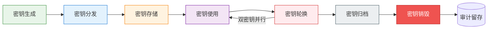

# 密钥全生命周期管理

### 密钥生成
- **随机源要求**：必须使用密码学安全随机数生成器（CSPRNG），禁止使用`math/rand`等伪随机数生成器；推荐来源：
  - Linux: `/dev/urandom`（或`getrandom()`系统调用）
  - Windows: `BCryptGenRandom()`
  - JVM: `SecureRandom.getInstanceStrong()`
  - Go: `crypto/rand.Reader`
- **密钥长度要求**：
  | 算法 | 最小密钥长度 | 推荐长度 |
  |---|---|---|
  | AES | 128位 | **256位** |
  | RSA | 2048位 | **4096位** |
  | ECC | P-256 | **P-384**（secp384r1） |
  | SM2 | 256位 | **256位**（固定） |
  | SM4 | 128位 | **128位**（固定） |
- **密钥分层**：建立三层密钥体系：
  1. **根密钥（Master Key）**：存储于HSM/离线介质，仅用于加密KEK，永不在线使用
  2. **密钥加密密钥（KEK）**：由KMS管理，用于加密DEK，不直接加密数据
  3. **数据加密密钥（DEK）**：用于实际数据加密，密文存储，使用时由KEK解密加载到内存

### 密钥存储
- **优先级顺序**：硬件安全模块（HSM）> 云密钥管理服务（KMS）> 企业级密钥管理系统 > 加密配置文件
- **严格禁止**：
  - 禁止密钥硬编码在源代码、配置文件、脚本中（必须通过密钥管理服务获取）
  - 禁止密钥明文存储在磁盘、数据库、日志、环境变量中（环境变量需通过seccomp/权限控制额外保护）
  - 禁止密钥提交至Git仓库（需配置git-secrets、gitleaks等扫描工具拦截）
  - 禁止在聊天工具、邮件、即时通讯中传输密钥
- **内存保护**：密钥使用后立即在内存中清零；密钥内存页锁定（`mlock`）防止被swap到磁盘；禁止密钥在core dump、crash日志中出现

### 密钥分发
- **安全协议**：密钥分发必须通过TLS1.3安全通道传输，或使用密钥封装机制（KEM）
- **公钥分发**：公钥通过证书体系分发，必须验证证书链有效性，信任锚必须预先安全配置
- **对称密钥分发**：禁止对称密钥直接网络明文传输；使用非对称加密（RSA/SM2）加密对称密钥后传输，或通过Diffie-Hellman密钥协商
- **人工分发**：根密钥等最高级别密钥采用人工分片分发（Shamir门限方案），多人分别持有密钥分片，禁止单人持有完整根密钥

### 密钥轮换

| 数据级别 | DEK轮换周期 | KEK轮换周期 | 证书轮换周期 |
|---|---|---|---|
| L4（绝密） | **90天** | 180天 | 90天（自动轮换） |
| L3（重要） | **180天** | 1年 | 90天 |
| L2（内部） | **1年** | 2年 | 1年 |
| L1（公开） | 按需 | 按需 | 1年 |

**轮换流程**：
1. 生成新版本密钥，标记为"待激活"
2. 新密钥进入**双密钥过渡期**：新数据使用新密钥加密，旧密钥继续解密旧数据，过渡期不少于30天
3. 后台渐进式重加密旧数据（低优先级执行，避免影响业务）
4. 重加密完成后，旧密钥标记为"已退役"，停止加密使用，仅保留解密权限
5. 归档期结束后销毁旧密钥

**紧急轮换**：发生密钥泄露疑似事件时，立即执行紧急轮换，过渡期缩短至72小时，同步审计所有密钥使用记录排查泄露范围。

### 密钥归档
- 已轮换退役的密钥必须归档保存，用于解密历史备份、归档数据
- 归档密钥存储在离线加密介质中，访问需严格审批流程
- 归档保存期限：与数据保留期限一致，L4数据归档密钥保留5年，L3数据保留3年
- 归档密钥必须加密存储，解密使用独立的归档KEK

### 密钥销毁
- **内存销毁**：密钥使用完毕立即在内存中安全清零（避免被内存dump获取）；清零操作使用`memset_s`等安全函数，防止编译器优化消除
- **存储介质销毁**：
  - 磁盘文件：使用多次覆写（至少3次覆写随机数据+1次0覆写），或使用`shred`工具
  - SSD介质：使用ATA Secure Erase命令或厂商提供的安全擦除工具
  - 硬件介质：纸质密钥粉碎，硬件密钥模块物理消磁/粉碎
- **云端密钥**：通过KMSAPI计划删除密钥，删除前设置7-30天等待期，等待期内可取消删除
- **销毁记录**：密钥销毁必须双人见证，留存销毁记录（密钥ID、销毁时间、销毁方式、监销人签字），销毁记录永久留存审计

### 密钥访问控制
- **最小权限**：每个服务、每个人员仅授予所需的最小密钥操作权限（加密/解密/轮换/销毁分离）
- **职责分离**：密钥管理人员、密钥使用人员、安全审计人员三权分立，禁止同一人兼任多个角色
- **多人控制（M of N）**：根密钥访问、密钥销毁等高风险操作必须采用Shamir门限方案，M人授权中至少N人同时授权才可执行（推荐3/5或2/3方案）
- **访问审计**：所有密钥操作（生成、获取、使用、轮换、销毁）必须记录审计日志，日志内容包含：操作人、操作时间、密钥ID、操作类型、操作结果、客户端IP、请求Trace ID；审计日志不可篡改，保留不少于180天

### 应急密钥恢复
- **密钥托管**：L3及以下数据密钥可实施密钥托管方案，但必须：
  - 经安全委员会审批通过，L4数据密钥禁止托管
  - 托管密钥分片由多人分别保管，采用M of N门限方案
  - 托管密钥解密访问需多重审批+双人操作
  - 所有恢复操作全程录像留痕
- **密钥备份冗余**：密钥多副本存储于不同地理位置的HSM/KMS实例中，防止单点故障导致密钥丢失、数据永久不可解密
- **灾备演练**：每半年进行一次密钥恢复灾备演练，验证备份密钥可用、恢复流程有效

---

## 相关模式

- [数据分类分级标准](../data-classification.md)
- [数据加密与密钥管理规范](../data-encryption.md)
- [数据安全监控体系](../security-monitoring.md)
- [第三方API供应商安全准入制度](../vendor-admission.md)
- [第三方API供应商持续审计制度](../vendor-audit.md)
- [数据出境安全评估机制](../cross-border-assessment.md)
- [数据安全治理角色职责矩阵](../role-responsibilities.md)

← 上一章: [字段级加密规范](03-field-encryption.md) | **[返回索引](../data-encryption.md)** | 下一章 → [第三方API通信加密与实施检查清单](05-api-checklist.md)
