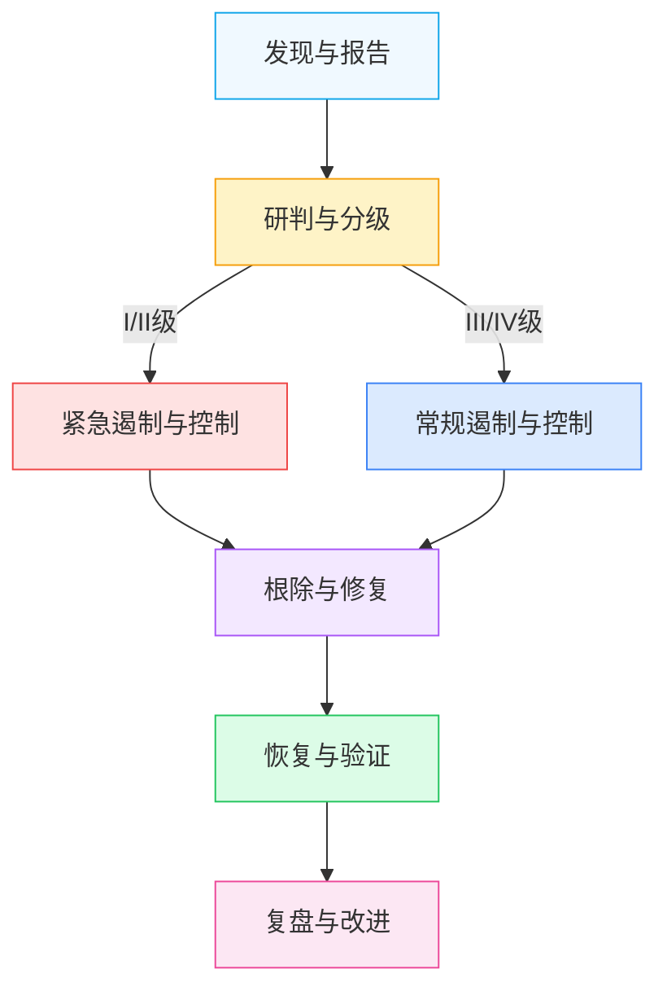

# 数据安全应急响应机制

> 本规范是AI智能体互联数据安全治理体系的事件响应模块，与[数据安全监控体系](security-monitoring.md)配套使用，定义数据安全事件分级标准、应急响应流程、典型场景处置预案、事件通报机制与复盘改进要求，确保安全事件得到快速、有序、有效的处置。

## 规范说明

### 目的
建立统一、高效的数据安全事件应急响应机制，最小化安全事件对业务、用户和组织的影响，保障数据资产安全，维护用户信任，满足合规要求。

### 适用范围
本规范适用于AI智能体互联平台所有数据安全事件的发现、报告、处置、通报和复盘全过程，覆盖内部系统、第三方供应商、跨境数据传输等所有数据处理场景。

### 基本原则
- **快速响应**：建立7×24小时响应机制，确保安全事件第一时间得到处置
- **分级处置**：根据事件严重级别启动对应响应流程，合理调配资源
- **生命安全优先**：当事件可能危及人身安全时，优先保障人员安全
- **证据保全**：在处置过程中完整保留相关证据，支持后续调查与追责
- **持续改进**：通过事件复盘不断完善安全防护体系
- **依法报告**：按照法律法规要求及时向监管部门和受影响方报告

### 应急组织架构

| 角色组 | 职责 | 核心成员 |
|---|---|---|
| 应急指挥组 | 整体决策、资源协调、升级判断、对外授权 | 安全负责人、技术负责人、法务负责人 |
| 技术处置组 | 技术研判、遏制措施、根因分析、修复实施 | 安全工程师、运维工程师、开发工程师 |
| 法务合规组 | 合规评估、监管报备、法律风险研判、用户通知审核 | 法务专员、合规专员 |
| 公关通信组 | 对外口径制定、媒体应对、用户沟通、内部通报 | 公关专员、客服负责人 |

## 数据安全事件分级标准

| 级别 | 名称 | 颜色 | 判定标准 | 响应启动条件 | 示例场景 |
|---|---|---|---|---|---|
| I级 | 特别重大事件 | 红色 | L4核心数据泄露；大规模个人信息泄露（影响人数>100万）；监管部门立案调查；可能引发国家级安全风险；造成重大经济损失（>1000万元） | 发现即启动最高级别响应，全员到位 | 核心算法模型泄露；超大规模用户数据库被拖库；国家级监管通报；核心业务数据被恶意加密勒索 |
| II级 | 重大事件 | 橙色 | L3敏感数据批量泄露；个人信息泄露（影响人数>10万）；未经评估的跨境数据传输；供应商严重安全违规；造成较大经济损失（100-1000万元） | 确认后立即启动，指挥组30分钟内到位 | 第三方供应商数据泄露波及本平台；API密钥大规模泄露被恶意利用；用户敏感聊天记录批量外泄；出境数据通道被非法利用 |
| III级 | 较大事件 | 黄色 | 少量L3数据泄露；个人信息泄露（影响人数1万-10万）；API密钥疑似泄露；安全配置缺陷可能导致数据泄露；造成一般经济损失（10-100万元） | 确认后2小时内启动响应 | 单个API密钥泄露但尚未发现滥用；测试环境敏感数据暴露；内部员工越权访问少量敏感数据；安全扫描发现高危漏洞 |
| IV级 | 一般事件 | 蓝色 | 单个用户PII泄露风险；内部数据误发；低危安全漏洞；安全告警误报经核实存在风险；经济损失<10万元 | 工作日4小时内响应处置 | 员工误将测试数据发送至外部群聊；单个用户个人信息因系统bug展示给他人；低危漏洞需要修复；日志异常经排查存在小范围风险 |

## 应急响应流程



### 各阶段核心要素与时限

| 阶段 | 核心活动 | 责任角色 | 输入物 | 输出物 | 时限要求 |
|---|---|---|---|---|---|
| 发现与报告 | 事件发现、初始信息收集、按路径上报 | 发现人、值班人员 | 监控告警、用户投诉、外部通报 | 事件报告单、初始信息清单 | I/II级：15分钟内上报指挥组；III级：1小时内上报；IV级：4小时内上报 |
| 研判与分级 | 事件核实、影响评估、级别判定、响应启动 | 应急指挥组、技术处置组 | 事件报告单、初始信息 | 分级结论、响应方案、启动通知 | I/II级：30分钟内完成研判；III/IV级：2小时内完成研判 |
| 遏制与控制 | 紧急止血、防止扩散、证据保全、效果验证 | 技术处置组 | 响应方案、环境信息 | 遏制措施记录、证据包、遏制验证报告 | I/II级：2小时内完成初步遏制；III级：4小时内完成遏制；IV级：8小时内完成处置 |
| 根除与修复 | 根因分析、漏洞修复、恶意代码清除、加固措施 | 技术处置组 | 证据包、遏制记录 | 根因分析报告、修复方案、修复验证记录 | I/II级：24小时内提交根因初步报告，72小时内完成修复；III级：3个工作日内完成；IV级：5个工作日内完成 |
| 恢复与验证 | 业务恢复、数据校验、监控加强、用户验证 | 技术处置组、业务方 | 修复验证记录 | 恢复方案、验证报告、加强监控计划 | 分阶段恢复，恢复后持续监控7天（I/II级30天） |
| 复盘与改进 | 复盘会议、报告编写、改进项跟踪、经验沉淀 | 全体应急组成员 | 全流程文档 | 复盘报告、改进项清单、知识库更新 | 事件关闭后7个工作日内完成复盘 |

### 关键检查点
1. **发现阶段检查点**：信息是否完整、上报路径是否正确、是否已通知值班负责人
2. **研判阶段检查点**：数据级别是否准确、影响范围是否清晰、是否需要升级响应
3. **遏制阶段检查点**：扩散路径是否切断、证据是否完整保全、遏制措施是否有效
4. **根除阶段检查点**：根因是否定位准确、修复是否彻底、是否引入新风险
5. **恢复阶段检查点**：数据完整性是否验证、业务功能是否正常、监控是否到位
6. **复盘阶段检查点**：改进项是否可落地、责任人是否明确、是否完成知识库更新

## 各阶段详细要求

### 发现与报告

#### 发现渠道
- 安全监控系统告警（参见[数据安全监控体系](security-monitoring.md)）
- 用户投诉与问题反馈
- 供应商安全通报（参见[供应商持续审计制度](vendor-audit.md)）
- 监管部门通知与预警
- 内部审计与安全扫描发现
- 员工主动报告

#### 报告路径与时限
| 事件级别 | 上报路径 | 上报时限 |
|---|---|---|
| I级 | 发现人→值班负责人→应急指挥组全体→管理层 | 15分钟内逐级上报，可越级直报 |
| II级 | 发现人→值班负责人→应急指挥组 | 30分钟内上报 |
| III级 | 发现人→安全团队负责人 | 1小时内上报 |
| IV级 | 发现人→安全团队 | 4小时内通过工单系统上报 |

#### 初始信息收集清单
- 事件发现时间、发现人、发现渠道
- 事件现象描述与初步影响范围
- 涉及的数据类型与数据级别（参见[数据分类分级标准](data-classification.md)）
- 涉及的系统、接口、供应商信息
- 已采取的初步措施
- 相关日志、截图、告警信息等证据材料

### 研判与分级

#### 快速研判Checklist
- [ ] 事件是否真实发生（排除误报）
- [ ] 涉及的数据级别是什么（L1-L4）
- [ ] 受影响的数据量和用户规模
- [ ] 数据泄露/篡改的具体内容
- [ ] 扩散途径是否已明确
- [ ] 是否存在跨境数据传输（参见[数据出境安全评估机制](cross-border-assessment.md)）
- [ ] 是否涉及第三方供应商
- [ ] 是否存在监管报告义务
- [ ] 事件发展趋势如何（是否仍在扩散）

#### 分级决策矩阵
| 数据级别\影响人数 | <100人 | 100-1万人 | 1万-10万人 | 10万-100万人 | >100万人 |
|---|---|---|---|---|---|
| L1公开数据 | IV级 | IV级 | IV级 | III级 | III级 |
| L2内部数据 | IV级 | IV级 | III级 | III级 | II级 |
| L3敏感数据 | III级 | III级 | II级 | II级 | I级 |
| L4核心数据 | II级 | I级 | I级 | I级 | I级 |

#### 应急指挥组启动条件
- 判定为I级或II级事件
- 事件涉及L4核心数据
- 涉及跨境数据传输违规
- 需要跨部门协调资源
- 需要向监管部门报告
- 可能引发媒体关注或舆情

### 遏制与控制

#### 紧急遏制措施
| 措施类型 | 适用场景 | 操作要点 |
|---|---|---|
| API密钥轮换 | 密钥泄露、疑似被盗用 | 立即生成新密钥，旧密钥设置过渡期，通知业务方更新，监控旧密钥使用情况 |
| 供应商接口暂停 | 供应商侧发生数据泄露、违规调用 | 先降级再切断，保留调用日志，通知供应商对接人，评估切换备用方案（参见[供应商持续审计制度](vendor-audit.md)） |
| 网络隔离 | 系统被入侵、恶意程序扩散 | 隔离受影响服务器/网段，保留现场，禁止直接关机（需先做内存镜像） |
| 账户冻结 | 账户被盗用、内部人员违规 | 冻结可疑账户，重置密码，吊销活跃会话，审计账户操作日志 |
| 功能下线 | 存在漏洞的功能模块 | 前置降级提示，保留访问日志，评估对用户的影响 |
| 数据通道切断 | 跨境数据违规传输 | 切断违规出境通道，核查已传输数据清单，评估数据召回可行性（参见[数据出境安全评估机制](cross-border-assessment.md)） |

#### 证据保全要求
- **日志快照**：完整导出相关系统日志、访问日志、API调用日志、安全设备日志，做哈希校验
- **内存镜像**：对受入侵的服务器做内存镜像，保留运行中的进程和网络连接信息
- **流量抓包**：对可疑网络流量进行抓包保存，分析攻击路径和数据外传情况
- **磁盘镜像**：必要时对涉事服务器磁盘做完整镜像，用于后续取证分析
- **证据链记录**：详细记录证据收集时间、收集人、收集过程、哈希值，确保证据链完整

#### 遏制效果验证
- 验证扩散路径是否已完全切断
- 监控是否仍有异常数据访问/外传行为
- 确认受影响范围不再扩大
- 记录遏制措施执行时间和效果
- 遏制未达预期时立即升级响应级别

### 根除与修复

#### 根因分析方法
- **5Why分析法**：连续追问为什么，从现象追溯到根本原因
  - Why1：为什么发生数据泄露？→ 因为API密钥未加密存储在代码仓库
  - Why2：为什么密钥未加密？→ 因为没有统一的密钥管理机制
  - Why3：为什么没有密钥管理机制？→ 因为安全规范未明确要求
  - Why4：为什么规范未落实？→ 因为代码评审未检查密钥硬编码
  - Why5：为什么代码评审没检查？→ 因为缺少自动化检测工具
- **鱼骨图分析法**：从人、流程、技术、管理四个维度分析原因

#### 修复方案制定与审批
1. 根据根因制定针对性修复方案
2. 评估修复方案的风险和业务影响
3. 修复方案需经过技术负责人和安全负责人审批
4. 重大修复方案需应急指挥组审批
5. 涉及供应商的问题需同步制定供应商整改要求

#### 漏洞修复与加固
- 及时修复安全漏洞，优先修复可被远程利用的高危漏洞
- 清除恶意代码、后门程序
- 重置所有可能泄露的凭证（密码、密钥、令牌）
- 加固安全配置（关闭不必要端口、收紧访问权限、启用WAF规则）
- 补充缺失的安全监控点（参见[数据安全监控体系](security-monitoring.md)）
- 修复完成后进行安全验证，确保漏洞确实被修复且未引入新问题

### 恢复与验证

#### 分阶段恢复策略
1. **第一阶段（核心业务）**：恢复核心业务功能，优先保障用户基本服务可用
2. **第二阶段（数据校验）**：校验恢复后数据的完整性和一致性
3. **第三阶段（外围功能）**：逐步恢复非核心功能，密切监控运行状态
4. **第四阶段（全面恢复）**：所有功能恢复正常，进入加强监控期

#### 恢复验证Checklist
- [ ] 核心业务功能是否正常可用
- [ ] 数据完整性是否验证（无丢失、无篡改、无重复）
- [ ] 用户是否可以正常访问服务
- [ ] 之前的攻击路径是否已被阻断
- [ ] 安全监控规则是否已更新
- [ ] 所有凭证是否已轮换
- [ ] 供应商侧问题是否已得到整改确认
- [ ] 日志记录是否正常，可追溯所有操作

#### 监控加强期
- **I/II级事件**：恢复后30天加强监控，配置专项告警规则，每日出具监控报告
- **III级事件**：恢复后7天加强监控，增加巡检频率
- **IV级事件**：恢复后3天重点关注，确认无异常后恢复正常监控
- 加强监控期间发现异常立即触发新一轮响应流程

### 复盘与改进

#### 复盘会议时限
- 事件完全关闭后7个工作日内召开复盘会议
- I级事件复盘需管理层出席
- 复盘会议由应急指挥组主持，全体参与处置人员参加

#### 复盘报告模板
参见「[事件复盘模板](#事件复盘模板)」章节。

#### 改进项跟踪机制
- 每个改进项明确责任人、完成时限、验证标准
- 建立改进项跟踪表，每周跟进进度
- 改进项完成后需经过安全团队验证
- 逾期未完成的改进项升级上报
- 改进措施落地后更新相关规范、监控规则和应急预案

## 典型场景处置预案库

### 预案1：数据泄露事件（大规模敏感数据外泄）

| 项目 | 内容 |
|---|---|
| 风险描述 | 内部数据库被拖库、敏感数据批量外泄到公开渠道、用户个人信息在暗网售卖等大规模数据泄露事件 |
| 初期识别信号 | 数据外泄监控告警；外部渠道发现本平台数据；用户反馈收到诈骗电话/短信精准提及平台信息；数据库异常大量读取/导出；暗网监测到相关数据售卖 |
| 立即采取行动 | 1. 确认泄露数据范围和级别；2. 启动应急响应，按事件级别上报；3. 初步切断泄露路径；4. 保全相关日志证据 |
| 遏制措施 | 1. 封禁可疑IP地址和账户；2. 暂时下线相关数据查询/导出功能；3. 隔离受影响的数据库服务器；4. 轮换所有数据库访问凭证；5. 对公开渠道的泄露数据启动删除流程 |
| 根除步骤 | 1. 分析入侵路径（SQL注入/权限控制漏洞/内部人员泄露等）；2. 修复被利用的漏洞；3. 加固数据库访问控制；4. 清除攻击者留下的后门；5. 全面排查其他系统是否受影响 |
| 恢复流程 | 1. 在隔离环境验证修复效果；2. 逐步恢复服务，优先恢复核心功能；3. 校验数据完整性；4. 通知受影响用户（如需）；5. 进入30天加强监控期 |
| 预防改进 | 1. 数据库访问全量审计；2. 敏感数据导出审批与告警；3. 数据加密存储（参见数据加密相关规范）；4. 部署数据防泄漏（DLP）系统；5. 定期进行渗透测试 |

### 预案2：API密钥泄露/被盗用（第三方API凭证泄露）

| 项目 | 内容 |
|---|---|
| 风险描述 | API密钥、Access Token、密码等凭证硬编码在代码中提交到公开仓库、或因其他原因泄露，被第三方恶意调用造成数据泄露或费用损失 |
| 初期识别信号 | API调用量异常激增；出现来自陌生IP的大量API请求；密钥调用行为不符合正常模式；代码仓库扫描发现硬编码密钥；收到供应商异常调用告警 |
| 立即采取行动 | 1. 立即确认泄露的密钥清单和权限范围；2. 评估已产生的异常调用数据量；3. 启动密钥轮换流程 |
| 遏制措施 | 1. 立即在控制台/管理后台吊销泄露密钥，或设置快速过期；2. 如无法立即吊销，先配置IP白名单限制调用来源；3. 临时下调密钥速率限制；4. 记录泄露后的所有调用日志用于溯源 |
| 根除步骤 | 1. 从代码仓库历史中清除硬编码密钥；2. 排查所有代码仓库是否存在其他硬编码密钥；3. 部署密钥硬编码自动化检测工具；4. 建立统一密钥管理服务（KMS）；5. 排查异常调用是否已造成数据泄露 |
| 恢复流程 | 1. 生成新密钥并安全分发给业务方；2. 业务方更新密钥后验证功能正常；3. 观察新密钥调用模式确认无异常；4. 旧密钥设置观察期后彻底废弃；5. 核查异常调用产生的费用并处理 |
| 预防改进 | 1. 所有密钥统一由KMS管理，禁止硬编码；2. 配置代码提交前密钥检测钩子；3. 密钥设置自动轮换周期；4. 配置API调用异常行为告警；5. 遵循最小权限原则分配密钥权限 |

### 预案3：供应商安全违规（第三方API厂商数据滥用/泄露）

| 项目 | 内容 |
|---|---|
| 风险描述 | 接入的第三方AI智能体厂商、数据服务商等供应商发生数据泄露、违规留存用户数据、超范围使用数据等安全违规事件 |
| 初期识别信号 | 供应商主动通报安全事件；公开渠道曝出供应商数据泄露；监控发现供应商接口异常数据返回；审计发现供应商超范围调用/返回数据；用户投诉在第三方处看到平台数据 |
| 立即采取行动 | 1. 确认涉及的供应商接口和数据类型；2. 评估通过该供应商传输的数据范围、数据级别和用户规模；3. 启动供应商应急响应流程（参见[供应商持续审计制度](vendor-audit.md)） |
| 遏制措施 | 1. 立即降级或暂停该供应商接口调用，切换至备用供应商（如有）；2. 保留与该供应商的所有接口调用日志；3. 要求供应商立即提供事件详情和影响评估；4. 通知供应商安全对接人启动联合处置 |
| 根除步骤 | 1. 要求供应商提供完整根因分析报告；2. 核查本平台传输给供应商的数据是否全部被泄露/滥用；3. 评估供应商整改措施的有效性；4. 对供应商接口进行全面安全审计；5. 如供应商整改不达标，启动供应商淘汰流程 |
| 恢复流程 | 1. 确认供应商完成整改并通过安全验证后，逐步恢复接口调用；2. 恢复初期限流并加强监控；3. 评估是否需要通知受影响用户；4. 根据事件级别判断是否需要监管报告；5. 更新供应商安全评分和准入状态 |
| 预防改进 | 1. 供应商接入前严格安全评估（参见供应商准入相关规范）；2. 与供应商签订数据安全协议明确责任；3. 定期审计供应商数据处理合规性；4. 关键供应商建立备用方案；5. 接口层面实施数据最小化传输，敏感数据脱敏后传输 |

### 预案4：跨境数据违规传输（未经评估数据出境）

| 项目 | 内容 |
|---|---|
| 风险描述 | 数据未经安全评估出境、超出评估范围传输数据、通过非法通道向境外传输数据等违反数据出境规定的行为（参见[数据出境安全评估机制](cross-border-assessment.md)） |
| 初期识别信号 | 网络流量监测发现异常境外IP连接；跨境接口传输数据量/类型异常；配置错误导致境外节点可访问境内数据；审计发现未申报的跨境数据传输；监管部门数据出境检查预警 |
| 立即采取行动 | 1. 确认违规出境通道涉及的数据类型、数据级别和传输量；2. 立即切断违规数据出境通道；3. 启动数据出境应急响应 |
| 遏制措施 | 1. 立即阻断违规跨境网络连接；2. 暂停违规跨境接口/通道；3. 核查数据接收方身份和数据用途；4. 完整保留跨境传输日志；5. 评估已出境数据能否召回 |
| 根除步骤 | 1. 追溯违规出境的根本原因（配置错误/未走评估流程/恶意传输等）；2. 全面排查所有跨境通道，识别其他未评估的传输；3. 修复配置或流程漏洞；4. 对已出境数据进行风险评估；5. 补充必要的数据出境安全评估申报 |
| 恢复流程 | 1. 确认合规后，按审批范围恢复跨境数据传输；2. 配置跨境数据传输全量审计与告警；3. 评估事件的合规后果和监管报告义务；4. 如已触发监管报告要求，按规定时限向网信部门报告；5. 对相关人员进行合规培训 |
| 预防改进 | 1. 所有跨境数据传输必须先完成安全评估（参见[数据出境安全评估机制](cross-border-assessment.md)）；2. 网络层面配置跨境访问白名单；3. 部署跨境数据传输监控与阻断系统；4. 定期开展跨境数据合规审计；5. 建立数据出境审批流程和台账 |

### 预案5：系统入侵/未授权访问（内部系统被入侵导致数据泄露）

| 项目 | 内容 |
|---|---|
| 风险描述 | 攻击者通过漏洞利用、弱口令、社会工程学等方式入侵内部系统、服务器或管理后台，获取未授权访问权限窃取或篡改数据 |
| 初期识别信号 | IDS/IPS告警；服务器出现异常进程/连接；管理员账户异常登录（异地、非工作时间）；Web应用防火墙拦截到攻击尝试；系统文件被篡改；日志被清除 |
| 立即采取行动 | 1. 确认被入侵的系统范围和攻击者权限；2. 不要立即关机（避免破坏内存证据）；3. 启动网络隔离流程；4. 召集安全技术人员到场 |
| 遏制措施 | 1. 将受影响服务器隔离至单独VLAN（不断电、不重启）；2. 冻结可疑账户，吊销所有会话令牌；3. 封禁攻击IP地址；4. 如有内存镜像取证条件，先做内存镜像；5. 快照涉事服务器磁盘用于取证；6. 评估是否有数据被外传 |
| 根除步骤 | 1. 通过日志分析溯源攻击路径和入口点；2. 提取攻击者植入的恶意样本进行分析；3. 清除所有后门、webshell、恶意程序；4. 修复被利用的漏洞；5. 全面排查所有系统是否被横向移动入侵；6. 重置所有可能泄露的凭证 |
| 恢复流程 | 1. 在隔离环境验证系统干净、漏洞已修复；2. 重建受影响系统（不建议直接在被入侵系统上修复后上线）；3. 迁移数据前验证数据完整性和未被篡改；4. 部署加强监控规则后上线；5. 30天加强监控期密切关注异常；6. 评估数据泄露影响并按规定通报 |
| 预防改进 | 1. 定期进行漏洞扫描和渗透测试；2. 所有系统启用多因素认证（MFA）；3. 部署EDR/XDR终端检测与响应系统；4. 实施网络分段和最小权限访问控制；5. 服务器基线加固；6. 安全日志集中存储和实时分析 |

### 预案6：勒索软件攻击（数据被加密/索要赎金）

| 项目 | 内容 |
|---|---|
| 风险描述 | 勒索软件感染服务器/终端，加密业务数据和用户数据，攻击者索要加密货币赎金才提供解密密钥，可能伴随数据窃取威胁 |
| 初期识别信号 | 文件后缀被篡改为异常后缀；桌面出现勒索信；文件无法打开；杀毒软件告警检测到勒索软件；系统运行异常缓慢；共享文件夹内文件批量被修改 |
| 立即采取行动 | 1. 立即断开受感染机器网络连接（拔掉网线/禁用网卡）；2. 检查其他机器是否也被感染；3. 不要支付赎金（不保证能解密且可能成为持续目标）；4. 立即启动应急响应 |
| 遏制措施 | 1. 隔离所有受感染及疑似受感染机器；2. 立即关闭相关共享文件夹权限；3. 检查备份系统是否安全（防止备份也被加密）；4. 保留勒索信和样本用于分析；5. 评估被加密数据范围和级别；6. 检查是否有数据被攻击者外传 |
| 根除步骤 | 1. 确定勒索软件家族和版本，查找是否有公开解密工具；2. 分析入侵途径（钓鱼邮件/RDP弱口令/漏洞利用等）；3. 全网查杀勒索软件和后门；4. 修复初始入侵点漏洞；5. 重置所有账户凭证；6. 确认所有系统都已清理干净 |
| 恢复流程 | 1. 优先从干净备份恢复数据（验证备份未被感染）；2. 无备份时尝试使用公开解密工具；3. 重建受感染系统，不要使用被加密的系统盘继续运行；4. 恢复后进行全面安全验证；5. 分阶段恢复业务，加强监控；6. 评估是否需要监管报告和用户通知 |
| 预防改进 | 1. 建立3-2-1备份策略（3份备份、2种介质、1份离线）；2. 定期离线备份并测试备份可恢复性；3. 邮件网关和终端部署反勒索软件防护；4. 禁用不必要的宏脚本；5. 网络分段防止横向扩散；6. 定期开展钓鱼邮件演练；7. RDP等远程管理端口不暴露公网，启用MFA |

## 事件上报与通报机制

### 内部上报路径与时限

| 上报层级 | 事件级别 | 上报对象 | 时限要求 |
|---|---|---|---|
| 值班响应 | 所有级别 | 安全值班人员 | 发现后15分钟内 |
| 团队响应 | III级及以上 | 安全团队负责人 | I/II级30分钟内，III级1小时内 |
| 指挥组响应 | I/II级 | 应急指挥组全体成员 | I级15分钟内，II级30分钟内 |
| 管理层上报 | I级 | CEO/CTO及管理层 | 确认I级事件后1小时内 |
| 全员通报 | I级，必要时II级 | 全体员工 | 根据事件发展情况，公关组统一发布 |

### 监管报告要求

#### 报告时限
- **I/II级事件**：发现后24小时内向所在地网信部门、公安部门报告
- **III级事件**：评估合规义务，必要时按要求报告
- **法律法规有明确要求的其他情形**：从其规定

#### 报告内容要素
1. 事件发生时间、发现时间
2. 事件类型和初步分级
3. 涉及的数据类型、数据级别、估计影响人数
4. 事件发生的简要经过
5. 已采取的应急处置措施
6. 当前处置进展和控制情况
7. 事件发展趋势研判
8. 拟采取的下一步措施
9. 需要监管部门支持的事项（如有）
10. 报告单位、联系人、联系方式

#### 报告流程
1. 技术处置组提供事件技术详情
2. 法务合规组评估监管报告义务并起草报告
3. 应急指挥组审批报告内容
4. 法务合规组按规定渠道提交报告
5. 持续更新事件处置进展，按要求续报
6. 事件处置结束后提交结报

### 用户通知机制

#### 通知条件
- 个人信息泄露可能影响用户人身、财产安全
- L3及以上级别数据泄露涉及具体用户
- 法律法规要求必须通知用户的情形

#### 通知内容
1. 事件基本情况和发生时间
2. 涉及的个人信息类型
3. 可能对用户造成的危害
4. 用户可以采取的防范措施
5. 平台已采取的处置措施
6. 用户咨询渠道和联系方式
7. 后续进展告知方式

#### 通知时限
- I/II级事件：评估后24小时内启动用户通知
- 通知内容需经法务合规组审核

#### 通知渠道
- 站内信/平台公告
- 推送通知
- 短信/电话（针对高风险用户）
- 邮件
- 官方网站公告

### 供应商通报

#### 通报条件
- 事件涉及供应商产品/服务漏洞
- 供应商侧数据可能受影响
- 需要供应商配合处置或调查

#### 通报流程
1. 技术处置组整理涉及供应商的事件详情
2. 通过供应商安全对接人正式通报
3. 要求供应商在规定时限内响应和处置
4. 跟进供应商处置进展
5. 要求供应商提供整改报告
6. 评估供应商后续合作风险

#### 协作要求
- 与供应商建立24小时安全应急对接通道
- 签订安全事件联动处置协议
- 要求供应商配合调查取证
- 重大事件要求供应商高层参与处置

### 公关沟通

#### 对外统一口径
- 所有对外信息发布由公关通信组统一归口
- 其他人员不得擅自接受媒体采访或对外发布信息
- 对外口径需经应急指挥组和法务合规组审核
- 信息发布遵循"及时、准确、真诚"原则

#### 媒体应对原则
1. 第一时间发布已知信息，不隐瞒不拖延
2. 只发布确认的事实，不猜测不臆断
3. 表达对用户的歉意和负责任的态度
4. 明确告知用户已采取的措施和防范建议
5. 持续更新事件处置进展
6. 不指责用户或第三方，不推卸责任
7. 指定唯一发言人，避免多头对外

## 应急资源与准备

### 应急联系清单

#### 内部角色联系表
| 角色 | 职责 | 联系方式 | 备用联系方式 |
|---|---|---|---|
| 应急总指挥 | 最终决策 | - | - |
| 安全负责人 | 技术处置总指挥 | - | - |
| 值班安全工程师 | 7×24小时响应 | - | - |
| 运维负责人 | 系统操作 | - | - |
| 开发负责人 | 代码修复 | - | - |
| 法务负责人 | 合规与监管 | - | - |
| 公关负责人 | 对外沟通 | - | - |
| 客服负责人 | 用户沟通 | - | - |

#### 供应商安全联系人
建立所有接入供应商的安全应急联系人清单，包含7×24小时联系方式。

#### 监管机构联系方式
- 当地网信办网络安全协调处
- 当地公安局网络安全保卫支队
- 行业主管部门
- 数据安全监管机构

#### 外部安全厂商
- 应急响应服务商（7×24小时热线）
- 取证分析服务商
- 法律顾问（数据合规律师）
- 公关危机处理顾问

### 应急工具包

| 工具类别 | 工具清单 | 用途 |
|---|---|---|
| 密钥轮换工具 | 密钥管理系统控制台、自动化轮换脚本 | 快速轮换各类API密钥、访问凭证 |
| 接口切断工具 | 流量网关控制台、API管理平台、网络ACL配置 | 快速暂停违规接口、阻断异常流量 |
| 日志分析工具 | ELK/ Splunk、日志检索平台 | 快速检索分析攻击日志和访问记录 |
| 取证工具 | 内存镜像工具、磁盘镜像工具、流量抓包工具 | 现场证据保全和取证分析 |
| 恶意样本分析工具 | 沙箱系统、反病毒引擎、静态/动态分析工具 | 分析恶意代码和攻击样本 |
| 监控告警工具 | 安全监控平台、态势感知系统 | 实时监控事件发展和处置效果 |
| 通信协作工具 | 应急指挥通信群、视频会议系统、电话会议桥 | 应急团队协作与沟通 |

### 备用方案

| 场景 | 备用方案 |
|---|---|
| 主供应商不可用 | 提前对接1-2家同类型备用供应商，确保可在4小时内切换；或准备本地降级处理方案，在供应商故障时提供基础服务 |
| 主区域不可用 | 核心系统多可用区部署，具备跨区域容灾切换能力 |
| 密钥管理系统故障 | 预留备用密钥，提前制定手动密钥轮换流程 |
| 内部系统不可用 | 关键应急操作手册离线备份，应急联系人名单纸质备份 |

### 应急演练频率

| 演练类型 | 频率 | 参与范围 | 演练目标 |
|---|---|---|---|
| 桌面推演 | 每年至少2次 | 应急指挥组+各角色组长 | 检验流程合理性、角色职责清晰度、跨团队协作效率 |
| 实战演练 | 每年至少1次 | 全体应急团队成员+相关业务方 | 检验技术处置能力、工具可用性、响应时效达标率 |
| 专项演练 | 根据需要 | 特定场景相关人员 | 针对典型场景（如数据泄露、勒索软件）开展专项演练 |
| 供应商联合演练 | 每年至少1次 | 我方团队+核心供应商团队 | 检验供应商联动处置能力、跨组织协作流程 |

#### 演练要求
- 每次演练制定详细演练计划和脚本
- 演练过程完整记录
- 演练后及时复盘发现问题
- 演练发现的问题纳入改进项跟踪
- 根据演练结果更新应急预案

## 事件复盘模板

```
# 数据安全事件复盘报告

## 1. 事件概述
- 事件编号：
- 事件标题：
- 事件级别：□I级 □II级 □III级 □IV级
- 发生时间：YYYY-MM-DD HH:MM
- 发现时间：YYYY-MM-DD HH:MM
- 响应启动时间：YYYY-MM-DD HH:MM
- 事件关闭时间：YYYY-MM-DD HH:MM
- 事件持续时长：XX小时XX分钟
- 事件简述：（简要描述事件经过和影响）

## 2. 事件时间线
| 时间 | 事件 | 操作人/角色 | 备注 |
|---|---|---|---|
| YYYY-MM-DD HH:MM | 事件发生 | - | 攻击开始/漏洞触发时间 |
| YYYY-MM-DD HH:MM | 事件发现 | XXX | 通过XX渠道发现 |
| YYYY-MM-DD HH:MM | 事件上报 | XXX | 上报给XX |
| YYYY-MM-DD HH:MM | 响应启动 | XXX | 启动XX级响应 |
| YYYY-MM-DD HH:MM | 遏制完成 | XXX | 采取XX措施遏制扩散 |
| ... | ... | ... | ... |
| YYYY-MM-DD HH:MM | 事件关闭 | XXX | 业务完全恢复 |

## 3. 影响评估
### 3.1 数据影响
- 涉及数据级别：□L1 □L2 □L3 □L4
- 涉及数据类型：
- 受影响数据量：
- 受影响用户数：
- 数据影响程度：□未泄露 □泄露未被利用 □泄露已被利用 □数据被篡改 □数据被加密

### 3.2 业务影响
- 受影响系统/功能：
- 业务中断时长：
- 直接经济损失估算：
- 间接损失（品牌/用户信任）评估：

### 3.3 合规影响
- 是否触发监管报告义务：□是 □否
- 已向哪些监管部门报告：
- 用户通知情况：□无需通知 □已通知XX人
- 可能面临的合规处罚：

## 4. 根因分析
### 4.1 直接原因
（直接导致事件发生的技术原因）

### 4.2 根本原因
使用5Why/鱼骨图分析的根本原因，从以下维度分析：
- 技术层面：
- 流程层面：
- 人员层面：
- 管理层面：

### 4.3 攻击路径/事件演化过程
（详细描述事件从发生到发现的完整演化路径）

## 5. 处置过程评估
### 5.1 响应时效评估
| 阶段 | 标准时限 | 实际耗时 | 是否达标 | 原因分析 |
|---|---|---|---|---|
| 发现与上报 | | | □是 □否 | |
| 研判与分级 | | | □是 □否 | |
| 遏制与控制 | | | □是 □否 | |
| 根除与修复 | | | □是 □否 | |
| 恢复与验证 | | | □是 □否 | |

### 5.2 处置措施有效性评估
- 哪些措施效果显著：
- 哪些措施效果不佳，原因是什么：
- 是否存在措施不当导致影响扩大的情况：

### 5.3 组织协作评估
- 各角色职责是否清晰：
- 跨团队协作是否顺畅：
- 资源调配是否及时：
- 供应商配合是否到位（如涉及）：

## 6. 改进项清单
| 序号 | 改进措施 | 改进类型（技术/流程/管理） | 责任人 | 完成时限 | 验证标准 | 优先级 |
|---|---|---|---|---|---|---|
| 1 | | | | | | P0/P1/P2 |
| 2 | | | | | | |
| 3 | | | | | | |

## 7. 经验教训
### 7.1 做得好的地方
（列出本次处置中值得肯定的做法和经验）

### 7.2 存在的不足
（列出本次事件暴露的问题和不足）

### 7.3 可复用的经验
（总结可固化到流程/工具/预案中的经验）

## 8. 附录
- 相关证据清单
- 相关日志片段
- 参考文档链接
- 复盘会议参与人员名单
```

## 应急响应检查清单

| 序号 | 检查项 | 检查要点 | 完成状态 | 备注 |
|---|---|---|---|---|
| 1 | 事件分级判定 | 数据级别判定准确、受影响人数统计准确、适用分级矩阵正确 | □是 □否 | |
| 2 | 响应流程启动 | 在规定时限内启动对应级别响应、应急人员到位、指挥权明确 | □是 □否 | |
| 3 | 初始信息收集 | 按初始信息清单收集完整关键信息、无重要信息遗漏 | □是 □否 | |
| 4 | 遏制措施执行 | 第一时间采取遏制措施、扩散路径有效切断、遏制效果验证通过 | □是 □否 | |
| 5 | 证据保全 | 日志完整导出并做哈希校验、必要时做内存/磁盘镜像、证据链记录完整 | □是 □否 | |
| 6 | 跨境合规核查 | 核查是否涉及跨境数据传输、如违规立即切断通道、评估监管报告义务（参见[数据出境安全评估机制](cross-border-assessment.md)） | □是 □否 □不涉及 | |
| 7 | 供应商协同 | 涉及供应商时及时通报、要求供应商配合处置、跟踪供应商整改进度（参见[供应商持续审计制度](vendor-audit.md)） | □是 □否 □不涉及 | |
| 8 | 内部上报合规 | 按规定时限逐级上报、无迟报瞒报漏报、信息上报准确 | □是 □否 | |
| 9 | 监管报告 | 评估监管报告义务、需要报告时在24小时内提交、报告内容要素齐全 | □是 □否 □无需报告 | |
| 10 | 用户通知 | 评估用户通知义务、通知内容合规、在规定时限内通知到受影响用户 | □是 □否 □无需通知 | |
| 11 | 根因分析 | 根因定位准确、分析到根本原因而非仅表面现象、根因通过验证 | □是 □否 | |
| 12 | 修复加固 | 漏洞彻底修复、所有泄露凭证轮换、安全加固措施到位、修复后验证通过 | □是 □否 | |
| 13 | 业务恢复验证 | 按分阶段策略恢复、恢复后数据完整性验证、业务功能测试通过 | □是 □否 | |
| 14 | 加强监控 | 恢复后进入加强监控期、监控规则更新到位、监控期内无异常复发 | □是 □否 | |
| 15 | 复盘会议 | 事件关闭后7个工作日内召开复盘会议、所有参与方参加、复盘深入不走过场 | □是 □否 | |
| 16 | 改进项跟踪 | 改进项明确责任人与时限、建立跟踪机制、改进项完成后验证落地效果 | □是 □否 | |
| 17 | 预案更新 | 根据事件处置经验更新本预案、更新相关监控规则和安全规范 | □是 □否 | |
| 18 | 证据归档 | 所有事件相关材料（日志、报告、证据）完整归档、可供后续查阅审计 | □是 □否 | |

## 相关模式

- [检查与恢复模式](../../../docs/retrospective/patterns/code-patterns/check-and-restore.md)
- [PDCA闭环映射](../../../docs/retrospective/patterns/methodology-patterns/retrospective-knowledge/closed-loop-pdca-mapping.md)
