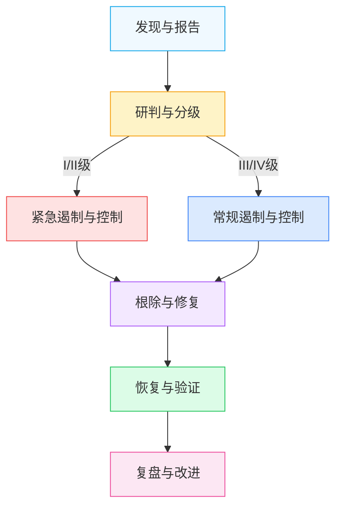

# 应急响应：事件分级与响应流程

| 级别 | 名称 | 颜色 | 判定标准 | 响应启动条件 | 示例场景 |
|---|---|---|---|---|---|
| I级 | 特别重大事件 | 红色 | L4核心数据泄露；大规模个人信息泄露（影响人数>100万）；监管部门立案调查；可能引发国家级安全风险；造成重大经济损失（>1000万元） | 发现即启动最高级别响应，全员到位 | 核心算法模型泄露；超大规模用户数据库被拖库；国家级监管通报；核心业务数据被恶意加密勒索 |
| II级 | 重大事件 | 橙色 | L3敏感数据批量泄露；个人信息泄露（影响人数>10万）；未经评估的跨境数据传输；供应商严重安全违规；造成较大经济损失（100-1000万元） | 确认后立即启动，指挥组30分钟内到位 | 第三方供应商数据泄露波及本平台；API密钥大规模泄露被恶意利用；用户敏感聊天记录批量外泄；出境数据通道被非法利用 |
| III级 | 较大事件 | 黄色 | 少量L3数据泄露；个人信息泄露（影响人数1万-10万）；API密钥疑似泄露；安全配置缺陷可能导致数据泄露；造成一般经济损失（10-100万元） | 确认后2小时内启动响应 | 单个API密钥泄露但尚未发现滥用；测试环境敏感数据暴露；内部员工越权访问少量敏感数据；安全扫描发现高危漏洞 |
| IV级 | 一般事件 | 蓝色 | 单个用户PII泄露风险；内部数据误发；低危安全漏洞；安全告警误报经核实存在风险；经济损失<10万元 | 工作日4小时内响应处置 | 员工误将测试数据发送至外部群聊；单个用户个人信息因系统bug展示给他人；低危漏洞需要修复；日志异常经排查存在小范围风险 |

# 应急响应流程

## 各阶段核心要素与时限

| 阶段 | 核心活动 | 责任角色 | 输入物 | 输出物 | 时限要求 |
|---|---|---|---|---|---|
| 发现与报告 | 事件发现、初始信息收集、按路径上报 | 发现人、值班人员 | 监控告警、用户投诉、外部通报 | 事件报告单、初始信息清单 | I/II级：15分钟内上报指挥组；III级：1小时内上报；IV级：4小时内上报 |
| 研判与分级 | 事件核实、影响评估、级别判定、响应启动 | 应急指挥组、技术处置组 | 事件报告单、初始信息 | 分级结论、响应方案、启动通知 | I/II级：30分钟内完成研判；III/IV级：2小时内完成研判 |
| 遏制与控制 | 紧急止血、防止扩散、证据保全、效果验证 | 技术处置组 | 响应方案、环境信息 | 遏制措施记录、证据包、遏制验证报告 | I/II级：2小时内完成初步遏制；III级：4小时内完成遏制；IV级：8小时内完成处置 |
| 根除与修复 | 根因分析、漏洞修复、恶意代码清除、加固措施 | 技术处置组 | 证据包、遏制记录 | 根因分析报告、修复方案、修复验证记录 | I/II级：24小时内提交根因初步报告，72小时内完成修复；III级：3个工作日内完成；IV级：5个工作日内完成 |
| 恢复与验证 | 业务恢复、数据校验、监控加强、用户验证 | 技术处置组、业务方 | 修复验证记录 | 恢复方案、验证报告、加强监控计划 | 分阶段恢复，恢复后持续监控7天（I/II级30天） |
| 复盘与改进 | 复盘会议、报告编写、改进项跟踪、经验沉淀 | 全体应急组成员 | 全流程文档 | 复盘报告、改进项清单、知识库更新 | 事件关闭后7个工作日内完成复盘 |

## 关键检查点
1. **发现阶段检查点**：信息是否完整、上报路径是否正确、是否已通知值班负责人
2. **研判阶段检查点**：数据级别是否准确、影响范围是否清晰、是否需要升级响应
3. **遏制阶段检查点**：扩散路径是否切断、证据是否完整保全、遏制措施是否有效
4. **根除阶段检查点**：根因是否定位准确、修复是否彻底、是否引入新风险
5. **恢复阶段检查点**：数据完整性是否验证、业务功能是否正常、监控是否到位
6. **复盘阶段检查点**：改进项是否可落地、责任人是否明确、是否完成知识库更新

---
## 相关模式

- [检查与恢复模式](../../../../docs/retrospective/patterns/code-patterns/check-and-restore.md)
- [PDCA闭环映射](../../../../docs/retrospective/patterns/methodology-patterns/retrospective-knowledge/closed-loop-pdca-mapping.md)
---
← 上一章: [01 概述与组织架构](01-overview-organization.md) | **[返回索引](../incident-response.md)** | 下一章 → [03 各阶段详细操作要求](03-phase-details.md)
