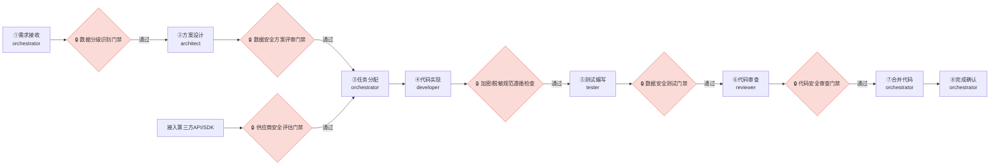
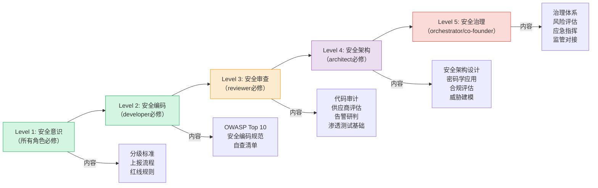
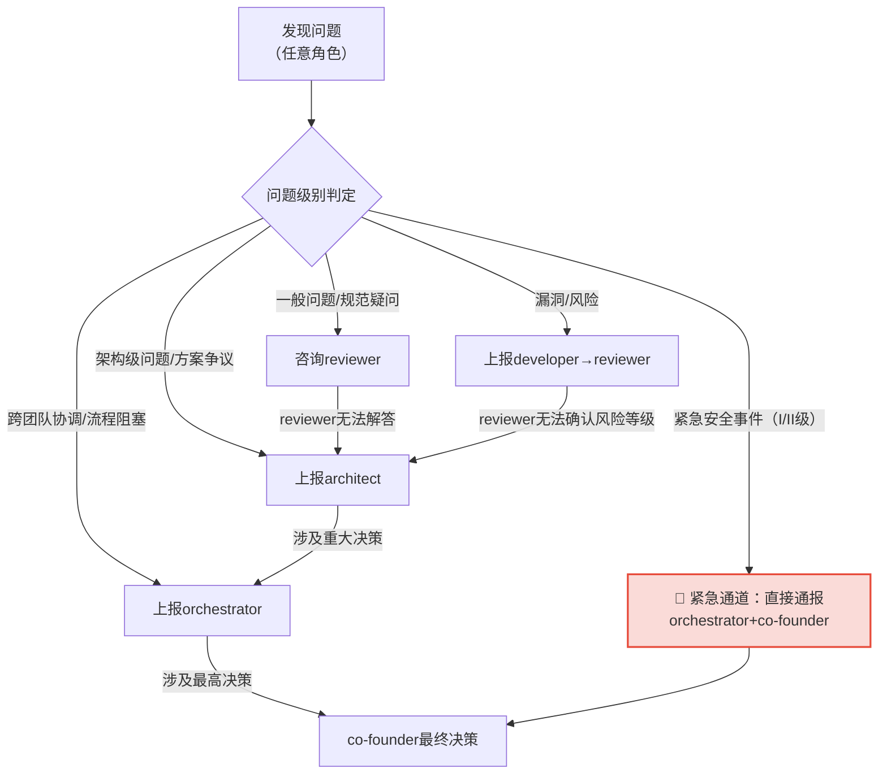

# 数据安全治理角色职责矩阵

> 本规范定义数据安全治理活动中各角色的职责映射与权限边界，明确现有角色（orchestrator、architect、developer、reviewer、tester、co-founder/team-admin）在数据安全治理中的权责划分，构建RACI责任分配矩阵，确保每项数据安全活动都有明确的责任主体。

## 规范说明

### 目的
建立清晰的数据安全治理责任体系，避免职责重叠或真空，确保数据分级分类、脱敏加密、跨境评估、供应商安全、事件响应等各项活动均有明确的执行主体、审批主体和知会范围，实现数据安全治理的可落地、可追溯、可审计。

### 适用范围
本规范适用于SpecWeave项目所有涉及数据处理的开发活动、第三方接入活动、运维监控活动及应急响应活动，覆盖需求、设计、编码、测试、上线、运维全生命周期。

### 基本原则
- **职责分离原则**：安全方案设计、执行、审查、审批四权分离，同一角色不得同时承担两项及以上存在利益冲突的安全职责。
- **最小权限原则**：各角色仅获得履行其数据安全职责所必需的最小权限，不得超范围访问或操作敏感数据。
- **权责对等原则**：拥有数据安全审批权限的角色必须承担相应的决策责任，执行角色必须对其实施结果负责。
- **可追溯原则**：所有数据安全相关操作必须留痕，关键决策必须有审批记录，安全事件必须可追溯到具体责任人。

### 关于数据安全官（DSO）角色的结论

**结论：不新增独立DSO角色，采用现有角色扩展模式。**

理由说明：
1. **reviewer角色天然适配**：reviewer作为质量守护者，已承担代码审查、安全漏洞识别职责，扩展数据安全审查职责符合其"质量把关"的角色定位，职责边界清晰无冲突。
2. **决策机制已有基础**：重大数据安全决策由orchestrator（流程协调）+ architect（技术决策）+ co-founder（最终审批）三方共同审批，形成三重保障，无需独立DSO角色。
3. **避免角色膨胀**：新增独立角色会增加协作复杂度和沟通成本，现有6个标准角色+1个创始角色的体系已覆盖治理全链路，扩展职责比重构角色体系成本更低、落地更快。
4. **能力可渐进提升**：reviewer的数据安全审查能力可通过培训、知识库、检查清单逐步强化，无需一开始就设立专职角色。

职责扩展安排：
- reviewer扩展承担**日常数据安全审查员**职责，执行代码安全审查、供应商准入初审、安全告警研判、定期安全检查等日常安全活动
- 重大数据安全决策（L4数据操作、重大跨境传输、II级及以上安全事件）由orchestrator+architect+co-founder共同审批

## 现有角色数据安全职责映射

### orchestrator（编排协调者）

| 维度 | 内容 |
|------|------|
| **核心数据安全职责** | 数据安全治理体系维护、重大安全决策审批、跨团队安全协调、应急响应总指挥、安全规则落地推进 |
| **关键活动** | ① 维护数据安全规则体系与流程规范 ② 组织重大数据安全方案评审 ③ 审批L3数据出境、新供应商接入等事项 ④ 安全事件应急响应的资源调度与流程协调 ⑤ 跟踪安全整改任务闭环 ⑥ 定期组织安全复盘与规则更新 ⑦ 跨团队数据安全争议仲裁 |
| **禁止事项（能力边界）** | ❌ 不直接编写数据安全相关代码（归developer）<br>❌ 不独立设计加密/脱敏技术方案（归architect）<br>❌ 不替代reviewer执行日常代码安全审查<br>❌ 不单独审批L4数据相关操作（需co-founder+architect双审批）<br>❌ 不在技术方案未评审通过时强行推进实施 |

---

### architect（架构师）

| 维度 | 内容 |
|------|------|
| **核心数据安全职责** | 数据安全技术方案设计、加密架构评审、供应商安全评估技术决策、安全架构合规性审查、密钥管理体系设计 |
| **关键活动** | ① 设计数据分级分类的技术落地方案 ② 评审/审批脱敏方案与加密方案 ③ 供应商接入的安全技术评估 ④ 数据出境自评估的技术风险把关 ⑤ 安全架构定期评审与优化 ⑥ 密钥管理体系设计与轮换策略制定 ⑦ 重大安全漏洞的技术修复方案设计 ⑧ 数据安全技术选型决策 |
| **禁止事项（能力边界）** | ❌ 不直接实施脱敏/加密代码（归developer）<br>❌ 不替代reviewer执行代码安全审查<br>❌ 不单独审批L4数据操作或重大数据出境（需co-founder联合审批）<br>❌ 不在未做风险评估的情况下批准安全方案变更<br>❌ 不绕过流程直接修改生产环境密钥配置 |

---

### developer（开发者）

| 维度 | 内容 |
|------|------|
| **核心数据安全职责** | 遵循数据安全规范编写代码、实施脱敏/加密措施、数据分级标注、安全自查、发现安全问题及时上报 |
| **关键活动** | ① 按照architect设计的方案实施数据脱敏、加密逻辑 ② 在代码中标注数据分级（L1-L4） ③ 编写单元测试覆盖安全逻辑分支 ④ 提交代码前执行安全自查（对照安全检查清单） ⑤ 发现安全漏洞或隐患立即上报reviewer ⑥ 配合安全测试与渗透测试 ⑦ 遵循密钥使用规范，不硬编码密钥或敏感配置 ⑧ 安全整改任务的代码实现 |
| **禁止事项（能力边界）** | ❌ 不擅自变更加密/脱敏方案（必须经architect审批）<br>❌ 不硬编码密钥、密码、Token等敏感信息<br>❌ 不在日志中输出L3及以上级别敏感数据<br>❌ 不私自接入未经安全评估的第三方API/SDK<br>❌ 不隐瞒发现的安全漏洞或风险<br>❌ 不绕过reviewer安全审查直接合并代码 |

---

### reviewer（代码审查者/数据安全审查员）

| 维度 | 内容 |
|------|------|
| **核心数据安全职责** | 代码数据安全审查、供应商准入/审计执行、监控告警研判、数据出境评估初审、定期安全检查、安全规范落地监督 |
| **关键活动** | ① 代码审查中专项检查数据安全：SQL注入、XSS、敏感数据泄露、硬编码密钥等 ② 执行供应商准入安全评估（对照检查清单） ③ 执行供应商定期安全审计 ④ 数据出境自评估材料的初审 ⑤ 安全监控告警的日常研判与处置 ⑥ 定期安全检查（代码扫描、配置审计、权限核查） ⑦ 安全整改任务的验收确认 ⑧ 安全规则执行情况的监督与报告 ⑨ 密钥轮换操作执行 ⑩ 安全事件的初步研判与分级 |
| **禁止事项（能力边界）** | ❌ 不直接修改业务代码修复安全漏洞（归developer）<br>❌ 不单独审批重大数据出境或L4数据操作<br>❌ 不替代architect设计安全技术方案<br>❌ 不在未记录的情况下执行密钥轮换等高危操作<br>❌ 不隐瞒审查中发现的重大安全风险<br>❌ 不基于个人经验而非安全规范给出审查结论 |

---

### tester（测试工程师）

| 维度 | 内容 |
|------|------|
| **核心数据安全职责** | 数据安全测试用例编写、安全功能验证、脱敏/加密有效性测试、渗透测试配合、安全缺陷验证 |
| **关键活动** | ① 编写数据安全专项测试用例（脱敏有效性、加密正确性、权限控制、注入防护等） ② 验证脱敏/加密功能是否符合设计要求 ③ 测试不同数据分级的访问控制是否生效 ④ 验证敏感数据是否在日志、接口、缓存中泄露 ⑤ 配合渗透测试执行与结果验证 ⑥ 安全缺陷修复后的回归测试 ⑦ 验证安全监控告警是否正确触发 ⑧ 数据出境场景的安全合规测试 |
| **禁止事项（能力边界）** | ❌ 不自行修复安全缺陷（归developer）<br>❌ 不修改安全相关业务逻辑代码<br>❌ 不在测试环境使用真实生产数据（需脱敏）<br>❌ 不跳过安全测试用例直接标记测试通过<br>❌ 不隐瞒测试中发现的安全漏洞 |

---

### co-founder/team-admin（联合创始者/团队管理员）

| 维度 | 内容 |
|------|------|
| **核心数据安全职责** | 数据安全最高决策、重大事件审批、监管对接、资源保障、安全文化建设 |
| **关键活动** | ① 与architect联合审批L4数据相关操作 ② 审批重大/国家级数据出境评估 ③ II级及以上安全事件的总指挥与最终决策 ④ 对接监管机构的数据安全检查与问询 ⑤ 数据安全资源（人力、工具、预算）保障 ⑥ 数据安全策略与基调的最终裁定 ⑦ 重大安全违规的问责与处罚决策 ⑧ 数据安全文化建设与高层倡导 |
| **禁止事项（能力边界）** | ❌ 不直接干预日常代码安全审查流程<br>❌ 不替代architect做具体技术方案决策<br>❌ 不绕过审批流程直接指令操作L4数据<br>❌ 不要求developer/reviewer隐瞒安全事件 |

## RACI责任分配矩阵

**RACI模型说明**：
- **R** = 负责执行（Responsible）：实际完成工作的角色
- **A** = 最终审批（Accountable）：对结果负最终责任，拥有最终决策权，每项活动有且仅有一个A
- **C** = 需咨询（Consulted）：决策前需征求意见、提供专业输入的角色，双向沟通
- **I** = 需知会（Informed）：决策后需告知进展与结果的角色，单向沟通

| 数据安全核心活动 | orchestrator | architect | developer | reviewer | tester | co-founder |
|:---|:---:|:---:|:---:|:---:|:---:|:---:|
| 数据分级标注 | I | C | **R** | **A** | C | I |
| 数据分类标准维护 | C | **R** | I | **A** | I | C |
| 脱敏方案设计 | C | **R** | C | **A** | I | I |
| 脱敏实施 | I | C | **R** | **A** | C | I |
| 加密方案设计 | C | **R** | C | **A** | I | I |
| 密钥管理（含轮换策略） | I | **R** | C | **A** | I | C |
| 密钥轮换执行 | I | C | C | **R/A** | I | I |
| 数据出境自评估 | C | C | I | **R/A** | I | C |
| 出境评估审批（一般/L3） | **A** | C | I | R | I | I |
| 出境评估审批（重大/国家级） | C | C | I | R | I | **A** |
| 供应商准入评估 | **A** | C | I | **R** | I | I |
| 供应商准入技术评审 | C | **A** | I | R | I | I |
| 供应商定期审计 | I | C | I | **R/A** | I | I |
| 监控告警处置（一般） | I | C | C | **R/A** | C | I |
| 监控告警处置（紧急） | **A** | C | C | R | I | I |
| 安全事件应急响应（III/IV级） | **R/A** | C | C | C | C | I |
| 安全事件应急响应（I/II级） | R | C | C | C | C | **A** |
| 安全事件复盘 | **R** | C | C | **A** | C | I |
| 安全规则更新 | C | C | I | **R** | I | **A** |
| 安全培训组织 | **R** | C | I | **A** | I | C |
| 代码安全审查 | I | I | C | **R/A** | I | I |
| 安全测试用例编写与执行 | I | C | C | C | **R/A** | I |
| 安全漏洞修复 | I | C | **R** | **A** | C | I |
| L4数据相关操作审批 | C | C | I | R | I | **A** |

## 关键数据安全活动审批权限边界

| 活动 | 审批权限级别 | 需提交材料 | 审批时限 |
|:---|:---|:---|:---|
| L4数据相关操作（访问/导出/修改/删除） | co-founder + architect 双审批 | ① 操作申请单（说明目的、范围、时间） ② 数据影响评估报告 ③ 安全防护方案 ④ 操作回滚预案 | 2个工作日 |
| 数据出境（L3级） | orchestrator审批，co-founder知会 | ① 数据出境自评估报告 ② 数据接收方安全资质证明 ③ 数据传输加密方案 ④ 合规性声明 | 3个工作日 |
| 数据出境（L4级/重大/国家级） | co-founder终审，orchestrator+architect联合评审 | ① 数据出境自评估报告（含法务审核） ② 监管机构报备材料（如需要） ③ 接收方安全评估报告 ④ 数据最小化方案 ⑤ 应急切断机制说明 | 5个工作日 |
| 新供应商接入 | architect技术评审 + orchestrator审批 | ① 供应商安全评估问卷 ② 供应商安全资质证明（ISO27001/等保等） ③ 数据处理协议（DPA）草案 ④ 接入技术方案 ⑤ 数据流向图 | 3个工作日 |
| 安全事件II级及以上响应 | co-founder总指挥，orchestrator协调 | ① 事件初步研判报告 ② 影响范围评估 ③ 遏制方案 ④ 通报范围建议 | 立即响应，30分钟内启动 |
| 加密方案变更 | architect审批 | ① 变更原因说明 ② 新旧方案对比 ③ 兼容性影响评估 ④ 迁移方案 ⑤ 回滚预案 | 2个工作日 |
| 密钥轮换（常规） | reviewer执行，orchestrator知会 | ① 密钥轮换计划 ② 轮换影响范围评估 ③ 验证方案 | 按计划执行，提前1个工作日报备 |
| 密钥轮换（紧急/泄露疑似） | reviewer立即执行，orchestrator+architect即时知会，事后co-founder报备 | ① 泄露风险说明 ② 紧急轮换操作记录 ③ 影响排查结果 | 立即执行，2小时内补交书面报告 |
| 紧急响应（I/II级安全事件） | 先执行遏制，后24小时内补审批 | ① 紧急处置记录 ② 遏制措施说明 ③ 后续整改计划 | 立即执行，事后补审 |
| 数据脱敏方案变更 | architect审批，reviewer会签 | ① 变更前后脱敏规则对比 ② 脱敏有效性验证方案 ③ 数据可用性影响评估 | 2个工作日 |
| 安全规则/策略更新 | reviewer起草，co-founder终审发布 | ① 规则更新说明 ② 影响范围评估 ③ 培训计划 | 3个工作日 |

## 数据安全门禁与阶段守卫集成

数据安全门禁嵌入现有[阶段守卫规则](../stage-guardrails.md)的8个标准阶段中，在关键节点设置强制检查点，未通过安全门禁不得进入下一阶段。



### 各阶段数据安全门禁细则

| 阶段 | 门禁名称 | 检查内容 | 执行角色 | 不通过处置 |
|:---|:---|:---|:---|:---|
| ①需求接收 | **数据分级识别门禁** | ① 需求涉及哪些数据实体 ② 每个数据实体的初步分级判定（L1-L4） ③ 是否涉及数据跨境传输 ④ 是否接入新的第三方供应商 | orchestrator（可咨询architect） | 暂停进入设计阶段，补充数据分级识别后重新提交 |
| ②方案设计 | **数据安全方案评审门禁** | ① 涉及L3/L4数据是否有脱敏方案 ② 敏感数据传输/存储是否有加密方案 ③ 数据访问权限模型是否定义 ④ 密钥管理方案是否明确 ⑤ 日志输出是否排除敏感数据 ⑥ 第三方接入是否标注安全评估需求 | architect（reviewer参与评审） | 退回方案设计阶段，补充安全方案后重新评审 |
| ④代码实现 | **加密/脱敏规范遵循检查** | ① 是否按方案实现脱敏/加密逻辑 ② 是否存在硬编码密钥/密码 ③ 是否在日志中输出敏感数据 ④ 是否使用参数化查询防止注入 ⑤ 数据分级标注是否完整 | developer自查 + reviewer抽查 | 不得提交PR，修复后重新自查 |
| ⑤测试编写 | **数据安全测试门禁** | ① 脱敏有效性测试用例是否覆盖 ② 加密正确性测试用例是否覆盖 ③ 权限控制测试用例是否覆盖 ④ 注入/XSS等安全漏洞测试是否覆盖 ⑤ 敏感数据泄露测试（日志/接口/缓存）是否覆盖 | tester（reviewer审核测试覆盖） | 不得进入代码审查阶段，补充安全测试用例 |
| ⑥代码审查 | **代码安全审查门禁** | ① 执行代码安全审查检查清单全项检查 ② 脱敏/加密实现与方案一致性验证 ③ 敏感数据处理逻辑专项审查 ④ 依赖包安全漏洞扫描 ⑤ 硬编码敏感信息扫描 | reviewer | 退回developer修复，重新提交审查 |
| 第三方接入前 | **供应商安全评估门禁** | ① 供应商安全资质是否齐全 ② 数据处理协议（DPA）是否签署 ③ 接入接口安全方案是否评审 ④ 数据流向是否符合最小化原则 | reviewer执行，architect技术把关，orchestrator审批 | 不得接入，完成评估并通过审批后方可接入 |

### 门禁拦截与SG-LOG集成

数据安全门禁拦截遵循阶段守卫的标准拦截格式，并输出`[SG-LOG]`结构化日志，事件类型扩展为`SEC_GATE_BLOCK`：

```
⚠️ 阶段守卫拦截：当前为【X阶段】，数据安全门禁【Y门禁】检查不通过。
不通过原因：[具体原因]
请补充完成：[需补充的安全工作项]
```

```
[SG-LOG] | level=WARN | event=SEC_GATE_BLOCK | stage=<阶段ID> | role=<执行角色> | session=<会话ID> | msg=数据安全门禁未通过: <门禁名称> | ctx={"gate_name":"<门禁名称>","fail_reason":"<不通过原因>","required_actions":"<需补充工作项>"}
```

## 角色能力要求与培训

### reviewer扩展数据安全审查能力要求

reviewer作为数据安全审查员，需具备以下能力：

| 能力域 | 具体要求 | 验证方式 |
|:---|:---|:---|
| 代码安全审查 | 熟练识别OWASP Top 10漏洞（SQL注入、XSS、CSRF、反序列化等）、硬编码密钥、敏感数据日志泄露、不安全的加密算法使用 | 通过代码安全审查测试用例验证 |
| 数据分级理解 | 准确理解L1-L4数据分级标准，能在代码审查中判定数据分级标注是否正确 | 通过分级案例判定测试 |
| 脱敏/加密知识 | 了解常见脱敏算法（掩码、替换、泛化、扰动等）的适用场景，了解对称/非对称加密、哈希、签名的基本原理与使用场景 | 通过方案评审模拟测试 |
| 供应商评估 | 能对照供应商安全评估清单完成评估，识别高风险供应商 | 通过模拟评估案例验证 |
| 告警研判 | 能根据安全告警信息初步研判事件级别（I-IV级），判断误报与真实攻击 | 通过告警案例研判测试 |
| 法规基础认知 | 了解《数据安全法》《个人信息保护法》《网络安全法》中与开发活动相关的基本要求，了解数据出境的基本合规要求 | 通过法规知识问卷测试 |

### developer数据安全意识培训要求

| 培训模块 | 培训内容 | 频次 | 考核要求 |
|:---|:---|:---|:---|
| 数据安全基础 | 数据分级标准、敏感数据识别、最小权限原则 | 入职必修 + 年度复训 | 笔试正确率≥90% |
| 安全编码规范 | 注入防护、XSS防护、敏感数据处理、密钥管理、日志规范 | 入职必修 + 季度更新 | 代码自查清单100%覆盖 |
| 脱敏加密实践 | 项目内脱敏规则、加密算法选型、密钥使用规范、常见错误案例 | 专项培训（涉及相关功能开发前） | 实操考核通过 |
| 安全事件上报 | 安全漏洞识别方法、上报流程、紧急联系方式、上报时限要求 | 年度培训 | 模拟上报演练通过 |
| 第三方接入规范 | 供应商评估流程、SDK/API接入安全要求、禁止私自接入规定 | 半年一次 | 流程知识测试通过 |

### 数据安全能力提升路径



## 职责冲突与升级机制

### 职责边界争议解决流程

当两个角色对数据安全职责归属产生争议时，按以下流程解决：

1. **直接协商**：争议双方首先基于本规范的职责映射表自行协商，对照RACI矩阵确定责任主体
2. **reviewer裁决**：协商不成时，由reviewer依据安全规范作出裁决（日常安全活动争议）
3. **orchestrator仲裁**：reviewer无法裁决或涉及跨团队争议时，提交orchestrator仲裁
4. **co-founder最终裁定**：涉及重大安全决策、架构层面争议或orchestrator无法仲裁时，提交co-founder最终裁定

争议解决期间，涉及L3/L4数据操作或疑似安全事件的，相关操作**必须暂停**，不得在争议未解决前继续执行。

### 问题升级路径

数据安全问题按严重程度逐级上报，升级路径如下：



**常规升级路径**：developer → reviewer → architect → orchestrator → co-founder

每级响应时限：
- reviewer：1个工作日内回复
- architect：2个工作日内回复
- orchestrator：1个工作日内协调
- co-founder：3个工作日内决策

### 安全问题紧急上报通道

发现以下情况时，可**越级直接上报**，不受常规升级路径限制：

1. **正在发生的数据泄露**：用户数据、敏感业务数据正在被未授权访问或导出
2. **密钥/凭证泄露**：私钥、密码、API Key、Token等敏感凭证已泄露或疑似泄露
3. **正在发生的攻击**：系统正遭受SQL注入、勒索攻击、挖矿程序等正在进行的攻击
4. **L4数据违规操作**：发现有人未审批正在操作L4级核心数据
5. **合规红线触发**：监管机构已介入或即将到场检查、数据出境已违反法规要求

**紧急上报方式**：
1. 立即在团队群@orchestrator和co-founder，标注【🔴数据安全紧急事件】
2. 同步在任务系统标记最高优先级缺陷
3. 如涉及线上系统，立即执行可遏制损害扩大的紧急操作（如下线接口、撤销密钥、切断网络），无需等待审批，但必须在操作后30分钟内补报说明

**紧急上报奖惩**：
- 对及时上报避免重大损失的角色给予正向激励
- 对瞒报、迟报导致损失扩大的，按安全违规追责
- 对误报（经reviewer研判为非紧急事件）不予追责，但需记录误报原因用于优化告警规则
