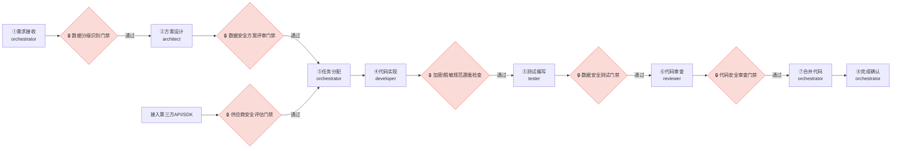
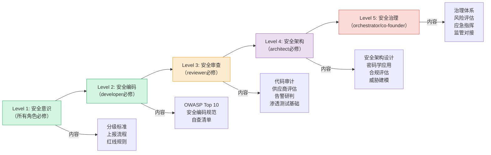

# 数据安全门禁与角色能力培训

## 数据安全门禁与阶段守卫集成

数据安全门禁嵌入现有[阶段守卫规则](../../stage-guardrails.md)的8个标准阶段中，在关键节点设置强制检查点，未通过安全门禁不得进入下一阶段。



### 各阶段数据安全门禁细则

| 阶段 | 门禁名称 | 检查内容 | 执行角色 | 不通过处置 |
|:---|:---|:---|:---|:---|
| ①需求接收 | **数据分级识别门禁** | ① 需求涉及哪些数据实体 ② 每个数据实体的初步分级判定（L1-L4） ③ 是否涉及数据跨境传输 ④ 是否接入新的第三方供应商 | orchestrator（可咨询architect） | 暂停进入设计阶段，补充数据分级识别后重新提交 |
| ②方案设计 | **数据安全方案评审门禁** | ① 涉及L3/L4数据是否有脱敏方案 ② 敏感数据传输/存储是否有加密方案 ③ 数据访问权限模型是否定义 ④ 密钥管理方案是否明确 ⑤ 日志输出是否排除敏感数据 ⑥ 第三方接入是否标注安全评估需求 | architect（reviewer参与评审） | 退回方案设计阶段，补充安全方案后重新评审 |
| ④代码实现 | **加密/脱敏规范遵循检查** | ① 是否按方案实现脱敏/加密逻辑 ② 是否存在硬编码密钥/密码 ③ 是否在日志中输出敏感数据 ④ 是否使用参数化查询防止注入 ⑤ 数据分级标注是否完整 | developer自查 + reviewer抽查 | 不得提交PR，修复后重新自查 |
| ⑤测试编写 | **数据安全测试门禁** | ① 脱敏有效性测试用例是否覆盖 ② 加密正确性测试用例是否覆盖 ③ 权限控制测试用例是否覆盖 ④ 注入/XSS等安全漏洞测试是否覆盖 ⑤ 敏感数据泄露测试（日志/接口/缓存）是否覆盖 | tester（reviewer审核测试覆盖） | 不得进入代码审查阶段，补充安全测试用例 |
| ⑥代码审查 | **代码安全审查门禁** | ① 执行代码安全审查检查清单全项检查 ② 脱敏/加密实现与方案一致性验证 ③ 敏感数据处理逻辑专项审查 ④ 依赖包安全漏洞扫描 ⑤ 硬编码敏感信息扫描 | reviewer | 退回developer修复，重新提交审查 |
| 第三方接入前 | **供应商安全评估门禁** | ① 供应商安全资质是否齐全 ② 数据处理协议（DPA）是否签署 ③ 接入接口安全方案是否评审 ④ 数据流向是否符合最小化原则 | reviewer执行，architect技术把关，orchestrator审批 | 不得接入，完成评估并通过审批后方可接入 |

### 门禁拦截与SG-LOG集成

数据安全门禁拦截遵循阶段守卫的标准拦截格式，并输出`[SG-LOG]`结构化日志，事件类型扩展为`SEC_GATE_BLOCK`：

```
⚠️ 阶段守卫拦截：当前为【X阶段】，数据安全门禁【Y门禁】检查不通过。
不通过原因：[具体原因]
请补充完成：[需补充的安全工作项]
```

```
[SG-LOG] | level=WARN | event=SEC_GATE_BLOCK | stage=<阶段ID> | role=<执行角色> | session=<会话ID> | msg=数据安全门禁未通过: <门禁名称> | ctx={"gate_name":"<门禁名称>","fail_reason":"<不通过原因>","required_actions":"<需补充工作项>"}
```


## 角色能力要求与培训

### reviewer扩展数据安全审查能力要求

reviewer作为数据安全审查员，需具备以下能力：

| 能力域 | 具体要求 | 验证方式 |
|:---|:---|:---|
| 代码安全审查 | 熟练识别OWASP Top 10漏洞（SQL注入、XSS、CSRF、反序列化等）、硬编码密钥、敏感数据日志泄露、不安全的加密算法使用 | 通过代码安全审查测试用例验证 |
| 数据分级理解 | 准确理解L1-L4数据分级标准，能在代码审查中判定数据分级标注是否正确 | 通过分级案例判定测试 |
| 脱敏/加密知识 | 了解常见脱敏算法（掩码、替换、泛化、扰动等）的适用场景，了解对称/非对称加密、哈希、签名的基本原理与使用场景 | 通过方案评审模拟测试 |
| 供应商评估 | 能对照供应商安全评估清单完成评估，识别高风险供应商 | 通过模拟评估案例验证 |
| 告警研判 | 能根据安全告警信息初步研判事件级别（I-IV级），判断误报与真实攻击 | 通过告警案例研判测试 |
| 法规基础认知 | 了解《数据安全法》《个人信息保护法》《网络安全法》中与开发活动相关的基本要求，了解数据出境的基本合规要求 | 通过法规知识问卷测试 |

### developer数据安全意识培训要求

| 培训模块 | 培训内容 | 频次 | 考核要求 |
|:---|:---|:---|:---|
| 数据安全基础 | 数据分级标准、敏感数据识别、最小权限原则 | 入职必修 + 年度复训 | 笔试正确率≥90% |
| 安全编码规范 | 注入防护、XSS防护、敏感数据处理、密钥管理、日志规范 | 入职必修 + 季度更新 | 代码自查清单100%覆盖 |
| 脱敏加密实践 | 项目内脱敏规则、加密算法选型、密钥使用规范、常见错误案例 | 专项培训（涉及相关功能开发前） | 实操考核通过 |
| 安全事件上报 | 安全漏洞识别方法、上报流程、紧急联系方式、上报时限要求 | 年度培训 | 模拟上报演练通过 |
| 第三方接入规范 | 供应商评估流程、SDK/API接入安全要求、禁止私自接入规定 | 半年一次 | 流程知识测试通过 |

### 数据安全能力提升路径




---

## 相关模式

- [数据分类分级标准](../data-classification.md)
- [数据加密与密钥管理规范](../data-encryption.md)
- [数据安全监控体系](../security-monitoring.md)
- [第三方API供应商安全准入制度](../vendor-admission.md)
- [第三方API供应商持续审计制度](../vendor-audit.md)
- [数据出境安全评估机制](../cross-border-assessment.md)
- [数据安全治理角色职责矩阵](../role-responsibilities.md)

← 上一章: [RACI责任矩阵与审批权限边界](02-raci-approvals.md) | **[返回索引](../role-responsibilities.md)** | 下一章 → [职责冲突解决与升级机制](04-conflict-escalation.md)
