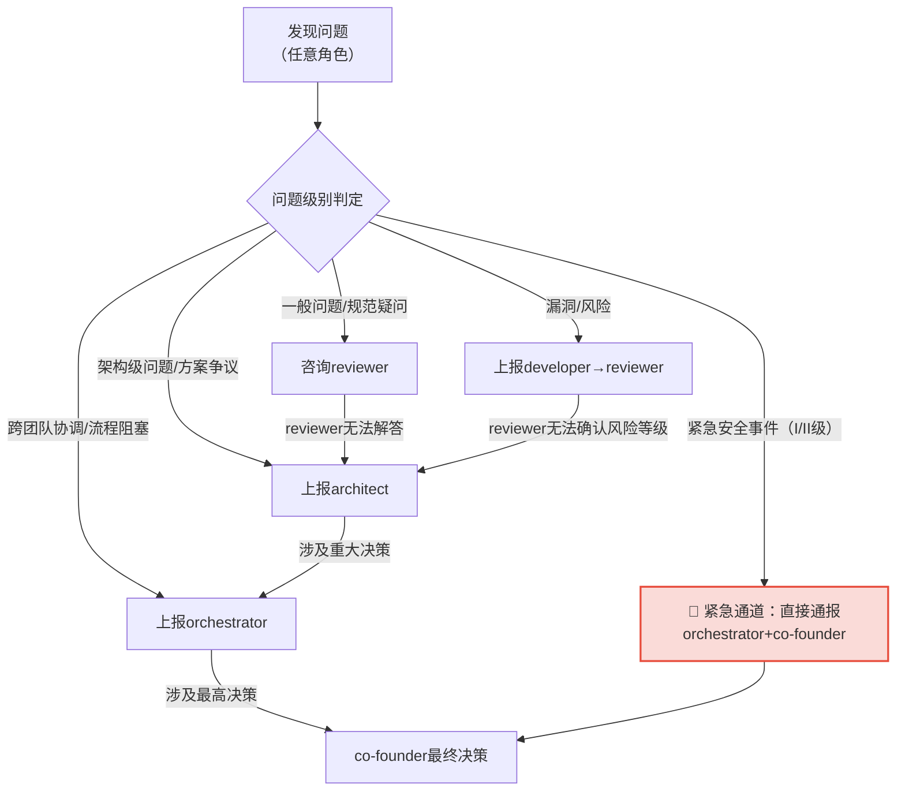

# 职责冲突解决与升级机制

### 职责边界争议解决流程

当两个角色对数据安全职责归属产生争议时，按以下流程解决：

1. **直接协商**：争议双方首先基于本规范的职责映射表自行协商，对照RACI矩阵确定责任主体
2. **reviewer裁决**：协商不成时，由reviewer依据安全规范作出裁决（日常安全活动争议）
3. **orchestrator仲裁**：reviewer无法裁决或涉及跨团队争议时，提交orchestrator仲裁
4. **co-founder最终裁定**：涉及重大安全决策、架构层面争议或orchestrator无法仲裁时，提交co-founder最终裁定

争议解决期间，涉及L3/L4数据操作或疑似安全事件的，相关操作**必须暂停**，不得在争议未解决前继续执行。

### 问题升级路径

数据安全问题按严重程度逐级上报，升级路径如下：

**常规升级路径**：developer → reviewer → architect → orchestrator → co-founder

每级响应时限：
- reviewer：1个工作日内回复
- architect：2个工作日内回复
- orchestrator：1个工作日内协调
- co-founder：3个工作日内决策

### 安全问题紧急上报通道

发现以下情况时，可**越级直接上报**，不受常规升级路径限制：

1. **正在发生的数据泄露**：用户数据、敏感业务数据正在被未授权访问或导出
2. **密钥/凭证泄露**：私钥、密码、API Key、Token等敏感凭证已泄露或疑似泄露
3. **正在发生的攻击**：系统正遭受SQL注入、勒索攻击、挖矿程序等正在进行的攻击
4. **L4数据违规操作**：发现有人未审批正在操作L4级核心数据
5. **合规红线触发**：监管机构已介入或即将到场检查、数据出境已违反法规要求

**紧急上报方式**：
1. 立即在团队群@orchestrator和co-founder，标注【🔴数据安全紧急事件】
2. 同步在任务系统标记最高优先级缺陷
3. 如涉及线上系统，立即执行可遏制损害扩大的紧急操作（如下线接口、撤销密钥、切断网络），无需等待审批，但必须在操作后30分钟内补报说明

**紧急上报奖惩**：
- 对及时上报避免重大损失的角色给予正向激励
- 对瞒报、迟报导致损失扩大的，按安全违规追责
- 对误报（经reviewer研判为非紧急事件）不予追责，但需记录误报原因用于优化告警规则

---

## 相关模式

- [数据分类分级标准](../data-classification.md)
- [数据加密与密钥管理规范](../data-encryption.md)
- [数据安全监控体系](../security-monitoring.md)
- [第三方API供应商安全准入制度](../vendor-admission.md)
- [第三方API供应商持续审计制度](../vendor-audit.md)
- [数据出境安全评估机制](../cross-border-assessment.md)
- [数据安全治理角色职责矩阵](../role-responsibilities.md)

← 上一章: [数据安全门禁与角色能力培训](03-gates-training.md) | **[返回索引](../role-responsibilities.md)**
