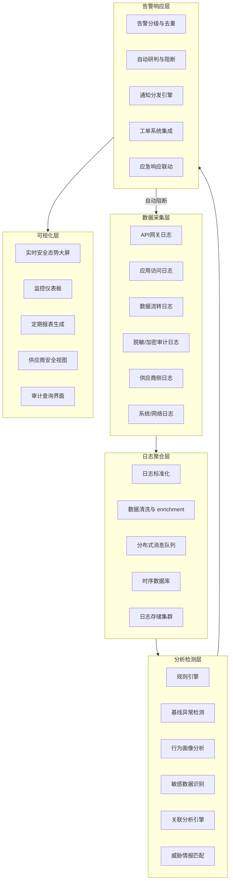
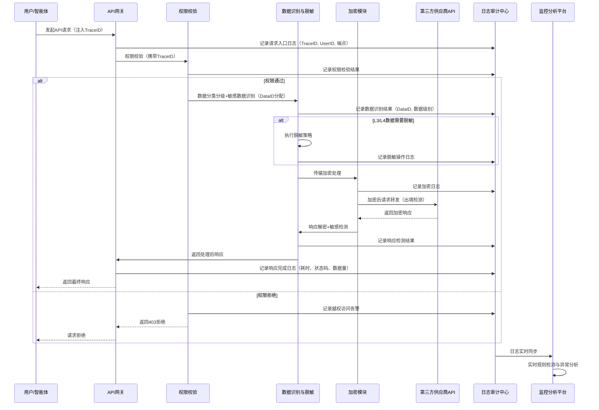
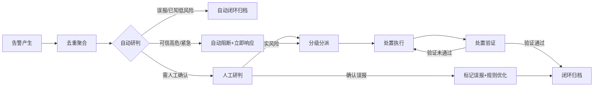

# 数据安全监控体系

> 本规范是AI智能体互联数据安全治理体系的运行时监控模块，定义数据安全监控指标体系、告警阈值分级、全链路追踪方案、异常行为检测规则与告警响应流程，实现7×24小时数据安全风险实时感知。

## 规范说明

### 目的

本规范旨在建立覆盖数据全生命周期的安全监控体系，实时感知数据安全风险，实现威胁快速发现、精准研判与及时响应处置，保障AI智能体互联场景下的数据流转安全、合规可控。通过可量化的监控指标、分级告警机制与自动化检测规则，将数据安全风险从事后追溯转变为事前预防、事中阻断。

### 适用范围

本规范适用于TRAE系统所有数据流转环节，包括但不限于：

- 用户提示词输入与模型响应输出监控
- 第三方AI API（国内/境外）数据传输监控
- 跨供应商数据流转与出境数据监控
- 敏感数据脱敏、加密处理过程监控
- 用户访问行为与API调用行为监控
- 供应商服务可用性与安全态势监控
- 数据存储、缓存、备份环节监控

### 基本原则

- **全链路覆盖**：监控范围覆盖数据从产生、传输、处理、存储到销毁的完整生命周期，不留监控盲区
- **实时性**：关键指标实现秒级采集、分钟级告警，确保威胁能够及时发现
- **分级告警**：根据风险严重程度划分五级告警，匹配不同响应时限与通知策略
- **误报可控**：通过规则优化、基线学习、多维度关联分析控制误报率，避免告警疲劳
- **隐私保护**：监控数据采集与存储遵循最小必要原则，敏感监控字段需脱敏处理，监控系统自身符合安全要求

### 监控体系架构概述

数据安全监控体系采用五层架构设计，从数据采集到可视化呈现形成闭环：数据采集层负责全维度日志与指标采集；日志聚合层实现多源数据统一汇聚与标准化；分析检测层通过规则引擎与基线模型进行实时异常检测；告警响应层执行告警分级、通知与自动化处置；可视化层提供态势感知与报表能力。体系与[数据分类分级标准](data-classification.md)、[数据脱敏规范](data-masking.md)、[数据加密规范](data-encryption.md)、[供应商准入制度](vendor-admission.md)、[供应商持续审计制度](vendor-audit.md)、[数据安全应急响应机制](incident-response.md)等规范协同运作。

## 监控体系架构

### 各层核心组件与职责

| 层级 | 核心组件 | 主要职责 |
|---|---|---|
| 数据采集层 | API网关探针、应用日志Agent、网络流量探针、供应商日志接收端 | 统一采集全链路数据访问、传输、处理日志，确保日志完整性与时间同步 |
| 日志聚合层 | 消息队列（Kafka）、日志标准化引擎、时序数据库（InfluxDB/Prometheus）、对象存储 | 实现多源日志汇聚、格式标准化、数据清洗、长期存储与快速检索 |
| 分析检测层 | Drools规则引擎、基线学习模型、UEBA用户行为分析、DLP敏感数据识别、关联分析模块 | 实时执行检测规则、动态基线对比、行为异常识别、敏感数据检测、多维度告警关联 |
| 告警响应层 | 告警聚合模块、自动处置引擎、通知网关、工单API、应急响应Webhook | 告警去重降噪、自动分级、多渠道通知、自动化阻断、应急流程触发 |
| 可视化层 | Grafana大屏、Kibana仪表板、报表引擎、供应商门户 | 实时态势展示、指标监控、历史追溯、报表自动生成、供应商安全评级展示 |

## 核心监控指标体系

### 指标分类与详细说明

| 指标ID | 指标名称 | 指标类别 | 计算方式 | 基线值 | 数据来源 | 关联风险 |
|---|---|---|---|---|---|---|
| METRIC-001 | 各供应商API数据传输量 | 数据流转指标 | 按供应商统计5分钟窗口内入方向+出方向数据流量（MB） | 根据历史同期建立动态基线，波动范围±50% | API网关日志 | 数据异常流出、供应商服务异常 |
| METRIC-002 | 出境数据量 | 数据流转指标 | 统计发往境外供应商API的请求/响应数据量（MB/小时） | 根据业务规律建立小时级基线，非业务时段为0 | API网关+IP地理位置库 | 未授权数据出境、数据泄露 |
| METRIC-003 | L3/L4数据传输次数 | 数据流转指标 | 按数据级别统计跨边界（跨供应商/出境）传输次数（次/小时） | L4数据传输需逐次审批，基线为0次/小时；L3根据业务量动态调整 | 数据标识系统+API网关 | 敏感数据越权流转、核心数据泄露 |
| METRIC-004 | 异常时间访问占比 | 访问异常指标 | 非工作时间（22:00-08:00）+周末/节假日访问量占当日总访问量比例 | < 5% | 访问日志+日历服务 | 账号盗用、非授权访问、内部违规操作 |
| METRIC-005 | 异常地理位置访问次数 | 访问异常指标 | 非常用登录地/境外IP（非白名单）访问次数（次/日） | 0次/日（白名单IP除外） | 访问日志+IP地理位置库 | 账号被盗、境外未授权接入 |
| METRIC-006 | 失败认证次数 | 访问异常指标 | 单用户/单IP 10分钟窗口内认证失败次数 | < 5次/10分钟 | 认证系统日志 | 暴力破解、密码喷洒攻击 |
| METRIC-007 | 单用户高频调用 | 行为异常指标 | 单用户/单API Key 1分钟窗口内API调用次数 | 根据用户角色设定，普通用户< 60次/分钟 | API网关访问日志 | API滥用、爬虫行为、凭证泄露 |
| METRIC-008 | 单次请求数据量异常 | 行为异常指标 | 单次API请求/响应体大小 | P99值为基线，超过3倍P99判定为异常 | API网关日志 | 批量数据窃取、异常数据导出 |
| METRIC-009 | 批量导出操作次数 | 行为异常指标 | 单用户1小时内触发批量导出/下载操作次数 | < 3次/小时 | 应用操作日志 | 数据批量泄露、内部人员违规 |
| METRIC-010 | PII检测命中次数 | 敏感数据指标 | DLP引擎检测到请求/响应中包含个人信息（手机号/身份证/邮箱等）的次数 | 出境场景基线为0；境内场景根据业务场景动态调整 | DLP敏感数据检测引擎 | 敏感数据未脱敏、PII违规传输 |
| METRIC-011 | 敏感关键词命中次数 | 敏感数据指标 | 自定义敏感关键词词典命中次数（次/小时） | 根据业务基线设定，突增超过200%告警 | DLP引擎+关键词匹配 | 核心数据泄露、敏感信息外发 |
| METRIC-012 | 脱敏失败次数 | 敏感数据指标 | 数据脱敏模块处理失败或跳过脱敏的次数 | 0次 | 脱敏审计日志 | 敏感数据明文传输、脱敏策略失效 |
| METRIC-013 | API错误率 | 供应商指标 | 供应商API返回4xx/5xx错误的比例 | < 1%（5分钟窗口） | API网关日志+供应商回调 | 供应商服务不可用、认证过期、请求异常 |
| METRIC-014 | 供应商SLA达标率 | 供应商指标 | 供应商API响应时间满足SLA约定的请求比例 | ≥ 99.5% | API网关性能日志 | 供应商服务质量下降、潜在故障风险 |
| METRIC-015 | 供应商异常通报次数 | 供应商指标 | 供应商主动通报的安全事件/服务异常次数 | 0次/季度 | 供应商管理系统+邮件通告 | 供应商侧安全事件、供应链风险 |
| METRIC-016 | 未评估出境请求数 | 合规指标 | 未经过[跨境数据流动评估](cross-border-assessment.md)审批的出境数据请求次数 | 0次 | 审批系统+API网关 | 违规数据出境、合规风险 |
| METRIC-017 | 未授权API调用次数 | 合规指标 | 调用未授权API端点、越权访问资源的次数 | 0次 | 权限系统+API网关 | 越权操作、权限绕过、攻击探测 |
| METRIC-018 | 加密失败次数 | 合规指标 | 传输/存储加密过程失败次数 | 0次 | 加密模块审计日志 | 数据明文传输、加密配置失效 |

## 告警阈值分级

### 五级告警定义

| 级别 | 名称 | 颜色标识 | 响应时限 | 通知方式 | 典型场景 |
|---|---|---|---|---|---|
| INFO | 信息 | 🔵 蓝色 | 无需响应，日常记录归档 | 仪表板展示、日志记录 | 正常业务波动、常规操作记录、基线学习样本 |
| LOW | 低危 | 🟢 绿色 | 24小时内研判 | 邮件通知安全运营团队 | 轻微偏离基线、单个低风险指标异常、可疑但不确定的行为 |
| MEDIUM | 中危 | 🟡 黄色 | 2小时内研判 | IM消息+邮件通知安全运营负责人 | 多个低危指标关联异常、单维度明显偏离基线、可疑访问行为 |
| HIGH | 高危 | 🟠 橙色 | 30分钟内响应处置 | 电话+IM+邮件通知安全负责人+值班人员 | 敏感数据异常传输、确定的攻击尝试、批量数据异常操作 |
| CRITICAL | 紧急 | 🔴 红色 | 立即响应（15分钟内启动应急） | 全员紧急通知+自动阻断+电话告警 | 核心数据泄露确认、大规模数据外传、正在发生的入侵事件 |

### 核心指标阈值建议

| 指标类别 | 具体指标 | INFO | LOW | MEDIUM | HIGH | CRITICAL |
|---|---|---|---|---|---|---|
| 数据流转 | 出境数据量突增 | 偏离基线±30% | 偏离基线+50% | 偏离基线+100% | 偏离基线+200% | 非业务时段出境数据量>0且含L3/L4数据 |
| 数据流转 | L4数据跨边界传输 | - | - | - | 未经审批发起L4传输请求 | L4数据已实际出境 |
| 访问异常 | 失败认证次数 | 3次/10分钟 | 5次/10分钟 | 10次/10分钟 | 20次/10分钟 | 50次/10分钟且分布在多个账号 |
| 访问异常 | 境外IP访问 | - | 白名单境外IP正常访问 | 非常用地IP首次访问 | 境外非白名单IP且携带认证凭证 | 境外IP成功访问敏感API |
| 行为异常 | 单用户调用频率 | 超基线20% | 超基线50% | 超基线100% | 超基线300% | 超基线500%且请求涉及批量接口 |
| 行为异常 | 单次请求数据量 | > P95 | > 2倍P99 | > 3倍P99 | > 5倍P99 | > 10倍P99且包含敏感字段 |
| 敏感数据 | PII出境命中 | - | - | 境内场景PII未脱敏命中 | 出境场景PII命中未拦截 | 大量PII数据正在出境 |
| 敏感数据 | 脱敏失败 | - | 单条脱敏失败 | 单小时5次脱敏失败 | 单小时20次脱敏失败 | 脱敏模块完全失效持续5分钟以上 |
| 供应商 | API错误率 | 1-3% | 3-5% | 5-10% | 10-30% | > 30%持续5分钟 |
| 合规 | 未评估出境请求 | - | - | 存在未评估出境请求意图 | 未评估请求已发出 | 未评估L3/L4数据已出境 |
| 合规 | 加密失败 | - | 单次加密失败警告 | 单小时3次加密失败 | 单小时10次加密失败 | 加密通道中断持续3分钟以上 |

## 数据流转全链路追踪方案

### 数据标识方案

- **TraceID分配机制**：API网关为每一次API调用生成全局唯一TraceID（格式：`TRACE-{timestamp}-{random16hex}`），在请求入口处注入HTTP Header `X-Trace-ID`，贯穿整个处理链路
- **DataID标识机制**：为每条L3/L4级别的敏感数据分配唯一DataID（格式：`DATA-{level}-{uuid}`），在数据分类分级标记阶段嵌入元数据，随数据流转全程携带
- **标识传递规则**：TraceID和DataID通过HTTP Header、RPC上下文、日志MDC（Mapped Diagnostic Context）等机制在跨服务调用中自动传递，不侵入业务数据本身

### 日志关联机制

- **统一日志格式**：所有链路节点日志采用结构化JSON格式，必须包含TraceID、时间戳、节点ID、事件类型、数据级别等公共字段
- **全链路埋点覆盖**：在请求接收→权限校验→数据识别→脱敏处理→加密处理→API转发→响应接收→解密→日志记录→缓存/存储等关键节点进行埋点日志记录
- **关联查询能力**：支持通过TraceID反查整条调用链的所有节点日志，通过DataID追溯数据的所有流转历史，实现"一次请求、全程可溯；一条数据、全生命周期可查"

### 数据流向图谱

- **可视化拓扑**：构建实时数据流向图谱，节点代表系统/服务/供应商，边代表数据流动方向与量级，不同颜色区分数据级别（L1透明、L2蓝色、L3橙色、L4红色）
- **跨境路径高亮**：对跨境数据流动路径进行特殊标记与高亮展示，出境节点实时闪烁提醒
- **异常流向告警**：当出现未注册的数据流路径、数据反向流动、非预期节点接收数据时，自动在图谱上标注异常并触发告警

### 追踪数据留存

- **日志留存期限**：全链路追踪日志在线存储不少于90天，归档存储不少于3年，满足合规审计要求
- **存储方式**：热数据存Elasticsearch支持快速检索，冷数据归档至对象存储并压缩加密，关键审计日志写入WORM（一次写入多次读取）存储防篡改
- **查询能力**：支持按TraceID、DataID、时间范围、用户ID、供应商、数据级别、事件类型等多维度组合查询，查询响应时间< 10秒

### 全链路追踪Mermaid序列图示例

## 异常行为检测规则集

| 规则ID | 规则名称 | 检测逻辑 | 阈值 | 告警级别 | 误报率预估 | 处置建议 |
|---|---|---|---|---|---|---|
| RULE-001 | 非工作时间大量调用 | 统计22:00-08:00及节假日单用户调用量，与该用户工作时间调用基线对比 | 非工作时间调用量超过日均工作时间的30%且绝对次数>50次 | MEDIUM | 10% | 核实是否有加班/值班安排，无合理理由则临时冻结账号并核查 |
| RULE-002 | 节假日异常请求 | 法定节假日期间系统请求量与节前基线对比 | 节假日请求量>节前工作日同时段的50%且非预案内运维操作 | LOW | 15% | 排查是否有紧急业务需求或未报备的运维操作 |
| RULE-003 | 境外IP直接调用 | 检测请求源IP地理位置，匹配境外IP库且不在白名单内 | 发现境外IP（非白名单）访问任何非公开API | HIGH | <5% | 立即阻断IP，核查是否存在代理/VPN滥用，追溯账号来源 |
| RULE-004 | 高风险地区访问 | 请求源IP来自威胁情报标记的高风险地区/已知恶意IP段 | 命中高风险地区IP库或威胁情报黑名单IP | HIGH | <3% | 立即阻断IP，强制相关账号退出登录并重置凭证 |
| RULE-005 | 单用户调用频率突增 | 单用户/单API Key滑动窗口调用QPS与历史7天基线对比 | 1分钟QPS超过该用户基线300%且持续3个窗口以上 | MEDIUM | 8% | 先限流观察，若持续异常则临时降级权限，联系用户确认 |
| RULE-006 | 单API Key调用频率突增 | 单API Key全局调用QPS与日均基线对比 | 5分钟QPS超过基线500%或触发平台限流阈值 | HIGH | 5% | 立即暂停该API Key，核查是否泄露或被滥用 |
| RULE-007 | 单次请求数据量异常大 | 单次请求/响应体大小与同接口P99值对比 | 单次请求体> 5倍P99 或 > 10MB（非文件上传接口） | HIGH | 5% | 拦截请求，人工核查内容，确认是否为批量数据窃取 |
| RULE-008 | 短时间多次请求大数据量 | 单用户10分钟窗口内累计请求/响应数据量 | 累计数据量> 100MB且涉及用户/业务数据接口 | HIGH | 7% | 临时阻断该用户数据导出权限，核查操作合理性 |
| RULE-009 | 敏感数据未脱敏传输 | DLP引擎检测出境请求/响应中是否包含未脱敏PII/敏感数据 | 正则+NER检测到手机号、身份证、银行卡、密钥等未脱敏字段 | CRITICAL | <1% | 立即阻断请求，触发应急响应，排查脱敏模块是否失效 |
| RULE-010 | 请求包含密钥/凭证 | 检测请求体/参数中是否包含API Key、密码、私钥、Token等凭证信息 | 命中密钥正则模式且疑似有效凭证格式 | HIGH | 3% | 拦截请求，立即吊销疑似泄露的凭证，通知安全团队 |
| RULE-011 | 访问模式偏离用户习惯 | 基于UEBA用户画像，检测访问时间、访问接口序列、数据量分布偏离 | 行为偏离度评分> 80分（满分100） | MEDIUM | 15% | 加强二次认证，记录详细日志，人工研判是否账号被盗 |
| RULE-012 | 遍历式ID访问 | 检测是否存在连续ID枚举访问（如/user/1, /user/2...） | 10分钟内访问ID连续递增/递减的资源>50次 | MEDIUM | 10% | 拦截遍历行为，核查是否为越权数据爬取 |
| RULE-013 | 异常时间批量导出 | 非工作时间或短时间内多次触发批量导出/下载接口 | 1小时内触发批量导出操作≥3次或单批次导出记录>1000条 | HIGH | 8% | 暂停导出权限，核查操作人身份与导出审批单 |
| RULE-014 | 供应商服务异常中断 | 供应商API连续超时/错误，SLA指标骤降 | 错误率>30%持续5分钟 或 平均响应时间> SLA约定3倍 | MEDIUM | 5% | 自动切换备用供应商/降级服务，通知供应商对接人 |
| RULE-015 | 供应商返回数据量异常 | 供应商响应数据量与历史基线对比，突增或突降 | 响应数据量突增超过基线200% 或 突降超过80%且非预期 | LOW | 12% | 核查是否供应商API变更、数据格式异常或被注入异常内容 |
| RULE-016 | 未审批出境请求 | 出境请求与[跨境数据流动评估](cross-border-assessment.md)审批单比对，无有效审批 | 检测到出境请求但无对应审批单号或审批已过期 | CRITICAL | <1% | 立即阻断出境流量，触发应急响应，追溯请求发起人责任 |
| RULE-017 | 向黑名单供应商发送数据 | 检测请求目标供应商是否在黑名单/暂停服务清单中 | 目标供应商ID命中黑名单列表 | CRITICAL | 0% | 立即阻断，记录全链路日志，核查路由配置是否被篡改 |
| RULE-018 | 短时间多账号失败登录 | 同一IP/设备短时间内尝试多个不同账号登录 | 10分钟内同一IP尝试≥10个不同账号登录且失败率>80% | HIGH | 5% | 立即封禁IP，标记为暴力破解攻击来源，纳入威胁情报 |

## 告警响应流程

### 告警响应全流程

### 各环节时限与责任角色

| 流程环节 | 时限要求 | 责任角色 | 主要动作 |
|---|---|---|---|
| 告警产生 | 实时（检测到异常秒级生成） | 监控系统 | 采集指标异常触发，生成原始告警事件，携带完整上下文（TraceID、关联日志、快照数据） |
| 去重聚合 | 1分钟内 | 告警引擎 | 相同规则+相同目标+短时间内重复告警聚合为一条，关联相似告警为事件组，避免告警风暴 |
| 自动研判 | 30秒内 | 规则引擎+SOAR | 基于历史误报库、白名单、维护窗口、威胁情报自动研判：已知误报直接归档，确认高危自动执行阻断剧本 |
| 人工研判 | HIGH/CRITICAL：30分钟内；MEDIUM：2小时内；LOW：24小时内 | 安全运营分析师 | 核查告警上下文，判断真实风险还是误报，补充风险评级，确定处置方案 |
| 分级分派 | 研判后10分钟内 | 工单系统 | 按级别分派至对应责任人：CRITICAL→安全负责人+应急响应组；HIGH→安全工程师；MEDIUM→运营值班；LOW→常规队列 |
| 处置执行 | CRITICAL：15分钟内启动；HIGH：30分钟内；MEDIUM：2小时内；LOW：24小时内 | 对应处置责任人 | 按处置手册执行：阻断IP、冻结账号、吊销凭证、暂停供应商、隔离数据等操作 |
| 处置验证 | 处置执行后1小时内 | 安全运营分析师 | 验证处置措施是否生效，确认异常行为是否停止，有无扩散风险，必要时补充处置动作 |
| 闭环归档 | 验证通过后24小时内 | 安全运营团队 | 完整记录处置过程、影响范围、根因分析，归档所有证据材料，更新知识库 |

### 误报反馈机制

- **误报标记入口**：在所有告警工单界面提供"标记误报"按钮，研判人员可一键标记并填写误报原因
- **误报分类统计**：将误报原因分类为：规则过于宽泛、业务变更未更新基线、白名单遗漏、测试数据、正常业务高峰、其他
- **规则优化闭环**：每周自动统计Top N误报规则，由安全运营团队评审优化：调整阈值、增加白名单、增加关联判断条件、下线低效规则
- **基线动态更新**：对因业务变化导致的基线偏离告警，确认合法后自动更新动态基线，避免重复误报
- **误报率考核**：单条规则误报率连续一周超过30%自动停用待优化，整体系统误报率控制在15%以下

## 监控仪表板与报表

### 实时安全态势大屏

**核心展示指标**：

- **全球数据流向地图**：实时展示数据跨境流动热力图，出境节点红色高亮，线条粗细代表数据量
- **告警趋势图**：近24小时各级别告警数量趋势折线图，告警级别颜色堆叠
- **核心指标卡片**：
  - 今日API调用总量、当前QPS
  - 出境数据流量（实时值/今日累计）
  - L3/L4数据传输次数（今日累计）
  - 当前活跃告警数（按级别分布）
  - 在线供应商数量、异常供应商数量
  - 自动阻断次数（今日累计）
- **实时告警滚动列表**：最新告警实时滚动展示，包含时间、级别、规则名称、简要描述
- **供应商安全状态矩阵**：所有供应商安全评分、SLA达标率、近期告警数热力展示
- **TOP风险排行**：当日触发告警最多的用户、IP、接口、供应商排行

### 定期报表模板框架

**日报（每日9:00自动生成）**：

1. 昨日数据安全态势概览（总调用量、出境数据量、告警总数、各级别分布）
2. 重要告警事件清单与处置情况（HIGH/CRITICAL级别）
3. 关键指标趋势（与前日对比）
4. 供应商服务情况汇总
5. 待跟进事项列表

**周报（每周一10:00自动生成）**：

1. 本周安全态势总结（与上周对比）
2. 告警分类统计与趋势分析
3. 本周处置的典型安全事件复盘
4. 误报率统计与规则优化建议
5. 供应商安全评分排名
6. 合规指标达标情况（出境审批、加密覆盖率等）
7. 下周重点关注事项

**月报（每月5日前自动生成）**：

1. 月度数据安全态势总览（与上月/去年同期对比）
2. 重大安全事件回顾与根因分析
3. 监控指标基线变化分析
4. 检测规则优化与新增情况
5. 供应商安全审计发现汇总
6. 合规性达标情况总结
7. 月度安全运营数据（MTTD平均检测时间、MTTR平均响应时间）
8. 下月工作计划与风险预警

### 供应商安全态势单独视图

为每个接入供应商提供独立安全视图，包含：

- 供应商基本信息、安全评级、对接人联系方式
- 实时服务可用性、SLA达标率、错误率、响应延迟趋势
- 该供应商相关的数据传输量（入/出方向）、数据级别分布
- 该供应商相关的历史安全告警统计与事件清单
- 最近一次[供应商持续审计](vendor-audit.md)结果与整改项
- 数据出境流向与涉及的用户范围统计

## 监控系统运维要求

### 监控系统自身高可用

- **冗余部署**：监控系统所有组件（采集Agent、消息队列、检测引擎、数据库、可视化服务）均采用集群化部署，无单点故障
- **故障切换**：关键组件配置健康检查与自动故障切换，RTO（恢复时间目标）< 5分钟，RPO（恢复点目标）< 1分钟
- **异地容灾**：监控数据跨可用区备份，核心配置多副本同步，确保单机房故障不影响监控能力
- **独立通道**：监控数据传输使用独立网络通道，与业务数据通道隔离，避免业务流量异常影响监控上报
- **降级策略**：系统高负载时自动降级非核心检测规则，优先保证CRITICAL和HIGH级别告警检测

### 检测规则定期更新与优化机制

- **规则评审周期**：每月组织一次检测规则评审会议，由安全运营团队、研发团队、合规团队共同参与
- **规则更新触发条件**：
  - 新业务上线/新供应商接入
  - 新的安全漏洞/威胁情报发布
  - 合规要求变更
  - 误报率超过阈值或漏报事件发生
- **规则上线流程**：规则开发→测试环境验证（历史数据回放）→灰度环境观察（10%流量）→全量上线→效果观察
- **规则生命周期管理**：每条规则记录创建人、创建时间、最后修改时间、误报率、命中率、状态（启用/停用/测试中），废弃规则及时清理归档

### 监控数据安全

- **监控日志加密**：监控日志在传输过程中强制TLS 1.3加密，存储时采用AES-256静态加密
- **访问控制**：监控系统访问遵循最小权限原则，不同角色（安全运营/研发/合规/审计）配置不同数据访问范围，敏感字段（如用户PII）查询需脱敏展示
- **审计留痕**：所有对监控系统的操作（查询、配置变更、规则修改、告警处置）均记录审计日志，不可篡改
- **数据留存合规**：监控数据留存期限满足《网络安全法》要求的不少于6个月日志留存，涉及安全事件的相关日志永久归档
- **监控系统自身安全扫描**：每季度对监控系统进行一次渗透测试与漏洞扫描，及时修复安全隐患

### 红蓝对抗与压力测试

- **红蓝对抗频率**：每季度组织一次针对数据安全监控体系的红蓝对抗演练，检验告警发现能力与响应流程有效性
- **演练场景覆盖**：
  - 模拟数据泄露（批量数据导出、敏感数据出境）
  - 模拟账号盗用（异常地理位置登录、越权访问）
  - 模拟供应商侧异常（数据回传异常、服务中断）
  - 模拟内部人员违规操作（非工作时间批量下载）
- **压力测试频率**：每月进行一次监控系统压力测试，验证在业务峰值3倍流量下监控系统的处理能力与告警准确性
- **演练复盘**：每次演练后输出复盘报告，记录漏报、误报、响应延迟问题，纳入规则优化与流程改进计划

## 监控有效性验证检查清单

安全运营团队每月使用以下检查清单验证监控体系有效性，检查结果纳入月度安全报告：

| 检查项ID | 检查内容 | 验证方法 | 合格标准 | 检查频率 | 责任人 |
|---|---|---|---|---|---|
| CHK-001 | 关键节点日志采集完整性 | 随机抽取100次API调用，核对全链路每个节点是否都有日志记录 | 日志完整率≥99.9%，缺失节点可追溯原因 | 每月 | 安全运营工程师 |
| CHK-002 | TraceID全链路透传有效性 | 抽样TraceID查询整条链路，验证各节点是否都携带相同TraceID | TraceID透传成功率100% | 每月 | 安全运营工程师 |
| CHK-003 | 检测规则命中率验证 | 使用已知攻击样本重放，验证是否触发对应告警 | 已知攻击场景检出率100% | 每季度 | 安全工程师 |
| CHK-004 | 告警误报率统计 | 统计本月所有人工研判告警中误报比例 | 整体误报率≤15%，单条规则误报率≤30% | 每月 | 安全运营负责人 |
| CHK-005 | 告警响应时限达标率 | 统计各级别告警从产生到首次响应的时间，符合率 | CRITICAL:100%在15分钟内响应；HIGH:≥95%在30分钟内响应 | 每月 | 安全运营负责人 |
| CHK-006 | 平均检测时间（MTTD） | 统计从异常发生到告警产生的平均时间 | CRITICAL/HIGH级别MTTD≤1分钟；MEDIUM/LOW≤5分钟 | 每月 | 安全运营工程师 |
| CHK-007 | 自动阻断有效性 | 在测试环境模拟CRITICAL级场景，验证自动阻断是否生效 | 阻断规则触发率100%，阻断生效时间<30秒 | 每季度 | 安全工程师 |
| CHK-008 | 监控系统高可用性 | 统计监控系统核心组件月度可用性SLA | 核心服务可用性≥99.9%，无单点故障 | 每月 | 运维工程师 |
| CHK-009 | 全链路追踪查询能力 | 随机选取TraceID和DataID进行查询，验证查询响应时间与结果完整性 | 查询响应时间<10秒，结果完整准确 | 每月 | 安全运营工程师 |
| CHK-010 | 敏感数据检测准确性 | 构造包含各类PII和敏感数据的测试用例，验证DLP检测召回率 | PII检测召回率≥98%，精确率≥95% | 每季度 | 数据安全工程师 |
| CHK-011 | 告警通知渠道可用性 | 定期发送测试告警，验证各通知渠道（邮件/IM/电话）是否可达 | 所有通知渠道可用率100%，通知延迟<1分钟 | 每月 | 安全运营工程师 |
| CHK-012 | 监控数据留存合规性 | 检查日志存储周期、加密状态、访问控制配置 | 满足法律法规留存要求，加密覆盖率100%，权限配置正确 | 每季度 | 合规专员 |
| CHK-013 | 报表生成准确性与及时性 | 核对自动生成的日报/周报/月报数据准确性与发送时效 | 数据准确率100%，按时发送率100% | 每月 | 安全运营工程师 |
| CHK-014 | 基线动态更新有效性 | 检查业务变更后动态基线是否及时更新，是否存在因基线陈旧导致的误报/漏报 | 业务变更后基线更新延迟≤24小时 | 每季度 | 安全运营负责人 |
