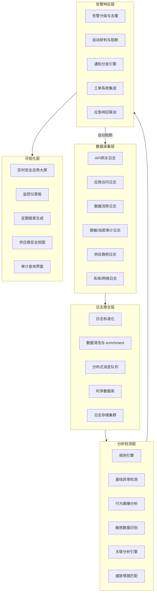

# 规范说明与监控体系架构

## 规范说明

### 目的

本规范旨在建立覆盖数据全生命周期的安全监控体系，实时感知数据安全风险，实现威胁快速发现、精准研判与及时响应处置，保障AI智能体互联场景下的数据流转安全、合规可控。通过可量化的监控指标、分级告警机制与自动化检测规则，将数据安全风险从事后追溯转变为事前预防、事中阻断。

### 适用范围

本规范适用于TRAE系统所有数据流转环节，包括但不限于：

- 用户提示词输入与模型响应输出监控
- 第三方AI API（国内/境外）数据传输监控
- 跨供应商数据流转与出境数据监控
- 敏感数据脱敏、加密处理过程监控
- 用户访问行为与API调用行为监控
- 供应商服务可用性与安全态势监控
- 数据存储、缓存、备份环节监控

### 基本原则

- **全链路覆盖**：监控范围覆盖数据从产生、传输、处理、存储到销毁的完整生命周期，不留监控盲区
- **实时性**：关键指标实现秒级采集、分钟级告警，确保威胁能够及时发现
- **分级告警**：根据风险严重程度划分五级告警，匹配不同响应时限与通知策略
- **误报可控**：通过规则优化、基线学习、多维度关联分析控制误报率，避免告警疲劳
- **隐私保护**：监控数据采集与存储遵循最小必要原则，敏感监控字段需脱敏处理，监控系统自身符合安全要求

### 监控体系架构概述

数据安全监控体系采用五层架构设计，从数据采集到可视化呈现形成闭环：数据采集层负责全维度日志与指标采集；日志聚合层实现多源数据统一汇聚与标准化；分析检测层通过规则引擎与基线模型进行实时异常检测；告警响应层执行告警分级、通知与自动化处置；可视化层提供态势感知与报表能力。体系与[数据分类分级标准](../data-classification.md)、[数据脱敏规范](../data-masking.md)、[数据加密规范](../data-encryption.md)、[供应商准入制度](../vendor-admission.md)、[供应商持续审计制度](../vendor-audit.md)、[数据安全应急响应机制](../incident-response.md)等规范协同运作。

## 监控体系架构

### 各层核心组件与职责

| 层级 | 核心组件 | 主要职责 |
|---|---|---|
| 数据采集层 | API网关探针、应用日志Agent、网络流量探针、供应商日志接收端 | 统一采集全链路数据访问、传输、处理日志，确保日志完整性与时间同步 |
| 日志聚合层 | 消息队列（Kafka）、日志标准化引擎、时序数据库（InfluxDB/Prometheus）、对象存储 | 实现多源日志汇聚、格式标准化、数据清洗、长期存储与快速检索 |
| 分析检测层 | Drools规则引擎、基线学习模型、UEBA用户行为分析、DLP敏感数据识别、关联分析模块 | 实时执行检测规则、动态基线对比、行为异常识别、敏感数据检测、多维度告警关联 |
| 告警响应层 | 告警聚合模块、自动处置引擎、通知网关、工单API、应急响应Webhook | 告警去重降噪、自动分级、多渠道通知、自动化阻断、应急流程触发 |
| 可视化层 | Grafana大屏、Kibana仪表板、报表引擎、供应商门户 | 实时态势展示、指标监控、历史追溯、报表自动生成、供应商安全评级展示 |

---

## 相关模式

- [数据分类分级标准](../data-classification.md)
- [数据加密与密钥管理规范](../data-encryption.md)
- [数据安全监控体系](../security-monitoring.md)
- [第三方API供应商安全准入制度](../vendor-admission.md)
- [第三方API供应商持续审计制度](../vendor-audit.md)
- [数据出境安全评估机制](../cross-border-assessment.md)
- [数据安全治理角色职责矩阵](../role-responsibilities.md)

**[返回索引](../security-monitoring.md)** | 下一章 → [核心监控指标与告警分级](02-metrics-alerts.md)
