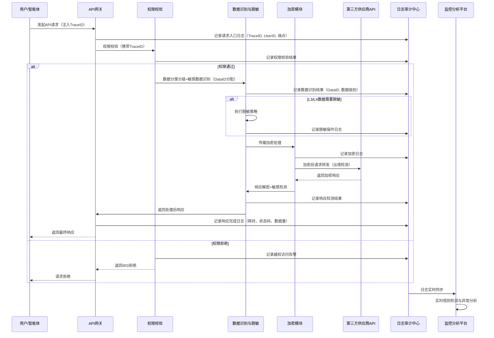

# 全链路追踪与异常检测规则

## 数据流转全链路追踪方案

### 数据标识方案

- **TraceID分配机制**：API网关为每一次API调用生成全局唯一TraceID（格式：`TRACE-{timestamp}-{random16hex}`），在请求入口处注入HTTP Header `X-Trace-ID`，贯穿整个处理链路
- **DataID标识机制**：为每条L3/L4级别的敏感数据分配唯一DataID（格式：`DATA-{level}-{uuid}`），在数据分类分级标记阶段嵌入元数据，随数据流转全程携带
- **标识传递规则**：TraceID和DataID通过HTTP Header、RPC上下文、日志MDC（Mapped Diagnostic Context）等机制在跨服务调用中自动传递，不侵入业务数据本身

### 日志关联机制

- **统一日志格式**：所有链路节点日志采用结构化JSON格式，必须包含TraceID、时间戳、节点ID、事件类型、数据级别等公共字段
- **全链路埋点覆盖**：在请求接收→权限校验→数据识别→脱敏处理→加密处理→API转发→响应接收→解密→日志记录→缓存/存储等关键节点进行埋点日志记录
- **关联查询能力**：支持通过TraceID反查整条调用链的所有节点日志，通过DataID追溯数据的所有流转历史，实现"一次请求、全程可溯；一条数据、全生命周期可查"

### 数据流向图谱

- **可视化拓扑**：构建实时数据流向图谱，节点代表系统/服务/供应商，边代表数据流动方向与量级，不同颜色区分数据级别（L1透明、L2蓝色、L3橙色、L4红色）
- **跨境路径高亮**：对跨境数据流动路径进行特殊标记与高亮展示，出境节点实时闪烁提醒
- **异常流向告警**：当出现未注册的数据流路径、数据反向流动、非预期节点接收数据时，自动在图谱上标注异常并触发告警

### 追踪数据留存

- **日志留存期限**：全链路追踪日志在线存储不少于90天，归档存储不少于3年，满足合规审计要求
- **存储方式**：热数据存Elasticsearch支持快速检索，冷数据归档至对象存储并压缩加密，关键审计日志写入WORM（一次写入多次读取）存储防篡改
- **查询能力**：支持按TraceID、DataID、时间范围、用户ID、供应商、数据级别、事件类型等多维度组合查询，查询响应时间< 10秒

### 全链路追踪Mermaid序列图示例

## 异常行为检测规则集

| 规则ID | 规则名称 | 检测逻辑 | 阈值 | 告警级别 | 误报率预估 | 处置建议 |
|---|---|---|---|---|---|---|
| RULE-001 | 非工作时间大量调用 | 统计22:00-08:00及节假日单用户调用量，与该用户工作时间调用基线对比 | 非工作时间调用量超过日均工作时间的30%且绝对次数>50次 | MEDIUM | 10% | 核实是否有加班/值班安排，无合理理由则临时冻结账号并核查 |
| RULE-002 | 节假日异常请求 | 法定节假日期间系统请求量与节前基线对比 | 节假日请求量>节前工作日同时段的50%且非预案内运维操作 | LOW | 15% | 排查是否有紧急业务需求或未报备的运维操作 |
| RULE-003 | 境外IP直接调用 | 检测请求源IP地理位置，匹配境外IP库且不在白名单内 | 发现境外IP（非白名单）访问任何非公开API | HIGH | <5% | 立即阻断IP，核查是否存在代理/VPN滥用，追溯账号来源 |
| RULE-004 | 高风险地区访问 | 请求源IP来自威胁情报标记的高风险地区/已知恶意IP段 | 命中高风险地区IP库或威胁情报黑名单IP | HIGH | <3% | 立即阻断IP，强制相关账号退出登录并重置凭证 |
| RULE-005 | 单用户调用频率突增 | 单用户/单API Key滑动窗口调用QPS与历史7天基线对比 | 1分钟QPS超过该用户基线300%且持续3个窗口以上 | MEDIUM | 8% | 先限流观察，若持续异常则临时降级权限，联系用户确认 |
| RULE-006 | 单API Key调用频率突增 | 单API Key全局调用QPS与日均基线对比 | 5分钟QPS超过基线500%或触发平台限流阈值 | HIGH | 5% | 立即暂停该API Key，核查是否泄露或被滥用 |
| RULE-007 | 单次请求数据量异常大 | 单次请求/响应体大小与同接口P99值对比 | 单次请求体> 5倍P99 或 > 10MB（非文件上传接口） | HIGH | 5% | 拦截请求，人工核查内容，确认是否为批量数据窃取 |
| RULE-008 | 短时间多次请求大数据量 | 单用户10分钟窗口内累计请求/响应数据量 | 累计数据量> 100MB且涉及用户/业务数据接口 | HIGH | 7% | 临时阻断该用户数据导出权限，核查操作合理性 |
| RULE-009 | 敏感数据未脱敏传输 | DLP引擎检测出境请求/响应中是否包含未脱敏PII/敏感数据 | 正则+NER检测到手机号、身份证、银行卡、密钥等未脱敏字段 | CRITICAL | <1% | 立即阻断请求，触发应急响应，排查脱敏模块是否失效 |
| RULE-010 | 请求包含密钥/凭证 | 检测请求体/参数中是否包含API Key、密码、私钥、Token等凭证信息 | 命中密钥正则模式且疑似有效凭证格式 | HIGH | 3% | 拦截请求，立即吊销疑似泄露的凭证，通知安全团队 |
| RULE-011 | 访问模式偏离用户习惯 | 基于UEBA用户画像，检测访问时间、访问接口序列、数据量分布偏离 | 行为偏离度评分> 80分（满分100） | MEDIUM | 15% | 加强二次认证，记录详细日志，人工研判是否账号被盗 |
| RULE-012 | 遍历式ID访问 | 检测是否存在连续ID枚举访问（如/user/1, /user/2...） | 10分钟内访问ID连续递增/递减的资源>50次 | MEDIUM | 10% | 拦截遍历行为，核查是否为越权数据爬取 |
| RULE-013 | 异常时间批量导出 | 非工作时间或短时间内多次触发批量导出/下载接口 | 1小时内触发批量导出操作≥3次或单批次导出记录>1000条 | HIGH | 8% | 暂停导出权限，核查操作人身份与导出审批单 |
| RULE-014 | 供应商服务异常中断 | 供应商API连续超时/错误，SLA指标骤降 | 错误率>30%持续5分钟 或 平均响应时间> SLA约定3倍 | MEDIUM | 5% | 自动切换备用供应商/降级服务，通知供应商对接人 |
| RULE-015 | 供应商返回数据量异常 | 供应商响应数据量与历史基线对比，突增或突降 | 响应数据量突增超过基线200% 或 突降超过80%且非预期 | LOW | 12% | 核查是否供应商API变更、数据格式异常或被注入异常内容 |
| RULE-016 | 未审批出境请求 | 出境请求与[跨境数据流动评估](../cross-border-assessment.md)审批单比对，无有效审批 | 检测到出境请求但无对应审批单号或审批已过期 | CRITICAL | <1% | 立即阻断出境流量，触发应急响应，追溯请求发起人责任 |
| RULE-017 | 向黑名单供应商发送数据 | 检测请求目标供应商是否在黑名单/暂停服务清单中 | 目标供应商ID命中黑名单列表 | CRITICAL | 0% | 立即阻断，记录全链路日志，核查路由配置是否被篡改 |
| RULE-018 | 短时间多账号失败登录 | 同一IP/设备短时间内尝试多个不同账号登录 | 10分钟内同一IP尝试≥10个不同账号登录且失败率>80% | HIGH | 5% | 立即封禁IP，标记为暴力破解攻击来源，纳入威胁情报 |

---

## 相关模式

- [数据分类分级标准](../data-classification.md)
- [数据加密与密钥管理规范](../data-encryption.md)
- [数据安全监控体系](../security-monitoring.md)
- [第三方API供应商安全准入制度](../vendor-admission.md)
- [第三方API供应商持续审计制度](../vendor-audit.md)
- [数据出境安全评估机制](../cross-border-assessment.md)
- [数据安全治理角色职责矩阵](../role-responsibilities.md)

← 上一章: [核心监控指标与告警分级](02-metrics-alerts.md) | **[返回索引](../security-monitoring.md)** | 下一章 → [告警响应流程与仪表板](04-response-dashboard.md)
