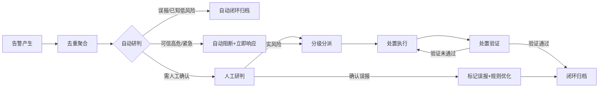

# 告警响应流程与仪表板

## 告警响应流程

### 告警响应全流程

### 各环节时限与责任角色

| 流程环节 | 时限要求 | 责任角色 | 主要动作 |
|---|---|---|---|
| 告警产生 | 实时（检测到异常秒级生成） | 监控系统 | 采集指标异常触发，生成原始告警事件，携带完整上下文（TraceID、关联日志、快照数据） |
| 去重聚合 | 1分钟内 | 告警引擎 | 相同规则+相同目标+短时间内重复告警聚合为一条，关联相似告警为事件组，避免告警风暴 |
| 自动研判 | 30秒内 | 规则引擎+SOAR | 基于历史误报库、白名单、维护窗口、威胁情报自动研判：已知误报直接归档，确认高危自动执行阻断剧本 |
| 人工研判 | HIGH/CRITICAL：30分钟内；MEDIUM：2小时内；LOW：24小时内 | 安全运营分析师 | 核查告警上下文，判断真实风险还是误报，补充风险评级，确定处置方案 |
| 分级分派 | 研判后10分钟内 | 工单系统 | 按级别分派至对应责任人：CRITICAL→安全负责人+应急响应组；HIGH→安全工程师；MEDIUM→运营值班；LOW→常规队列 |
| 处置执行 | CRITICAL：15分钟内启动；HIGH：30分钟内；MEDIUM：2小时内；LOW：24小时内 | 对应处置责任人 | 按处置手册执行：阻断IP、冻结账号、吊销凭证、暂停供应商、隔离数据等操作 |
| 处置验证 | 处置执行后1小时内 | 安全运营分析师 | 验证处置措施是否生效，确认异常行为是否停止，有无扩散风险，必要时补充处置动作 |
| 闭环归档 | 验证通过后24小时内 | 安全运营团队 | 完整记录处置过程、影响范围、根因分析，归档所有证据材料，更新知识库 |

### 误报反馈机制

- **误报标记入口**：在所有告警工单界面提供"标记误报"按钮，研判人员可一键标记并填写误报原因
- **误报分类统计**：将误报原因分类为：规则过于宽泛、业务变更未更新基线、白名单遗漏、测试数据、正常业务高峰、其他
- **规则优化闭环**：每周自动统计Top N误报规则，由安全运营团队评审优化：调整阈值、增加白名单、增加关联判断条件、下线低效规则
- **基线动态更新**：对因业务变化导致的基线偏离告警，确认合法后自动更新动态基线，避免重复误报
- **误报率考核**：单条规则误报率连续一周超过30%自动停用待优化，整体系统误报率控制在15%以下

## 监控仪表板与报表

### 实时安全态势大屏

**核心展示指标**：

- **全球数据流向地图**：实时展示数据跨境流动热力图，出境节点红色高亮，线条粗细代表数据量
- **告警趋势图**：近24小时各级别告警数量趋势折线图，告警级别颜色堆叠
- **核心指标卡片**：
  - 今日API调用总量、当前QPS
  - 出境数据流量（实时值/今日累计）
  - L3/L4数据传输次数（今日累计）
  - 当前活跃告警数（按级别分布）
  - 在线供应商数量、异常供应商数量
  - 自动阻断次数（今日累计）
- **实时告警滚动列表**：最新告警实时滚动展示，包含时间、级别、规则名称、简要描述
- **供应商安全状态矩阵**：所有供应商安全评分、SLA达标率、近期告警数热力展示
- **TOP风险排行**：当日触发告警最多的用户、IP、接口、供应商排行

### 定期报表模板框架

**日报（每日9:00自动生成）**：

1. 昨日数据安全态势概览（总调用量、出境数据量、告警总数、各级别分布）
2. 重要告警事件清单与处置情况（HIGH/CRITICAL级别）
3. 关键指标趋势（与前日对比）
4. 供应商服务情况汇总
5. 待跟进事项列表

**周报（每周一10:00自动生成）**：

1. 本周安全态势总结（与上周对比）
2. 告警分类统计与趋势分析
3. 本周处置的典型安全事件复盘
4. 误报率统计与规则优化建议
5. 供应商安全评分排名
6. 合规指标达标情况（出境审批、加密覆盖率等）
7. 下周重点关注事项

**月报（每月5日前自动生成）**：

1. 月度数据安全态势总览（与上月/去年同期对比）
2. 重大安全事件回顾与根因分析
3. 监控指标基线变化分析
4. 检测规则优化与新增情况
5. 供应商安全审计发现汇总
6. 合规性达标情况总结
7. 月度安全运营数据（MTTD平均检测时间、MTTR平均响应时间）
8. 下月工作计划与风险预警

### 供应商安全态势单独视图

为每个接入供应商提供独立安全视图，包含：

- 供应商基本信息、安全评级、对接人联系方式
- 实时服务可用性、SLA达标率、错误率、响应延迟趋势
- 该供应商相关的数据传输量（入/出方向）、数据级别分布
- 该供应商相关的历史安全告警统计与事件清单
- 最近一次[供应商持续审计](../vendor-audit.md)结果与整改项
- 数据出境流向与涉及的用户范围统计

---

## 相关模式

- [数据分类分级标准](../data-classification.md)
- [数据加密与密钥管理规范](../data-encryption.md)
- [数据安全监控体系](../security-monitoring.md)
- [第三方API供应商安全准入制度](../vendor-admission.md)
- [第三方API供应商持续审计制度](../vendor-audit.md)
- [数据出境安全评估机制](../cross-border-assessment.md)
- [数据安全治理角色职责矩阵](../role-responsibilities.md)

← 上一章: [全链路追踪与异常检测规则](03-tracing-detection.md) | **[返回索引](../security-monitoring.md)** | 下一章 → [监控系统运维与有效性验证](05-ops-validation.md)
