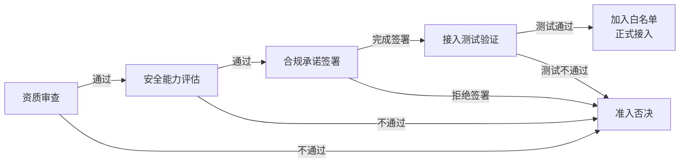

# 第三方API供应商安全准入制度

> 本规范是AI智能体互联数据安全治理体系的供应商管理模块，定义GPT、Claude、Gemini、国内大模型等第三方AI API服务供应商的安全准入评估标准、资质审查流程、合规承诺要求、接入测试验证与黑白名单管理机制。

---

## 规范说明

### 目的

从源头把控第三方AI API服务引入的安全风险，建立标准化的供应商安全准入、持续监控与退出机制，防止因第三方安全能力不足、合规缺陷或恶意行为导致的数据泄露、滥用、违规出境等安全事件。

### 适用范围

- 所有新接入的第三方AI API服务供应商（含海外与国内大模型服务商）
- 已在使用但未经过安全准入评估的存量第三方API供应商
- 第三方API的代理服务商、集成商与中间平台
- 所有通过API方式调用外部智能能力的业务场景

### 基本原则

| 原则 | 说明 |
|---|---|
| **安全前置** | 安全评估必须在正式接入前完成，禁止"先接入后补审" |
| **最小权限** | 仅授予业务必需的最小API权限范围与数据访问权限 |
| **合规承诺** | 供应商必须签署具有法律约束力的数据安全合规承诺 |
| **持续评估** | 准入不是一次性动作，建立定期复审与动态监控机制 |
| **一票否决** | 存在零容忍安全问题的供应商，直接禁止接入 |

### 准入否决项（零容忍清单）

存在以下任一情况的供应商，直接予以否决，禁止接入：

1. 隐瞒数据中心物理位置，拒绝提供数据存储地域信息
2. 明确将用户请求数据用于训练自有模型且拒绝签署不使用承诺
3. 近三年内发生过重大数据泄露事件且未完成有效整改
4. 拒绝签署数据处理协议（DPA）或拒绝合规审计
5. 被列入国家网信办或相关监管部门的违规名单
6. 无法提供必要的安全资质证明且拒绝配合安全评估
7. API接口不支持TLS加密传输，明文传输敏感数据
8. 存在恶意代码、后门或数据窃取行为的明确证据

---

## 供应商准入四阶段流程

### 阶段详情

| 阶段 | 输入 | 核心活动 | 输出 | 责任角色 | 通过判定 | 不通过处置 | 建议时限 |
|---|---|---|---|---|---|---|---|
| **资质审查** | 供应商接入申请、基本信息 | 查验企业资质、安全认证、合规资质、数据中心位置、企业背景 | 《资质审查报告》 | architect、reviewer | 所有必须项审查通过，建议项无重大问题 | 直接否决，或要求补充材料后重审 | 5个工作日 |
| **安全能力评估** | 《资质审查报告》、供应商安全文档 | 多维度安全问卷、技术文档审查、必要的技术验证 | 《安全能力评估报告》、评分结果 | security reviewer、architect | 总分≥4分（满分5分），各维度均达到最低分要求 | 要求整改后重评，或否决 | 10个工作日 |
| **合规承诺签署** | 《安全能力评估报告》 | 起草/审核DPA等法律文件、沟通条款、双方签署 | 签署完成的合规法律文件包 | orchestrator、法务 | 所有必需法律文件签署完成 | 拒绝签署核心条款则否决 | 7个工作日 |
| **接入测试验证** | 签署完成的法律文件 | 沙箱环境测试、安全配置验证、数据隔离验证、限流验证、日志验证、灰度观察 | 《接入测试报告》、灰度观察记录 | developer、tester | 所有技术测试项通过，灰度期无安全异常 | 修复问题后重测，或否决 | 测试3个工作日+灰度观察7天 |

---

## 资质审查标准

| 审查类别 | 审查项 | 审查方式 | 必须/建议 | 不通过处置 |
|---|---|---|---|---|
| **企业资质** | 营业执照有效性、经营范围匹配 | 证书查验、国家企业信用信息公示系统查询 | 必须 | 否决 |
| **企业资质** | 法人信息、实际控制人 | 公开查询、企业征信报告 | 必须 | 否决 |
| **企业资质** | 注册资本（建议≥1000万元） | 公开查询 | 建议 | 风险标注，加强后续监控 |
| **企业资质** | 经营年限（建议≥3年） | 公开查询 | 建议 | 风险标注，缩短复审周期 |
| **安全认证** | ISO 27001信息安全管理体系认证 | 证书查验、认证机构官网核验 | 必须 | 否决 |
| **安全认证** | SOC 2 Type II报告 | 供应商提供报告查验 | 建议 | 风险标注，补充专项评估 |
| **安全认证** | 网络安全等级保护备案证明（国内供应商） | 等保备案查询系统核验 | 必须（国内） | 国内供应商无则否决 |
| **安全认证** | CSA STAR云安全认证 | 证书查验 | 建议 | 风险标注 |
| **安全认证** | 国密算法应用认证（涉及敏感数据场景） | 证书查验 | 必须（敏感数据场景） | 敏感场景无则否决 |
| **合规资质** | 数据出境相关资质（如涉及出境） | 网信办备案查询，参照[数据出境安全评估机制](cross-border-assessment.md) | 必须（涉及出境） | 涉出境无则否决 |
| **合规资质** | 网信办算法备案/生成式AI服务备案（国内） | 网信办备案系统查询 | 必须（国内大模型） | 否决 |
| **合规资质** | 行业相关许可资质（如金融、医疗等） | 行业主管部门查询 | 必须（特定行业） | 特定行业无则否决 |
| **数据中心位置** | 服务器物理位置、数据存储地域 | 供应商书面承诺、合同条款约定 | 必须 | 否决 |
| **数据中心位置** | 可用区分布、灾备中心位置 | 供应商文档查验 | 建议 | 风险标注 |
| **数据中心位置** | 是否支持指定地域数据存储 | 技术文档验证 | 建议 | 高敏感场景必需 |
| **企业背景** | 母公司/投资方背景、股权结构 | 公开信息查询、企查查/天眼查 | 必须 | 否决（外资受限场景） |
| **企业背景** | 上市状态、财务健康状况 | 公开财报、证券信息查询 | 建议 | 风险标注，缩短复审周期 |
| **企业背景** | 近三年合规历史、监管处罚记录 | 信用中国、裁判文书网、监管公告查询 | 必须 | 重大处罚未整改则否决 |
| **企业背景** | 历史安全事件记录及处置情况 | 公开信息查询、供应商问卷 | 必须 | 重大事件未整改则否决 |

---

## 安全能力评估框架

| 评估维度 | 评估项 | 评估方法 | 评分标准（1-5分） | 最低分要求 |
|---|---|---|---|---|
| **数据安全** | 传输加密（TLS版本、加密套件强度） | 技术测试、文档审查 | 1=明文传输；3=TLS1.2但弱套件；5=TLS1.3+强套件+HSTS | 4分 |
| **数据安全** | 存储加密（静态数据加密、密钥管理） | 文档审查、问卷，参照[数据加密与密钥管理规范](data-encryption.md) | 1=不加密；3=加密但密钥管理弱；5=全量加密+HSM密钥管理 | 4分 |
| **数据安全** | 多租户数据隔离机制 | 文档审查、技术验证 | 1=无隔离；3=逻辑隔离；5=物理隔离+独立加密密钥 | 4分 |
| **数据安全** | 数据留存期限与删除策略 | 文档审查、合同条款 | 1=无限期留存且不删除；3=留存30天可删除；5=默认不留存，请求处理完立即删除 | 4分（敏感数据5分） |
| **访问控制** | API身份认证机制（API Key/OAuth2/mTLS） | 技术测试、文档审查 | 1=无认证；3=仅API Key；5=mTLS+OAuth2+定期轮换 | 3分 |
| **访问控制** | 权限粒度与最小权限支持 | 技术测试、文档审查 | 1=全权限；3=粗粒度权限；5=细粒度RBAC+权限范围可配置 | 3分 |
| **访问控制** | API密钥安全存储与轮换机制 | 问卷、文档审查 | 1=硬编码不轮换；3=定期轮换但人工操作；5=自动轮换+安全存储+泄漏检测 | 3分 |
| **访问控制** | 管理后台多因素认证（MFA） | 问卷、文档审查 | 1=无MFA；3=MFA可选；5=MFA强制所有管理员 | 3分 |
| **日志审计** | API调用日志留存时长 | 文档审查、合同约定 | 1=不留存；3=留存30天；5=留存≥180天且支持合规调阅 | 3分 |
| **日志审计** | 日志内容完整性（谁/何时/做了什么） | 文档审查、技术验证 | 1=日志缺失关键字段；3=基本字段完整；5=全字段+防篡改+签名 | 3分 |
| **日志审计** | 异常访问行为检测能力 | 问卷、文档审查 | 1=无检测；3=基础告警；5=UEBA+实时告警+自动阻断 | 3分 |
| **日志审计** | 日志完整性保护（防篡改、防删除） | 文档审查 | 1=可随意删除修改；3=追加写；5=WORM存储+哈希链+审计追踪 | 3分 |
| **漏洞管理** | 安全漏洞响应SLA | 文档审查、合同约定 | 1=无SLA；3=高危7天修复；5=高危24小时+中危7天+漏洞赏金计划 | 3分 |
| **漏洞管理** | 第三方渗透测试频率与报告 | 报告查验 | 1=从不测试；3=每年一次；5=每季度+报告可提供给客户 | 3分 |
| **漏洞管理** | 安全补丁发布与通知机制 | 问卷、文档审查 | 1=无通知；3=邮件通知；5=提前通知+紧急补丁通道+影响评估 | 3分 |
| **人员安全** | 员工背景调查范围与频率 | 问卷、文档审查 | 1=无背调；3=核心人员背调；5=全员背调+定期复背调 | 3分 |
| **人员安全** | 保密协议签署覆盖范围 | 文档审查 | 1=不签NDA；3=核心人员签；5=全员签NDA+竞业限制 | 3分 |
| **人员安全** | 数据访问权限最小化原则执行 | 问卷、文档审查 | 1=全员可访问生产数据；3=按需申请；5=默认零权限+审批流+双人复核+全程审计 | 4分 |
| **人员安全** | 员工离职权限回收流程及时效 | 问卷、文档审查 | 1=离职后不回收；3=离职当天回收；5=离职即时回收+权限审计+交接确认 | 3分 |
| **业务连续性** | API服务SLA承诺（可用性） | 合同约定 | 1=无SLA；3=99.9%；5=99.99%+明确赔偿条款 | 3分 |
| **业务连续性** | 灾备方案与多活架构 | 文档审查 | 1=无灾备；3=同城灾备；5=异地多活+自动切换+年度灾备演练 | 3分 |
| **业务连续性** | 故障恢复时间目标（RTO/RPO） | 文档审查、合同约定 | 1=无承诺；3=RTO<4h/RPO<1h；5=RTO<30min/RPO<5min | 3分 |
| **业务连续性** | 数据可移植性与退出机制 | 文档审查、合同约定 | 1=无法导出数据；3=支持标准格式导出；5=标准格式导出+删除证明+迁移支持 | 4分 |

---

## 安全准入评估Checklist

### 技术评估项

| 序号 | 类别 | 检查项 | 评估方法 | 通过标准 | 一票否决 |
|---|---|---|---|---|---|
| T1 | 传输安全 | API接口强制使用TLS 1.2及以上版本 | 技术测试（curl/openssl）、文档审查 | 无TLS降级风险，禁用SSLv3/TLS1.0/TLS1.1 | 是 |
| T2 | 传输安全 | 加密套件强度符合安全要求，不使用弱加密算法 | 技术测试（sslscan/nmap） | 仅使用ECDHE/AES-GCM/ChaCha20等强套件 | 否 |
| T3 | 认证安全 | API访问必须有身份认证机制，不支持匿名调用 | 技术测试 | 无有效凭证返回401/403，无越权访问 | 是 |
| T4 | 认证安全 | API密钥支持轮换，轮换过程不中断业务 | 文档审查、技术验证 | 支持双密钥并行，轮换周期≤90天 | 否 |
| T5 | 数据安全 | 请求/响应数据在服务端默认不留存 | 合同条款、技术验证 | 无明确留存声明则视为默认不留存 | 否 |
| T6 | 数据安全 | 多租户数据逻辑隔离（或物理隔离）有效 | 技术验证、文档审查 | 无法通过API访问其他租户数据 | 是 |
| T7 | 数据安全 | 静态存储数据使用加密保护 | 文档审查，参照[数据加密与密钥管理规范](data-encryption.md) | AES-256或国密SM4加密存储 | 否 |
| T8 | 访问控制 | 支持细粒度权限配置，遵循最小权限 | 技术测试、文档审查 | 可限制API仅访问必要资源 | 否 |
| T9 | 限流保护 | API有合理的限流/熔断机制防止滥用 | 技术测试、文档审查 | 返回429状态码，可配置限流阈值 | 否 |
| T10 | 日志记录 | API调用日志包含必要审计字段 | 技术验证、日志样本审查 | 包含时间戳、调用方ID、接口、状态码、IP | 否 |
| T11 | 输入验证 | API有完善的输入校验与防注入机制 | 技术测试（模糊测试） | 恶意输入被正确拦截，无注入漏洞 | 否 |
| T12 | 输出脱敏 | API响应中敏感数据支持脱敏输出 | 技术测试，参照[数据脱敏规范](data-masking.md) | 敏感字段可配置掩码/哈希处理 | 否 |

### 管理评估项

| 序号 | 类别 | 检查项 | 评估方法 | 通过标准 | 一票否决 |
|---|---|---|---|---|---|
| M1 | 企业资质 | 营业执照真实有效，经营范围匹配 | 证书查验、公开查询 | 在有效期内，经营范围包含相关服务 | 是 |
| M2 | 安全认证 | ISO 27001认证有效（国内供应商需等保备案） | 证书查验、官方核验 | 证书在有效期内，覆盖服务范围 | 是 |
| M3 | 合规备案 | 国内大模型已完成网信办算法备案/生成式AI备案 | 网信办备案查询 | 在备案名单中可查询到 | 是（国内） |
| M4 | 数据地域 | 明确告知数据中心物理位置与存储地域 | 供应商书面承诺、合同条款 | 明确数据存储地域，符合数据出境要求 | 是 |
| M5 | 不滥用承诺 | 承诺不将API调用数据用于训练自有模型 | DPA条款、专项承诺函 | 合同明确约定，违约有赔偿责任 | 是 |
| M6 | DPA签署 | 已签署数据处理协议（DPA），引用[数据出境安全评估机制](cross-border-assessment.md)条款 | 文件查验 | 双方法人或授权代表签署盖章 | 是 |
| M7 | 事件通报 | 承诺安全事件24小时内通报 | 合同条款 | 明确通报时限、联系人、处置流程 | 否 |
| M8 | 审计配合 | 承诺接受定期安全审计并提供必要证据 | 合同条款 | 每年至少一次，可提供日志/文档/人员访谈 | 否 |
| M9 | 人员安全 | 接触生产数据的员工均已签署保密协议 | 问卷、文档审查 | 核心运维/开发人员100%签署NDA | 否 |
| M10 | 漏洞管理 | 有明确的漏洞响应SLA，高危漏洞及时修复 | 文档审查、合同约定 | 高危漏洞≤72小时响应，有补丁计划 | 否 |
| M11 | 退出机制 | 合同终止后明确数据删除/返还流程与时限 | 合同条款 | 终止后30天内完成删除并提供证明 | 否 |
| M12 | 历史合规 | 近三年无重大数据泄露事件或监管处罚 | 公开信息查询 | 无重大事件记录或已完成整改验收 | 是（重大未整改） |

---

## 合规承诺签署要求

| 文件名称 | 核心条款要点 | 签署要求 |
|---|---|---|
| **数据处理协议（DPA）** | 1. 数据处理的范围、目的、方式明确界定 2. 数据出境合规条款，参照[数据出境安全评估机制](cross-border-assessment.md)中DPA模板 3. 数据主体权利响应机制 4. 分包处理商清单与审批要求 5. 数据安全保护义务与责任划分 | 必须双方法人或授权代表签署并加盖公章；涉及数据出境的DPA需经法务与安全团队双重审核 |
| **数据不滥用承诺函** | 1. API请求与响应数据不得用于训练供应商自有或第三方大模型 2. 不得将用户数据用于约定目的之外的任何场景 3. 不得向任何第三方出售、转让、披露用户数据 4. 不得通过API数据进行用户画像或行为分析（除明确约定的功能外） | 必须由供应商法定代表人签署；明确违反承诺的违约金计算方式（建议不低于100万元或实际损失的3倍） |
| **数据不留存承诺函** | 1. 默认情况下，API请求与响应数据处理完成后立即删除，不留存 2. 如因调试/安全原因确需留存，必须明确留存期限（最长不超过30天） 3. 留存数据的访问必须有严格审批与审计 4. 留存期满后必须彻底删除，不可恢复 | 必须签署；涉及敏感个人信息或核心数据的场景，必须承诺零留存；留存方案需经我方安全团队审批 |
| **安全审计配合承诺书** | 1. 接受我方或委托的第三方机构每年至少一次安全审计 2. 审计范围包括技术设施、管理制度、日志记录、人员权限 3. 配合提供必要的文档、日志、人员访谈支持 4. 对审计发现的问题按约定时限完成整改 | 必须签署；明确审计前通知时间（提前5个工作日）、审计人员保密义务、争议解决机制 |
| **安全事件通报承诺书** | 1. 发现可能影响我方数据安全的事件后，24小时内书面通报 2. 通报内容包括：事件时间、影响范围、可能泄露的数据、已采取的措施 3. 重大事件（数据泄露/系统入侵）需1小时内口头通报 4. 配合我方进行事件调查与处置 5. 承担因事件造成的全部损失 | 必须签署；明确通报联系人（7×24小时）、通报渠道、升级路径；未及时通报视为重大违约 |
| **违约赔偿条款** | 1. 数据泄露事件的赔偿范围：直接损失+调查费用+通知费用+监管罚款+用户赔偿+商誉损失 2. 每起数据泄露事件的最低赔偿额：建议不低于500万元 3. 数据滥用的惩罚性赔偿条款 4. 赔偿责任不因合同终止而免除 | 作为DPA的必要组成部分；要求供应商具备相应的网络安全保险（保额建议不低于1000万元） |
| **数据退出承诺书** | 1. 合同终止后15个工作日内，返还所有我方数据 2. 合同终止后30个工作日内，彻底删除所有存储介质上的我方数据（含备份） 3. 提供数据删除的书面证明，必要时接受第三方验证 4. 删除后不得保留任何副本或衍生数据 | 必须签署；明确数据返还格式（标准机器可读格式）、验证方式、未按期删除的违约金 |

---

## 接入测试安全验证流程

### 1. 沙箱环境测试验证

- 在供应商提供的沙箱/测试环境中完成所有API功能验证
- 使用模拟数据而非真实生产数据进行测试
- 验证API认证、限流、错误处理等机制
- 测试周期：不少于3个工作日

### 2. 安全配置验证

| 验证项 | 验证方法 | 通过标准 |
|---|---|---|
| TLS配置 | `openssl s_client`、SSL Labs测试 | TLS 1.2+，无弱加密套件，证书有效 |
| 认证机制 | 构造无凭证/错误凭证/过期凭证请求 | 正确返回401/403，无信息泄露 |
| 密钥安全 | 检查密钥传输、存储方式 | 密钥不在URL中传输，响应中不返回密钥 |
| 加密配置 | 检查请求/响应加密、敏感字段加密 | 敏感字段加密传输，符合[数据加密与密钥管理规范](data-encryption.md) |

### 3. 数据隔离验证

- 使用两个不同租户凭证进行交叉访问测试
- 验证无法通过ID遍历、参数篡改等方式访问其他租户数据
- 测试越权访问场景：水平越权、垂直越权
- 验证结果：所有越权尝试均被拦截

### 4. 限流与异常行为验证

- 发送高频请求验证限流机制是否生效
- 发送异常格式、超长内容、特殊字符请求
- 验证错误响应不泄露系统内部信息（堆栈跟踪、路径等）
- 验证异常请求触发告警的机制

### 5. 日志记录验证

- 执行一系列API调用，检查日志记录完整性
- 验证日志包含必要审计字段：时间、调用方ID、接口、IP、状态码
- 验证日志不记录敏感数据明文（API密钥、用户隐私数据等）
- 参照[数据分类分级标准](data-classification.md)检查敏感数据日志处理

### 6. 灰度接入与监控观察期

- 接入流程：1%流量→10%流量→50%流量→全量，分阶段推进
- 观察期时长：**7个自然日**
- 观察期监控指标：
  - API错误率（阈值：<0.1%）
  - 响应时间异常波动
  - 异常访问模式（非业务时段调用、异常高频调用）
  - 认证失败率
- 观察期内出现任何安全异常，立即暂停灰度并回滚
- 观察期结束无异常，由security reviewer与architect共同签字确认正式接入

---

## 供应商黑白名单管理

### 名单分类对比

| 维度 | 白名单 | 灰名单 | 黑名单 |
|---|---|---|---|
| **定义** | 通过完整准入评估，安全合规的供应商 | 存在一定风险，但可在限制条件下使用的供应商 | 存在重大安全问题，禁止接入的供应商 |
| **准入条件** | 四阶段流程全部通过，Checklist无否决项 | 评估存在非严重问题，或出现预警信号 | 触发准入否决项、发生重大安全事件、严重违约 |
| **使用限制** | 可正常接入，按业务需求使用 | 限制调用量、限制数据类型、加强监控、禁止接入敏感数据场景 | 禁止任何形式的接入与调用 |
| **复审周期** | 每年一次常规复审 | 每季度复审 | 移出时重新评估 |
| **审批权限** | architect + security reviewer共同审批 | architect审批，orchestrator备案 | orchestrator审批，全员公示 |
| **整改要求** | 持续合规即可 | 必须在约定整改期限内完成风险整改 | 必须完成全面整改并通过重新评估方可移出 |
| **监控级别** | 常规监控 | 增强监控（实时告警、每日审计日志检查） | 禁止接入，技术层面阻断 |
| **升级条件** | - | 整改逾期/风险升级→黑名单 | - |
| **降级条件** | 出现安全预警/合规问题→灰名单 | 整改完成并验证通过→白名单 | 完成全面整改并通过全流程评估→白名单 |

### 白名单管理细节

- 建立统一的白名单清单，包含：供应商名称、接入时间、评估分数、复审日期、允许的数据级别、允许调用的API范围
- 白名单供应商每年必须进行一次复审，提交最新安全资质、渗透测试报告
- 出现以下情况立即降级至灰名单：
  - 发生安全事件但影响范围可控
  - 安全认证到期未续
  - 连续两个季度SLA未达标
  - 未及时通报已知漏洞

### 灰名单管理细节

- 灰名单供应商必须制定明确的整改计划，整改期限最长不超过90天
- 限制措施包括：
  - 禁止传入敏感个人信息与核心数据
  - API调用量限制在正常用量的30%以内
  - 所有调用数据进行脱敏处理
  - 每日审计日志人工复核
- 整改期限内未完成整改，或整改期间发生安全事件，立即列入黑名单

### 黑名单管理细节

- 列入黑名单的情形：
  - 触发准入否决项任何一条
  - 发生重大数据泄露事件
  - 违反数据不滥用承诺，将用户数据用于模型训练
  - 拒绝配合安全审计或事件调查
  - 存在恶意行为（植入后门、数据窃取等）的证据
  - 灰名单整改逾期或整改期间发生新的安全问题
- 黑名单列入需经orchestrator审批，并在团队内部公示
- 技术层面必须立即阻断所有对黑名单供应商的API调用
- 黑名单移出条件：供应商完成全面整改，提供有效证明，并重新通过完整的四阶段准入评估；移出需orchestrator审批

---

## 存量供应商安全整改

对于已在使用但未经过正式安全准入评估的供应商，按照以下时间表完成整改：

| 风险等级 | 定义 | 整改期限 | 整改要求 |
|---|---|---|---|
| **高风险** | 处理敏感个人信息/核心数据、未签署DPA、无安全认证、存在已知安全问题 | 30天内 | 1. 立即停止新增敏感数据传入 2. 15天内完成资质审查与安全评估 3. 30天内完成合规文件签署与技术整改 4. 整改未通过立即下线 |
| **中风险** | 处理一般个人信息/重要数据、有部分资质但不完整、无重大已知问题 | 60天内 | 1. 30天内完成资质审查补全 2. 45天内完成安全能力评估 3. 60天内完成合规文件签署与必要整改 |
| **低风险** | 仅处理公开数据/非敏感数据、有基础安全机制、无合规问题 | 90天内 | 1. 60天内完成全流程准入评估 2. 90天内完成所有必要文件签署与优化 |

### 存量整改流程

1. **盘点阶段（10天内）**：developer梳理所有正在使用的第三方API供应商，形成清单，标注处理的数据级别、使用场景、调用量
2. **风险评估阶段**：security reviewer按风险等级对存量供应商进行分类
3. **整改执行阶段**：按上述时间表逐家完成四阶段准入评估
4. **验收阶段**：architect与reviewer共同审核整改结果，决定加入白名单/灰名单/黑名单
5. **下线阶段**：整改未通过或拒绝配合整改的供应商，制定下线计划，在30天内完成替代方案迁移并切断调用

---

## 准入审批检查清单

供reviewer、architect、orchestrator在准入审批时逐项核对：

| 序号 | 检查项 | 核查内容 | 责任人 | 签字确认 |
|---|---|---|---|---|
| 1 | 资质完整性 | 所有必须资质项已查验，证书真实有效且在有效期内 | reviewer | □ |
| 2 | 安全评估分数 | 安全能力评估总分≥4分，各维度均达到最低分要求 | security reviewer | □ |
| 3 | 一票否决项检查 | 所有Checklist中标记"一票否决"的项均已核查通过，无触发否决项 | reviewer | □ |
| 4 | 数据地域合规 | 数据存储地域明确，涉及出境的已完成出境评估或符合[数据出境安全评估机制](cross-border-assessment.md)要求 | architect | □ |
| 5 | DPA签署 | 数据处理协议已双签盖章，条款包含必要的安全与合规要求 | architect + 法务 | □ |
| 6 | 核心承诺函签署 | 数据不滥用、不留存、事件通报、审计配合、退出承诺等核心承诺函均已签署 | orchestrator | □ |
| 7 | 技术测试通过 | 沙箱环境所有技术测试项通过，无高危/严重漏洞 | tester + developer | □ |
| 8 | 数据隔离验证 | 多租户数据隔离测试通过，无越权访问风险 | developer | □ |
| 9 | TLS与加密合规 | 传输加密、存储加密配置符合[数据加密与密钥管理规范](data-encryption.md) | security reviewer | □ |
| 10 | 灰度观察期完成 | 7天灰度观察期结束，监控指标无异常，无安全事件 | developer + reviewer | □ |
| 11 | 日志审计完备 | 日志记录机制验证通过，符合审计要求，敏感数据处理符合[数据分类分级标准](data-classification.md) | reviewer | □ |
| 12 | 退出机制确认 | 合同终止后的数据删除/返还条款明确，可执行 | architect | □ |
| 13 | 保险与赔偿 | 供应商已购买足够保额的网络安全保险，违约赔偿条款明确 | orchestrator + 法务 | □ |
| 14 | 监控接入 | 供应商API调用已接入我方统一监控平台，告警规则配置完成 | developer | □ |

**审批结论**：
- □ 准入通过，加入白名单
- □ 需整改后重新审批（说明整改项与期限）
- □ 准入否决，列入黑名单（说明原因）

审批人签字：__________ 日期：__________
