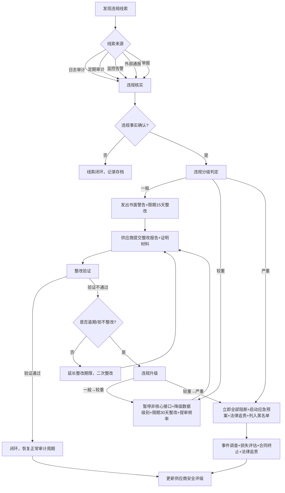

# 第三方API供应商持续审计制度

> 本规范是AI智能体互联数据安全治理体系的供应商管理持续监督模块，与[供应商安全准入制度](vendor-admission.md)配套使用，定义第三方AI API供应商接入后的定期安全评估、日志审计、合规检查、违规处置与安全评级机制。

---

## 规范说明

### 目的

防止第三方API供应商在接入后安全状况退化，建立常态化的持续监督机制，及时发现并处置供应商安全能力下降、合规承诺违反、异常行为等风险，确保数据全生命周期安全可控。

### 适用范围

- 所有已接入的第三方AI API服务供应商（含白名单、灰名单供应商）
- 通过API方式调用外部智能能力的所有业务场景
- 已签署DPA的存量与新增供应商
- 供应商的分包处理商与第三方合作方

### 基本原则

| 原则 | 说明 |
|---|---|
| **定期持续** | 审计不是一次性动作，建立固定周期的持续审计机制，覆盖供应商全生命周期 |
| **风险导向** | 基于供应商处理的数据级别、历史合规记录、风险暴露面差异化配置审计频率与深度 |
| **证据驱动** | 所有审计结论必须基于可验证的证据材料，禁止主观判断，审计过程全程留痕 |
| **分级处置** | 根据违规严重程度采取差异化处置措施，既保证安全又避免过度影响业务连续性 |
| **闭环管理** | 审计发现问题必须跟踪整改直至验证闭环，建立发现-处置-整改-验证的完整流程 |

### 审计与准入的关系

- **准入是一次性门槛**：[供应商安全准入制度](vendor-admission.md)定义的是接入前的安全基线，解决"能不能进"的问题
- **审计是持续性监督**：本制度定义的是接入后的常态化监督，解决"进来后会不会变坏"的问题
- **两者衔接关系**：准入通过后立即进入持续审计周期；审计发现严重问题触发准入重新评估，甚至直接列入黑名单
- **与其他模块关系**：日志审计与[数据安全监控体系](security-monitoring.md)联动；违规处置与[数据安全应急响应机制](incident-response.md)衔接

---

## 分级定期审计计划

根据供应商处理数据的最高级别（参照[数据分类分级标准](data-classification.md)），制定差异化的审计频率和深度：

| 供应商风险等级（基于最高数据级别） | 审计类型组合 | 审计频率 | 审计深度 | 审计方式 | 责任方 |
|---|---|---|---|---|---|
| **L4（核心数据）**（原则上禁止，例外需专项审批） | 轻量审计 + 全面审计 + 第三方渗透测试 | 每月1次轻量审计 每季度1次全面审计 每半年1次渗透测试 | 全维度深度检查，覆盖技术、管理、人员、合规所有领域 | 远程+现场审计结合，渗透测试由第三方机构执行 | security reviewer主导，architect、tester配合 |
| **L3（敏感个人信息/重要数据）** | 轻量审计 + 全面审计 + 第三方渗透测试 | 每季度1次轻量审计 每半年1次全面审计 每年1次渗透测试 | 技术与管理核心维度深度检查，高风险项专项核查 | 远程审计为主，关键项现场核查 | security reviewer主导，developer配合 |
| **L2（一般个人信息）** | 轻量审计 + 全面审计 | 每半年1次轻量审计 每年1次全面审计 | 核心合规项与关键安全控制检查 | 远程审计+供应商自评 | reviewer执行 |
| **L1（公开数据）** | 合规自查 | 每年1次供应商合规自查 | 基础合规项自查，提交自评报告 | 供应商自评+我方抽查 | 供应商提交报告，reviewer形式审查 |

### 审计类型内容范围

| 审计类型 | 具体内容范围 | 输出物 | 预计工作量 |
|---|---|---|---|
| **轻量审计** | 1. 安全资质证书有效性核查 2. 近三月异常调用日志抽样分析 3. 上次审计整改项验证 4. 安全事件与漏洞通报情况核查 5. 认证有效期监控 6. 公开渠道舆情与监管信息检索 | 《轻量审计报告》（3-5页） | 1-2人天 |
| **全面审计** | 1. 安全能力全维度复评（参照准入评估框架22个维度） 2. 近半年全量日志审计分析 3. 合规文件与合同条款履约检查 4. 技术配置远程验证（TLS、加密、认证、隔离） 5. 人员安全与权限管理审查 6. 数据留存与删除策略执行验证 7. 分包商合规性延伸检查 8. 业务连续性与灾备能力验证 | 《全面审计报告》（15-20页）+ 问题清单+评分表 | 5-8人天 |
| **第三方渗透测试** | 1. API接口安全渗透（认证、授权、注入、越权、数据泄露） 2. 配置安全测试（TLS、CORS、 headers、错误处理） 3. 业务逻辑漏洞测试 4. 拒绝服务与限流机制测试 5. 数据泄露风险验证 | 《渗透测试报告》+漏洞清单+修复建议 | 第三方机构执行，10-15人天 |

---

## 日志审计要求

### API调用日志留存期限

- **最低留存期限**：不少于3年（36个月）
- **涉及L3/L4数据的调用日志**：留存期限不少于5年
- **法律诉讼或监管调查相关日志**：留存至案件结束后1年
- **日志存储介质**：使用WORM（一次写入多次读取）存储或具备区块链存证能力，防止篡改

### 必须记录的日志字段

| 字段类别 | 具体字段 | 要求 |
|---|---|---|
| **基础标识字段** | 时间戳（精确到毫秒）、调用方唯一标识（app_id/tenant_id）、API请求ID、供应商标识 | 必填，不可为空 |
| **请求信息字段** | API端点URL、HTTP方法、请求源IP、User-Agent、请求数据量（字节）、请求数据级别 | 必填，请求体不记录明文敏感数据 |
| **响应信息字段** | HTTP状态码、响应数据量（字节）、响应耗时（毫秒）、错误码（如有） | 必填，响应体不记录明文敏感数据 |
| **安全标记字段** | 数据级别（L1-L4）、数据出境标识（是/否）、敏感字段命中标记、调用风险评分 | 必填，基于[数据分类分级标准](data-classification.md)自动标注 |
| **完整性校验字段** | 请求体哈希值、响应体哈希值、日志记录自身哈希链 | 必填，用于防篡改验证 |
| **关联追踪字段** | 业务线标识、用户会话ID（如适用）、链路追踪ID | 必填，支持全链路关联分析 |

### 异常调用检测规则清单

| 规则ID | 规则名称 | 检测逻辑 | 告警级别 | 响应动作 |
|---|---|---|---|---|
| R01 | 异常时间调用 | 非业务定义的允许时间窗口内发起调用（如凌晨2:00-5:00无业务场景调用） | 中危 | 自动告警，人工复核 |
| R02 | 异常高频调用 | 单调用方/单IP的QPS超过正常基线3倍以上，或短时间内突发流量 | 高危 | 自动限流，立即告警 |
| R03 | 超大数据量请求 | 单次请求数据量超过阈值（L3/L4数据场景>1MB，其他场景>10MB） | 高危 | 告警，抽样检查内容 |
| R04 | 超大数据量响应 | 单次响应数据量超过阈值（L3/L4数据场景>5MB，其他场景>50MB） | 高危 | 告警，检查是否存在数据批量导出 |
| R05 | 非工作时间批量请求 | 非工作时间（工作日20:00-次日8:00、节假日）出现成批量的连续请求（>100次/小时） | 高危 | 自动告警，可临时阻断 |
| R06 | 异常IP/地理位置 | 来自非常用IP段、境外IP（业务无出境场景）、已知恶意IP、Tor出口节点的调用 | 严重 | 立即阻断，触发应急响应 |
| R07 | 重复相同请求 | 短时间内（5分钟）重复发送完全相同（哈希一致）的请求≥10次 | 中危 | 告警，检查是否为重放攻击或故障重试 |
| R08 | 敏感关键词命中 | 请求/响应中命中敏感关键词库（身份证号、银行卡号、密钥、内部敏感词等） | 高危 | 立即告警，内容脱敏抽样检查 |
| R09 | 失败率异常 | 单供应商/单接口5分钟内失败率（4xx+5xx）超过30%，或认证失败率超过10% | 中危 | 告警，检查是否为攻击或配置错误 |
| R10 | 数据流出量突增 | 单供应商日数据流出量超过近7日均值的200% | 高危 | 告警，分析数据流向与内容类型 |
| R11 | 未授权资源访问 | 尝试访问未授权API端点、越权访问其他租户资源、访问不存在的资源（路径探测） | 严重 | 立即阻断IP，记录攻击特征 |
| R12 | 异常用户代理 | 使用已知扫描器User-Agent、异常爬虫标识、缺失或畸形User-Agent | 中危 | 告警，结合其他规则判定 |

### 审计追溯能力要求

- **多维度查询**：支持按时间范围、供应商、调用方（app_id）、用户、数据级别、API端点等单一维度或组合维度查询
- **关联分析**：支持跨日志源关联（应用日志、网关日志、安全告警日志），可追溯单次调用的完整链路
- **快速检索**：日志检索响应时间≤5秒（时间范围≤24小时），≤30秒（时间范围≤30天）
- **导出能力**：支持查询结果导出（CSV/JSON格式），用于合规检查与事件调查
- **可视化**：提供调用量趋势、异常分布、数据流向、风险热力图等可视化看板

### 日志完整性保护

- **防篡改机制**：日志写入后不可修改删除，使用哈希链（每条日志包含前一条日志哈希）保证完整性
- **加密存储**：日志文件静态加密存储（AES-256或国密SM4），密钥与日志分离管理
- **独立存储**：审计日志独立存储于安全日志专区，与业务系统隔离，仅安全审计人员可访问
- **访问审计**：日志查询、导出操作本身必须记录审计日志，做到"审计的审计"
- **备份策略**：日志多副本备份（本地+异地），备份频率不低于每日一次，备份保留期限与原日志一致

---

## 合规检查机制

### 供应商合规自评

| 项目 | 要求 |
|---|---|
| **自评频率** | L3/L4供应商每季度一次；L2供应商每半年一次；L1供应商每年一次 |
| **自评内容** | 参照《安全能力评估框架》逐项自评，涵盖数据安全、访问控制、日志审计、漏洞管理、人员安全、业务连续性6大维度 |
| **证明材料要求** | 自评报告必须附支撑证明材料：资质证书扫描件、渗透测试报告、漏洞修复记录、安全事件处置记录、内部审计报告等 |
| **提交时限** | 自评周期结束后10个工作日内提交 |
| **审核要求** | security reviewer对自评报告进行书面审核，发现疑点要求补充说明或现场核查 |
| **未提交处置** | 逾期未提交自评报告的，视为较重违规，按违规分级处置流程处理 |

### 文件审查

- **定期审查清单**：
  - ISO 27001、SOC 2、等保等安全认证证书有效期（到期前30天预警）
  - 数据处理协议（DPA）及补充协议履约情况
  - 供应商安全制度文档更新情况（是否有重大变更未通报）
  - 合规声明与公开承诺的一致性
  - 分包商清单变更情况
  - 网络安全保险续保情况
- **审查方式**：证书官方网站核验、文档对比审查、公开信息检索
- **审查频率**：与轻量审计同步，每月/每季度开展
- **问题处置**：发现证书过期、文档不一致等问题，纳入问题清单跟踪整改

### 现场审计触发条件

出现以下任一情况时，立即启动现场审计（不受定期审计计划限制）：

1. **重大安全事件**：供应商发生可能影响我方数据安全的安全事件（数据泄露、系统入侵、勒索攻击等）
2. **连续两期自评问题**：连续两次自评/轻量审计发现同一问题未整改，或发现重大风险隐患
3. **控制权变更**：供应商股权结构、实际控制人、母公司发生重大变更（外资控股、被收购等）
4. **监管调查**：供应商收到网信办、公安、行业监管部门的安全调查或处罚通知
5. **举报线索**：收到内部或外部关于供应商安全问题的可信举报
6. **异常预警**：[数据安全监控体系](security-monitoring.md)检测到持续异常行为，远程审计无法确认原因
7. **评级降级**：供应商安全评级连续两期下降，或降至C级及以下

### 渗透测试要求

| 项目 | 要求 |
|---|---|
| **测试机构** | 必须由具备资质的第三方独立渗透测试机构执行（具备CNAS/CMA认证，或国家级网络安全测评机构） |
| **测试范围** | 我方使用的所有API接口、认证系统、管理后台、数据传输链路；不得测试供应商其他客户的数据或系统 |
| **测试授权**：测试前必须签署授权书与保密协议，明确测试时间窗口、IP白名单、测试强度边界，避免影响生产 |
| **测试频率** | L4供应商每半年一次；L3供应商每年一次；L2供应商每两年一次 |
| **漏洞分级与SLA** | 严重（Critical）：24小时内提供修复方案，7天内完成修复 高危（High）：72小时内提供修复方案，30天内完成修复 中危（Medium）：15天内提供修复方案，90天内完成修复 低危（Low）：下一版本周期修复 |
| **重测验证** | 漏洞修复完成后，由原测试机构进行重测验证，确认漏洞已修复且未引入新问题 |
| **报告交付** | 渗透测试报告必须包含：漏洞详情、风险评级、复现步骤、修复建议、验证结果 |

### 问卷审计

- **问卷更新**：每年第一季度更新年度安全问卷，纳入最新法规要求、行业最佳实践、上一年度发现的共性问题
- **问卷内容**：涵盖组织安全、技术安全、人员安全、合规管理、事件响应、供应链安全6大模块，不少于80个问题
- **发放与回收**：每年第二季度向所有在审供应商发放，要求30天内回收
- **验证机制**：对回收问卷进行交叉验证（与自评报告、技术测试、公开信息比对），发现回答不一致或虚假回答的，按较重违规处理
- **问卷分析**：对问卷结果进行年度横向对比分析，识别行业共性风险与供应商个体风险

---

## 违规分级与处置流程

### 违规分级标准与处置措施

| 违规级别 | 定义 | 典型违规行为 | 处置措施 | 整改时限 | 升级条件 |
|---|---|---|---|---|---|
| **一般违规** | 安全管理不规范，但未直接造成数据安全风险，不影响核心安全控制有效性 | 1. 日志记录字段不完整（非关键字段缺失） 2. 安全文档过期30天内未更新 3. 自评报告逾期10天内提交 4. 非核心安全配置轻微偏差 5. 人员离职权限回收延迟3天内 | 1. 发出书面警告（邮件+正式函件） 2. 要求提交书面整改计划 3. 限期完成整改 4. 整改完成后提交验证材料 | 15个工作日 | 整改逾期未完成→升级为较重违规；同类问题180天内累计发生3次→升级为较重违规 |
| **较重违规** | 存在明确安全风险，或违反合规承诺，但尚未造成实际数据泄露或严重后果 | 1. 未提前通报重大安全架构/策略变更 2. 数据留存超期30天以上未删除 3. 异常调用无法提供合理解释 4. 安全认证过期未续超过30天 5. 自评发现问题整改逾期 6. 未按要求通报已知安全漏洞 7. 拒绝提供审计必需的非核心证明材料 | 1. 暂停非核心API接口调用 2. 暂停L3/L4数据传入，仅允许L1/L2数据 3. 限期整改并提交整改报告 4. 审计频率提升一级（如季度改为月度） 5. 供应商法定代表人或安全负责人书面致歉 | 30个工作日 | 整改逾期未完成→升级为严重违规；整改期间发生新的安全问题→升级为严重违规 |
| **严重违规** | 严重违反合规承诺，已造成或可能造成重大数据安全事件，严重损害我方权益 | 1. 发生数据泄露事件且影响我方数据 2. 未经同意将我方数据用于模型训练或其他约定外用途 3. 拒绝配合安全审计或事件调查 4. 数据出境未按要求完成评估即传输出境 5. 存在恶意行为（植入后门、数据窃取、窃听等） 6. 提供虚假证明材料或隐瞒重大安全事件 7. 发生重大安全事件未按要求24小时内通报 | 1. 立即暂停所有API接入，技术层面阻断调用 2. 启动[数据安全应急响应机制](incident-response.md) 3. 成立专项调查组开展事件调查 4. 评估损失，启动法律追责程序 5. 列入黑名单，终止合作 6. 按合同约定追究违约责任与赔偿 | 立即处置，无整改宽限期 | - |

### 处置流程

---

## 供应商安全评级体系

### 评级维度与权重

| 评级维度 | 权重 | 评估要点 |
|---|---|---|
| **安全资质** | 20% | ISO 27001、SOC 2、等保等认证完整性与有效性；行业专项资质；监管合规状态；是否有权威机构安全奖项 |
| **历史合规记录** | 25% | 历次审计发现问题数量与整改率；违规记录历史；安全事件发生情况；监管处罚记录；承诺履约情况 |
| **技术安全能力** | 25% | API安全配置（TLS、加密、认证、隔离）；日志审计能力；漏洞管理SLA执行情况；渗透测试结果；技术架构安全成熟度 |
| **事件响应能力** | 15% | 安全事件通报及时性；应急响应流程完善度；历史事件处置效果；漏洞修复时效；7×24小时响应能力 |
| **配合度** | 15% | 审计配合度；自评材料及时性与质量；问题整改积极性；沟通响应速度；主动风险通报情况 |

### 评级等级划分与监管措施

| 等级 | 分数区间 | 定义 | 监管措施 | 复审周期 |
|---|---|---|---|---|
| **A级（优秀）** | 90-100分 | 安全能力突出，合规记录优秀，主动安全管理意识强 | 1. 可正常处理所有级别数据（在准入范围内） 2. 常规审计频率可适当降低（最长不超过原频率的1.5倍） 3. 优先考虑新业务场景合作 4. 作为标杆供应商在内部推广 | 每年一次全面审计 |
| **B级（合格）** | 75-89分 | 安全能力达标，合规记录良好，能满足安全要求 | 1. 按标准频率执行审计计划 2. 正常业务合作 3. 针对扣分点制定优化计划 | 每半年一次轻量审计，每年一次全面审计 |
| **C级（关注）** | 60-74分 | 存在一定安全风险或合规问题，需重点关注 | 1. 审计频率提升一级 2. 限制接入新业务场景 3. 禁止处理L4数据，L3数据需专项审批 4. 派驻安全联络员，每月沟通 5. 限期3个月整改提升，整改计划需我方审批 | 每月一次轻量审计，每季度一次全面审计 |
| **D级（不合格）** | 60分以下 | 安全能力严重不足或存在严重违规，风险极高 | 1. 立即暂停所有API调用或限制仅处理L1公开数据 2. 启动退出评估，制定替代方案与迁移计划 3. 列入灰名单管理，情节严重直接列入黑名单 4. 6个月整改期，整改不通过终止合作 | 持续监控，每周审计 |

### 评级更新机制

| 触发方式 | 更新频率 | 说明 |
|---|---|---|
| **定期更新** | 每年1月进行年度评级更新 | 基于上一年度所有审计结果、安全事件、合规记录综合评分 |
| **审计后更新** | 每次全面审计/渗透测试完成后10个工作日内 | 根据审计发现问题与评分即时更新评级 |
| **事件触发更新** | 发生安全事件、违规处置后即时更新 | 严重违规直接降至D级；较重违规视情况降1-2级；一般违规单次不降级但影响年度评分 |
| **整改后更新** | 整改验证通过后10个工作日内 | 整改效果验证通过后，可申请评级复评，根据整改情况调整评级 |

---

## 审计档案与报告

### 审计档案管理

| 档案类别 | 归档内容 | 保存期限 | 存储要求 | 访问权限 |
|---|---|---|---|---|
| **供应商基础档案** | 准入评估材料、资质证书、DPA及承诺函、合同文本、供应商基本信息 | 合作结束后5年 | 加密存储，与其他审计档案统一管理 | security reviewer、architect、orchestrator |
| **定期审计档案** | 每次审计的计划、工作底稿、证据材料（日志截图、文档扫描件、访谈记录）、审计报告、问题清单 | 审计完成后5年 | 每次审计建立独立目录，电子档案+关键材料纸质归档 | security reviewer、内审人员 |
| **事件处置档案** | 违规记录、处置通知、整改报告、验证材料、事件调查报告、相关往来函件 | 事件处置完成后5年 | 单独建档，标注密级 | security reviewer、orchestrator、法务 |
| **评级档案** | 历次评级评分表、评级结果通知、评级调整记录 | 合作结束后5年 | 与供应商基础档案关联存储 | security reviewer、architect、orchestrator |

### 审计报告模板结构

每份审计报告必须包含以下章节：

1. **审计概览**：审计时间、审计类型、审计范围、审计人员、供应商基本信息、本次审计结论摘要
2. **审计方法与依据**：采用的审计方法、审计依据的标准与制度、抽样说明
3. **审计发现**：分维度列出审计发现，每个发现包含：问题描述、风险等级、证据引用、违反条款、整改建议
4. **评分与评级**：各维度评分、总分计算、本次评级结果、与上次评级对比
5. **问题清单**：表格形式列出所有问题，含问题ID、问题描述、风险级别、整改建议、整改时限、责任人
6. **上次整改验证**：上次审计发现问题的整改情况验证结果
7. **审计结论与建议**：总体审计结论、对供应商的安全建议、是否需要调整监管措施
8. **附件**：证据材料清单、访谈记录、测试数据等支撑材料

### 年度供应商安全态势报告

每年1月31日前，security reviewer负责编制上一年度《第三方API供应商安全态势报告》，内容包括：

- 在审供应商基本情况（数量、分布、数据级别分布）
- 年度审计工作开展情况统计（审计次数、覆盖范围、工作量）
- 年度发现问题汇总分析（问题数量、分布、类型、趋势）
- 违规事件统计与分析（违规次数、级别分布、处置情况）
- 供应商评级分布与变化趋势（各级别数量、升降级情况）
- 安全事件统计与复盘（事件数量、类型、影响、处置效果）
- 行业风险与共性问题提炼
- 下一年度审计工作计划与改进建议
- 高风险供应商清单与重点关注事项

报告经architect审核后，报送orchestrator与团队管理层。

### 审计发现问题跟踪整改机制

1. **问题登记**：审计发现的所有问题统一录入问题跟踪台账，分配唯一问题ID
2. **整改通知**：审计报告签发后3个工作日内，向供应商发出正式整改通知，明确问题、整改要求、时限
3. **整改执行**：供应商按要求制定整改计划并执行，每月提交整改进度报告
4. **验证闭环**：整改到期后，security reviewer对整改情况进行验证，验证通过予以闭环；验证不通过按违规升级流程处理
5. **逾期升级**：整改逾期15天以上未完成，自动升级违规级别
6. **定期复盘**：每季度对未闭环问题进行复盘，协调资源推动解决
7. **整改率考核**：问题整改率纳入供应商配合度评分，年度整改率低于80%的供应商评级不得高于C级

---

## 持续审计检查清单

供审计人员在开展各类审计时逐项核查使用：

| 序号 | 检查类别 | 检查项 | 审计方法 | 判定标准 | 对应审计类型 |
|---|---|---|---|---|---|
| 1 | 日志完整性 | API调用日志字段完整，无必填字段缺失 | 抽样1000条日志核查字段完整性 | 必填字段完整率100%，非关键字段缺失率<0.1% | 轻量/全面 |
| 2 | 日志留存 | 日志留存期限符合要求（≥3年，L3/L4≥5年） | 检查日志存储策略、历史日志可访问性 | 到期日志未删除，可正常检索调阅 | 轻量/全面 |
| 3 | 日志防篡改 | 日志防篡改机制（哈希链/WORM）正常运行 | 验证哈希链完整性、尝试修改/删除测试 | 无法修改或删除历史日志，篡改可检测 | 全面 |
| 4 | 异常检测规则 | 12项异常检测规则全部启用且运行正常 | 检查规则配置、运行状态、近3月告警记录 | 所有规则启用，无失效规则，告警准确率≥90% | 轻量/全面 |
| 5 | 告警响应 | 高危/严重级告警均已及时响应处置 | 抽查近3个月高危告警处置记录 | 高危告警1小时内响应，24小时内闭环，有完整处置记录 | 轻量/全面 |
| 6 | 安全认证有效性 | 所有要求的安全资质证书在有效期内 | 官方网站核验证书有效期 | 无过期证书，到期前30天有续证计划 | 轻量/全面 |
| 7 | 合规自评提交 | 供应商按要求定期提交合规自评报告与材料 | 检查自评记录、提交时间、材料完整性 | 按时提交，材料完整，无虚假陈述 | 轻量/全面 |
| 8 | 整改闭环率 | 历次审计发现问题均按要求整改闭环 | 检查问题台账，统计整改率 | 年度整改率≥95%，无逾期30天以上未整改问题 | 轻量/全面 |
| 9 | 渗透测试 | 按要求频率开展第三方渗透测试，高危漏洞已修复 | 检查渗透测试报告、漏洞修复验证记录 | 测试频率符合要求，高危漏洞100%修复，中危修复率≥90% | 全面 |
| 10 | 安全事件通报 | 安全事件按要求时限通报并配合处置 | 检查事件通报记录、处置文档 | 无隐瞒事件情况，通报及时率100%，配合度良好 | 全面 |
| 11 | 评级更新 | 供应商安全评级按要求及时更新 | 检查评级记录、评分表、更新时间 | 评级更新及时，评分依据充分，评级结果已通知供应商 | 全面 |
| 12 | 数据地域合规 | 数据存储地域与约定一致，无违规出境 | 核查供应商数据中心承诺、流量分析（结合[数据出境安全评估机制](cross-border-assessment.md)） | 数据存储地域符合约定，无未评估的数据出境行为 | 全面 |
| 13 | 数据留存删除 | 数据留存期限符合承诺，到期数据及时删除 | 抽查留存数据、删除记录、删除证明 | 无超期留存，到期删除有证明材料，留存数据访问有审批 | 全面 |
| 14 | 人员安全 | 接触数据人员签署NDA，离职权限及时回收 | 抽查人员清单、NDA签署记录、离职权限回收记录 | NDA签署率100%，离职当天完成权限回收 | 全面 |
| 15 | 分包商管理 | 分包商经过审批且安全合规 | 检查分包商清单、分包商安全评估记录 | 无未审批分包商，分包商安全基线与主供应商一致 | 全面 |
| 16 | 应急响应准备 | 供应商应急响应机制完善，联系方式有效 | 测试7×24小时联系人响应、检查应急预案 | 联系人可随时联系，应急预案完善，年度演练有记录 | 全面/现场 |
