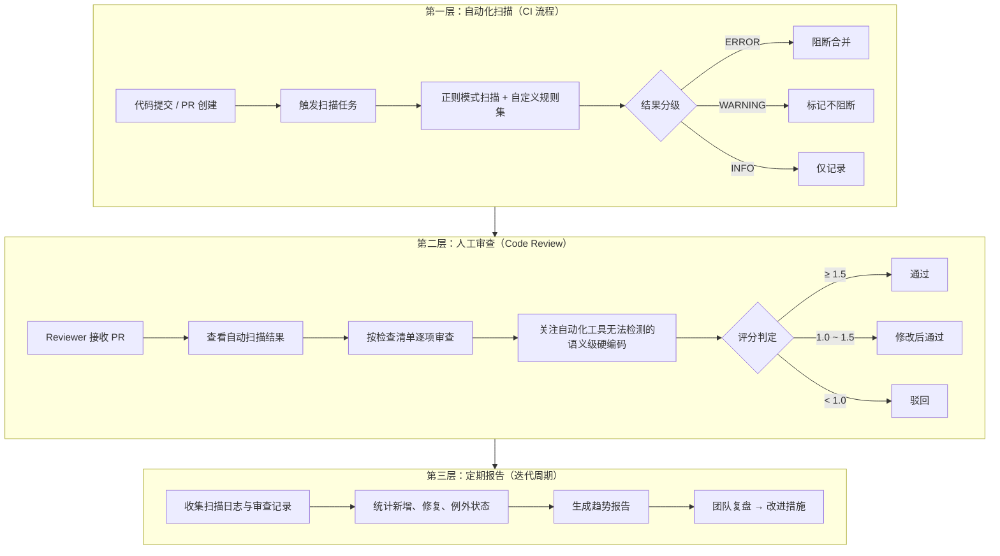
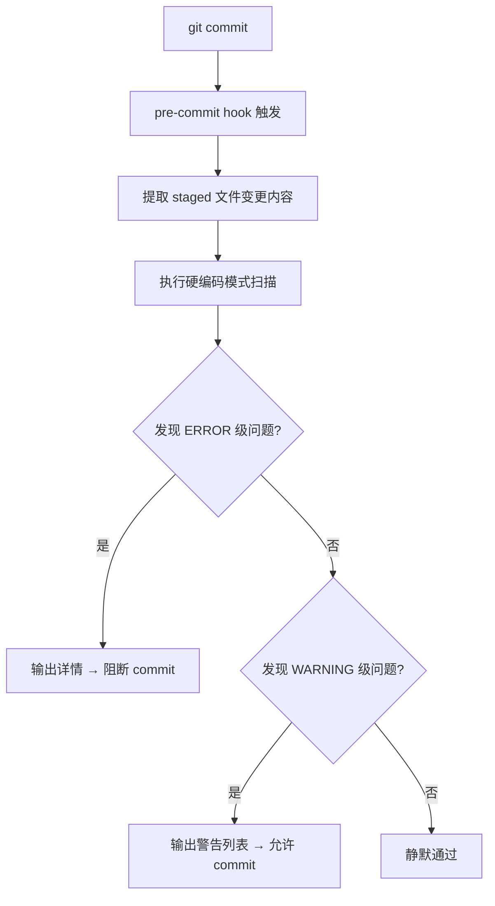
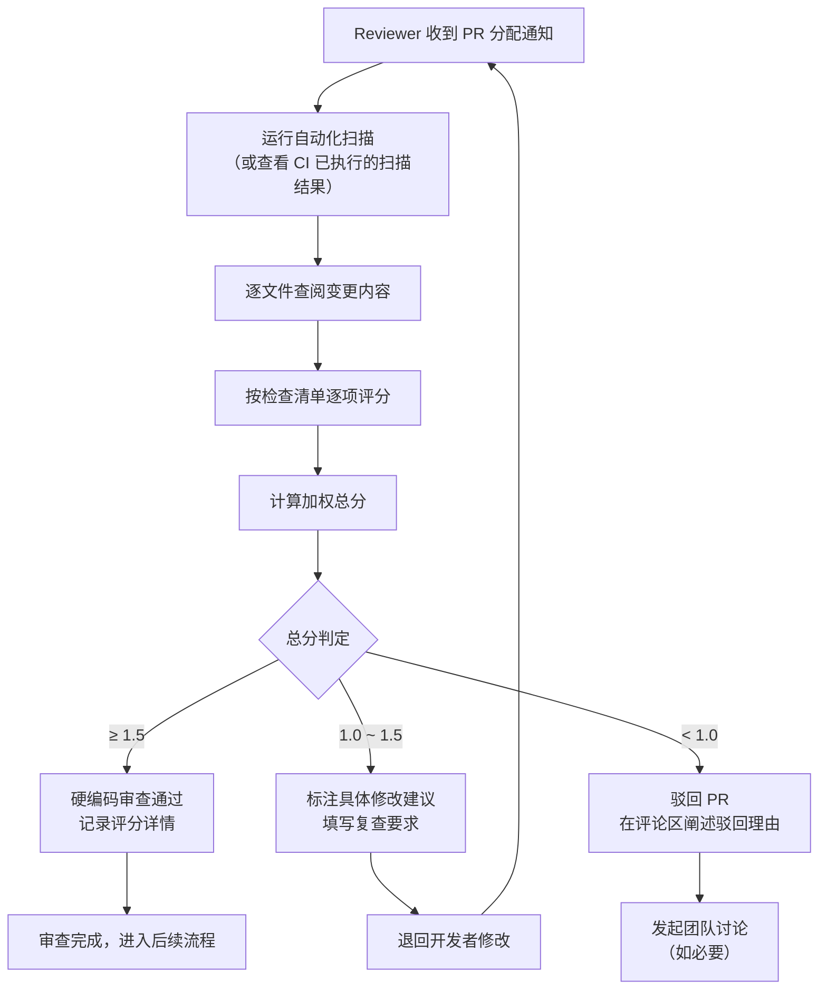
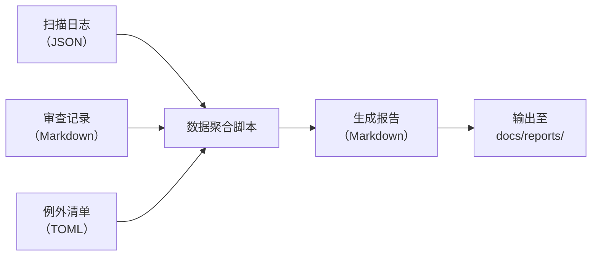

# 检测与报告机制

## 规范说明

本规范是硬编码治理规则体系中的检测与报告层文档，旨在建立硬编码问题的多层级发现、评估与上报机制。治理体系的有效性不仅取决于识别标准是否明确，更依赖于能否在开发流程的各个环节中及时发现硬编码问题、准确评估其风险等级，并形成可追溯、可对比的治理数据。

本规范覆盖以下三个层面：

1. **自动化扫描**：在代码提交与 CI 流水线中集成静态分析工具，实现无人工介入的检测与阻断；
2. **人工审查**：在 Code Review 阶段依据标准化检查清单进行语义级审查，弥补自动化工具的盲区；
3. **定期报告**：按迭代周期汇总统计数据，生成趋势报告供团队复盘与改进决策。

三者构成"自动初筛 → 人工深审 → 周期复盘"的完整闭环，确保硬编码问题在事前、事中、事后均有相应机制覆盖。

## 三层检测体系架构

三层检测体系按照执行时序与介入深度递进排列。第一层自动化扫描承担大规模初筛职责，第二层人工审查负责语义级深度判断，第三层定期报告则从宏观视角提供治理数据与趋势洞察。



三层体系的分工原则：

| 层级 | 介入时机 | 覆盖范围 | 判定精度 | 阻断能力 |
|---|---|---|---|---|
| 自动化扫描 | pre-commit / PR 提交 | 全量代码变更 | 高（模式匹配） | 可阻断 ERROR 级别 |
| 人工审查 | Code Review | 语义级硬编码 | 最高（人工判断） | 可拒绝合并 |
| 定期报告 | 迭代周期结束 | 全仓库累积数据 | 宏观统计 | 驱动流程改进 |

## 自动化扫描规范

### 触发时机

自动化扫描在以下时间节点触发，分别对应不同的检查粒度与执行开销：

| 触发时机 | 触发方式 | 扫描范围 | 执行时长约束 | 阻断策略 |
|---|---|---|---|---|
| pre-commit | git hook 自动触发 | 变更文件（staged） | ≤ 5 秒 | 阻断 commit |
| PR 提交 | CI 流水线自动触发 | PR 变更文件 | ≤ 60 秒 | 阻断合并（ERROR 级） |
| 定时扫描 | cron 定时任务（可选） | 全量仓库 | 无硬约束 | 仅记录不上报阻断 |

**pre-commit 阶段的具体执行流程**：



### 扫描规则

自动化扫描基于预定义的正则表达式规则集运行。规则按风险等级分级，覆盖常见的硬编码模式类型。

| 规则 ID | 检测目标 | 正则模式描述 | 级别 | 参考类别 |
|---|---|---|---|---|
| HC-STR-01 | 中文字符串硬编码 | 函数调用参数、异常消息、日志语句中出现的双引号或单引号内中文序列（排除注释行与文档字符串） | WARNING | HARD-STR |
| HC-STR-02 | 英文句子硬编码 | 函数调用参数中出现的完整英文句子（包含空格且长度 ≥ 30 字符的字符串字面量） | INFO | HARD-STR |
| HC-NUM-01 | 魔法数字 | 逻辑表达式与函数调用中独立出现的数值字面量（排除 0、1、-1 及数组索引、循环边界等惯用写法） | WARNING | HARD-NUM |
| HC-NUM-02 | 超时/阈值硬编码 | `timeout`、`sleep`、`retry`、`limit`、`threshold` 等语义明确的参数位置出现的数值字面量 | WARNING | HARD-NUM |
| HC-PATH-01 | 硬编码文件路径 | 包含 `/` 或 `\` 分隔符且指向具体文件或目录的字符串（排除 import/module 路径） | ERROR | HARD-PATH |
| HC-URL-01 | 硬编码 URL | 包含 `http://` 或 `https://` 协议的完整 URL 字符串 | ERROR | HARD-URL |
| HC-URL-02 | 硬编码 IP 地址 | 符合 IPv4 或 IPv6 格式的地址字符串 | ERROR | HARD-URL |
| HC-CFG-01 | 配置参数硬编码 | `pool_size`、`max_connections`、`cache_ttl`、`batch_size` 等明确为配置项命名所赋的值 | WARNING | HARD-CFG |
| HC-KEY-01 | 敏感信息泄漏 | 匹配疑似密钥、密码、token 的模式（如 `password =`、`secret_key =`、`api_key =` 后跟非空字符串） | ERROR | — |

规则集以配置文件形式管理，存放在 `.agents/rules/` 目录下，支持按项目语言与框架扩展自定义规则。每条规则包含以下字段：

```
规则 ID → 描述 → 正则模式 → 严重级别 → 排除模式 → 适用文件类型
```

### 结果分级与处理策略

扫描结果按严重程度分为三级，各级别对应不同的 CI 行为与处理策略：

| 级别 | 含义 | 典型场景 | CI 行为 | 处理策略 |
|---|---|---|---|---|
| ERROR | 必须立即修复 | 硬编码密钥、URL、文件路径 | 阻断合并，构建标记为失败 | 开发者立即修改为替代方案后重新提交 |
| WARNING | 建议本次迭代修复 | 魔法数字、中文硬编码字符串 | 不阻断但生成标注，Code Review 中着重审查 | 本次迭代或下一迭代内修复，修复后标注消除 |
| INFO | 提示关注 | 长度较短的英文固定字符串 | 仅记录至扫描日志，不阻断也不在 PR 页面展示 | 开发者知晓即可，在定期报告中追踪累积趋势 |

**阻断逻辑说明**：

- 当且仅当扫描结果中存在至少一个 ERROR 级别问题时，CI 流水线返回非零退出码，阻止代码合并；
- WARNING 与 INFO 级别问题不改变 CI 退出码，但 WARNING 级结果将作为标注显示在 PR 的 Code Review 界面；
- 开发者在修复 ERROR 后重新推送，扫描将再次执行，直至无 ERROR 方可通过。

### 白名单与抑制注释

对于经过审慎评估后确认为合理保留的硬编码点，允许通过特殊注释标记来抑制特定行或特定规则的检测，避免反复产生误报告警。

| 抑制注释格式 | 作用范围 | 示例 |
|---|---|---|
| `# noinspection HardcodeCheck` | 抑制下一行的所有硬编码检测规则 | 用于逐行豁免 |
| `# noinspection HC-STR-01` | 抑制下一行的指定规则（ID 精确匹配） | 用于精确豁免单个规则 |
| `// noinspection HardcodeCheck` | 同上，适用于类 C 语系 | JavaScript / TypeScript / Java / Go 等 |
| `# noinspection start` / `# noinspection end` | 抑制注释块包裹区域内的所有检测 | 用于豁免整段代码 |

**使用约束**：

- 抑制注释必须紧邻被抑制代码的上一行，或通过 `start`/`end` 明确标注范围；
- 每次使用抑制注释须在所在文件中以 `# HARDCODE-EXCEPTION: <编号>` 格式标注例外说明，编号应与项目例外清单中的条目对应；
- 例外说明应包含：理由（为什么不能外部化）、评估人、创建日期、计划复审日期；
- 抑制注释不得用于屏蔽 ERROR 级别的规则（HC-PATH-01、HC-URL-01、HC-KEY-01）。

```python
# HARDCODE-EXCEPTION: EX-2026-001
# 理由：第三方 SDK 要求硬编码版本标识符，无外部化接口
# 评估人：architect  创建日期：2026-06-23  复审日期：2026-09-23
# noinspection HC-STR-01
SDK_VERSION = "v3.2.1-compatible"  
```

## 人工审查规范

自动化扫描擅长模式匹配，但无法判断硬编码点的业务合理性、替代方案可行性以及上下文语义。人工审查环节正是补足这一短板的关键步骤。

### 审查检查清单

Reviewer 在进行硬编码专项审查时，依据以下量化评分表逐项打分，计算加权总分后判定审查结果。

| 检查项 | 权重 | 评分标准 | 0 分 | 1 分 | 2 分 |
|---|---|---|---|---|---|
| 新增硬编码数量 | 30% | 本次 PR 引入的硬编码点总数（含自动化扫描标记 + 人工发现） | > 5 个 | 1 ~ 5 个 | 0 个 |
| 例外标记规范性 | 25% | `HARDCODE-EXCEPTION` 标记的格式完整性、理由充分性与编号可追溯性 | 存在未标记的硬编码点 | 已标记但格式或理由不规范 | 全部标记且格式规范 |
| 替代方案合理性 | 25% | 硬编码点是否已通过配置文件、环境变量、常量定义或资源文件等替代方案消除 | 存在明显可替代项但未处理 | 部分已处理或替代方案合理 | 全部已处理或无合理替代方案 |
| 敏感信息暴露 | 20% | 是否暴露密钥、密码、Token、证书等敏感信息 | 存在敏感信息泄露 | — | 无泄露 |

**—— 评分公式 ——**

```
总分 = (新增硬编码数量 × 0.30) + (例外标记规范性 × 0.25) + (替代方案合理性 × 0.25) + (敏感信息暴露 × 0.20)
```

**—— 判定阈值 ——**

| 总分范围 | 判定结果 | 后续动作 |
|---|---|---|
| ≥ 1.5 | 通过 | Reviewer 批准 PR，硬编码审查项标记为已通过 |
| ≥ 1.0 且 < 1.5 | 修改后通过 | Reviewer 标注具体修改建议，退回开发者修改后重新审查 |
| < 1.0 | 驳回 | Reviewer 驳回 PR 并发起讨论（可在 PR 评论区或团队频道中阐述驳回理由） |

**—— 加分与减分项 ——**

| 类型 | 条件 | 调整分值 |
|---|---|---|
| 加分 | 本期主动修复存量硬编码（非本次 PR 引入） | +0.2 / 个（上限 +0.4） |
| 减分 | 使用抑制注释屏蔽 ERROR 级别规则 | -0.3 / 次 |
| 减分 | 例外标记中复审日期已过期未更新 | -0.2 / 项 |

### 审查流程

审查流程从 Reviewer 获取 PR 开始，以审查结论结束。整个流程在 PR 的 Code Review 界面中完成，结果记录于审查摘要中。



**审查记录格式**：Reviewer 完成审查后，应在 PR 评论区或审查摘要中附上以下格式的审查记录：

```
## 硬编码审查记录

- 审查人：reviewer
- 审查时间：2026-06-23T15:30:00+08:00
- 新增硬编码点数：2
- 例外标记规范性：2 分（标记齐全，格式规范）
- 替代方案合理性：1 分（HC-NUM-01 处建议抽取为配置项）
- 敏感信息暴露：2 分（无泄露）
- 总分：1.55
- 判定：通过
- 修改建议：第 45 行处的超时值建议从配置文件读取。
```

## 定期报告规范

定期报告将分散在 CI 日志与审查记录中的硬编码治理数据汇总为结构化报表，帮助团队从宏观视角把握治理态势、识别趋势性问题，并为流程改进提供数据支撑。

### 报告周期

| 周期类型 | 适用团队 | 报告范围 | 产出时间 |
|---|---|---|---|
| 迭代报告（推荐） | 敏捷团队（2 周迭代） | 本迭代内所有 PR 的扫描与审查数据 | 迭代回顾会前 1 个工作日 |
| 月度报告 | 月迭代或看板团队 | 当月全量数据 | 次月第 1 个工作日 |
| 季度总结 | 所有团队 | 季度内趋势汇总与对比 | 季度末最后一周 |

### 报告内容模板

```markdown
# 硬编码治理报告 —— 2026 年第 12 迭代（6月9日 ~ 6月23日）

## 一、概览

| 指标 | 数值 | 较上期变化 |
|---|---|---|
| 本期新增硬编码 | 8 个 | ↓ 3 |
| 本期已修复硬编码 | 12 个 | ↑ 5 |
| 当前存量硬编码 | 47 个 | ↓ 4 |
| 例外清单活跃项 | 5 项 | — |
| ERROR 阻断次数 | 3 次 | ↓ 1 |
| 平均审查评分 | 1.72 | ↑ 0.15 |

## 二、类型分布

| 硬编码类型 | 新增 | 已修复 | 存量 | 变化趋势 |
|---|---|---|---|---|
| HARD-STR（固定字符串） | 3 | 5 | 18 | ↓ |
| HARD-NUM（固定数值） | 2 | 3 | 12 | ↓ |
| HARD-PATH（固定路径） | 1 | 1 | 5 | → |
| HARD-URL（固定 URL） | 0 | 2 | 3 | ↓ |
| HARD-CFG（固定配置） | 1 | 1 | 7 | → |
| HARD-KEY（敏感信息） | 1 | 0 | 2 | ↑ |

## 三、风险分布

| 风险等级 | 新增 | 已修复 | 存量 |
|---|---|---|---|
| ERROR（阻断级） | 2 | 5 | 8 |
| WARNING（建议级） | 5 | 6 | 29 |
| INFO（提示级） | 1 | 1 | 10 |

## 四、模块分布

| 模块/目录 | 新增 | 存量 | 密集度 |
|---|---|---|---|
| src/api/ | 2 | 12 | 高 |
| src/utils/ | 1 | 5 | 中 |
| src/config/ | 0 | 1 | 低 |

## 五、例外清单状态

| 编号 | 文件位置 | 内容摘要 | 创建日期 | 复审日期 | 状态 | 操作建议 |
|---|---|---|---|---|---|---|
| EX-2026-001 | sdk_wrapper.py:23 | SDK 版本标识符，无外部化接口 | 2026-06-01 | 2026-09-01 | 有效 | 复审时与 SDK 供应商确认 |
| EX-2026-002 | legacy_adapter.py:67 | 遗留系统兼容性常量 | 2026-05-15 | 2026-08-15 | 有效 | 遗留系统退役后可移除 |
| EX-2026-003 | vendor/init.py:5 | 第三方库入口路径 | 2026-04-20 | 2026-07-20 | 即将到期 | 本次迭代复审更新 |

## 六、趋势对比

（以文字或图表描述与上一周期的对比变化）

- **积极趋势**：存量硬编码连续 3 个周期下降，团队治理意识持续增强；
- **消极趋势**：HARD-KEY 类问题存量略有上升，需在下次迭代中重点关注；
- **稳定项**：HARD-PATH 与 HARD-URL 类问题存量趋于低位稳定，前期治理见效。

## 七、改进建议

1. **针对 HARD-KEY 类问题**：建议在 pre-commit 阶段增加密钥检测专用规则，将 `password =` 与 `secret_key =` 后的常数字符串默认定级为 ERROR；
2. **针对审查效率**：本期平均审查评分上升，但 3 次 ERROR 阻断表明 pre-commit 扫描可进一步前移检测粒度；
3. **针对例外管理**：EX-2026-003 即将到期，需安排复审以决定是更新、移除还是升级。
```

### 数据来源

报告数据来自以下三个渠道，报告生成时应确保数据交叉验证：

| 数据来源 | 采集内容 | 采集方式 | 备注 |
|---|---|---|---|
| 自动化扫描输出日志 | 每次扫描的规则命中数、级别分布、文件路径、抑制注释使用情况 | 解析扫描工具的结构化输出（JSON/CSV） | 日志存放于 `.agents/logs/scan/` 目录 |
| Reviewer 审查记录摘要 | 审查评分详情、修改建议、驳回原因 | 提取 PR 评论区的审查记录模板内容 | 可由 CI 脚本自动提取并结构化存储 |
| 例外清单更新记录 | HARDCODE-EXCEPTION 的增删改记录、复审日期变更 | 跟踪 `HARDCODE-EXCEPTION` 注释的 Git 变更 | 例外清单文件存放于 `.agents/rules/exceptions.toml` |

**数据处理流程**：



## 工具集成建议

### 与现有 CI 脚本集成

项目的 CI 检查入口脚本（`.agents/scripts/ci-check.ps1` 与 `ci-check.sh`）已承担多项质量检查职责。硬编码检测脚本应作为其中一项新增步骤接入，建议插入顺序为"链接有效性检查之后、规格一致性检查之前"。

**集成示例（Shell 片段）**：

```bash
#!/usr/bin/env bash
# 在 ci-check.sh 中新增硬编码检测步骤

echo -e "\033[33m[N/5] 硬编码检测...\033[0m"
python "$ROOT/.agents/scripts/check-hardcode.py" --format json --level error
if [ $? -ne 0 ]; then
    echo -e "\033[31m错误: 存在 ERROR 级硬编码，请修复后重新提交\033[0m"
    exit 1
fi
echo -e "\033[32m  通过\033[0m"
```

**集成示例（PowerShell 片段）**：

```powershell
# 在 ci-check.ps1 中新增硬编码检测步骤

Write-Host "[N/5] 硬编码检测..." -ForegroundColor Yellow
python "$root\.agents\scripts\check-hardcode.py" --format json --level error
if ($LASTEXITCODE -ne 0) {
    Write-Host "错误: 存在 ERROR 级硬编码，请修复后重新提交" -ForegroundColor Red
    exit 1
}
Write-Host "  通过" -ForegroundColor Green
```

### 推荐的外部工具

以下成熟工具提供了硬编码检测的相关规则，建议按项目技术栈有选择地集成：

| 工具 | 适用语言 | 相关规则/插件 | 集成方式 |
|---|---|---|---|
| **ruff** | Python | `S105`（硬编码密码）、`S106`（硬编码密钥）、`PLR2004`（魔法数字） | `ruff check --select S105,S106,PLR2004` |
| **bandit** | Python | `B105`（硬编码密码字符串）、`B106`（硬编码函数调用）、`B107`（硬编码默认参数） | `bandit -r src/ -c bandit.yaml` |
| **semgrep** | 多语言 | 社区规则 `generic.secrets.*`、`python.hardcoded.*`，支持自定义规则 | `semgrep --config auto --config .agents/rules/semgrep/` |
| **detect-secrets** | 多语言 | 基于熵值检测的密钥扫描引擎 | `detect-secrets scan --all-files` |
| **ESLint** | JavaScript/TypeScript | `no-magic-numbers`、`no-restricted-syntax`（自定义模式） | 配置 `.eslintrc.js` 中对应规则 |
| **gitleaks** | 多语言 | Git 历史中的密钥与凭证泄漏检测 | `gitleaks detect --source .` |

### 自定义扫描脚本模板

建议在 `.agents/scripts/` 目录下创建 `check-hardcode.py` 作为硬编码检测的统一入口脚本，其核心结构如下：

```python
#!/usr/bin/env python3
"""硬编码检测脚本
用途：扫描指定文件或目录中的硬编码模式，按规则集分级输出结果。
用法：python check-hardcode.py [--path DIR] [--format json|text] [--level error|warning|info]
"""

import argparse
import json
import re
import sys
from pathlib import Path
from typing import Iterator


def load_rules(rules_dir: Path) -> list[dict]:
    """从 .agents/rules/ 目录加载硬编码检测规则集。"""
    # 规则加载逻辑
    ...


def scan_file(file_path: Path, rules: list[dict]) -> Iterator[dict]:
    """对单个文件执行规则集扫描，逐条产出命中的检测结果。"""
    # 文件扫描逻辑
    ...


def format_output(results: list[dict], fmt: str) -> str:
    """按指定格式（JSON / text）格式化扫描结果。"""
    ...


def main():
    parser = argparse.ArgumentParser(description="硬编码检测脚本")
    parser.add_argument("--path", default=".", help="扫描目标路径")
    parser.add_argument("--format", choices=["json", "text"], default="text")
    parser.add_argument("--level", choices=["error", "warning", "info"], default="warning")
    args = parser.parse_args()

    rules = load_rules(Path(".agents/rules"))
    results = []

    target = Path(args.path)
    files = target.rglob("*.py") if target.is_dir() else [target]

    for f in files:
        results.extend(scan_file(f, rules))

    # 按级别过滤
    filtered = [r for r in results if r["level"] == args.level.upper() or args.level == "warning"]

    print(format_output(filtered, args.format))

    # 存在 ERROR 级结果时返回非零退出码
    if any(r["level"] == "ERROR" for r in results):
        sys.exit(1)


if __name__ == "__main__":
    main()
```

### pre-commit 钩子配置

推荐使用 `pre-commit` 框架将硬编码检测挂载至提交前阶段：

```yaml
# .pre-commit-config.yaml
repos:
  - repo: local
    hooks:
      - id: hardcode-check
        name: 硬编码检测
        entry: python .agents/scripts/check-hardcode.py --level error
        language: python
        files: \.(py|js|ts|java|go|rs)$
        stages: [pre-commit]
        pass_filenames: true
```

## 角色职责划分

| 角色 | 自动化扫描阶段 | 人工审查阶段 | 定期报告阶段 |
|---|---|---|---|
| developer | 修复扫描发现的 ERROR 与 WARNING 级问题；必要时添加抑制注释与例外说明 | 回应 Reviewer 的修改建议；修正后重新提交 | 关注本人模块的数据趋势，主动清理存量硬编码 |
| reviewer | 查看扫描结果标注，核对抑制注释的合理性 | 依据检查清单逐项评分，给出审查结论与修改建议 | 汇总本周期审查数据，参与复盘讨论 |
| orchestrator | 确保 CI 流水线中硬编码检测步骤正确执行 | 协调 Reviewer 资源分配，对驳回 PR 发起的必要讨论进行仲裁 | 主持迭代复盘会议，推动改进措施的落地 |
| architect | — | 对存在技术分歧的替代方案作出最终决策 | 根据趋势报告评估是否需要新增或调整扫描规则 |

## 使用约束

1. **阻断不可绕过**：ERROR 级别的扫描结果必须修复，不得通过抑制注释或手动跳过 CI 步骤的方式规避阻断。
2. **审查不可跳过**：当 PR 涉及 3 个及以上文件变更或新增代码行数超过 100 行时，硬编码审查为必选项，不得省略。
3. **报告不可延迟**：迭代报告须在迭代回顾会前生成，缺失报告视为流程执行不完整。
4. **例外不可过期**：例外清单中所有条目必须在复审日期到期前完成复审更新，逾期条目视为无效并自动回归为 WARNING 级问题。
5. **规则集可演进**：扫描规则集应根据定期报告的趋势数据持续调整，添加新规则或调整现有规则的级别。规则变更需经 architect 审批后生效。
