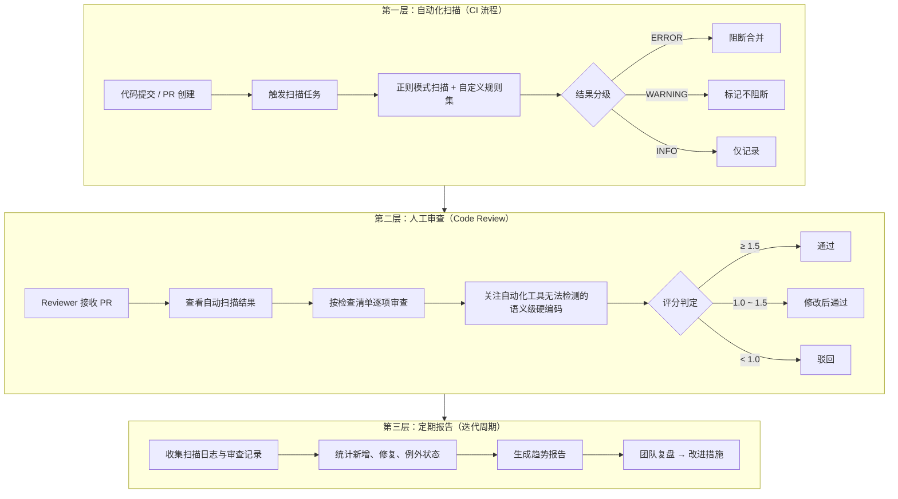

# 检测与报告机制：三层检测体系架构

三层检测体系按照执行时序与介入深度递进排列。第一层自动化扫描承担大规模初筛职责，第二层人工审查负责语义级深度判断，第三层定期报告则从宏观视角提供治理数据与趋势洞察。

三层体系的分工原则：

| 层级 | 介入时机 | 覆盖范围 | 判定精度 | 阻断能力 |
|---|---|---|---|---|
| 自动化扫描 | pre-commit / PR 提交 | 全量代码变更 | 高（模式匹配） | 可阻断 ERROR 级别 |
| 人工审查 | Code Review | 语义级硬编码 | 最高（人工判断） | 可拒绝合并 |
| 定期报告 | 迭代周期结束 | 全仓库累积数据 | 宏观统计 | 驱动流程改进 |
---
## 相关模式

- [多信号检测](../../docs/retrospective/patterns/methodology-patterns/tools-automation/multi-signal-detection.md)
- [周期检查缓存](../../docs/retrospective/patterns/code-patterns/periodic-check-caching.md)
---
← 上一章: [01 规范说明](01-overview.md) | **[返回索引](../detection-and-reporting.md)** | 下一章 → [03 自动化扫描规范](03-automated-scanning.md)
