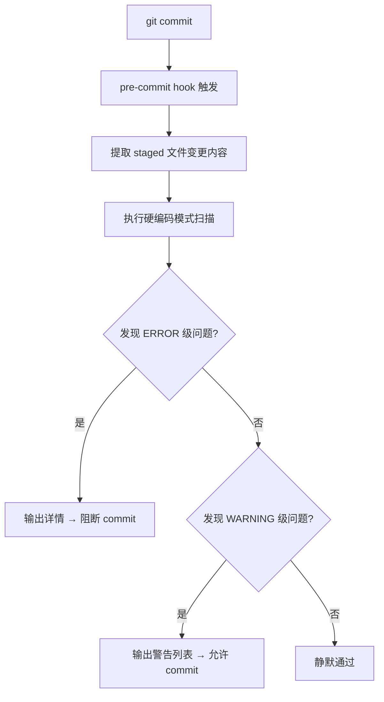

# 检测与报告机制：自动化扫描规范

## 触发时机

自动化扫描在以下时间节点触发，分别对应不同的检查粒度与执行开销：

| 触发时机 | 触发方式 | 扫描范围 | 执行时长约束 | 阻断策略 |
|---|---|---|---|---|
| pre-commit | git hook 自动触发 | 变更文件（staged） | ≤ 5 秒 | 阻断 commit |
| PR 提交 | CI 流水线自动触发 | PR 变更文件 | ≤ 60 秒 | 阻断合并（ERROR 级） |
| 定时扫描 | cron 定时任务（可选） | 全量仓库 | 无硬约束 | 仅记录不上报阻断 |

**pre-commit 阶段的具体执行流程**：



## 扫描规则

自动化扫描基于预定义的正则表达式规则集运行。规则按风险等级分级，覆盖常见的硬编码模式类型。

| 规则 ID | 检测目标 | 正则模式描述 | 级别 | 参考类别 |
|---|---|---|---|---|
| HC-STR-01 | 中文字符串硬编码 | 函数调用参数、异常消息、日志语句中出现的双引号或单引号内中文序列（排除注释行与文档字符串） | WARNING | HARD-STR |
| HC-STR-02 | 英文句子硬编码 | 函数调用参数中出现的完整英文句子（包含空格且长度 ≥ 30 字符的字符串字面量） | INFO | HARD-STR |
| HC-NUM-01 | 魔法数字 | 逻辑表达式与函数调用中独立出现的数值字面量（排除 0、1、-1 及数组索引、循环边界等惯用写法） | WARNING | HARD-NUM |
| HC-NUM-02 | 超时/阈值硬编码 | `timeout`、`sleep`、`retry`、`limit`、`threshold` 等语义明确的参数位置出现的数值字面量 | WARNING | HARD-NUM |
| HC-PATH-01 | 硬编码文件路径 | 包含 `/` 或 `\` 分隔符且指向具体文件或目录的字符串（排除 import/module 路径） | ERROR | HARD-PATH |
| HC-URL-01 | 硬编码 URL | 包含 `http://` 或 `https://` 协议的完整 URL 字符串 | ERROR | HARD-URL |
| HC-URL-02 | 硬编码 IP 地址 | 符合 IPv4 或 IPv6 格式的地址字符串 | ERROR | HARD-URL |
| HC-CFG-01 | 配置参数硬编码 | `pool_size`、`max_connections`、`cache_ttl`、`batch_size` 等明确为配置项命名所赋的值 | WARNING | HARD-CFG |
| HC-KEY-01 | 敏感信息泄漏 | 匹配疑似密钥、密码、token 的模式（如 `password =`、`secret_key =`、`api_key =` 后跟非空字符串） | ERROR | — |

规则集以配置文件形式管理，存放在 `.agents/rules/` 目录下，支持按项目语言与框架扩展自定义规则。每条规则包含以下字段：

```
规则 ID → 描述 → 正则模式 → 严重级别 → 排除模式 → 适用文件类型
```

## 结果分级与处理策略

扫描结果按严重程度分为三级，各级别对应不同的 CI 行为与处理策略：

| 级别 | 含义 | 典型场景 | CI 行为 | 处理策略 |
|---|---|---|---|---|
| ERROR | 必须立即修复 | 硬编码密钥、URL、文件路径 | 阻断合并，构建标记为失败 | 开发者立即修改为替代方案后重新提交 |
| WARNING | 建议本次迭代修复 | 魔法数字、中文硬编码字符串 | 不阻断但生成标注，Code Review 中着重审查 | 本次迭代或下一迭代内修复，修复后标注消除 |
| INFO | 提示关注 | 长度较短的英文固定字符串 | 仅记录至扫描日志，不阻断也不在 PR 页面展示 | 开发者知晓即可，在定期报告中追踪累积趋势 |

**阻断逻辑说明**：

- 当且仅当扫描结果中存在至少一个 ERROR 级别问题时，CI 流水线返回非零退出码，阻止代码合并；
- WARNING 与 INFO 级别问题不改变 CI 退出码，但 WARNING 级结果将作为标注显示在 PR 的 Code Review 界面；
- 开发者在修复 ERROR 后重新推送，扫描将再次执行，直至无 ERROR 方可通过。

## 白名单与抑制注释

对于经过审慎评估后确认为合理保留的硬编码点，允许通过特殊注释标记来抑制特定行或特定规则的检测，避免反复产生误报告警。

| 抑制注释格式 | 作用范围 | 示例 |
|---|---|---|
| `# noinspection HardcodeCheck` | 抑制下一行的所有硬编码检测规则 | 用于逐行豁免 |
| `# noinspection HC-STR-01` | 抑制下一行的指定规则（ID 精确匹配） | 用于精确豁免单个规则 |
| `// noinspection HardcodeCheck` | 同上，适用于类 C 语系 | JavaScript / TypeScript / Java / Go 等 |
| `# noinspection start` / `# noinspection end` | 抑制注释块包裹区域内的所有检测 | 用于豁免整段代码 |

**使用约束**：

- 抑制注释必须紧邻被抑制代码的上一行，或通过 `start`/`end` 明确标注范围；
- 每次使用抑制注释须在所在文件中以 `# HARDCODE-EXCEPTION: <编号>` 格式标注例外说明，编号应与项目例外清单中的条目对应；
- 例外说明应包含：理由（为什么不能外部化）、评估人、创建日期、计划复审日期；
- 抑制注释不得用于屏蔽 ERROR 级别的规则（HC-PATH-01、HC-URL-01、HC-KEY-01）。

```python
# HARDCODE-EXCEPTION: EX-2026-001
# 理由：第三方 SDK 要求硬编码版本标识符，无外部化接口
# 评估人：architect  创建日期：2026-06-23  复审日期：2026-09-23
# noinspection HC-STR-01
SDK_VERSION = "v3.2.1-compatible"  
```
---
## 相关模式

- [多信号检测](../../docs/retrospective/patterns/methodology-patterns/tools-automation/multi-signal-detection.md)
- [周期检查缓存](../../docs/retrospective/patterns/code-patterns/periodic-check-caching.md)
---
← 上一章: [02 三层检测体系架构](02-three-layer-architecture.md) | **[返回索引](../detection-and-reporting.md)** | 下一章 → [04 人工审查规范](04-manual-review.md)
