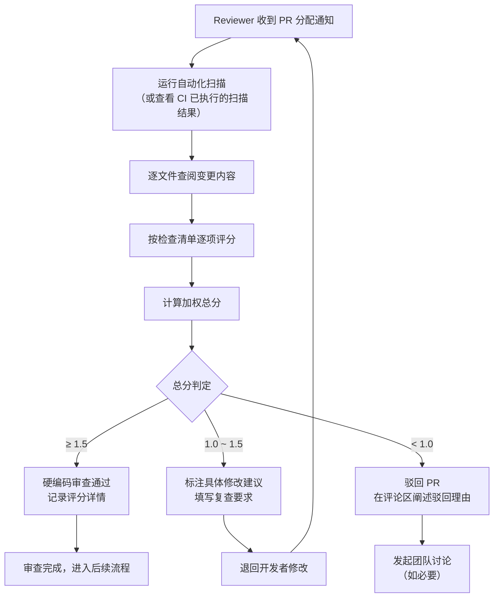

# 检测与报告机制：人工审查规范

自动化扫描擅长模式匹配，但无法判断硬编码点的业务合理性、替代方案可行性以及上下文语义。人工审查环节正是补足这一短板的关键步骤。

## 审查检查清单

Reviewer 在进行硬编码专项审查时，依据以下量化评分表逐项打分，计算加权总分后判定审查结果。

| 检查项 | 权重 | 评分标准 | 0 分 | 1 分 | 2 分 |
|---|---|---|---|---|---|
| 新增硬编码数量 | 30% | 本次 PR 引入的硬编码点总数（含自动化扫描标记 + 人工发现） | > 5 个 | 1 ~ 5 个 | 0 个 |
| 例外标记规范性 | 25% | `HARDCODE-EXCEPTION` 标记的格式完整性、理由充分性与编号可追溯性 | 存在未标记的硬编码点 | 已标记但格式或理由不规范 | 全部标记且格式规范 |
| 替代方案合理性 | 25% | 硬编码点是否已通过配置文件、环境变量、常量定义或资源文件等替代方案消除 | 存在明显可替代项但未处理 | 部分已处理或替代方案合理 | 全部已处理或无合理替代方案 |
| 敏感信息暴露 | 20% | 是否暴露密钥、密码、Token、证书等敏感信息 | 存在敏感信息泄露 | — | 无泄露 |

**—— 评分公式 ——**

```
总分 = (新增硬编码数量 × 0.30) + (例外标记规范性 × 0.25) + (替代方案合理性 × 0.25) + (敏感信息暴露 × 0.20)
```

**—— 判定阈值 ——**

| 总分范围 | 判定结果 | 后续动作 |
|---|---|---|
| ≥ 1.5 | 通过 | Reviewer 批准 PR，硬编码审查项标记为已通过 |
| ≥ 1.0 且 < 1.5 | 修改后通过 | Reviewer 标注具体修改建议，退回开发者修改后重新审查 |
| < 1.0 | 驳回 | Reviewer 驳回 PR 并发起讨论（可在 PR 评论区或团队频道中阐述驳回理由） |

**—— 加分与减分项 ——**

| 类型 | 条件 | 调整分值 |
|---|---|---|
| 加分 | 本期主动修复存量硬编码（非本次 PR 引入） | +0.2 / 个（上限 +0.4） |
| 减分 | 使用抑制注释屏蔽 ERROR 级别规则 | -0.3 / 次 |
| 减分 | 例外标记中复审日期已过期未更新 | -0.2 / 项 |

## 审查流程

审查流程从 Reviewer 获取 PR 开始，以审查结论结束。整个流程在 PR 的 Code Review 界面中完成，结果记录于审查摘要中。



**审查记录格式**：Reviewer 完成审查后，应在 PR 评论区或审查摘要中附上以下格式的审查记录：

```
# 硬编码审查记录

- 审查人：reviewer
- 审查时间：2026-06-23T15:30:00+08:00
- 新增硬编码点数：2
- 例外标记规范性：2 分（标记齐全，格式规范）
- 替代方案合理性：1 分（HC-NUM-01 处建议抽取为配置项）
- 敏感信息暴露：2 分（无泄露）
- 总分：1.55
- 判定：通过
- 修改建议：第 45 行处的超时值建议从配置文件读取。
```
---
## 相关模式

- [多信号检测](../../../docs/retrospective/patterns/methodology-patterns/tools-automation/multi-signal-detection.md)
- [周期检查缓存](../../../docs/retrospective/patterns/code-patterns/periodic-check-caching.md)
---
← 上一章: [03 自动化扫描规范](03-automated-scanning.md) | **[返回索引](../detection-and-reporting.md)** | 下一章 → [05 定期报告规范](05-periodic-reporting.md)
