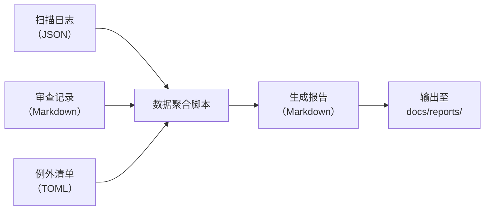

# 检测与报告机制：定期报告规范

定期报告将分散在 CI 日志与审查记录中的硬编码治理数据汇总为结构化报表，帮助团队从宏观视角把握治理态势、识别趋势性问题，并为流程改进提供数据支撑。

## 报告周期

| 周期类型 | 适用团队 | 报告范围 | 产出时间 |
|---|---|---|---|
| 迭代报告（推荐） | 敏捷团队（2 周迭代） | 本迭代内所有 PR 的扫描与审查数据 | 迭代回顾会前 1 个工作日 |
| 月度报告 | 月迭代或看板团队 | 当月全量数据 | 次月第 1 个工作日 |
| 季度总结 | 所有团队 | 季度内趋势汇总与对比 | 季度末最后一周 |

## 报告内容模板

```markdown
# 硬编码治理报告 —— 2026 年第 12 迭代（6月9日 ~ 6月23日）

# 一、概览

| 指标 | 数值 | 较上期变化 |
|---|---|---|
| 本期新增硬编码 | 8 个 | ↓ 3 |
| 本期已修复硬编码 | 12 个 | ↑ 5 |
| 当前存量硬编码 | 47 个 | ↓ 4 |
| 例外清单活跃项 | 5 项 | — |
| ERROR 阻断次数 | 3 次 | ↓ 1 |
| 平均审查评分 | 1.72 | ↑ 0.15 |

# 二、类型分布

| 硬编码类型 | 新增 | 已修复 | 存量 | 变化趋势 |
|---|---|---|---|---|
| HARD-STR（固定字符串） | 3 | 5 | 18 | ↓ |
| HARD-NUM（固定数值） | 2 | 3 | 12 | ↓ |
| HARD-PATH（固定路径） | 1 | 1 | 5 | → |
| HARD-URL（固定 URL） | 0 | 2 | 3 | ↓ |
| HARD-CFG（固定配置） | 1 | 1 | 7 | → |
| HARD-KEY（敏感信息） | 1 | 0 | 2 | ↑ |

# 三、风险分布

| 风险等级 | 新增 | 已修复 | 存量 |
|---|---|---|---|
| ERROR（阻断级） | 2 | 5 | 8 |
| WARNING（建议级） | 5 | 6 | 29 |
| INFO（提示级） | 1 | 1 | 10 |

# 四、模块分布

| 模块/目录 | 新增 | 存量 | 密集度 |
|---|---|---|---|
| src/api/ | 2 | 12 | 高 |
| src/utils/ | 1 | 5 | 中 |
| src/config/ | 0 | 1 | 低 |

# 五、例外清单状态

| 编号 | 文件位置 | 内容摘要 | 创建日期 | 复审日期 | 状态 | 操作建议 |
|---|---|---|---|---|---|---|
| EX-2026-001 | sdk_wrapper.py:23 | SDK 版本标识符，无外部化接口 | 2026-06-01 | 2026-09-01 | 有效 | 复审时与 SDK 供应商确认 |
| EX-2026-002 | legacy_adapter.py:67 | 遗留系统兼容性常量 | 2026-05-15 | 2026-08-15 | 有效 | 遗留系统退役后可移除 |
| EX-2026-003 | vendor/init.py:5 | 第三方库入口路径 | 2026-04-20 | 2026-07-20 | 即将到期 | 本次迭代复审更新 |

# 六、趋势对比

（以文字或图表描述与上一周期的对比变化）

- **积极趋势**：存量硬编码连续 3 个周期下降，团队治理意识持续增强；
- **消极趋势**：HARD-KEY 类问题存量略有上升，需在下次迭代中重点关注；
- **稳定项**：HARD-PATH 与 HARD-URL 类问题存量趋于低位稳定，前期治理见效。

# 七、改进建议

1. **针对 HARD-KEY 类问题**：建议在 pre-commit 阶段增加密钥检测专用规则，将 `password =` 与 `secret_key =` 后的常数字符串默认定级为 ERROR；
2. **针对审查效率**：本期平均审查评分上升，但 3 次 ERROR 阻断表明 pre-commit 扫描可进一步前移检测粒度；
3. **针对例外管理**：EX-2026-003 即将到期，需安排复审以决定是更新、移除还是升级。
```

## 数据来源

报告数据来自以下三个渠道，报告生成时应确保数据交叉验证：

| 数据来源 | 采集内容 | 采集方式 | 备注 |
|---|---|---|---|
| 自动化扫描输出日志 | 每次扫描的规则命中数、级别分布、文件路径、抑制注释使用情况 | 解析扫描工具的结构化输出（JSON/CSV） | 日志存放于 `.agents/logs/scan/` 目录 |
| Reviewer 审查记录摘要 | 审查评分详情、修改建议、驳回原因 | 提取 PR 评论区的审查记录模板内容 | 可由 CI 脚本自动提取并结构化存储 |
| 例外清单更新记录 | HARDCODE-EXCEPTION 的增删改记录、复审日期变更 | 跟踪 `HARDCODE-EXCEPTION` 注释的 Git 变更 | 例外清单文件存放于 `.agents/rules/exceptions.toml` |

**数据处理流程**：


---
## 相关模式

- [多信号检测](../../../docs/retrospective/patterns/methodology-patterns/tools-automation/multi-signal-detection.md)
- [周期检查缓存](../../../docs/retrospective/patterns/code-patterns/periodic-check-caching.md)
---
← 上一章: [04 人工审查规范](04-manual-review.md) | **[返回索引](../detection-and-reporting.md)** | 下一章 → [06 工具集成建议](06-tool-integration.md)
