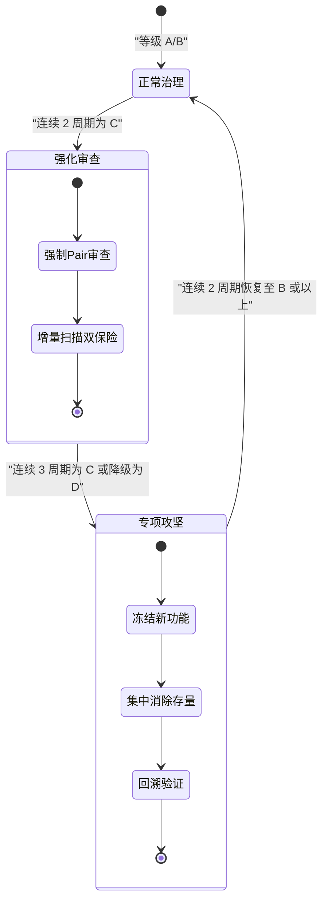

# 硬编码治理执行与验证规则

本规范是硬编码治理规则体系中的执行层文档，其核心目标是确保治理体系中的所有规则具备切实的**可执行性**与**可验证性**。体系内每条规则均采用"触发条件 → 执行步骤 → 衡量标准"的三段式结构定义，保证从触发到评估的完整闭环。

## 规范说明

硬编码治理是代码质量工程的基础性保障措施。若规则仅停留在声明层面而缺乏明确的执行路径与验收标准，则无法在实际工程中落地。本规范承担以下三项核心职责：

1. **定义规则结构**：为所有治理规则建立统一的表达模板，避免因人而异的解读偏差；
2. **细化执行步骤**：将每条规则转化为可操作的行动序列，使各角色能够无歧义地执行；
3. **设定验收尺度**：为每条规则配备量化或检核型的衡量标准，确保判定的客观性与一致性。

## 规则三段式定义结构

所有硬编码治理规则均遵循以下统一格式，任何新规则的创建应沿用此模板：

```
### 规则编号：RULE-HC-XXX
- **触发条件**：明确描述触发本规则的场景、事件或代码状态。
                条件应足够具体，使执行者无需额外推断即可判断是否适用。
- **执行步骤**：按顺序列出具体操作。每条步骤应为单一、可验证的动作，
                使用祈使句表达，避免模糊措辞。
- **衡量标准**：给出合格判定的量化指标或检核项。
              须区分自动化判定与人工判定，并注明阈值。
```

规则编号命名规范：
- 前缀 `RULE-HC-` 表示硬编码（Hard-Coding）治理类规则；
- 后缀为三位数字序号，从 `001` 起顺序递增；
- 规则一经分配编号即不可复用或修改编号，废弃规则保留编号并标注 `[已废弃]`。

## 各规则详细定义

### RULE-HC-001：新代码禁止引入硬编码

- **触发条件**：编写新功能代码、修改已有模块代码、或执行任何涉及业务逻辑的代码变更。
- **执行步骤**：
  1. 编码前查阅 `alternatives-guide.md`，确认目标参数/文本/路径是否存在已定义的替代方案；
  2. 将可配置参数写入对应的配置文件（`config/` 目录），而非直接嵌入代码；
  3. 将面向用户的文本信息外部化到消息字典或国际化资源文件中；
  4. 提交前执行自查：检查本次变更的代码中是否包含直接写死的字符串字面量、数值常量或不可携路径。
- **衡量标准**：
  - 自动化扫描 HC-STR、HC-NUM、HC-PATH 规则结果均为 0 ERROR；
  - Reviewer 在审查检查清单中"新增硬编码数量"一项的评分为 **2 分**（0 新增）；
  - CI pipeline 中硬编码扫描阶段标记为 PASS。

### RULE-HC-002：硬编码例外必须标记与归档

- **触发条件**：存在经评估确认无法通过替代方案消除的硬编码点（如第三方 SDK 强制要求的特定字符串、协议级固化的数值等）。
- **执行步骤**：
  1. 在代码行上方使用标准注释格式 `# HARDCODE-EXCEPTION: <原因> | type=<类型标识> | valid_until=<有效期>` 进行标记；
  2. 在例外注释中填写完整的理由说明、类型标识（如 `API_CONSTRAINT`、`PROTOCOL_FIXED`、`PERF_CRITICAL`）及明确的有效期（日期或里程碑）；
  3. 将例外提交至 reviewer，经 reviewer 初步审核后转交 architect 做最终审批；
  4. 审批通过后，将例外信息同步记录到项目例外清单文件中。
- **衡量标准**：
  - 代码中例外标记格式 100% 符合 `# HARDCODE-EXCEPTION:` 模板（自动化正则校验通过）；
  - 例外清单中收录项与代码实际标记项完全一致（无遗漏、无幽灵项）；
  - 每项例外均包含非空的有效期字段，且格式符合 `YYYY-MM-DD` 或 `M<序号>` 里程碑标识；
  - Reviewer 检查清单中"例外合规率"为 100%。

### RULE-HC-003：敏感信息永不硬编码

- **触发条件**：代码中需要引用密钥、密码、Token、API 密钥、证书内容、私钥、连接字符串等任何形式的敏感凭证信息。
- **执行步骤**：
  1. 将敏感信息设置为环境变量（或密钥管理服务中的对应条目），代码通过 `os.environ` 或等效机制读取；
  2. 确认 `.env`、`*.pem`、`*.key`、`credentials.*` 等含敏感信息的文件已在 `.gitignore` 中声明；
  3. 在项目根目录提供 `.env.example` 模板文件，列出所有必需的环境变量名及说明，但**不包含任何真实值**；
  4. 对于生产环境，使用密钥管理服务替代环境变量直传。
- **衡量标准**：
  - 自动化扫描 HC-SEC 规则结果为 0 ERROR；
  - 代码库全量搜索中不存在匹配密钥/密码模式（如 `password = "..."`、`api_key = "sk-..."`）的真实值；
  - `.agents/scripts/check-gitignore.py` 验证通过，确认敏感文件模式均已覆盖；
  - `.env.example` 存在且仅包含变量名与说明，不含真实凭证。

### RULE-HC-004：配置参数集中管理

- **触发条件**：代码中出现超时时间、重试次数、并发连接数、功能开关、阈值、缓冲大小等运行时可调参数。
- **执行步骤**：
  1. 在 `config/` 目录中以 YAML/TOML/JSON 格式定义配置项，按模块或功能域分组；
  2. 使用统一的配置加载器读取配置值，加载器须支持环境变量覆盖机制（环境变量优先级高于配置文件默认值）；
  3. 业务代码中通过配置对象引用参数值（如 `config.get("db.pool_size")`），禁止直接书写字面量；
  4. 确保配置文件的变更无需重新编译或修改业务代码即可生效。
- **衡量标准**：
  - 所有可调参数 100% 通过 `config/` 配置文件管理（人工抽查 + 自动化扫描验证）；
  - 不同部署环境可通过环境变量实现差异化配置，无需维护多套配置副本；
  - 自动化扫描 HC-CFG-01 规则结果为 0 WARNING。

### RULE-HC-005：路径引用统一管理

- **触发条件**：代码中需要引用文件路径或目录路径（包括相对路径与绝对路径）。
- **执行步骤**：
  1. 将项目中所有复用的路径常量集中定义在 `constants/paths.py`（或等效模块）中；
  2. 在运行时使用 `os.path.join()` 或 `pathlib.Path` 拼接子路径，禁止使用字符串拼接（如 `base + "/" + sub`）；
  3. 基数路径（如数据目录、日志目录、缓存目录）从配置文件或环境变量获取，不硬编码绝对路径；
  4. 删除代码中已有的一切硬编码绝对路径（如 `C:\Users\...`、`/home/...`）。
- **衡量标准**：
  - 自动化扫描 HC-PATH-01 规则结果为 0 ERROR；
  - 路径常量 100% 集中定义在 `constants/paths.py`，代码中无分散的路径字符串；
  - 项目能在不同操作系统与不同安装路径下正常部署运行，无路径硬编码导致的运行故障。

### RULE-HC-006：定期审查与趋势监控

- **触发条件**：每个迭代周期（或每个日历月）结束时，或项目进入版本发布冻结期前。
- **执行步骤**：
  1. 运行全量硬编码自动化扫描脚本，生成本周期完整的扫描报告；
  2. 读取上一周期的扫描报告与例外清单作为基准，生成本周期趋势报告（含存量变化、新增/修复统计、例外活跃项对比）；
  3. 逐一核查例外清单中已过有效期的项，标记为"待处理"并通知对应责任人；
  4. 由 orchestrator 主持团队复盘会议，基于趋势报告讨论改进措施，并将决议写入迭代复盘文档。
- **衡量标准**：
  - 趋势报告中"硬编码存量"数值不高于上一周期（平或降）；
  - 过期例外项在下一周期开始前 100% 被处理（续期审批或完成消除）；
  - 本周期新提交代码中，自动化扫描 ERROR 级别问题数量为 0。

## 验证手段规范

验证是规则闭环的最终环节。本规范定义了三种互补的验证手段，覆盖自动化、人工与趋势分析三个维度。

### 4.1 自动化脚本验证

自动化验证是最基础的验证层，由工具链在代码变更时自动触发，不依赖人工干预。

| 属性 | 说明 |
|---|---|
| **工具** | 正则扫描脚本（HC 规则集）、现有 CI 检查流程中的硬编码检测阶段 |
| **集成点** | pre-commit hook（本地提交前）、CI pipeline（推送后） |
| **输出格式** | JSON 结构化扫描结果（机器消费） + Markdown 摘要报告（人工查阅） |
| **执行频率** | 每次 `git commit` 时通过 pre-commit hook 自动执行；CI 端每次 push 触发 |
| **阻断策略** | ERROR 级别问题阻断提交（pre-commit）或阻断合并（CI）；WARNING 级别记录但不阻断 |

扫描报告 JSON 结构示例：

```json
{
  "report_id": "HC-SCAN-20260623-001",
  "timestamp": "2026-06-23T17:00:00+08:00",
  "summary": {
    "error_count": 0,
    "warning_count": 2,
    "info_count": 5,
    "exception_count": 3
  },
  "violations": [
    {
      "rule": "HC-CFG-01",
      "severity": "WARNING",
      "file": "src/utils.py",
      "line": 42,
      "snippet": "timeout = 30",
      "message": "可配置参数应移至 config/ 目录管理"
    }
  ]
}
```

### 4.2 检查点清单验证

检查点清单用于人工审查场景，结构化为 Markdown 复选框格式，由责任人在审查/验收阶段逐项确认。

#### 代码审查检查清单（reviewer 使用）

```markdown
## 硬编码治理审查清单

### RULE-HC-001：新代码禁止引入硬编码
- [ ] 新增代码中无硬编码字符串字面量（首轮过滤）
- [ ] 新增代码中无硬编码数值常量（配置项除外）
- [ ] 新增代码中无硬编码文件/目录路径

### RULE-HC-002：例外标记与归档
- [ ] 所有例外均使用标准注释格式标记
- [ ] 例外清单与代码标记完全一致
- [ ] 每项例外均注明了有效期
- [ ] 无未经审批的例外项

### RULE-HC-003：敏感信息
- [ ] 环境变量已正确引用，无内联密钥/密码
- [ ] `.gitignore` 涵盖所有敏感文件模式
- [ ] `.env.example` 模板已同步更新

### 评分类别
- **新增硬编码数量**：[ ] 0 分（≥5 个） [ ] 1 分（1–4 个） [ ] 2 分（0 个）
- **例外合规率**：[ ] 不通过（格式错误/有遗漏） [ ] 通过（格式正确且完整）
```

#### 迭代验收检查清单（orchestrator 使用）

```markdown
## 迭代验收硬编码治理清单

- [ ] 全量扫描已执行且结果已存档
- [ ] 趋势报告已生成（含与上周期对比数据）
- [ ] 过期例外项已全部处理
- [ ] 本周期新代码 ERROR 级别问题为 0
- [ ] 团队复盘已执行，改进措施已记录
```

### 4.3 基准数据对比

基准数据对比用于周期性的趋势分析，通过将本周期扫描数据与上周期基准数据进行比较，量化治理效果。

**数据源**：
- 上一周期的全量扫描报告（JSON）；
- 上一周期的例外清单；
- 本周期的全量扫描报告（JSON）；
- 本周期的例外清单。

**对比维度**：

| 指标 | 上周期 | 本周期 | 变化 | 趋势 |
|---|---|---|---|---|
| 硬编码存量（ERROR + WARNING） | N | M | M−N | ↑/↓/→ |
| 新增硬编码 | a | b | b−a | ↑/↓/→ |
| 已修复硬编码 | c | d | d−c | ↑/↓/→ |
| 例外活跃项 | e | f | f−e | ↑/↓/→ |
| 例外过期未处理 | g | h | h−g | ↑/↓/→ |
| ERROR 级别问题 | i | j | j−i | ↑/↓/→ |

**趋势判定规则**：

| 趋势 | 判定条件 | 对应措施 |
|---|---|---|
| ↓（改善） | 硬编码存量下降 | 记录有效措施，纳入团队知识库推广 |
| →（持平） | 硬编码存量未变化 | 正常状态，持续监督即可 |
| ↑（恶化） | 硬编码存量上升 | 触发团队复盘，制定回归控制方案，必要时加入迭代阻塞项 |

## 角色执行职责表

各角色在硬编码治理体系中的具体职责与验证关系如下：

| 角色 | 执行职责 | 验证手段 | 触发时机 |
|---|---|---|---|
| **developer** | 编码阶段遵守 RULE-HC-001、RULE-HC-003、RULE-HC-004、RULE-HC-005；提交前自查代码中是否存在硬编码 | 提交前自查清单 + pre-commit 自动化扫描 | 每次编码与提交 |
| **reviewer** | 审查阶段核对 RULE-HC-001 新增硬编码评分、RULE-HC-002 例外格式与清单一致性 | 审查检查清单逐项评分 | 每次代码审查 |
| **architect** | 审批 RULE-HC-002 硬编码例外申请；为无法消除的硬编码场景提供架构级替代方案指导 | 例外审批记录 + 定期审查例外清单 | 例外申请时 + 迭代周期末 |
| **orchestrator** | 执行 RULE-HC-006 定期审查与趋势监控；主持团队复盘会议，跟踪改进措施落实 | 趋势报告 + 复盘会议纪要 + 改进措施跟踪看板 | 每个迭代周期末 |
| **tester** | 验证消除硬编码后的重构代码功能等价性；确保配置外部化不影响运行时行为 | 全量回归测试 + 多环境部署验证 | 重构完成后 |

## 合规等级与奖惩机制

### 合规等级定义

| 等级 | 名称 | 判定标准 |
|---|---|---|
| A | 完全合规 | 所有 ERROR 级规则结果为 0；WARNING 级规则结果为 0；例外清单无过期项 |
| B | 基本合规 | 所有 ERROR 级规则结果为 0；WARNING 级规则结果 ≤ 3；例外清单无过期项 |
| C | 需改进 | ERROR 级规则结果为 0；WARNING 级规则结果 > 3 或例外清单存在过期项 |
| D | 不合规 | ERROR 级规则结果 > 0 |

### 奖惩机制

| 等级 | 代码合并 | 发布 | 团队措施 |
|---|---|---|---|
| **A** | 正常合并 | 正常发布 | 记录为最佳实践案例，向团队分享有效策略 |
| **B** | 正常合并 | 正常发布 | 在迭代复盘时列出 WARNING 项，纳入下周期改进计划 |
| **C** | 正常合并 | 可发布（附带治理计划） | 须在下周期内将等级提升至 B 级以上；连续两周期 C 级则触发专项治理 |
| **D** | **阻断合并** | **阻断发布** | 修复全部 ERROR 项后方可重新进入审查与合并流程 |

### 升级路径

当项目长期处于 C 级或以下时，按以下路径升级治理强度：



- **强化审查**：所有变更须经过 pairing review 方可通过；提交前与 CI 端双重扫描，任一失败即阻断。
- **专项攻坚**：暂停新功能开发，集中资源消除存量硬编码；消除完成后执行全量回归测试验证功能等价性。
