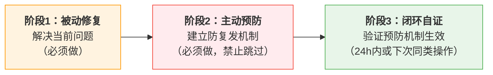

# 修复即闭环：三阶段强制SOP

> 只修不防，等于白忙。
> 点修复是最常见的认知偏差——解决眼前问题比建立长效机制更"紧急"，但每次跳过预防都在为未来创造同样的问题。

---

## 一、问题背景

在SpecWeave 13天实践中，多次出现"修复了问题但未建立预防机制，导致问题以变体形式复发"的模式：

- **Mermaid渲染问题**：修复中文ID子图语法问题后，未建立预防性检查脚本，后续又出现特殊字符转义问题
- **断链问题**：原子化后批量修复81处断链，未在重构前建立影响范围分析流程，后续重构又产生新断链
- **事实表述漂移**：修正统计数字不一致后，未建立单一数据源，后续又出现类似漂移

**根因分析（5-Whys）**：
1. 为什么问题复发？→ 只做了"点修复"而未建立"预防机制"
2. 为什么只做点修复？→ 修复时急于解决当前问题，未系统性思考"如何防止再次发生"
3. 为什么不系统思考？→ 缺乏"修复→预防→闭环"的标准操作流程
4. 为什么缺乏？→ "点修复偏误"是普遍的认知偏差——解决眼前问题比建立长效机制更"紧急"
5. **根本原因**：没有强制流程要求在修复时必须执行预防步骤

---

## 二、三阶段闭环模型

所有Bug修复、问题解决、错误纠正必须严格遵循以下三阶段，**禁止跳过任何阶段**：

### 阶段1：被动修复（Fix）

**目标**：解决当前暴露的问题，恢复正常状态。

**执行步骤**：
1. 明确问题现象和复现条件
2. 定位根因（使用5-Whys或等价分析方法）
3. 实施修复，确保当前问题不再出现
4. 验证修复有效（复现条件不再触发问题）

**交付物**：修复后的代码/文档/配置 + 问题根因记录。

### 阶段2：主动预防（Prevent）

**目标**：确保同类问题不再以任何形式出现。**此阶段禁止跳过——只做阶段1不算完成修复。**

**预防措施选择矩阵**（按优先级从高到低，至少选择一项）：

| 预防措施类型 | 适用场景 | 具体操作 |
|-------------|---------|---------|
| **自动化检查脚本** | 问题可通过静态检测发现 | 编写/更新检查脚本，加入CI或pre-commit |
| **规则/规范更新** | 问题源于流程缺失或规范不清 | 更新相关规则文档、SOP、检查清单 |
| **单元测试用例** | 问题出现在代码逻辑中 | 添加测试用例覆盖该Bug场景，防止回归 |
| **反模式清单** | 问题是常见陷阱/易犯错误 | 将错误模式加入反模式清单，附正例对比 |
| **架构/设计调整** | 问题源于设计缺陷 | 调整架构从根源消除问题产生的可能性 |

**关键原则**：
- 预防措施必须能**自动或半自动地检测同类问题**，不能仅靠"以后注意"
- 如果无法立即实现强预防措施，必须创建P1级别的待办项并在commit message中标注
- 预防措施成本过高时，至少添加反模式清单条目和人工检查清单项

### 阶段3：闭环自证（Close）

**目标**：证明预防机制确实有效，形成完整闭环。

**执行方式**（满足任一即可）：
1. **自动验证**：预防措施是检查脚本/测试用例 → 运行脚本/测试确认能检测到问题模式
2. **实战验证**：在24小时内或下次执行同类操作时，观察预防机制是否成功拦截/提醒了潜在问题
3. **回归验证**：故意引入同类错误（在测试环境中），确认预防机制能检测到

**闭环标准**：
- 能提供证据证明预防机制生效（检查脚本输出、测试通过记录、拦截日志等）
- 将本次修复→预防→闭环的经验沉淀到复盘/模式库（适用于非 trivial 问题）

---

## 三、触发条件与适用范围

### RULE-FPC-001：Bug修复必须执行三阶段

- **触发条件**：修复任何Bug、错误、问题、不一致、故障（包括代码Bug、文档错误、配置错误、流程缺陷）
- **执行步骤**：
  1. 执行阶段1（被动修复）：定位并修复当前问题
  2. 执行阶段2（主动预防）：从预防措施选择矩阵中选择至少一项实施
  3. 执行阶段3（闭环自证）：验证预防机制生效
  4. 提交时在commit message中注明预防措施类型（如`fix(scope): 描述 [prevent: test-case]`）
- **衡量标准**：
  - 修复提交的diff中包含阶段1（修复）和阶段2（预防）两部分变更
  - commit message注明预防措施类型
  - 阶段3验证证据可追溯（测试通过日志、检查脚本输出等）

### RULE-FPC-002：纯点修复禁止提交

- **触发条件**：修复提交中仅包含问题修复内容，无任何预防措施
- **执行步骤**：
  1. reviewer或阶段守卫识别到纯点修复提交
  2. 退回给修复者补充预防措施
  3. 如果预防措施无法在同一提交中完成，创建P1级别跟踪Issue并在commit中引用
- **衡量标准**：
  - 禁止纯点修复合入主分支（`fix:`类型提交必须包含预防措施或跟踪Issue引用）
  - 例外情况：紧急Hotfix可先修复后补预防措施，但必须在24小时内补齐

### RULE-FPC-003：平凡修复豁免

- **触发条件**：以下类型的修复可豁免阶段2-3（仅需阶段1）
  - 明显的拼写错误/错别字修正（不改变语义）
  - 格式调整/排版美化（不改变内容结构）
  - 注释修正/文档补充（不改变行为描述）
  - 临时文件/构建产物清理
- **执行步骤**：
  1. 判断是否属于豁免范围（以上四种类型）
  2. 如不确定，按完整三阶段执行
  3. commit message中无需标注预防措施
- **衡量标准**：
  - 豁免修复的diff仅包含表层修改，不涉及逻辑/规则/结构变更
  - 如reviewer判断不属于豁免范围，按RULE-FPC-001执行

---

## 四、反模式识别

### 反模式1："以后再加预防"

**表现**：修复时说"这个问题先修了，预防以后再加"，但"以后"永远不会来。

**为什么是反模式**：
- 问题修复后上下文消失，后续不会主动回头补充预防
- 下次出现同类问题时成本更高（需要重新回忆上下文）
- 每次"以后加"都是在积累技术/规范债务

**纠正**：预防措施必须在同一次提交中完成（平凡修复豁免除外）。如果预防成本确实很高，创建跟踪Issue并在commit中引用，但Issue必须有明确的deadline（不超过3天）。

### 反模式2："这个问题不会再发生"

**表现**：修复后认为"这种情况很特殊，不会再出现了"，因此不加预防。

**为什么是反模式**：
- "特殊情况"往往比想象中更常见
- 如果问题出现了一次，说明存在系统性弱点，类似变体很可能出现
- Mermaid问题就是典型案例：中文字图ID是"特殊"的，但特殊字符转义是"同类问题"

**纠正**：问自己"如果一个不了解上下文的人做类似操作，是否可能犯同样的错误？"如果答案是"是"或"可能"，就需要预防措施。

### 反模式3：预防措施等于"加文档"

**表现**：修复后只在文档中加一句"注意不要XXX"，认为这就是预防。

**为什么是反模式**：
- 文档不会被自动执行，依赖人的记忆和自觉
- 人非圣贤，孰能无过——不能靠"注意"来防止错误
- 有效的预防是"想犯错都难"（poka-yoke），而非"请注意不要犯错"

**纠正**：优先选择自动化检查脚本、测试用例、架构调整等强制性预防措施。文档/规范更新是辅助手段，不能作为唯一的预防措施。

---

## 五、实施检查清单

### 修复者自查清单（提交前）

- [ ] 阶段1完成：当前问题已修复，复现验证通过
- [ ] 阶段2完成：已实施至少一项预防措施（检查脚本/规则更新/测试用例/反模式/架构调整）
- [ ] 预防措施不是纯文档说明（至少有半自动化检测能力）
- [ ] commit message中注明了预防措施类型
- [ ] 如属于平凡修复豁免，确认符合豁免条件

### Reviewer审查清单

- [ ] 修复提交是否包含预防措施（或引用了跟踪Issue）
- [ ] 预防措施类型与问题性质是否匹配（代码Bug→测试用例，规范问题→检查脚本，等等）
- [ ] 预防措施是否可验证（不是仅靠"以后注意"）
- [ ] 是否属于平凡修复豁免范围
- [ ] 如发现纯点修复，退回补充预防措施

### 阶段守卫拦截规则

当提交类型为`fix:`时，阶段守卫自动检查：
1. commit message是否包含预防措施标记（`[prevent:xxx]`）或Issue引用（`#NNN`）
2. diff中是否包含非修复性变更（预防措施代码/文档/测试）
3. 如两者都不满足，发出WARNING提醒（非阻断，但提醒reviewer关注）

---

## 六、实战案例

### 案例1：Mermaid渲染问题（反面→正面）

**反面做法（实际发生）**：
1. 阶段1：修复中文ID子图语法（使用`subgraph ID ["标题"]`格式）✅
2. 阶段2：跳过 ❌ → 后续出现特殊字符转义问题
3. 阶段3：跳过 ❌

**正面做法（本SOP要求）**：
1. 阶段1：修复中文ID子图语法 ✅
2. 阶段2：编写check-mermaid.py检查脚本+安全编码六规则 ✅
3. 阶段3：在后续Mermaid编写中验证脚本可检测到反模式 ✅

### 案例2：断链问题（反面→正面）

**反面做法（实际发生）**：
1. 阶段1：批量修复81处断链 ✅
2. 阶段2：开发check-links.py脚本（部分做了），但未在重构前增加影响范围分析 ⚠️
3. 阶段3：脚本在后续修改中验证有效 ✅

**正面做法（本SOP要求）**：
1. 阶段1：批量修复断链 ✅
2. 阶段2：check-links.py脚本 + 重构前影响范围检查流程 + 路径深度规则 ✅
3. 阶段3：后续重构前运行影响范围分析，确认无误后再执行 ✅

---

## 相关模式

- [治理演化三阶段](../docs/retrospective/reports/project-governance/comprehensive-reviews/retrospective-specweave-full-lifecycle-20260705/insight-extraction.md)：本SOP是治理三阶段在Bug修复领域的具体应用（模式2）
- [三层检查工具模式](../docs/retrospective/patterns/code-patterns/three-tier-check-tool.md)：自动化检查脚本是预防措施的核心手段
- [根因诊断模式](../docs/retrospective/patterns/methodology-patterns/governance-strategy/root-cause-diagnosis.md)：5-Whys分析方法
- [可用性启发式结构守卫](../docs/retrospective/patterns/methodology-patterns/governance-strategy/availability-heuristic-structural-guard.md)：对抗认知偏差的结构设计

---

## 关联规范

- 全局核心规则：[global-core-rules.md](../global-core-rules.md)（规则#9：修复即闭环）
- 原子提交规范：[commands/atomic-commit.md](../commands/atomic-commit.md)（提交检查清单增加预防措施验证）
- 开发规范：[docs/development-standards.md](../docs/development-standards.md)
