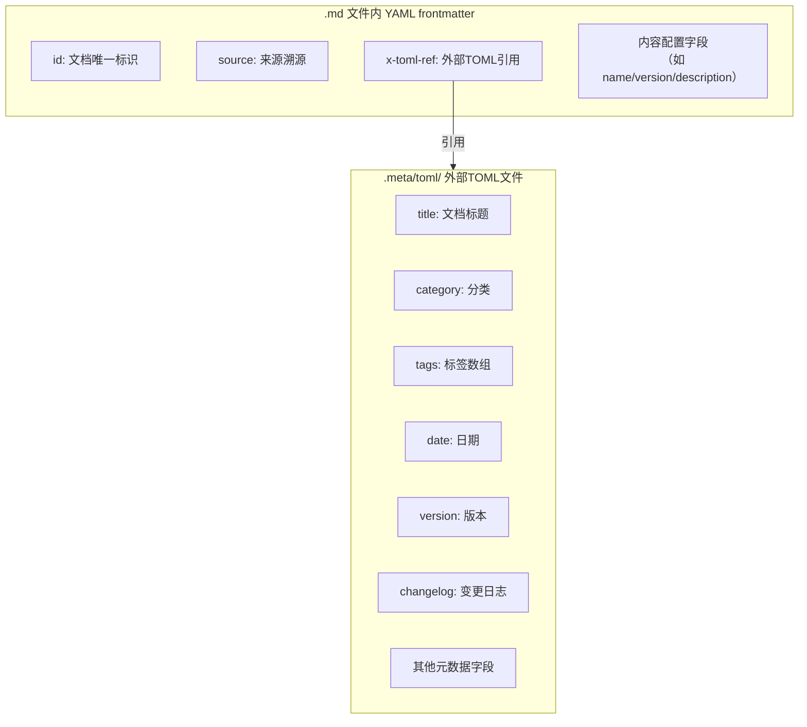
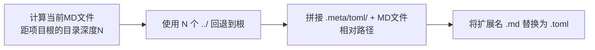

# Markdown 文档 Frontmatter 元数据规范

## 目的

统一项目中所有 Markdown 文档的 frontmatter 元数据格式，确保：
- YAML frontmatter 简洁扁平，无多行缩进嵌套
- 复杂元数据（标签数组、变更日志等）通过 `x-toml-ref` 外部化存储
- AI 智能体和人类开发者遵循一致的元数据编写规范
- 元数据可被程序化工具（索引生成、链接检查、知识库构建）可靠解析

## 适用范围

项目内所有 Markdown 文档，包括但不限于：
- `docs/` 下的知识文档、学习资料、复盘报告
- `.agents/` 下的规则、角色定义、协议、模板
- `.trae/specs/` 下的 spec 文档（spec.md/tasks.md/checklist.md 使用自身格式，**不适用**本规范）

## 基本规则

### 1. 统一使用 YAML 格式

所有 Markdown 文档的 frontmatter 统一使用 **YAML 格式**，以 `---` 作为分隔符：

```yaml
---
id: "document-unique-id"
x-toml-ref: "../.meta/toml/path/to/file.toml"
---
```

**禁止**在新文件中使用 `+++` 包裹的 TOML frontmatter 格式。

### 2. 扁平结构，禁止多行缩进

YAML frontmatter 必须保持**扁平结构**，禁止使用多行缩进嵌套语法：

| 禁止写法 ❌ | 正确写法 ✅ |
|------------|-----------|
| 多行数组缩进（`tags:\n  - "tag1"\n  - "tag2"`） | 内联数组（`tags: ["tag1", "tag2"]`）移至 TOML |
| 嵌套对象（`config:\n  key: value`） | 扁平字段或移至 TOML |
| 多行字符串（`changelog: |\n  line1\n  line2`） | 移至 TOML 文件 |

### 3. YAML 与 TOML 职责分离

采用 "YAML 存核心标识，TOML 存完整元数据" 的分层策略：



**字段合并规则**：YAML frontmatter 中的字段**优先于**外部 TOML 文件的同名字段。核心标识字段保留在 YAML 中，复杂/描述性元数据存储在外部 TOML。

## YAML frontmatter 字段规范

### 字段分类

| 字段 | 必填 | 适用场景 | 说明 |
|------|------|---------|------|
| `id` | 是 | 所有文档 | kebab-case 唯一标识符，如 `myst-migration-02-concept-adaptability` |
| `x-toml-ref` | 是 | 所有文档 | 外部 TOML 元数据文件的相对路径 |
| `source` | 条件必填 | 派生产物 | 来源溯源，格式见下文 |
| `title` | 可选 | 所有文档 | 文档标题（通常从 H1 标题推断，可选） |
| 内容配置字段 | 按需 | 特殊文档 | 如 MCP PoC 的 name/version/description，是文档内容的一部分 |

### id 命名规范

- 使用 **kebab-case**（小写字母+数字+连字符）
- 索引页使用简短 ID：`<topic>-readme`、`<topic>-index`、`<topic>-wiki`
- 章节文件使用带序号的 ID：`<topic>-NN-<section-name>`
- 报告文件使用语义 ID：`<topic>-analysis`、`<topic>-retro-YYYYMMDD`

**示例**：
```yaml
id: "executablebooks-myst-guide-readme"        # 索引页
id: "myst-migration-02-concept-adaptability"  # 章节页
id: "frontmatter-metadata-standard"           # 规则文档
```

### source 溯源字段

从其他文档派生出的结构化产物，**必须**携带 `source` 字段建立溯源链路：

- **格式**：`source: "<文件路径>#<章节锚点>"` 或 `source: "<URL>"`
- **多来源**：多个来源用逗号+空格分隔
- **索引页**：非派生的索引/入口页可省略 source 字段

**示例**：
```yaml
source: "report.md#2-核心概念适配性分析"
source: "https://mystmd.org/guide/syntax-overview, https://mystmd.org/guide/directives"
source: "README.md#自我迭代机制"
```

### 内容配置字段

当文档 frontmatter 中包含**内容定义元数据**（而非文档索引元数据）时，这些字段保留在 YAML 中：

- MCP Server PoC 示例：`name`、`version`、`description`
- MyST 文档中的内容级配置
- 文档正文中直接引用的 frontmatter 变量

判断标准：**如果一个字段是文档"内容的一部分"而非"关于文档的元数据"，则保留在 YAML 中。**

### 禁止的 YAML 写法

```yaml
---
# ❌ 禁止：多行缩进数组
tags:
  - "myst"
  - "directives"
  - "roles"

# ❌ 禁止：多行嵌套对象
config:
  enabled: true
  level: 2

# ❌ 禁止：多行 changelog（描述性文字，应放入TOML）
changelog:
  - "2026-07-02 | initial | 初始版本"
  - "2026-07-02 | expanded | 新增分析"

# ❌ 禁止：单独使用 category/date/tags/version 等字段（应放入TOML）
category: "learning"
date: "2026-07-02"
tags: ["myst", "syntax"]
---
```

## TOML 外部元数据规范

### 文件位置

所有 TOML 元数据文件存放在 `.meta/toml/` 目录下，路径镜像 Markdown 文件的项目内路径：

| Markdown 文件 | TOML 元数据文件 |
|---|---|
| `.agents/rules/example.md` | `.meta/toml/.agents/rules/example.toml` |
| `docs/knowledge/learning/guide/01-syntax.md` | `.meta/toml/docs/knowledge/learning/guide/01-syntax.toml` |
| `docs/retrospective/reports/standards-tools/analysis/report.md` | `.meta/toml/docs/retrospective/reports/standards-tools/analysis/report.toml` |

### x-toml-ref 路径计算

`x-toml-ref` 路径是从 Markdown 文件所在目录到 TOML 文件的**相对路径**：



**深度参考表**：

| MD 文件位置 | 距根深度 | x-toml-ref 前缀 |
|---|---|---|
| 项目根目录（`AGENTS.md`） | 0 | `.meta/toml/` |
| `.agents/rules/` | 2 | `../../.meta/toml/` |
| `docs/` | 1 | `../.meta/toml/` |
| `docs/knowledge/learning/` | 3 | `../../../.meta/toml/` |
| `docs/knowledge/learning/guide/` | 4 | `../../../../.meta/toml/` |
| `docs/knowledge/learning/guide/examples/` | 5 | `../../../../../.meta/toml/` |
| `docs/knowledge/learning/guide/examples/poc/` | 6 | `../../../../../../.meta/toml/` |
| `docs/retrospective/reports/` | 3 | `../../../.meta/toml/` |
| `docs/retrospective/reports/category/topic/` | 5 | `../../../../../.meta/toml/` |

### TOML 字段规范

**必填字段**：
- `title`：文档标题（字符串）
- `category`：分类（字符串，如 `"learning"`、`"standards-tools"`、`"rules"`）

**推荐字段**：
- `tags`：标签数组（`["tag1", "tag2"]`，使用 TOML 内联数组或多行数组均可）
- `date`：创建/更新日期（`"YYYY-MM-DD"` 格式）
- `version`：版本号（字符串，如 `"1.0"`、`"1.2.0"`）
- `source`：来源（与 YAML 中 source 一致）

**可选字段**：
- `status`：状态（`"draft"`、`"stable"`、`"deprecated"`）
- `part_of`：所属集合/系列（字符串）
- `summary`：摘要描述
- `changelog`：变更日志（字符串数组，每条格式 `"YYYY-MM-DD | type | description"`）
- `author`：作者（空字符串表示未指定）

### TOML 示例

```toml
title = "核心概念适配性分析"
category = "standards-tools"
tags = ["myst", "myst-nb", "directives", "roles", "agentspec"]
date = "2026-07-02"
version = "1.2.0"
source = "report.md#2-核心概念适配性分析 + MyST-NB可执行notebook能力分析"
part_of = "myst-to-agentspec-migration-analysis"
changelog = [
  "2026-07-02 | initial | 初始版本",
  "2026-07-02 | expanded | 新增MyST-NB分析"
]
```

## 文档类型模板

### 模板 1：索引页/入口页

```yaml
---
id: "<topic>-readme"
x-toml-ref: "<相对路径>.meta/toml/.../<name>.toml"
---
```

对应 TOML：
```toml
title = "<文档标题>"
category = "<分类>"
tags = ["tag1", "tag2"]
date = "YYYY-MM-DD"
version = "1.0"
```

### 模板 2：章节/派生内容页

```yaml
---
id: "<topic>-NN-<section>"
source: "<parent-file>.md#<章节锚点>"
x-toml-ref: "<相对路径>.meta/toml/.../<name>.toml"
---
```

### 模板 3：学习资料页

```yaml
---
source: "<URL或来源文档>"
x-toml-ref: "<相对路径>.meta/toml/.../<name>.toml"
---
```

### 模板 4：规则/规范页

```yaml
---
id: "<rule-name>"
source: "<来源spec或文档>"
x-toml-ref: "../../.meta/toml/.agents/rules/<name>.toml"
---
```

### 模板 5：带内容配置的特殊页（如MCP PoC）

```yaml
---
source: "示例说明文字"
name: "<content-name>"
version: "<content-version>"
description: "<content-description>"
x-toml-ref: "<相对路径>.meta/toml/.../<name>.toml"
---
```

## 常见错误与修复

| 错误类型 | 错误示例 | 修复方式 |
|---------|---------|---------|
| 使用 `+++` TOML frontmatter | `+++\ntitle = "..."\n+++` | 改为 `---` YAML + x-toml-ref 外部 TOML |
| 多行 tags 缩进 | `tags:\n  - "a"\n  - "b"` | tags 移至 TOML，YAML 删除 tags 字段 |
| YAML 中放 category/date | `category: "learning"\ndate: "2026-07-02"` | 这些字段移至 TOML，YAML 中删除 |
| changelog 放在 YAML | `changelog:\n  - "..."` | changelog 是描述性文字，移至 TOML |
| x-toml-ref 路径层级错误 | `../../.meta/...`（深度不够） | 按"深度参考表"计算 `../` 层数 |
| TOML 文件缺失 | x-toml-ref 指向的 .toml 不存在 | 创建对应路径的 TOML 文件 |
| YAML 内联 tags 数组 | `tags: ["a", "b"]` | 简单标签数组可用此写法，但推荐移至 TOML 以保持 YAML 最小化；若 tags 条目多或含中文长标签则必须移至 TOML |

## 验证方式

提交前运行以下检查确保 frontmatter 合规：

1. **frontmatter 格式检查**：确认所有 `---` 分隔的 frontmatter 只包含允许的字段
2. **x-toml-ref 路径验证**：所有引用的 TOML 文件必须存在
3. **链接有效性检查**：
   ```bash
   python .agents/scripts/check-links.py --path <目标目录>
   ```

## 关联文档

- [开发规范 Frontmatter 章节](../../docs/development-standards.md#frontmatter-格式规范)
- [派生产物溯源约定](../../docs/development-standards.md#派生产物溯源约定)
- [.meta 目录说明](../../.meta/README.md)
- [submodule-metadata-externalization 模式](../../docs/retrospective/patterns/architecture-patterns/submodule-metadata-externalization.md)
