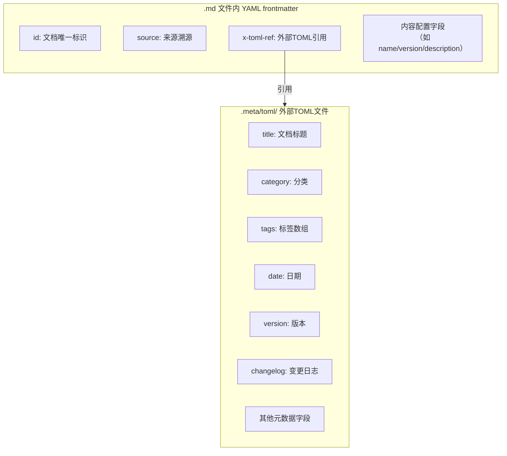

# 目的、适用范围与基本规则

## 目的

统一项目中所有 Markdown 文档的 frontmatter 元数据格式，确保：
- YAML frontmatter 简洁扁平，无多行缩进嵌套
- 复杂元数据（标签数组、变更日志等）通过 `x-toml-ref` 外部化存储
- AI 智能体和人类开发者遵循一致的元数据编写规范
- 元数据可被程序化工具（索引生成、链接检查、知识库构建）可靠解析


## 适用范围

项目内所有 Markdown 文档，包括但不限于：
- `docs/` 下的知识文档、学习资料、复盘报告
- `.agents/` 下的规则、角色定义、协议、模板
- `.trae/specs/` 下的 spec 文档（spec.md/tasks.md/checklist.md 使用自身格式，**不适用**本规范）


## 基本规则

### 1. 统一使用 YAML 格式

所有 Markdown 文档的 frontmatter 统一使用 **YAML 格式**，以 `---` 作为分隔符：

```yaml
---
id: "document-unique-id"
x-toml-ref: "../.meta/toml/path/to/file.toml"
---
```

**禁止**在新文件中使用 `+++` 包裹的 TOML frontmatter 格式。

### 2. 扁平结构，禁止多行缩进

YAML frontmatter 必须保持**扁平结构**，禁止使用多行缩进嵌套语法：

| 禁止写法 ❌ | 正确写法 ✅ |
|------------|-----------|
| 多行数组缩进（`tags:\n  - "tag1"\n  - "tag2"`） | 内联数组（`tags: ["tag1", "tag2"]`）移至 TOML |
| 嵌套对象（`config:\n  key: value`） | 扁平字段或移至 TOML |
| 多行字符串（`changelog: |\n  line1\n  line2`） | 移至 TOML 文件 |

### 3. YAML 与 TOML 职责分离

采用 "YAML 存核心标识，TOML 存完整元数据" 的分层策略：



**字段合并规则**：YAML frontmatter 中的字段**优先于**外部 TOML 文件的同名字段。核心标识字段保留在 YAML 中，复杂/描述性元数据存储在外部 TOML。


---

## 相关模式

- - [硬编码识别标准](../identification-standards.md)
- - [派生产物溯源脚本](../../scripts/check-source-traceability.py)
- - [半结构化解析复杂度预算](../../../docs/retrospective/patterns/methodology-patterns/tools-automation/semi-structured-parsing-complexity-budget.md)

**[返回索引](../frontmatter-metadata-standard.md)** | 下一章 → [YAML frontmatter 字段规范](02-yaml-fields.md)
