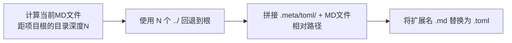

# TOML 外部元数据规范


### 文件位置

所有 TOML 元数据文件存放在 `.meta/toml/` 目录下，路径镜像 Markdown 文件的项目内路径：

| Markdown 文件 | TOML 元数据文件 |
|---|---|
| `.agents/rules/example.md` | `.meta/toml/.agents/rules/example.toml` |
| `docs/knowledge/learning/guide/01-syntax.md` | `.meta/toml/docs/knowledge/learning/guide/01-syntax.toml` |
| `docs/retrospective/reports/standards-tools/analysis/report.md` | `.meta/toml/docs/retrospective/reports/standards-tools/analysis/report.toml` |

### x-toml-ref 路径计算

`x-toml-ref` 路径是从 Markdown 文件所在目录到 TOML 文件的**相对路径**：



**深度参考表**：

| MD 文件位置 | 距根深度 | x-toml-ref 前缀 |
|---|---|---|
| 项目根目录（`AGENTS.md`） | 0 | `.meta/toml/` |
| `.agents/rules/` | 2 | `../../.meta/toml/` |
| `docs/` | 1 | `../.meta/toml/` |
| `docs/knowledge/learning/` | 3 | `../../../.meta/toml/` |
| `docs/knowledge/learning/guide/` | 4 | `../../../../.meta/toml/` |
| `docs/knowledge/learning/guide/examples/` | 5 | `../../../../../.meta/toml/` |
| `docs/knowledge/learning/guide/examples/poc/` | 6 | `../../../../../../.meta/toml/` |
| `docs/retrospective/reports/` | 3 | `../../../.meta/toml/` |
| `docs/retrospective/reports/category/topic/` | 5 | `../../../../../.meta/toml/` |

### TOML 字段规范

**必填字段**：
- `title`：文档标题（字符串）
- `category`：分类（字符串，如 `"learning"`、`"standards-tools"`、`"rules"`）

**推荐字段**：
- `tags`：标签数组（`["tag1", "tag2"]`，使用 TOML 内联数组或多行数组均可）
- `date`：创建/更新日期（`"YYYY-MM-DD"` 格式）
- `version`：版本号（字符串，如 `"1.0"`、`"1.2.0"`）
- `source`：来源（与 YAML 中 source 一致）

**可选字段**：
- `status`：状态（`"draft"`、`"stable"`、`"deprecated"`）
- `part_of`：所属集合/系列（字符串）
- `summary`：摘要描述
- `changelog`：变更日志（字符串数组，每条格式 `"YYYY-MM-DD | type | description"`）
- `author`：作者（空字符串表示未指定）

### TOML 示例

```toml
title = "核心概念适配性分析"
category = "standards-tools"
tags = ["myst", "myst-nb", "directives", "roles", "agentspec"]
date = "2026-07-02"
version = "1.2.0"
source = "report.md#2-核心概念适配性分析 + MyST-NB可执行notebook能力分析"
part_of = "myst-to-agentspec-migration-analysis"
changelog = [
  "2026-07-02 | initial | 初始版本",
  "2026-07-02 | expanded | 新增MyST-NB分析"
]
```


---

## 相关模式

- - [硬编码识别标准](../identification-standards.md)
- - [派生产物溯源脚本](../../scripts/check-source-traceability.py)
- - [半结构化解析复杂度预算](../../../docs/retrospective/patterns/methodology-patterns/tools-automation/semi-structured-parsing-complexity-budget.md)

← 上一章: [YAML frontmatter 字段规范](02-yaml-fields.md) | **[返回索引](../frontmatter-metadata-standard.md)** | 下一章 → [文档类型模板与常见错误修复](04-templates-errors.md)
