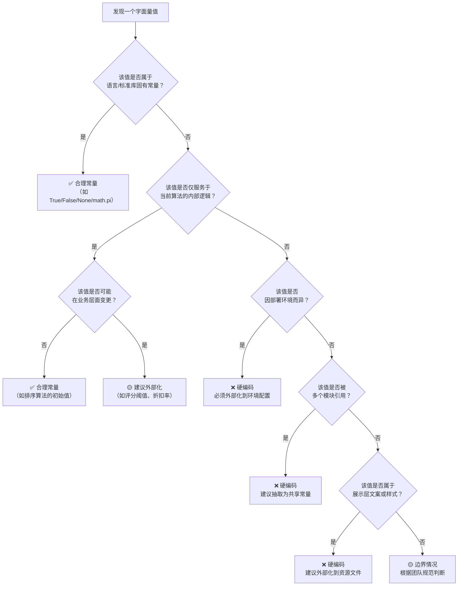

# 硬编码识别标准

## 规范说明

本规范定义硬编码（Hard-coding）的识别标准，为代码审查者和开发者提供统一的判断依据。硬编码是指将本应外部化管理的数值、字符串、路径、配置等直接写入代码逻辑中的做法。其核心危害在于：当这些值需要变更时，必须修改源代码并重新编译或部署，降低了系统的可维护性和灵活性。

本规范的适用范围包括但不限于：

- 日常开发中的自我检查
- 代码审查（Code Review）时的质量评估
- 自动化静态分析工具的规则定义
- 重构决策中的优先级排序

## 分类定义表

以下 8 大类硬编码按标识码、典型表现形式及风险等级进行概要划分：

| 类别 | 标识 | 典型形式 | 风险等级 |
|---|---|---|---|
| 固定字符串 | `HARD-STR` | 错误消息、日志文本、UI 标签、提示信息、消息模板 | 中 |
| 固定数值 | `HARD-NUM` | 业务阈值、超时时间、分页大小、权重系数、金额 | 高 |
| 固定路径 | `HARD-PATH` | 文件路径、目录路径、资源路径、临时目录 | 高 |
| 固定 URL/端点 | `HARD-URL` | API 地址、第三方服务地址、回调地址、OAuth 端点 | 高 |
| 固定编码值 | `HARD-ENC` | 字符编码标识、MIME 类型标识、协议版本号 | 低 |
| 固定正则模式 | `HARD-REGEX` | 正则表达式字面量、模式匹配字符串 | 中 |
| 固定颜色/样式 | `HARD-STYLE` | CSS 颜色值、字体大小、间距、边框样式 | 中 |
| 固定配置参数 | `HARD-CFG` | 连接池大小、线程数、重试次数、缓存过期时间 | 高 |

## 各类别详细说明

### 固定字符串（HARD-STR）

**定义**：直接在代码中以字面量形式出现的文本字符串，包括但不限于错误消息、日志输出内容、用户界面标签、提示文本、通知模板等。此类字符串通常应通过消息字典、国际化（i18n）资源文件或配置中心管理。

**正例（应避免的写法）**：

```python
# ❌ 错误：错误消息硬编码在代码中
raise ValueError("配置文件格式不正确，请检查 YAML 语法")

# ❌ 错误：日志文本硬编码
logger.info("用户登录成功，开始加载个人数据")

# ❌ 错误：UI 标签硬编码
return {"label": "请输入您的用户名"}
```

**反例（推荐写法）**：

```python
# ✅ 正确：错误消息外部化到消息字典
from .messages import ERROR_MSGS
raise ValueError(ERROR_MSGS["config_format_invalid"])

# ✅ 正确：日志消息通过消息模板管理
logger.info(MSG_TEMPLATES["user_login_success"])

# ✅ 正确：UI 标签通过 i18n 资源加载
return {"label": t("input.username.placeholder")}
```

**检测要点**：

- 函数调用中直接出现的非变量中文字符串或完整英文句子
- `raise`、`print`、`log`、`logger.info` 等语句中直接写死的文本
- 字典或 JSON 结构中写死的面向用户的文本内容
- 排除：日志中的变量插值占位符（如 `f"user_id={uid}"`）属于数据拼接，不属于此类

---

### 固定数值（HARD-NUM）

**定义**：在代码中直接以数字字面量形式出现的业务相关数值，包括业务规则阈值、超时时间、分页大小、权重系数、折扣率、手续费比例等。此类数值通常随业务需求变化，应抽取为配置项。

**正例（应避免的写法）**：

```python
# ❌ 错误：业务阈值硬编码
if score < 60:
    return "不合格"

# ❌ 错误：超时时间硬编码
response = requests.get(url, timeout=30)

# ❌ 错误：分页大小硬编码
items = query.limit(20).all()
```

**反例（推荐写法）**：

```python
# ✅ 正确：业务阈值从配置读取
if score < config.PASS_THRESHOLD:
    return "不合格"

# ✅ 正确：超时时间从配置读取
response = requests.get(url, timeout=config.HTTP_TIMEOUT)

# ✅ 正确：分页大小从配置读取
items = query.limit(config.PAGE_SIZE).all()
```

**检测要点**：

- 在比较运算符（`<`、`>`、`==`、`!=`）或函数参数中出现的非零整数/浮点数
- 排除：数组索引 `0`、`-1`，循环计数器 `i=0`，偏移量等逻辑控制数值
- 排除：数学或物理常量（如 `math.pi`、`gravitational_constant`）

---

### 固定路径（HARD-PATH）

**定义**：在代码中以字符串字面量形式直接写死的文件系统路径、目录路径或资源路径。此类路径通常因部署环境（开发/测试/生产）、操作系统或目录布局而异，应通过环境变量或配置中心管理。

**正例（应避免的写法）**：

```python
# ❌ 错误：文件路径硬编码（且针对性适配某个操作系统）
with open("/etc/app/config.yaml", "r") as f:
    cfg = yaml.safe_load(f)

# ❌ 错误：日志目录硬编码
LOG_DIR = "./logs"

# ❌ 错误：资源路径硬编码
TEMPLATE_PATH = "templates/email/welcome.html"
```

**反例（推荐写法）**：

```python
# ✅ 正确：路径通过环境变量读取
import os
cfg_path = os.environ.get("APP_CONFIG_PATH", "/etc/app/config.yaml")
with open(cfg_path, "r") as f:
    cfg = yaml.safe_load(f)

# ✅ 正确：路径通过配置对象读取
LOG_DIR = config.LOG_DIR

# ✅ 正确：使用 pathlib 构建跨平台路径，根路径来自配置
from pathlib import Path
TEMPLATE_PATH = Path(config.RESOURCE_ROOT) / "email" / "welcome.html"
```

**检测要点**：

- 字符串中出现的 `/` 或 `\` 路径分隔符
- 文件扩展名联合路径字符串（如 `.yaml`、`.json`、`.log`、`.html`）
- 排除：Python 模块导入路径（`import` 语句），其属于语言机制
- 排除：`os.path.join` 中作为拼接片段的纯目录名（若根路径来自外部）

---

### 固定 URL/端点（HARD-URL）

**定义**：在代码中以字符串字面量形式直接写死的 HTTP/HTTPS 地址、API 端点、第三方服务回调地址、OAuth 授权端点等。此类地址因运行环境（开发/测试/生产）、服务迁移或版本升级而频繁变化。

**正例（应避免的写法）**：

```python
# ❌ 错误：API 端点硬编码
response = requests.post("https://api.example.com/v1/users", json=data)

# ❌ 错误：OAuth 端点硬编码
OAUTH_URL = "https://auth.example.com/oauth/authorize"

# ❌ 错误：回调地址硬编码
CALLBACK_URL = "https://myapp.com/callback"
```

**反例（推荐写法）**：

```python
# ✅ 正确：端点从配置读取，支持环境切换
response = requests.post(
    f"{config.API_BASE_URL}/v1/users",
    json=data
)

# ✅ 正确：OAuth 端点通过服务发现或配置管理
OAUTH_URL = config.OAUTH_AUTHORIZE_ENDPOINT

# ✅ 正确：回调地址动态构建
CALLBACK_URL = f"{config.BASE_URL}/callback"
```

**检测要点**：

- 以 `http://` 或 `https://` 开头的字符串字面量
- 包含域名或 IP 地址的字符串
- 排除：代码注释中的示例 URL
- 排除：测试代码中的 mock 地址（如 `http://localhost:8000` 或 `http://127.0.0.1`）

---

### 固定编码值（HARD-ENC）

**定义**：在代码中直接写死的字符编码标识、媒体类型（MIME Type）、协议标识等标准编码常量。此类值虽变更频率较低，但为了统一管理和避免拼写错误，建议通过常量库引用。

**正例（应避免的写法）**：

```python
# ❌ 错误：编码字符串硬编码
content = data.encode("utf-8")

# ❌ 错误：MIME 类型硬编码
headers = {"Content-Type": "application/json; charset=utf-8"}

# ❌ 错误：协议标识硬编码
version = "HTTP/1.1"
```

**反例（推荐写法）**：

```python
# ✅ 正确：使用标准库或自定义常量
from .constants import ENCODING_UTF8, MIME_JSON, HTTP_VERSION_11
content = data.encode(ENCODING_UTF8)
headers = {"Content-Type": f"{MIME_JSON}; charset={ENCODING_UTF8}"}
version = HTTP_VERSION_11
```

**检测要点**：

- 字符串参数中出现编码名称（如 `"utf-8"`、`"latin-1"`）
- 字符串中出现 MIME 类型格式（`"type/subtype"`）
- 注：此类硬编码风险较低，审查时可放宽处理，但建议在项目层面统一收口为常量

---

### 固定正则模式（HARD-REGEX）

**定义**：在代码中直接以正则表达式字面量或模式字符串形式出现的匹配规则，如邮箱验证、手机号校验、身份证号校验等。此类模式可能随业务规则调整而变化，且复杂正则难以维护和理解。

**正例（应避免的写法）**：

```python
# ❌ 错误：正则表达式直接写死在函数中
import re

def is_valid_email(email: str) -> bool:
    return bool(re.match(r"^[a-zA-Z0-9._%+-]+@[a-zA-Z0-9.-]+\.[a-zA-Z]{2,}$", email))

# ❌ 错误：正则模式作为字符串硬编码
phone_pattern = r"^1[3-9]\d{9}$"
```

**反例（推荐写法）**：

```python
# ✅ 正确：正则模式集中管理在常量模块
from .patterns import EMAIL_PATTERN
import re

def is_valid_email(email: str) -> bool:
    return bool(re.match(EMAIL_PATTERN, email))

# ✅ 正确：通过校验规则配置文件管理
from .validators import match_rule
match_rule("phone", value)
```

**检测要点**：

- `re.match`、`re.search`、`re.findall`、`re.compile` 的第一个参数是字符串字面量
- 变量赋值右侧为正则字符串字面量（以 `r"` 开头）
- 排除：简单的分隔符正则（如 `r"\s+"`、`r","`），属于通用数据处理逻辑

---

### 固定颜色/样式（HARD-STYLE）

**定义**：在代码中直接写死的视觉样式值，包括 CSS 颜色值（十六进制、RGB）、字体大小、边距、间距、边框样式等。此类值通常应与设计系统（Design System）或主题变量绑定。

**正例（应避免的写法）**：

```python
# ❌ 错误：颜色值硬编码
button_style = {"background-color": "#1890ff", "font-size": "14px"}

# ❌ 错误：间距硬编码
layout = {"padding": "24px", "margin": "16px"}

# ❌ 错误：尺寸硬编码
component_size = {"width": 320, "height": 240}
```

**反例（推荐写法）**：

```python
# ✅ 正确：引用设计令牌（Design Token）
from .tokens import Color, Spacing, FontSize
button_style = {"background-color": Color.PRIMARY, "font-size": FontSize.BASE}

# ✅ 正确：从主题配置读取
layout = {"padding": theme.SPACING_LG, "margin": theme.SPACING_MD}

# ✅ 正确：组件尺寸从预设常量读取
from .constants import DIALOG_SIZES
component_size = DIALOG_SIZES["medium"]
```

**检测要点**：

- 字符串中出现 `#` 开头的十六进制颜色值或 `rgb(` 函数
- 字符串中出现 `px`、`em`、`rem` 等 CSS 单位且无变量引用
- 整数值用于表示像素尺寸且无上下文关联

---

### 固定配置参数（HARD-CFG）

**定义**：在代码中直接写死的系统运行参数，包括数据库连接池大小、线程池大小、重试次数、缓存过期时间、队列容量、批量处理大小等。此类参数的调优依赖具体硬件资源和业务负载，必须在运行时灵活调整。

**正例（应避免的写法）**：

```python
# ❌ 错误：连接池大小硬编码
pool = ConnectionPool(max_connections=10)

# ❌ 错误：重试次数硬编码
@retry(stop_max_attempt_number=3)
def send_message(msg):
    ...

# ❌ 错误：缓存过期时间硬编码
cache.set(key, value, expire=3600)
```

**反例（推荐写法）**：

```python
# ✅ 正确：连接池大小从配置读取
pool = ConnectionPool(max_connections=config.DB_POOL_SIZE)

# ✅ 正确：重试次数从配置读取
@retry(stop_max_attempt_number=config.RETRY_MAX_ATTEMPTS)
def send_message(msg):
    ...

# ✅ 正确：缓存过期时间从配置读取
cache.set(key, value, expire=config.CACHE_TTL_SECONDS)
```

**检测要点**：

- 函数参数中代表容量、次数、时长的非零整数/浮点数
- `time.sleep()`、`cache.set(..., expire=N)`、`max_workers=N` 等参数
- 排除：`0`、`1`、`-1` 等表示"禁用/启用/无限"的哨兵值

## 区分标准与边界判断

### 判断原则

硬编码的本质不是"代码中出现了字面量"，而是"本应外部化管理的值被写死在代码中"。核心判断标准如下：

| 维度 | 合理常量 | 硬编码 |
|---|---|---|
| **变更频率** | 极少变更，属于固有规则 | 可能随需求、环境、配置而频繁变更 |
| **作用域** | 仅作用于当前代码逻辑 | 跨越模块、环境、部署实例 |
| **语义属性** | 表达算法或逻辑的固有属性 | 表达外部业务规则或运行参数 |
| **环境依赖** | 不依赖部署环境 | 因环境（开发/测试/生产）而异 |
| **可配置意愿** | 无外部化管理的必要 | 有明显的配置化管理诉求 |

### 决策流程



### 属于"合理常量"的典型场景

以下场景中的字面量属于合理常量，无需外部化管理：

| 场景 | 示例 | 理由 |
|---|---|---|
| 数学常量 | `math.pi`、`math.e` | 属于数学定理，永不变化 |
| HTTP 状态码 | `200`、`301`、`404`、`500` | 属于 HTTP 协议规范，为通用知识 |
| MIME 类型 | `"application/json"`、`"text/html"` | 属于 IANA 标准，项目中建议通过常量库引用以避免拼写错误 |
| 字符编码 | `"utf-8"`、`"ascii"` | 属于编码标准，建议通过常量库统一引用 |
| 控制流哨兵值 | `0`、`1`、`-1`、`None` | 表示逻辑条件的极值，属于算法本身 |
| 空集合/空字符串 | `""`、`[]`、`{}`、`set()` | 表示空值，属于程序逻辑 |
| Python 内置常量 | `True`、`False`、`None` | 属于语言本身 |
| 单位进制 | `1024`（1KB）、`3600`（1 小时秒数） | 属于计量标准，永不变化 |

## 检查清单

代码审查时，以下清单用于快速判断是否存在硬编码问题：

| 序号 | 检查项 | 判定标准 |
|---|---|---|
| 1 | 是否存在写死的字符串消息或标签？ | `Ctrl+F` 搜索中文或完整英文句子在非注释代码中的出现位置 |
| 2 | 是否存在写死的业务数值（阈值、金额、比例）？ | 审查条件语句与函数参数中的非零数字字面量 |
| 3 | 是否存在写死的文件系统路径？ | 检查字符串中是否包含 `/`、`\` 与文件扩展名 |
| 4 | 是否存在写死的 HTTP/HTTPS 地址？ | 检查字符串中是否以 `http://` 或 `https://` 开头 |
| 5 | 是否存在写死的正则表达式？ | 检查 `re.match`、`re.search`、`re.compile` 的参数 |
| 6 | 是否存在写死的颜色值或 CSS 样式？ | 检查 `#` 开头的颜色值或含 `px`/`em` 的样式字符串 |
| 7 | 是否存在写死的运行参数（超时、重试、缓存时间）？ | 审查网络调用、缓存操作、线程池等参数 |
| 8 | 每个已确认的字面量是否通过了"合理常量"判定？ | 对照上一节的判断流程图与合理常量表格 |

审查者应在审查报告中标注每个硬编码实例的类别标识（如 `HARD-NUM`），以便开发者精准定位并根据对应的推荐写法进行重构。
