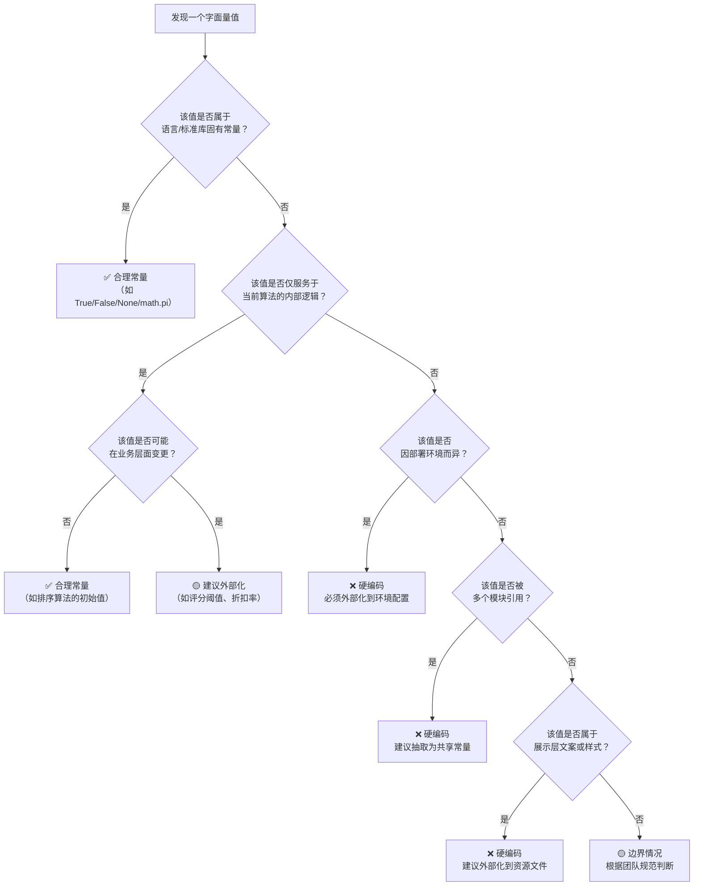

# 硬编码识别标准：区分标准与边界判断

## 判断原则

硬编码的本质不是"代码中出现了字面量"，而是"本应外部化管理的值被写死在代码中"。核心判断标准如下：

| 维度 | 合理常量 | 硬编码 |
|---|---|---|
| **变更频率** | 极少变更，属于固有规则 | 可能随需求、环境、配置而频繁变更 |
| **作用域** | 仅作用于当前代码逻辑 | 跨越模块、环境、部署实例 |
| **语义属性** | 表达算法或逻辑的固有属性 | 表达外部业务规则或运行参数 |
| **环境依赖** | 不依赖部署环境 | 因环境（开发/测试/生产）而异 |
| **可配置意愿** | 无外部化管理的必要 | 有明显的配置化管理诉求 |

## 决策流程

## 属于"合理常量"的典型场景

以下场景中的字面量属于合理常量，无需外部化管理：

| 场景 | 示例 | 理由 |
|---|---|---|
| 数学常量 | `math.pi`、`math.e` | 属于数学定理，永不变化 |
| HTTP 状态码 | `200`、`301`、`404`、`500` | 属于 HTTP 协议规范，为通用知识 |
| MIME 类型 | `"application/json"`、`"text/html"` | 属于 IANA 标准，项目中建议通过常量库引用以避免拼写错误 |
| 字符编码 | `"utf-8"`、`"ascii"` | 属于编码标准，建议通过常量库统一引用 |
| 控制流哨兵值 | `0`、`1`、`-1`、`None` | 表示逻辑条件的极值，属于算法本身 |
| 空集合/空字符串 | `""`、`[]`、`{}`、`set()` | 表示空值，属于程序逻辑 |
| Python 内置常量 | `True`、`False`、`None` | 属于语言本身 |
| 单位进制 | `1024`（1KB）、`3600`（1 小时秒数） | 属于计量标准，永不变化 |
← 上一章: [05 类别详解：样式/配置](05-categories-style-cfg.md) | **[返回索引](../identification-standards.md)** | 下一章 → [07 检查清单](07-checklist.md)
