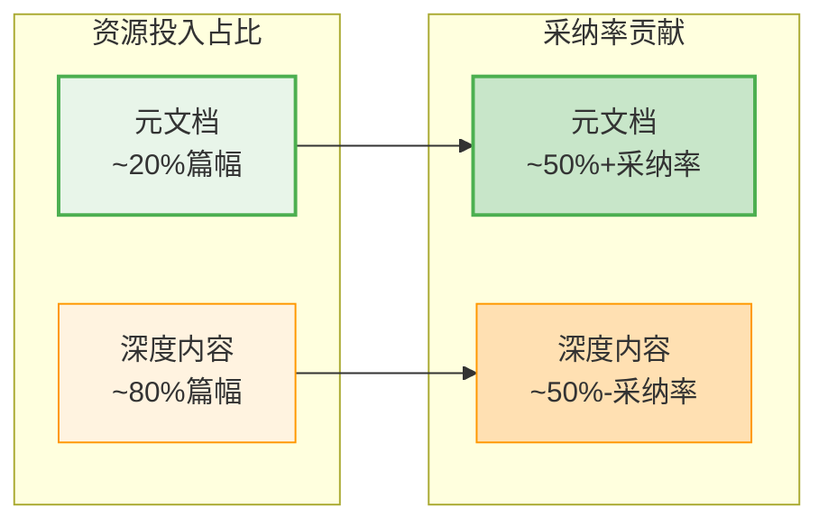

# 元文档优先原则：高ROI资源分配策略

> 元文档篇幅占比<20%，但对采纳率贡献>50%。资源有限时，优先投资元文档。

---

## 一、原则概述

在文档体系建设、知识库构建、API设计、产品入门体验等场景中，存在一类特殊的文档——**元文档**（描述文档的文档）：它们不直接描述"功能是什么"，而是描述"如何找到、理解、使用功能"。

元文档具有极高的投资回报率（ROI）：用不到20%的篇幅，贡献超过50%的采纳率。当资源（时间、精力、篇幅）有限时，必须优先优化元文档，而非深化深度内容。

**核心量化验证**（来自SpecWeave 13天实践）：
- Skills体系L1门面化后，认知负担大幅降低
- README原子化拆分后，可发现性显著提升
- learning目录建立CATEGORIES.md导航后，导航效率提升
- AGENTS.md精简为~70行入口后，新智能体启动速度提升



---

## 二、什么是元文档？

### 元文档的定义

```
元文档 = 不直接描述具体功能/内容，而是描述"如何找到、理解、导航、使用内容"的文档
```

### 元文档的层级分类

| 层级 | 类型 | 示例 | 读者接触率 | 篇幅占比目标 |
|------|------|------|-----------|-------------|
| **L0 入口层** | 项目/模块入口文档 | README.md、AGENTS.md、ONBOARDING.md | 100%（第一接触点） | <100行 |
| **L1 索引层** | 导航、目录、决策树、注册表 | CATEGORIES.md、README索引、capability-registry.md、Skill L1门面 | 60-80% | <500行 |
| **L2 门面层** | 模块概览、快速开始、使用指南 | 模块README、快速开始、How-to | 20-40% | 按需 |
| **L3 深度内容** | API文档、详细规范、源码注释 | 具体规范、API参考、实现细节 | 5-15% | 按需 |

### 元文档 vs 深度内容

| 维度 | 元文档 | 深度内容 |
|------|--------|---------|
| **回答的问题** | "这是什么？我需要读哪个？从哪开始？" | "具体怎么实现？参数是什么？细节是什么？" |
| **读者** | 所有人（新读者/老用户/智能体） | 有明确需求的深度用户 |
| **更新频率** | 低（结构稳定后很少变） | 高（随功能迭代频繁更新） |
| **价值体现** | 决定读者是否留下来深入阅读 | 解决读者的具体问题 |
| **典型反例** | 入口文档300+行充满技术细节 | 深度文档里夹杂导航说明 |

---

## 三、判断标准与量化指标

### 3.1 强制判断标准（满足任一即优先优化元文档）

| 判断条件 | 触发动作 | 阈值 |
|---------|---------|------|
| 入口文档行数超标 | **必须精简入口**，将内容迁移到L2/L3 | AGENTS.md > 100行；L0入口文档 > 100行 |
| Skill L1门面行数超标 | **必须拆分L1门面**，将细节迁移到L2 | Skill SKILL.md > 500行 |
| 新增模块/主题 | **必须先更新索引**，再写深度内容 | 新增任何模块时先更新对应README/CATEGORIES |
| 新读者反馈"找不到东西" | **立即优化导航结构**，而非添加更多内容 | 有1次反馈即触发 |
| 目录下文件>10个但无README索引 | **必须补建索引文档** | 文件数>10个必须有README |

### 3.2 量化指标体系

| 指标 | 目标值 | 测量方式 |
|------|--------|---------|
| **L0入口文档行数** | < 100行 | wc -l统计 |
| **Skill L1门面行数** | < 500行 | wc -l统计 |
| **元文档篇幅占比** | < 20% | 元文档总行数 / 文档总行数 |
| **导航覆盖率** | 100% | 所有L2+文档都能通过<3次点击从入口到达 |
| **新读者上手时间** | < 3分钟 | 从接触入口到找到目标文档的时间 |

---

## 四、实施指南

### 4.1 文档创建/更新优先级决策树

```
有时间写文档/优化内容？
├─ 是新建模块/主题？
│  └─ 是 → 1. 更新父目录README索引 → 2. 创建模块README入口 → 3. 再写深度内容
├─ 入口文档是否超过行数阈值？
│  └─ 是 → 优先精简入口（拆分内容到L2/L3），不要加新内容
├─ 导航是否完整？能不能<3次点击到达所有内容？
│  └─ 否 → 完善导航结构和决策树
└─ 以上都满足？
   └─ 可以深化L2/L3内容
```

### 4.2 入口文档精简操作流程

当入口文档（README.md/AGENTS.md）超过行数阈值时，按以下流程精简：

1. **识别深度内容块**：标记入口文档中包含技术细节、具体命令、长表格的内容块
2. **分类迁移**：
   - 技术实现细节 → 迁移到 `.agents/systems/` 或对应模块文档
   - 完整参数说明 → 迁移到L2参考文档
   - 大表格/长列表 → 提取为独立的索引/清单文档
3. **替换为摘要+链接**：入口文档中用1-2句话摘要 + "详见XXX"链接替换原内容块
4. **验证导航完整性**：确保从入口出发能通过链接到达所有迁出内容

### 4.3 元文档建设检查清单

- [ ] **入口层**：是否有<100行的L0入口文档，3分钟内能理解项目全貌？
- [ ] **索引层**：每个目录下>10个文件是否有README索引？
- [ ] **决策树**：新读者是否有决策树/路由表快速定位目标文档？
- [ ] **导航链**：是否存在从L0→L1→L2→L3的递进式导航链？
- [ ] **门面约束**：所有Skill L1门面是否<500行？
- [ ] **链接完整**：从入口出发能否<3次点击到达所有内容？
- [ ] **没有反模式**：元文档中是否没有深度技术细节？深度文档中是否没有重复导航说明？

---

## 五、反模式识别

### 反模式1："深度内容优先"

**表现**：一上来就写详细的API文档、实现细节、技术规范，但入口文档只有3行或根本没有。

**为什么是反模式**：
- 读者连"这是什么、能解决什么问题"都不知道，不会去读深度内容
- 缺乏导航结构，写出来的深度内容无法被发现
- 写完后发现"没人读"，浪费投入

**纠正**：先写入口文档和索引，确保读者能找到你的内容，再深化内容。

### 反模式2："入口文档膨胀"

**表现**：AGENTS.md/README.md越写越长，把所有细节都堆在入口，行数超过500行甚至1000行。

**为什么是反模式**：
- 新读者看到300+行的入口直接被吓跑，采纳率骤降
- 入口文档每次修改都要滚动很久，维护成本高
- 违反"渐进式披露"原则——一次性给读者太多信息等于没给信息

**纠正**：入口文档严格控制行数，把细节迁移到L2文档，入口只放摘要+链接。

### 反模式3："新增内容不更新索引"

**表现**：新建了10个Wiki教程、5个模式文档，但没有更新父目录的README和CATEGORIES索引。

**为什么是反模式**：
- 新内容成为"信息孤岛"——除了创建者没人知道它们存在
- 下次写类似内容时重复建设，因为不知道已有内容
- 导航覆盖率下降，<3次点击到达率降低

**纠正**：新增任何模块/内容，第一步就是更新索引，最后一步也是验证索引链接正确。

### 反模式4："元文档里放深度内容"

**表现**：在README.md里写完整的API参数说明、完整的配置选项列表、详细的实现步骤。

**为什么是反模式**：
- 入口文档膨胀（违反反模式2）
- 读者需要在一堆导航信息里找具体内容
- 深度内容更新时容易忘记同步入口中的副本

**纠正**：元文档只回答"这是什么/去哪找"，具体内容放到L2/L3深度文档中，元文档只放链接。

---

## 六、与现有模式/规范的关系

- [meta-document-leverage.md](../docs/retrospective/patterns/methodology-patterns/document-architecture/meta-document-leverage.md)：元文档杠杆效应模式文档（已升级为L3），本原则是其操作化规则
- [entry-container-separation.md](../docs/retrospective/patterns/methodology-patterns/document-architecture/entry-container-separation.md)：入口-容器分离原则，本原则是其"入口精简"的量化标准
- [progressive-context-disclosure.md](../docs/retrospective/patterns/methodology-patterns/ai-collaboration/progressive-context-disclosure.md)：渐进式上下文披露，元文档分层是其在文档体系的应用
- [three-stage-universal-principle.md](three-stage-universal-principle.md)：三阶段普遍规律，知识库建设"生成→重组→精确化"的第二阶段"重组"主要就是建设元文档索引
- [global-core-rules.md](../global-core-rules.md)：本原则作为全局核心规则之一被引用

---

## 七、Changelog

<!-- changelog -->
- 2026-07-05 | docs | 初始版本，基于SpecWeave 13天全生命周期复盘认知升级#5和元文档杠杆效应量化验证创建
