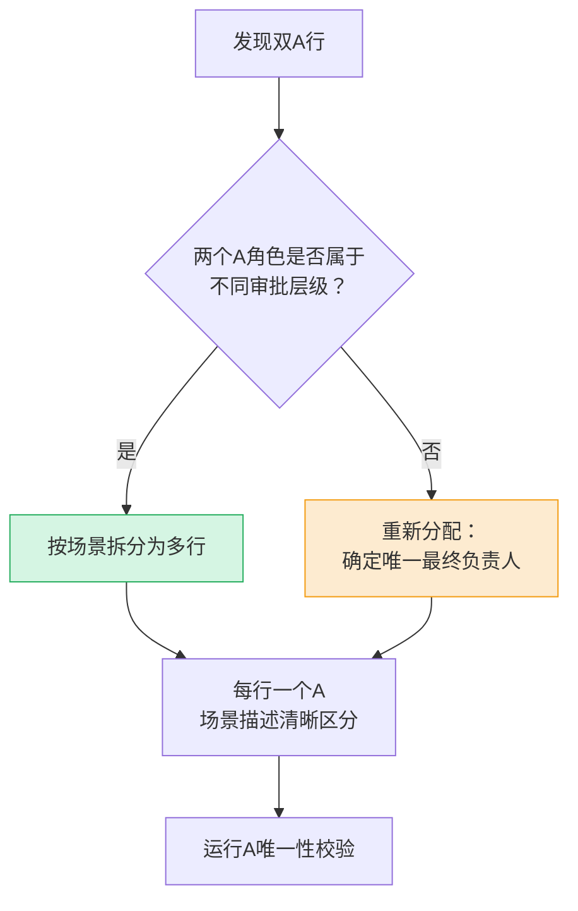
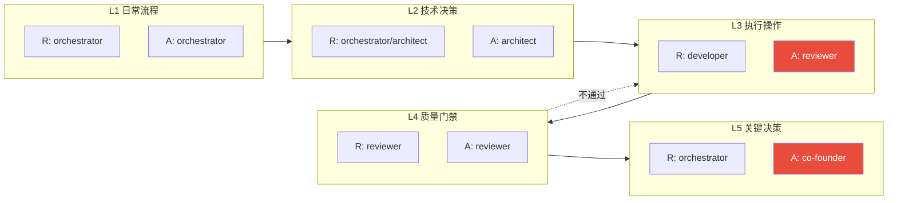

+++
id = "raci-governance-standards"
type = "standard"
category = "governance"
maturity = "L1"
source = "docs/retrospective/reports/project-governance/process-and-compliance/retrospective-raci-governance-matrix-20260629/"
created = "2026-06-29"
verified_count = 69

[bindings]
rules = [
    ".agents/commands/retrospective.md",
    ".agents/commands/insight.md",
    ".agents/commands/export-report.md",
    ".agents/commands/atomization.md",
    ".agents/commands/atomic-commit.md",
    ".agents/rules/data-security/role-responsibilities.md"
]
references = [
    "role-minimization-principle.md",
    "five-layer-governance-architecture.md",
    "three-layer-rule-enforcement.md"
]
scripts = [".agents/scripts/check-raci-compliance.py"]
+++

# RACI 治理规范与模板

> **适用范围**：所有治理流程文档、指令集、规则文档中的RACI责任分配矩阵编写
> **核心依据**：基于69行RACI实践验证，来自RACI治理矩阵落地复盘
> **强制等级**：规则级（违反将触发质量门禁拦截）

## 一、三大强制规则

### 规则1：A唯一性约束（A-Uniqueness）

**规则陈述**：RACI矩阵中**每项活动必须有且仅有一个A**（Accountable，最终审批者）。

**判定标准**：
- ✅ 合法：一行中有且仅有一个单元格含 `**A**` 或 `**R/A**`
- ❌ 违规：一行中无A（缺失最终负责人）
- ❌ 违规：一行中有两个或以上单元格含A（双A/多A冲突）
- ❌ 违规：A未加粗（`A` 而非 `**A**`，影响可读性和自动检测）

**双A冲突处理流程**：



**正例**：
```markdown
| 跨模块原子化审批（常规） | C | C | C | **A** | I | I |
| 跨模块原子化审批（重大架构调整） | C | C | I | R | I | **A** |
```

**反例**：
```markdown
| 跨模块原子化审批 | C | C | C | **A** | I | **A** |  <!-- ❌ 双A违规 -->
```

---

### 规则2：R≠A分离原则（R-A Separation）

**规则陈述**：**执行操作类活动必须遵循"执行者(R)≠审批者(A)"原则**，即R和A必须分配给不同角色，防止自我审批。

**适用活动类型**：
- 涉及实际代码/文件/配置修改的活动
- 产出物需要质量验收的活动
- 审批层级模型中的执行层

**标准模式**：

| 活动类型 | R角色 | A角色 | 说明 |
|---|---|---|---|
| 代码实现/文件修改/提交 | developer | reviewer | 执行→审批制衡 |
| 流程协调/数据采集/归档 | orchestrator | orchestrator | 日常流程类，orchestrator自理 |
| 方案设计/架构分析 | orchestrator/architect | architect | 技术决策类 |
| 质量验收/安全审计 | reviewer | reviewer | 质量门禁类，reviewer自理（见例外） |
| 重大审批/架构变更 | orchestrator | co-founder | 关键决策类 |

**例外条款**：reviewer独立执行的质量门禁类活动允许 `reviewer R/A`，须同时满足：
1. 活动不涉及修改产出物（仅检查、判断、审计）
2. reviewer本身就是质量门禁角色
3. 活动异常有明确的升级路径（至co-founder）

**正例**：
```markdown
| 代码实现 | I | C | **R** | **A** | I | I |  <!-- ✅ developer R, reviewer A -->
| 代码安全审查 | I | I | C | **R/A** | I | I |  <!-- ✅ reviewer自理（质量门禁例外） -->
```

**反例**（Layer 4修正前的教训）：
```markdown
| 执行操作层 | developer | developer | 代码实现...  <!-- ❌ R=A=developer，自我审批违规 -->
```

---

### 规则3：审批模型双列设计（Dual-Column Approval Design）

**规则陈述**：审批层级模型表格**必须使用双列设计**——"主要执行者(R)"+"最终审批者(A)"，禁止使用单列"审批角色"。

**设计原理**：单列"审批角色"无法区分"谁执行"和"谁审批"，天然导致R/A混淆和自我审批漏洞。双列设计将执行权和审批权显性分离。

**标准模板（五层审批模型）**：

| 层级 | 主要执行者 (R) | 最终审批者 (A) | 适用场景 |
|---|---|---|---|
| **L1 日常流程** | orchestrator | orchestrator | 流程触发、进度协调、范围确认、数据采集、归档通知 |
| **L2 技术决策** | orchestrator / architect | architect | 方案设计、源文件/架构分析、根因分析、趋势分析 |
| **L3 执行操作** | developer | reviewer | 代码实现、文件拆分、引用更新、格式转换、提交 |
| **L4 质量门禁** | reviewer | reviewer | 质量验收、常规审批、安全审计、预提交验证 |
| **L5 关键决策** | orchestrator | **co-founder** | 重大审批、架构变更、核心数据操作、紧急绕过 |

> **层级设计原则**：L1日常流程 → L2技术决策 → L3执行操作 → L4质量门禁 → L5关键决策，质量门禁必须在执行操作之后，形成"执行→验收"的流程闭环。

**反例**（修正前）：
```markdown
| 层级 | 审批角色 | 适用场景 |
|---|---|---|
| 执行操作 | developer | 代码实现...  <!-- ❌ R/A混淆，导致自我审批 -->
```

---

## 二、RACI矩阵编写模板

### 2.1 标准RACI矩阵模板

在编写新的治理流程/指令集/规则文档时，使用以下模板：

```markdown
## RACI责任分配矩阵

**RACI模型说明**：
- **R** = 负责执行（Responsible）：实际完成工作的角色，可多个
- **A** = 最终审批（Accountable）：对结果负最终责任，拥有最终决策权，每项活动有且仅有一个A
- C = 需咨询（Consulted）：决策前需征求意见、提供专业输入的角色，双向沟通
- I = 需知会（Informed）：决策后需告知进展与结果的角色，单向沟通

| [流程名称]核心活动 | orchestrator | architect | developer | reviewer | tester | co-founder |
|:---|:---:|:---:|:---:|:---:|:---:|:---:|
| 活动1（替换为实际活动） | **R/A** | C | I | C | I | I |
| 活动2 | C | **R** | C | **A** | I | I |
| 活动3（执行类） | I | C | **R** | **A** | I | I |
| 活动4（质量门禁类） | C | C | I | **R/A** | I | I |
| ... | ... | ... | ... | ... | ... | ... |
| 重大场景审批（如有） | R | C | I | C | I | **A** |

### 审批权限边界

- **常规场景**：[说明常规审批路径，如reviewer审批]
- **重大/敏感场景**：[说明升级路径，如co-founder最终审批]
- **R/A分配原则**：[如R≠A分离的例外说明]
```

### 2.2 活动行编写规范

| 规范项 | 要求 | 说明 |
|--------|------|------|
| A加粗 | `**A**` 或 `**R/A**` | 必须加粗，便于视觉识别和自动检测 |
| R加粗 | `**R**` 或 `**R/A**` | 执行者加粗，C/I不加粗 |
| 场景拆分 | 常规/重大场景分两行 | 避免双A冲突 |
| 活动命名 | 动词开头，简洁明确 | 如"事实数据收集"而非"步骤1" |
| 活动数量 | 8-12行 | 覆盖核心活动，避免过度拆分 |

### 2.3 角色R/A分配速查表

| 角色 | 典型R场景 | 典型A场景 | 禁止A场景 |
|------|----------|----------|----------|
| orchestrator | 流程触发、协调、采集、归档 | 日常流程自理类 | 执行操作类（developer R时） |
| architect | 方案设计、架构分析、技术评审 | 技术决策类 | 质量验收类（reviewer专属） |
| developer | 代码实现、文件修改、提交 | 无（developer仅执行，不自审） | 所有A（必须由reviewer审批） |
| reviewer | 质量验收、安全审计、常规审批 | 质量门禁类、常规审批类 | —（reviewer是A的主要承担者） |
| tester | 测试用例编写、测试执行 | 测试活动自理类 | 非测试领域审批 |
| co-founder | 重大决策发起 | 关键决策类（L5） | 常规活动（不应过度审批） |

---

## 三、五层审批模型模板

在设计新流程的审批层级时，基于以下五层模型扩展：



**审批升级路径**：
- 常规流程：按L1→L2→L3→L4逐层推进，L4质量门禁不通过则打回L3
- 关键决策：任何层级发现涉及重大架构/核心数据/敏感操作，升级至L5 co-founder审批
- 紧急绕过：紧急情况下可申请co-founder直接审批（须记录原因，事后复盘）

---

## 四、质量验证Checklist

在完成RACI矩阵编写后，逐项检查：

### 格式检查
- [ ] 所有A角色均已加粗（`**A**`）
- [ ] 所有R角色均已加粗（`**R**`）
- [ ] RACI表头包含全部6个角色列
- [ ] 列对齐正确，无多余/缺失的 `|` 分隔符

### 规则合规检查
- [ ] 每行有且仅有一个A角色
- [ ] 不存在双A/多A行（已按场景拆分）
- [ ] 执行操作类活动满足R≠A（developer R → reviewer A）
- [ ] reviewer R/A的行均属于质量门禁类活动（满足例外三条件）
- [ ] co-founder作为A仅限于重大/关键场景（非过度审批）

### 一致性检查
- [ ] 同类活动的A角色与其他流程文档一致（如质量验收统一为reviewer A）
- [ ] 审批层级与五层模型对齐（L1-L5）
- [ ] 审批权限边界已明确说明（常规vs重大的区分）
- [ ] 无新增角色（遵循角色最小化原则）

### 自动化验证
```powershell
# 运行RACI合规性自动检查
python .agents/scripts/check-raci-compliance.py --file <目标文件>
# 运行链接有效性检查
python .agents/scripts/check-links.py --path <目标文件目录>
```

---

## 五、适用场景与不适用场景

### 适用场景
- 新建指令集/命令文档的RACI矩阵编写
- 现有治理流程文档的RACI补全
- 审批层级模型设计
- 角色职责边界定义
- RACI矩阵审计和质量检查

### 不适用场景
- 非治理类文档（如技术文档、用户文档）
- 临时一次性任务的分工（用任务模板即可）
- 跨组织/跨公司的RACI（角色定义不同，需重新协商）
