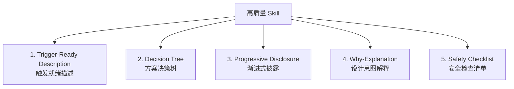

+++
id = "specweave-skill-development-spec"
date = "2026-06-29"
type = "rule"
source = "AGENTS.md#启动协议;retrospective-forum-posting-skill-optimization-20260629"
+++

# SpecWeave Skill 开发规范（补充层）

> **层级定位**：本文件是 SpecWeave 主权区对 vendor skill-creator 方法论的补充规范。Skill 开发的权威方法论来源是 [vendor/flexloop/apps/chaos/.agents/skills/skill-creator/SKILL.md](../../vendor/flexloop/apps/chaos/.agents/skills/skill-creator/SKILL.md)，本文件仅增加 SpecWeave 项目特有的合规要求和从复盘中萃取的最佳实践，不替代 skill-creator 的核心方法论。

## 1. 适用范围

本规范适用于在 SpecWeave 主权区（`.agents/skills/`）下创建、优化、调试任何 Skill。

**必读前置**：执行 Skill 开发任务前，必须完成以下启动协议预检：

```
□ 已读取 AGENTS.md 启动协议（步骤1-3.5含自检）
□ 已读取 vendor/flexloop/apps/chaos/.agents/skills/skill-creator/SKILL.md（方法论权威来源）
□ 已读取 vendor/flexloop/apps/chaos/.agents/rules/skills.md（Skill 目录结构规范）
□ 已读取本文件（SpecWeave 补充规范）
```

## 2. SpecWeave 特有合规要求

### 2.1 三层路由与任务类型预检（启动协议步骤 2.0）

无论当前工作目录是否在 `vendor/` 内，创建/优化 Skill 时必须执行任务类型预检：

- **命中"Skill 创建/优化/调试"** → 必须读取 vendor skill-creator
- **涉及跨项目子模块协同** → 必须读取 VENDOR-INTEGRATION.md + vendor/AGENTS.md
- **涉及浏览器自动化** → 优先参考现有 forum-posting 的双方案+决策树模式

> **为什么？** 这防范了"就近直觉"偏差（可得性启发）——开发者容易只看工作目录附近的文件，忽略 vendor 子模块中更成熟的方法论。vendor skill-creator 包含了 description 触发词优化、渐进式披露、长度控制、Why 解释等经过多轮验证的最佳实践。

### 2.2 自检检查点（启动协议步骤 3.5）

加载 Skill 或开始写 SKILL.md 之前，必须逐项确认：

1. □ 任务类型是否命中 vendor 方法论资产？如命中，对应规范是否已读取？
2. □ 是否已盘点项目中现有相关资产（脚本、知识库、已有Skill）可整合？
3. □ 是否有相关 Skill 应被加载（禁止无 Skill 指导下手动操作有对应 Skill 的领域）？

### 2.3 Context 恢复场景（启动协议步骤 2.2）

若本会话是先前对话的延续（收到会话历史摘要/summary），必须重新执行步骤 1-2（读取 AGENTS.md 和路由表），不得假设摘要中已包含完整路由信息。

> **为什么？** 上下文压缩会导致认知视野收窄——只依赖摘要容易遗漏 vendor 资产。这是从 forum-posting 优化复盘中萃取的关键教训：初始违规版本正是在 context continuation 场景下因视野收窄而跳过了 vendor 路由。

### 2.4 vendor 资产边界

- SpecWeave 主权区 Skill 放在 `.agents/skills/<skill-name>/`
- **禁止直接修改** `vendor/flexloop/apps/chaos/.agents/skills/` 下的 Skill 文件（vendor 边界约束）
- 如需改进 vendor 中的 Skill，走贡献上游流程（见 [VENDOR-INTEGRATION.md](../VENDOR-INTEGRATION.md)）
- 主权区 Skill 可以引用 vendor 中的脚本和知识库，保持单一可信源

## 3. Skill 质量五要素模型

从 forum-posting skill 优化和 skill-creator 方法论中提炼的高质量 Skill 核心要素：

> 📊 **可视化思维导图**：五要素模型的完整展开（含叶子节点检查点）见 [skill-five-elements-mindmap.md](./skill-five-elements-mindmap.md)。



### 3.1 Trigger-Ready Description（触发就绪描述）

Description 是触发的唯一入口，不是功能简介。必须做到：

- **包含完整触发词**：列出所有可能的用户表述（包括同义词、口语化表达、相关操作词）
- **强制措辞**：明确声明"必须使用此技能"/"Use this skill when..."
- **说明核心优势**：简述为什么用这个 Skill 比手动操作更好
- **"Pushy"但不误导**：针对 Claude 的 undertrigger 倾向，description 需要"有说服力"

> **反模式**：description 只写"XX操作工具"——触发词不足，模型不知道什么时候该用。
>
> **正例**（forum-posting）：`Discourse论坛（forum.trae.cn）自动化操作。当用户需要发帖、编辑帖子、更新帖子、回复帖子、跟帖、发布论坛内容、清理草稿、读取帖子、操作forum.trae.cn、使用forum-bot脚本时，必须使用此技能。`

### 3.2 Decision Tree（方案决策树）

当 Skill 支持多种执行方案时（如脚本/MCP/API），必须提供明确的选型决策树，而非简单的方案列表：

- 明确列出选择条件（运行环境、是否需要dry-run、登录状态等）
- 给出默认推荐方案
- 解释为什么在场景A选方案1、场景B选方案2

> **为什么？** 并列罗列方案会增加 Agent 的决策负担，容易选错；决策树把选型逻辑编码进文档，降低决策成本。

### 3.3 Progressive Disclosure（渐进式披露）

- SKILL.md 正文控制在 **500行以内**（skill-creator 推荐值）
- 常用内容（操作步骤、核心参数、工具函数、检查清单）内联在 SKILL.md 中
- 低频内容（完整参数表、故障排查树、长期方案配置）引用到知识库文档（`docs/knowledge/`）
- 附带资源（scripts/、references/、assets/）按需加载

### 3.4 Why-Explanation（设计意图解释）

关键规则和设计决策后，必须解释"为什么"：

- 使用 `> **为什么？**` 引用块格式
- 解释规则背后的意图，帮助 Agent 在边界情况下做出正确判断
- 避免纯 MUST 规则列表——纯规则无法覆盖未预见的场景

> **为什么？** AI 模型在面对边界情况时需要理解决策意图。只知道"不能用 :has-text()"而不知道"为什么"（因为它不是标准DOM API），在遇到类似非标准选择器时会犯同样错误。

### 3.5 Safety Checklist（安全检查清单）

涉及写操作（发帖、编辑、删除、发布）的 Skill 必须包含：

- **dry-run/预览机制**：正式执行前可预览效果
- **幂等性检查**：避免重复添加内容
- **结果验证**：操作后验证确实生效
- **明确的"不可撤销操作"警告**

## 4. 浏览器自动化 Skill 通用模式

涉及浏览器自动化（MCP/Playwright/Puppeteer）的 Skill，推荐遵循以下模式：

### 4.1 多信号状态检测

不要依赖单一选择器判断页面状态，使用多信号组合：

```javascript
// 登录状态检测：组合多信号，不依赖单一选择器
function checkLoginStatus() {
  const signals = {
    hasAvatar: !!document.querySelector('#current-user .avatar'),
    hasLoginLink: !!document.querySelector('a[href="/login"]'),
    hasUserMenu: !!document.querySelector('.user-menu'),
    bodyText: document.body.innerText.substring(0, 200)
  };
  // 多信号投票判断
}
```

### 4.2 原子操作函数封装

封装常用的 JavaScript 工具函数，减少重复代码和出错概率：

- 设置 textarea 内容时必须触发 `input` 和 `change` 事件（React/Vue 框架需要）
- 提供幂等性检查函数（如开头追加前检查是否已存在）
- 提供用户名自动获取函数（避免让用户手动提供）

### 4.3 双方案模式

当浏览器自动化同时存在 MCP 方案和脚本方案时：

| 场景 | 推荐方案 | 原因 |
|------|---------|------|
| IDE内即时操作、无需持久化 | integrated_browser MCP | 零配置，快速操作 |
| 需要dry-run/预览/幂等 | 独立脚本（如 forum-bot.py） | 可重复执行，内置安全机制 |
| CI/自动化流水线 | 独立脚本 | 无界面环境稳定运行 |

## 5. 资产盘点要求

优化现有 Skill 前（而非创建新 Skill），必须先做资产盘点：

1. **脚本资产**：`.agents/scripts/` 下是否已有相关自动化脚本可以整合？
2. **知识库资产**：`docs/knowledge/` 下是否已有相关文档可以引用？
3. **其他 Skill**：`.agents/skills/` 下是否有可复用模式（如双方案、JS工具函数）？
4. **vendor 资产**：vendor 子模块中是否有相关工具或参考实现？

> **为什么？** 初版 forum-posting 优化遗漏了已有的 forum-bot.py，正是因为没有做资产盘点。盘点确保不重复造轮子，充分利用已有投资。

## 6. 文件结构规范

遵循 vendor/flexloop skill 目录结构：

```
.agents/skills/<skill-name>/
├── SKILL.md          # 必需：技能定义（YAML frontmatter + Markdown）
├── scripts/          # 可选：可执行脚本
├── references/       # 可选：参考文档（按需加载）
└── assets/           # 可选：模板、图标等资源
```

### SKILL.md Frontmatter 字段

```yaml
---
name: skill-name              # 必需：Skill 标识符
description: "..."            # 必需：触发描述（遵循3.1节规范）
argument-hint: "<hint>"       # 可选：参数提示
user-invocable: true/false    # 可选：用户是否可直接调用
paths:                        # 可选：相关文件路径模式
  - ".agents/skills/**"
---
```

## 7. 禁止事项

1. **禁止直接修改 vendor 内 Skill 文件**——走贡献上游流程
2. **禁止在 SKILL.md 中硬编码选择器、URL 等环境相关值**——使用配置或检测
3. **禁止只有操作步骤没有 Why 解释**——关键决策必须说明原因
4. **禁止写操作 Skill 无 dry-run/预览机制**——必须有安全防护
5. **禁止 SKILL.md 超长（>500行）无分层**——使用渐进式披露
6. **禁止 description 过于简短**——必须包含足够触发词

## 8. 验证清单

创建/优化 Skill 完成后，对照以下清单自检：

- [ ] Description 包含完整触发词列表和强制措辞？
- [ ] SKILL.md 控制在 500 行以内？
- [ ] 关键规则有 Why 解释？
- [ ] 多方案时有决策树？
- [ ] 写操作有安全检查清单（dry-run/幂等/验证）？
- [ ] 已做资产盘点（脚本/知识库/vendor资产）？
- [ ] 未修改 vendor 内文件？
- [ ] 相关知识库文档（如需要）已创建或更新？
- [ ] 所有文件路径使用相对路径？
