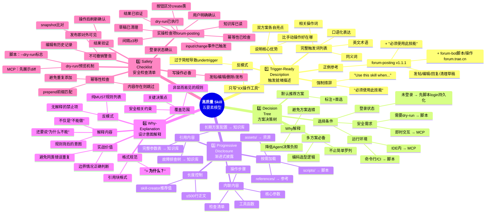

# Skill 质量五要素模型 · 思维导图

> 源文档：[skill-development.md](./skill-development.md) §3 质量五要素模型

## 使用说明

- 本思维导图是 [skill-development.md](./skill-development.md) §3 五要素模型的可视化展开
- 创建/优化 Skill 时，对照五个分支逐项检查即可完成质量自检
- 最右侧叶子节点是具体的检查点和正/反例，可直接作为 review 清单使用
- 与 [skill-development.md §8 验证清单](./skill-development.md#8-验证清单) 配合使用：验证清单是9项快速过检，本思维导图是深度参考
