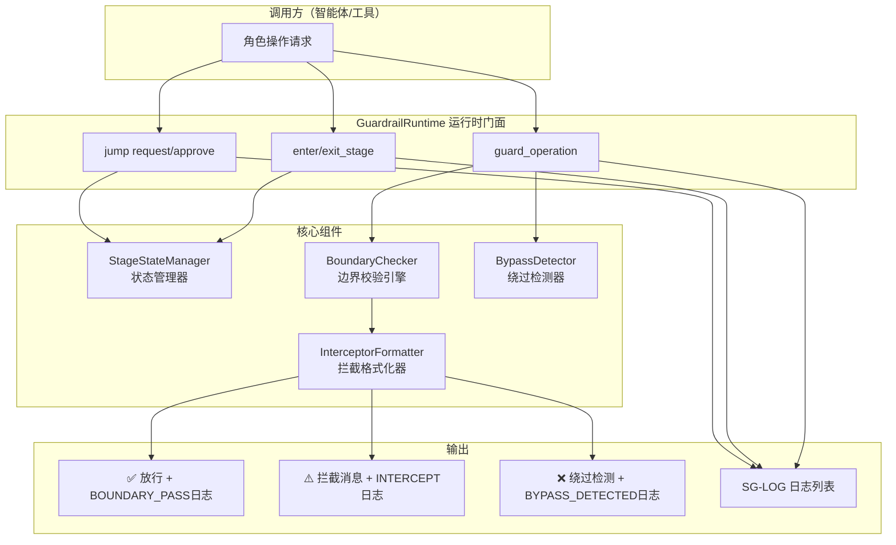
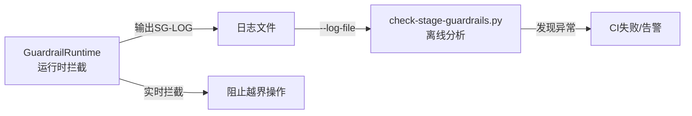

# 阶段守卫运行时强制执行层使用指南

> 本文档是 [stage-guardrails.md](stage-guardrails.md)（阶段守卫规则定义）的配套运行时指南，涵盖8阶段权限速查、必读文档清单、典型日志示例、常见拦截原因与解决方案、CLI工具手册，以及运行时+离线双层验证闭环。

## 背景

阶段守卫（Stage Guardrails）是 SpecWeave 项目用于强制执行开发生命周期阶段边界的核心机制。它确保AI智能体在正确的阶段、由正确的角色、执行正确的操作，防止跨阶段越权（如在需求阶段直接写代码）。

系统采用**"定义层→运行时层→验证层"三层架构**：
- **定义层**：[stage-guardrails.md](stage-guardrails.md) 定义8个阶段、角色权限、退出标准
- **运行时层**：GuardrailRuntime 在操作执行前实时拦截越界行为（本指南重点）
- **验证层**：离线分析工具 [check-stage-guardrails.py](../scripts/check-stage-guardrails.py) 事后解析日志检测异常

相关代码位于 [.agents/scripts/lib/stage_guardrails/](../scripts/lib/stage_guardrails/) 模块，包含4个核心组件。

## 架构概览



## 快速开始

### 最小使用示例

```python
from lib.stage_guardrails import GuardrailRuntime, OperationType

rt = GuardrailRuntime(session_id='my-task-001')

rt.enter_stage('S1', 'orchestrator', '收到用户需求')

out = rt.guard_operation(OperationType.WRITE_CODE, 'orchestrator', detail='直接开始编码')
if out.is_intercept:
    print(out.user_message)

rt.guard_operation(OperationType.CLARIFY_REQUIREMENT, 'orchestrator')

rt.mark_doc_check(['spec.md'])
rt.mark_pdr_done()
rt.exit_stage('S1', 'orchestrator', '需求澄清完成',
               exit_criteria_met=['需求明确'], output_artifacts=['任务清单'],
               next_stage='S2')
rt.enter_stage('S2', 'architect', '开始方案设计')
```

### CLI工具快速演示

```bash
python .agents/scripts/check-stage-guardrail-runtime.py --demo
python .agents/scripts/check-stage-guardrail-runtime.py --full-flow
python .agents/scripts/check-stage-guardrail-runtime.py --check \
    --stage S1 --role orchestrator --op write_code
python .agents/scripts/check-stage-guardrail-runtime.py \
    --export-logs .agents/logs/session-demo.log
python .agents/scripts/check-stage-guardrail-runtime.py --status
```

## 8阶段权限速查表

### 阶段定义与负责角色

| 阶段ID | 阶段名称 | 负责角色 | 核心产出 |
|--------|----------|----------|----------|
| S1 | 需求接收 | orchestrator | 需求文档、任务分解清单、风险评估 |
| S2 | 方案设计 | architect | 技术方案、架构设计、API定义、技术选型 |
| S3 | 任务分配 | orchestrator | 任务分配表、验收标准、依赖关系 |
| S4 | 代码实现 | developer | 业务代码、单元测试、PR |
| S5 | 测试编写 | tester | 测试用例、测试报告、缺陷报告 |
| S6 | 代码审查 | reviewer | 审查意见、合并建议 |
| S7 | 合并代码 | orchestrator | 合并记录、发布说明 |
| S8 | 完成确认 | orchestrator | 完成确认、交付物清单 |

### 各阶段允许的核心操作

| 阶段 | 允许的操作 | 典型禁止操作 |
|------|-----------|-------------|
| **S1** 需求接收 | CLARIFY_REQUIREMENT、CREATE_TASK_LIST、IDENTIFY_RISK、DEFINE_SCOPE、SET_PRIORITY、SEARCH_CODE、READ_DOCS | WRITE_CODE、DESIGN_ARCHITECTURE、CHOOSE_TECH_STACK、MODIFY_ARCHITECTURE |
| **S2** 方案设计 | ARCHITECTURE_DESIGN、CHOOSE_TECH_STACK、DEFINE_API、DESIGN_DATA_MODEL、CREATE_TASK_LIST、EVALUATE_TRADEOFFS | WRITE_CODE、MODIFY_BUSINESS_CODE、DEPLOY、MERGE_CODE |
| **S3** 任务分配 | ASSIGN_TASK、SET_ACCEPTANCE_CRITERIA、DEFINE_DONE、ESTIMATE_EFFORT、PRIORITIZE_BACKLOG | WRITE_CODE、DESIGN_ARCHITECTURE、APPROVE_CODE、DEPLOY |
| **S4** 代码实现 | WRITE_CODE、WRITE_UNIT_TEST、RUN_TEST、DEBUG_CODE、REFACTOR_CODE、SUBMIT_PR、CALL_TOOL | MODIFY_ARCHITECTURE、CHANGE_TECH_SELECTION、APPROVE_CODE、DEPLOY、MERGE_CODE |
| **S5** 测试编写 | WRITE_TEST、RUN_TEST、WRITE_INTEGRATION_TEST、REPORT_BUG、VERIFY_FIX、DEBUG_CODE | WRITE_CODE（业务代码）、MODIFY_ARCHITECTURE、APPROVE_CODE、MERGE_CODE |
| **S6** 代码审查 | REVIEW_CODE、APPROVE_CODE、REQUEST_CHANGES、COMMENT_CODE、READ_DOCS | WRITE_CODE（业务代码）、MODIFY_ARCHITECTURE、DEPLOY、MERGE_CODE |
| **S7** 合并代码 | MERGE_CODE、RESOLVE_CONFLICT、TAG_RELEASE、WRITE_CHANGELOG、APPROVE_CODE | WRITE_CODE、DESIGN_ARCHITECTURE、MODIFY_ARCHITECTURE |
| **S8** 完成确认 | CONFIRM_DELIVERY、WRITE_SUMMARY、UPDATE_DOC、CLOSE_TASK、SEARCH_CODE、READ_DOCS | WRITE_CODE、DESIGN_ARCHITECTURE、CHOOSE_TECH_STACK、DEPLOY |

> **通用规则**：`SEARCH_CODE` 和 `READ_DOCS` 在所有阶段对所有角色开放（只读操作永不拦截）。

### 各阶段必读文档（PDR前置文档）

| 阶段 | 必读文档 |
|------|---------|
| S1 | `AGENTS.md`、[stage-guardrails.md](stage-guardrails.md)、[../../docs/development-standards.md](../../docs/development-standards.md) |
| S2 | [../../docs/knowledge/](../../docs/knowledge/)（架构决策相关）、[stage-guardrails.md](stage-guardrails.md)、S1产出的需求文档 |
| S3 | [feature-development.md](../workflows/feature-development.md)、S1+S2产出物 |
| S4 | [../../docs/development-standards.md](../../docs/development-standards.md)（编码规范）、S3任务分配表 |
| S5 | [../../docs/development-standards.md](../../docs/development-standards.md)（测试规范）、S4代码 |
| S6 | [reviewer.md](../roles/reviewer.md)、S4代码+S5测试 |
| S7 | [dependency-management.md](../protocols/dependency-management.md) |
| S8 | 全部阶段产出物 |

使用 `mark_doc_check(required_docs=[...])` 标记必读文档检查完成，使用 `mark_pdr_done()` 确认PDR流程完成。

## 典型SG-LOG日志示例

### 1. 正常放行（BOUNDARY_PASS）

```
[SG-LOG] | level=DEBUG | event=BOUNDARY_PASS | stage=S4 | role=developer | session=task-001 | msg=操作通过边界检查：执行write_code | ctx={"operation":"write_code"}
```

### 2. 越界拦截（INTERCEPT）

```
[SG-LOG] | level=WARN | event=INTERCEPT | stage=S1 | role=orchestrator | session=task-001 | msg=阶段守卫拦截: 直接开始编写登录模块代码（编写代码属于S4代码实现阶段职责） | ctx={"current_stage":"S1","violating_operation":"write_code","target_stage":"S4","violation_type":"STAGE_BOUNDARY_VIOLATION","detail":"直接开始编写登录模块代码（编写代码属于S4代码实现阶段职责）","session":"task-001"}
```

用户看到的拦截消息：
```
⚠️ 阶段守卫拦截：当前为【S1需求接收】阶段，【直接开始编写登录模块代码（编写代码属于S4代码实现阶段职责）】。
请先完成当前阶段：明确功能边界与验收标准，输出任务分解清单
如需跳至S4（代码实现）阶段，请提交正向跳过申请并经orchestrator批准。
```

### 3. 阶段进入（STAGE_ENTER）

```
[SG-LOG] | level=INFO | event=STAGE_ENTER | stage=S4 | role=developer | session=task-001 | msg=进入代码实现阶段 | ctx={"prev_stage":"S3","via_jump":false}
```

### 4. 阶段退出（STAGE_EXIT）

```
[SG-LOG] | level=INFO | event=STAGE_EXIT | stage=S1 | role=orchestrator | session=task-001 | msg=需求澄清完成 | ctx={"exit_criteria_met":["需求已澄清","任务已分解"],"output_artifacts":["需求文档","任务清单"],"next_stage":"S2","duration":120.5}
```

### 5. 跳转申请（JUMP_REQUEST）

```
[SG-LOG] | level=INFO | event=JUMP_REQUEST | stage=S1 | role=orchestrator | session=task-001 | msg=申请skip跳转: S1→S4 | ctx={"jump_id":"jump-task-001-1","jump_type":"skip","from_stage":"S1","to_stage":"S4","reason":"简单bug修复，跳过设计阶段"}
```

### 6. 跳转批准（JUMP_APPROVED）

```
[SG-LOG] | level=INFO | event=JUMP_APPROVED | stage=S1 | role=orchestrator | session=task-001 | msg=跳转已批准: S1→S4（skip） | ctx={"jump_id":"jump-task-001-1","jump_type":"skip","approved_by":"orchestrator","conditions":"确保补充单元测试"}
```

### 7. 回退自动进入目标阶段

```
[SG-LOG] | level=INFO | event=STAGE_ENTER | stage=S2 | role=architect | session=task-001 | msg=通过逆向回退进入S2 | ctx={"jump_id":"jump-task-001-2","via_jump":true}
```

### 8. 绕过检测（BYPASS_DETECTED）

```
[SG-LOG] | level=ERROR | event=BYPASS_DETECTED | stage=S1 | role=orchestrator | session=task-001 | msg=检测到疑似绕过阶段守卫行为：疑似通过替代操作绕过拦截: write_code -> modify_business_code | ctx={"operation":"modify_business_code","detection_reason":"疑似通过替代操作绕过拦截: write_code -> modify_business_code","evidence":"原操作write_code被拦截，改用modify_business_code执行同类行为"}
```

### 9. 错误事件（ERROR）

```
[SG-LOG] | level=ERROR | event=ERROR | stage=S1 | role=orchestrator | session=task-001 | msg=阶段转换错误: DUPLICATE_ENTRY - 重复进入阶段S1（S1已处于活跃状态） | ctx={"error_type":"DUPLICATE_ENTRY","error_detail":"重复进入阶段S1（S1已处于活跃状态）","impact":"可能导致阶段状态混乱，跳过必要的退出标准检查","recovery_hint":"先退出当前阶段或提交JUMP_REQUEST获得审批"}
```

### 10. 前置文档检查（DOC_CHECK + PDR_CONFIRM）

```
[SG-LOG] | level=INFO | event=DOC_CHECK | stage=S1 | role=orchestrator | session=task-001 | msg=前置文档检查完成：共3份必读文档 | ctx={"required_docs":["AGENTS.md","stage-guardrails.md","development-standards.md"]}
[SG-LOG] | level=INFO | event=PDR_CONFIRM | stage=S1 | role=orchestrator | session=task-001 | msg=前置文档读取流程完成
```

## SG-LOG日志格式规范

```
[SG-LOG] | level=<LEVEL> | event=<EVENT> | stage=<STAGE> | role=<ROLE> | session=<SID> | msg=<MSG> [| ctx=<JSON>]
```

| 字段 | 说明 | 取值 |
|------|------|------|
| level | 日志级别 | `DEBUG`（检查/放行）、`INFO`（正常流转）、`WARN`（拦截）、`ERROR`（绕过/异常） |
| event | 事件类型 | STAGE_ENTER/STAGE_EXIT/DOC_CHECK/PDR_CONFIRM/BOUNDARY_CHECK/BOUNDARY_PASS/INTERCEPT/BYPASS_DETECTED/JUMP_REQUEST/JUMP_APPROVED/JUMP_REJECTED/ERROR |
| stage | 当前阶段 | S1~S8 或 NONE（无活跃阶段） |
| role | 执行角色 | orchestrator/architect/developer/tester/reviewer |
| session | 会话ID | 用于关联同一任务的所有日志 |
| msg | 人类可读消息 | UTF-8中文描述 |
| ctx | 可选JSON上下文 | 事件相关的结构化数据 |

## 常见拦截原因与解决方案

### 1. 当前阶段未允许该操作

**现象**：S1阶段尝试WRITE_CODE，被拦截提示"编写代码属于S4代码实现阶段职责"

**原因**：操作类型与当前阶段职责不匹配

**解决方案**：
- 按照正常流程：完成当前阶段的退出标准 → exit_stage → enter_stage进入目标阶段
- 如需跳过中间阶段：调用 `request_jump('skip', target_stage, role, reason)` → orchestrator批准 → `execute_skip()`
- 如需回退到之前阶段：调用 `request_jump('rollback', target_stage, role, reason)` → orchestrator批准（批准后自动进入目标阶段）

### 2. 角色与阶段不匹配

**现象**：tester在S1阶段尝试CLARIFY_REQUIREMENT被拦截

**原因**：当前阶段的负责角色不包含执行角色（S1仅orchestrator可执行需求操作）

**解决方案**：
- 确认当前应由哪个角色执行操作（参考阶段权限速查表）
- 通过handoff协议将任务交接给正确角色

### 3. 未进入任何阶段就执行操作

**现象**：调用guard_operation时current_stage为None，提示"未进入任何开发阶段"

**原因**：忘记先调用 `enter_stage('S1', 'orchestrator', ...)`

**解决方案**：每个任务开始时必须先从S1进入，不能跳过S1直接操作

### 4. 重复进入阶段（DUPLICATE_ENTRY）

**现象**：已经进入S1后再次调用enter_stage('S1', ...)

**原因**：状态机已在活跃阶段，不能重复进入

**解决方案**：如需重新开始，先调用 `reset()` 重置运行时；如需推进，先exit_stage再enter_stage

### 5. 退出阶段不匹配（STAGE_MISMATCH）

**现象**：当前在S2但调用exit_stage('S1', ...)

**原因**：退出的阶段ID与当前活跃阶段不一致

**解决方案**：使用 `current_stage` 属性确认当前活跃阶段后再退出

### 6. 未经审批执行跳转（UNAUTHORIZED_JUMP）

**现象**：未approve就调用execute_skip

**原因**：跳过/回退必须经orchestrator审批

**解决方案**：严格执行 request_jump → approve_jump → execute_skip 的流程

### 7. 疑似绕过拦截（BYPASS_DETECTED）

**现象**：WRITE_CODE被拦截后，改用MODIFY_BUSINESS_CODE执行同类操作，触发绕过检测

**原因**：BypassDetector跟踪被拦截的操作，检测等价操作替代执行

**解决方案**：这是ERROR级别事件，必须立即停止并走正规审批流程。绕过检测会记录到SG-LOG，离线分析工具会检测到并标记为严重违规。

## 阶段跳转流程

### 正向跳过（skip）

适用于简单任务需要跳过中间阶段的场景（如trivial bugfix直接从S1跳到S4）：

```python
record, out = rt.request_jump('skip', 'S4', 'orchestrator',
                               reason='简单CSS修复，跳过设计阶段')
out = rt.approve_jump(record.jump_id, 'orchestrator',
                       conditions='必须补充回归测试')
out = rt.execute_skip(record.jump_id, 'developer', '开始编码')
```

### 逆向回退（rollback）

适用于在后续阶段发现需要重新做前期阶段工作的场景（如编码时发现设计缺陷需要回S2）：

```python
record, out = rt.request_jump('rollback', 'S2', 'developer',
                               reason='发现架构设计缺陷，需重新设计')
out = rt.approve_jump(record.jump_id, 'orchestrator',
                       rollback_scope='保留已完成代码，重新设计认证模块',
                       conditions='回退后需architect重新评审')
```

审批成功后，current_stage自动变为S2，无需手动execute_skip。

### 顺序推进（advance_to_next_stage）

正常流程的便捷方法，自动退出当前阶段并进入下一阶段：

```python
rt.mark_doc_check(['spec.md'])
rt.mark_pdr_done()
out = rt.advance_to_next_stage(
    'orchestrator',
    exit_message='需求澄清完成',
    enter_message='开始方案设计',
    exit_criteria_met=['需求明确', '任务分解'],
    output_artifacts=['需求文档', '任务清单'],
)
```

## CLI工具手册

### check-stage-guardrail-runtime.py（运行时工具）

运行时实时拦截和演示工具，位于 [.agents/scripts/check-stage-guardrail-runtime.py](../scripts/check-stage-guardrail-runtime.py)。

```
用法:
    python check-stage-guardrail-runtime.py [选项]

选项:
    --demo              基础演示（S1/S2拦截+绕过检测）
    --full-flow         完整流程演示（审批跳过+回退+多场景）
    --check             单步拦截检查模式
      --stage STAGE     阶段ID（S1~S8），check模式必填
      --role ROLE       执行角色
      --op OPERATION    操作类型（如write_code）
      --detail DETAIL   操作描述
    --export-logs PATH  导出SG-LOG到指定文件
    --status            显示运行时组件状态
    --json              JSON格式输出
    --strict            严格模式（WARN也返回退出码1）
    --no-color          禁用彩色输出
    --help              显示帮助

退出码:
    0  正常（操作未被拦截/检查通过）
    1  拦截/异常（strict模式下WARN即失败）
    2  参数错误
```

### check-stage-guardrails.py（离线分析工具）

事后日志分析工具，位于 [.agents/scripts/check-stage-guardrails.py](../scripts/check-stage-guardrails.py)。解析会话日志中的 `[SG-LOG]` 和 `[PDR-LOG]`，检测异常情况。

```
用法:
    python check-stage-guardrails.py --log-file <path> [--strict] [--json]
    python check-stage-guardrails.py --demo [--strict]

选项:
    --log-file PATH     会话日志文件路径
    --demo              使用内置示例日志演示
    --strict            严格模式：WARN级别异常也返回非零退出码
    --json              JSON格式输出

CI集成:
    CI流水线 ci-check.ps1/ci-check.sh 第11步自动调用 --strict 模式
```

### 双层验证闭环



1. **运行时层**：每次操作前实时检查，直接阻止越界行为
2. **日志层**：所有操作产生标准化SG-LOG日志
3. **离线层**：CI中检查日志完整性，发现运行时未覆盖的异常（如缺少STAGE_EXIT、未审批跳转等）

## Python API参考

### GuardrailRuntime 核心方法

| 方法 | 说明 | 返回值 |
|------|------|--------|
| `guard_operation(op, role, detail)` | 操作前拦截检查（核心入口） | FormattedOutput |
| `enter_stage(stage, role, msg)` | 进入阶段 | FormattedOutput |
| `exit_stage(stage, role, msg, ...)` | 退出阶段 | FormattedOutput |
| `advance_to_next_stage(role, ...)` | 顺序推进到下一阶段 | FormattedOutput |
| `mark_doc_check(docs)` | 标记必读文档检查完成 | FormattedOutput |
| `mark_pdr_done()` | 标记PDR流程完成 | FormattedOutput |
| `request_jump(type, to, by, reason)` | 提交跳转申请 | (JumpRecord, FormattedOutput) |
| `approve_jump(id, by, ...)` | 批准跳转（rollback自动进入目标） | FormattedOutput |
| `reject_jump(id, by, reason)` | 拒绝跳转 | FormattedOutput |
| `execute_skip(id, role, msg)` | 执行已批准的正向跳过 | FormattedOutput |
| `can_transition_to(target)` | 查询是否可转换到目标阶段 | (bool, str) |
| `get_status()` | 获取运行时状态快照 | RuntimeStatus |
| `get_logs_since(event, level)` | 按类型/级别过滤日志 | list[str] |
| `dump_logs()` | 导出所有日志为字符串 | str |
| `reset()` | 重置运行时状态 | None |

### FormattedOutput 属性

| 属性 | 类型 | 说明 |
|------|------|------|
| `is_intercept` | bool | 是否被拦截（True=操作应被阻止） |
| `user_message` | str | 人类可读的拦截/错误消息（放行时为空） |
| `sg_log_line` | str | SG-LOG结构化日志行 |
| `log_level` | str | DEBUG/INFO/WARN/ERROR |
| `event_type` | str | 事件类型名称 |

### OperationType 常用操作

| 操作值 | 说明 | 典型阶段 |
|--------|------|---------|
| `clarify_requirement` | 澄清需求 | S1 |
| `create_task_list` | 创建任务清单 | S1/S2 |
| `identify_risk` | 识别风险 | S1 |
| `architecture_design` | 架构设计 | S2 |
| `choose_tech_stack` | 技术选型 | S2 |
| `define_api` | 定义API | S2 |
| `assign_task` | 分配任务 | S3 |
| `set_acceptance_criteria` | 设定验收标准 | S3 |
| `write_code` | 编写代码 | S4 |
| `write_unit_test` | 编写单元测试 | S4 |
| `run_test` | 运行测试 | S4/S5 |
| `modify_architecture` | 修改架构决策 | S2（需回退） |
| `submit_pr` | 提交PR | S4 |
| `review_code` | 审查代码 | S6 |
| `approve_code` | 批准代码 | S6 |
| `merge_code` | 合并代码 | S7 |
| `search_code` | 搜索代码 | 所有阶段 |
| `read_docs` | 读取文档 | 所有阶段 |

完整操作列表见 `boundary.py` 中的 `OperationType` 枚举（共60种操作类型）。

## 排错指南

### 问题：CLI中文显示乱码

**原因**：Windows PowerShell默认编码非UTF-8

**解决方案**：设置环境变量 `$env:PYTHONIOENCODING='utf-8'`，或使用Windows Terminal替代旧版PowerShell

### 问题：guard_operation总是返回is_intercept=True

**排查步骤**：
1. 检查 `current_stage` 是否正确（是否已enter_stage）
2. 检查 `current_role` 是否匹配当前阶段的负责角色
3. 检查操作类型是否在当前阶段的允许列表中
4. 查看 `user_message` 获取具体拦截原因

### 问题：approve_jump后current_stage没有变化

**原因**：skip类型的跳转批准后需要手动调用 `execute_skip()` 才会进入目标阶段；只有rollback类型批准后会自动进入。

### 问题：导出的日志被离线工具检测出NO_PDR_FOR_STAGE

**原因**：进入阶段后没有调用 `mark_doc_check()` 和 `mark_pdr_done()`。每个阶段进入后都应该先做PDR检查。

## 参考

- [阶段守卫规则定义](stage-guardrails.md)
- [功能开发工作流](../workflows/feature-development.md)
- [前置文档读取协议（PDR）](../protocols/pre-document-reading.md)
- [阶段守卫离线分析工具check-stage-guardrails.py](../scripts/check-stage-guardrails.py)
- [运行时模块源码](../scripts/lib/stage_guardrails/)
