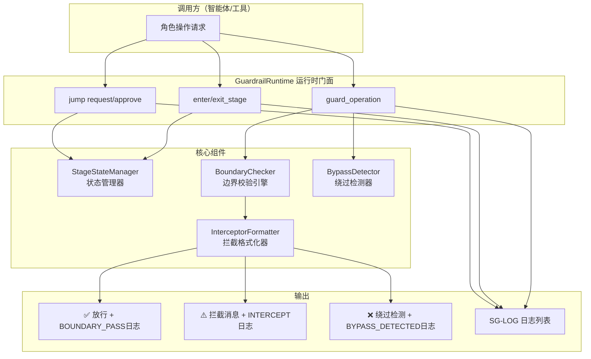

# 01 概述、架构与快速开始


阶段守卫（Stage Guardrails）是 SpecWeave 项目用于强制执行开发生命周期阶段边界的核心机制。它确保AI智能体在正确的阶段、由正确的角色、执行正确的操作，防止跨阶段越权（如在需求阶段直接写代码）。

系统采用**"定义层→运行时层→验证层"三层架构**：
- **定义层**：[stage-guardrails.md](../stage-guardrails.md) 定义8个阶段、角色权限、退出标准
- **运行时层**：GuardrailRuntime 在操作执行前实时拦截越界行为（本指南重点）
- **验证层**：离线分析工具 [check-stage-guardrails.py](../../scripts/check-stage-guardrails.py) 事后解析日志检测异常

相关代码位于 [.agents/scripts/lib/stage_guardrails/](../../scripts/lib/stage_guardrails/) 模块，包含4个核心组件。



### 最小使用示例

```python
from lib.stage_guardrails import GuardrailRuntime, OperationType

rt = GuardrailRuntime(session_id='my-task-001')

rt.enter_stage('S1', 'orchestrator', '收到用户需求')

out = rt.guard_operation(OperationType.WRITE_CODE, 'orchestrator', detail='直接开始编码')
if out.is_intercept:
    print(out.user_message)

rt.guard_operation(OperationType.CLARIFY_REQUIREMENT, 'orchestrator')

rt.mark_doc_check(['spec.md'])
rt.mark_pdr_done()
rt.exit_stage('S1', 'orchestrator', '需求澄清完成',
               exit_criteria_met=['需求明确'], output_artifacts=['任务清单'],
               next_stage='S2')
rt.enter_stage('S2', 'architect', '开始方案设计')
```

### CLI工具快速演示

```bash
python .agents/scripts/check-stage-guardrail-runtime.py --demo
python .agents/scripts/check-stage-guardrail-runtime.py --full-flow
python .agents/scripts/check-stage-guardrail-runtime.py --check \
    --stage S1 --role orchestrator --op write_code
python .agents/scripts/check-stage-guardrail-runtime.py \
    --export-logs .agents/logs/session-demo.log
python .agents/scripts/check-stage-guardrail-runtime.py --status
```

---

## 相关模式

- [三层检查工具模式](../../docs/retrospective/patterns/code-patterns/three-tier-check-tool.md)
- [双通道分级日志](../../docs/retrospective/patterns/code-patterns/dual-channel-tiered-logging.md)
---

**[返回索引](../stage-guardrails-guide.md)** | 下一章: [02 8阶段权限速查表](02-permissions-reference.md) →
