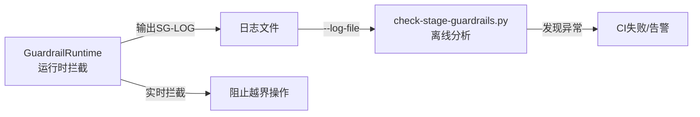

# 05 阶段跳转流程与CLI工具


### 正向跳过（skip）

适用于简单任务需要跳过中间阶段的场景（如trivial bugfix直接从S1跳到S4）：

```python
record, out = rt.request_jump('skip', 'S4', 'orchestrator',
                               reason='简单CSS修复，跳过设计阶段')
out = rt.approve_jump(record.jump_id, 'orchestrator',
                       conditions='必须补充回归测试')
out = rt.execute_skip(record.jump_id, 'developer', '开始编码')
```

### 逆向回退（rollback）

适用于在后续阶段发现需要重新做前期阶段工作的场景（如编码时发现设计缺陷需要回S2）：

```python
record, out = rt.request_jump('rollback', 'S2', 'developer',
                               reason='发现架构设计缺陷，需重新设计')
out = rt.approve_jump(record.jump_id, 'orchestrator',
                       rollback_scope='保留已完成代码，重新设计认证模块',
                       conditions='回退后需architect重新评审')
```

审批成功后，current_stage自动变为S2，无需手动execute_skip。

### 顺序推进（advance_to_next_stage）

正常流程的便捷方法，自动退出当前阶段并进入下一阶段：

```python
rt.mark_doc_check(['spec.md'])
rt.mark_pdr_done()
out = rt.advance_to_next_stage(
    'orchestrator',
    exit_message='需求澄清完成',
    enter_message='开始方案设计',
    exit_criteria_met=['需求明确', '任务分解'],
    output_artifacts=['需求文档', '任务清单'],
)
```

### check-stage-guardrail-runtime.py（运行时工具）

运行时实时拦截和演示工具，位于 [.agents/scripts/check-stage-guardrail-runtime.py](../../scripts/check-stage-guardrail-runtime.py)。

```
用法:
    python check-stage-guardrail-runtime.py [选项]

选项:
    --demo              基础演示（S1/S2拦截+绕过检测）
    --full-flow         完整流程演示（审批跳过+回退+多场景）
    --check             单步拦截检查模式
      --stage STAGE     阶段ID（S1~S8），check模式必填
      --role ROLE       执行角色
      --op OPERATION    操作类型（如write_code）
      --detail DETAIL   操作描述
    --export-logs PATH  导出SG-LOG到指定文件
    --status            显示运行时组件状态
    --json              JSON格式输出
    --strict            严格模式（WARN也返回退出码1）
    --no-color          禁用彩色输出
    --help              显示帮助

退出码:
    0  正常（操作未被拦截/检查通过）
    1  拦截/异常（strict模式下WARN即失败）
    2  参数错误
```

### check-stage-guardrails.py（离线分析工具）

事后日志分析工具，位于 [.agents/scripts/check-stage-guardrails.py](../../scripts/check-stage-guardrails.py)。解析会话日志中的 `[SG-LOG]` 和 `[PDR-LOG]`，检测异常情况。

```
用法:
    python check-stage-guardrails.py --log-file <path> [--strict] [--json]
    python check-stage-guardrails.py --demo [--strict]

选项:
    --log-file PATH     会话日志文件路径
    --demo              使用内置示例日志演示
    --strict            严格模式：WARN级别异常也返回非零退出码
    --json              JSON格式输出

CI集成:
    CI流水线 ci-check.ps1/ci-check.sh 第11步自动调用 --strict 模式
```

### 双层验证闭环



1. **运行时层**：每次操作前实时检查，直接阻止越界行为
2. **日志层**：所有操作产生标准化SG-LOG日志
3. **离线层**：CI中检查日志完整性，发现运行时未覆盖的异常（如缺少STAGE_EXIT、未审批跳转等）

---

## 相关模式

- [三层检查工具模式](../../docs/retrospective/patterns/code-patterns/three-tier-check-tool.md)
- [双通道分级日志](../../docs/retrospective/patterns/code-patterns/dual-channel-tiered-logging.md)
---

← 上一章: [04 常见拦截原因与解决方案](04-common-interceptions.md) | **[返回索引](../stage-guardrails-guide.md)** | 下一章: [06 Python API参考与排错指南](06-api-troubleshooting.md) →
