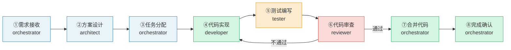
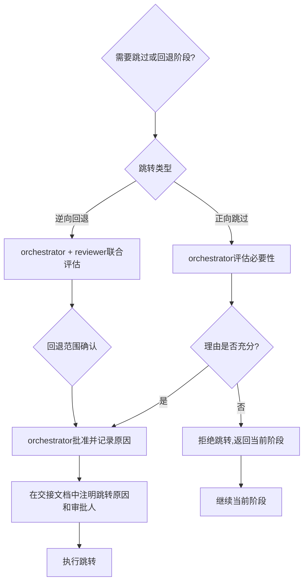

# 开发流程阶段守卫规则

本规则定义功能开发流程的标准阶段序列、每个阶段的操作边界、跨阶段拦截机制与阶段跳转审批流程。所有智能体在执行开发任务时必须遵守本规则，确保在正确的阶段做正确的事。

## 核心原则

> 在需求阶段聊代码，是空中楼阁；在编码阶段改架构，是推倒重来。
> 阶段守卫的本质不是限制自由，而是防止"越做越偏"——每一步的输出是下一步的输入，跨阶段操作等于在流沙上盖楼。

---

## 标准阶段序列

功能开发遵循以下8个标准阶段，顺序不可跳过：



### 阶段概览表

| 阶段 | 负责角色 | 核心目标 | 进入条件 | 退出标准 |
|------|---------|---------|---------|---------|
| ①需求接收 | orchestrator | 明确需求边界与验收标准 | 收到用户/产品方需求描述 | 任务分解清单已创建并分配 |
| ②方案设计 | architect | 产出可执行的技术方案 | 收到任务分解清单 | 技术方案经orchestrator确认 |
| ③任务分配 | orchestrator | 匹配角色、明确交付要求 | 技术方案已确认 | 任务分配通知已发送至各角色 |
| ④代码实现 | developer | 按方案完成编码与单元测试 | 收到任务分配+技术方案 | PR已创建，本地测试通过 |
| ⑤测试编写 | tester | 验证功能正确性、发现缺陷 | 代码已提交PR | 测试报告已生成，缺陷已记录 |
| ⑥代码审查 | reviewer | 质量把关、改进建议 | 收到代码实现与测试报告 | 审查报告已输出，合并决策明确 |
| ⑦合并代码 | orchestrator | 合入主干、触发CI | 审查通过，无阻塞问题 | CI流程通过，代码已合并 |
| ⑧完成确认 | orchestrator | 验收确认、关闭任务 | 合并结果+测试报告 | 任务状态已更新，相关方已通知 |

---

## 各阶段操作边界

### ① 需求接收阶段（orchestrator）

**允许操作**：
- 解析需求文档，提取功能描述与验收标准
- 询问用户/产品方澄清需求边界（功能做什么、不做什么）
- 将需求拆分为可独立执行的子任务
- 评估任务优先级与依赖关系
- 识别需求中的风险点和模糊点

**禁止操作**：
- ❌ 讨论具体技术实现方案（如"用Redis还是Memcached"）
- ❌ 指定技术选型或框架
- ❌ 编写任何代码或伪代码
- ❌ 估算代码行数或技术细节
- ❌ 跳过需求澄清直接进入设计

**正例**：
> "这个功能的目标用户是谁？验收标准中'快速响应'具体指多少秒以内？"

**反例**：
> "这个功能我打算用React+Node.js+MongoDB来做，API用RESTful，先写个用户登录接口……"

---

### ② 方案设计阶段（architect）

**允许操作**：
- 分析任务的技术可行性
- 进行架构设计与模块划分
- 完成技术选型与接口定义（API签名、数据模型）
- 识别技术风险并给出应对策略
- 评估影响范围（哪些现有模块会受影响）

**禁止操作**：
- ❌ 编写业务逻辑代码
- ❌ 直接修改已有代码文件
- ❌ 跳过风险评估直接给出"理想方案"
- ❌ 在需求未澄清的情况下强行出方案
- ❌ 指定具体实现细节（如变量名、函数内部逻辑）

**正例**：
> "用户模块采用分层架构：Controller→Service→Repository，接口定义如下……缓存策略建议用Redis，过期时间30分钟。"

**反例**：
> "我直接把代码写出来给你看吧：function login(username, password) { const user = db.query(...)……"

---

### ③ 任务分配阶段（orchestrator）

**允许操作**：
- 依据技术方案调整任务分解
- 按角色能力匹配任务
- 明确任务交付时间与验收标准
- 确定任务优先级与执行顺序

**禁止操作**：
- ❌ 修改技术方案的核心内容（架构、选型、接口定义）
- ❌ 直接开始编码
- ❌ 跳过architect确认自行决定技术方案
- ❌ 分配超出角色能力边界的任务（如让tester写业务代码）

**正例**：
> "根据方案，将任务拆为3个：用户认证（developer-A）、权限验证（developer-B）、集成测试（tester）。每个任务的验收标准见方案文档第3节。"

**反例**：
> "这个方案我觉得用GraphQL更好，我直接改了方案然后让developer按新方案做。"

---

### ④ 代码实现阶段（developer）

**允许操作**：
- 依据技术方案进行编码实现
- 编写单元测试并保证本地通过
- 遵循项目编码规范与代码风格
- 在方案范围内选择具体实现方式（变量名、函数内部逻辑等）
- 提交代码并发起Pull Request

**禁止操作**：
- ❌ 擅自变更架构决策（如把分层架构改成单体直接调用）
- ❌ 擅自更换技术选型（如方案用PostgreSQL，私改用MongoDB）
- ❌ 跳过单元测试直接提交
- ❌ 在未读取技术方案文档的情况下开始编码
- ❌ 实现方案中未包含的功能（"顺手"加了功能）

**正例**：
> "📋 前置文档确认：已读取技术方案文档、任务分解清单、开发规范。按照方案的分层架构实现，单元测试覆盖核心路径。"

**反例**：
> "方案写的用Repository模式太麻烦了，我直接在Controller里查数据库，简单直接。顺便加了个导出Excel功能，用户没提但肯定需要。"

---

### ⑤ 测试编写阶段（tester）

**允许操作**：
- 依据需求与技术方案设计测试用例
- 编写自动化测试代码（单元测试、集成测试、E2E测试）
- 执行测试并记录结果
- 发现缺陷时反馈至developer
- 验证修复后的缺陷是否解决

**禁止操作**：
- ❌ 自行修复发现的缺陷（必须反馈给developer）
- ❌ 修改业务逻辑代码
- ❌ 在未读取需求和技术方案的情况下设计测试用例
- ❌ 跳过缺陷记录直接标记测试通过
- ❌ 仅测试"happy path"忽略边界条件和异常情况

**正例**：
> "发现3个缺陷：①登录失败时返回500而非401 ②空密码未校验 ③并发登录未处理。已记录至缺陷清单，反馈developer修复。"

**反例**：
> "测试发现登录报错，我直接改了auth.js里的判断逻辑，现在正常了。"

---

### ⑥ 代码审查阶段（reviewer）

**允许操作**：
- 审查代码规范、功能正确性、测试覆盖
- 检查安全性与性能指标
- 给出审查意见与改进建议
- 审查通过则批准合并，否则退回developer修改

**禁止操作**：
- ❌ 直接修改业务代码
- ❌ 在未读取前置文档的情况下给出审查结论
- ❌ 基于个人偏好而非规范要求提出修改意见
- ❌ 跳过安全检查和性能检查
- ❌ 不给出具体改进建议直接打回

**正例**：
> "📋 前置文档确认：已读取需求文档、技术方案、代码实现、测试报告。审查发现：①第45行SQL注入风险，建议使用参数化查询 ②单元测试缺少异常分支覆盖，请补充。"

**反例**：
> "这代码写得不好，重写。"（无具体原因，无改进建议）

---

### ⑦ 合并代码阶段（orchestrator）

**允许操作**：
- 确认审查通过且无阻塞问题
- 确认CI流程全部通过
- 执行代码合并至主干分支
- 触发持续集成与部署流程

**禁止操作**：
- ❌ 在审查未通过时强行合并
- ❌ 跳过CI检查直接合并
- ❌ 合并后不通知相关角色
- ❌ 忽略冲突警告强制合并

---

### ⑧ 完成确认阶段（orchestrator）

**允许操作**：
- 核对验收标准是否全部满足
- 更新任务状态为已完成
- 通知相关角色任务结束
- 归档项目文档

**禁止操作**：
- ❌ 在验收标准未全部满足时标记完成
- ❌ 跳过回归验证直接关闭任务
- ❌ 不通知相关方单方面关闭任务

---

## 跨阶段拦截机制

当智能体在某个阶段尝试执行其他阶段的操作时，必须**显式拦截**，不得执行越界操作。

### 拦截输出格式

拦截时必须使用以下标准格式输出：

```
⚠️ 阶段守卫拦截：当前为【X阶段】，【Y操作】属于【Z阶段】的职责。
请先完成当前阶段：[当前阶段的退出标准]
如需跳过或回退阶段，请参考"阶段跳转审批流程"。
```

### 拦截行为规范

1. **立即停止**：检测到跨阶段操作后，立即停止当前越界操作的执行
2. **明确告知**：清晰说明当前阶段、越界操作、正确阶段
3. **给出出路**：提示当前阶段的退出标准，或跳转审批流程
4. **不替用户决策**：不得自行判断"这个越界没关系"而放行
5. **记录拦截**：拦截事件应在交接文档或任务状态中记录

### 拦截示例

**场景**：在需求讨论中，用户说"这个用Redis做缓存吧"，developer角色的AI直接开始写Redis配置代码。

**正确拦截输出**：
```
⚠️ 阶段守卫拦截：当前为【①需求接收】阶段，【编写Redis配置代码】属于【④代码实现】阶段的职责。
请先完成当前阶段：明确功能边界与验收标准，输出任务分解清单。
如需在需求阶段讨论技术可行性，可转由architect进行技术预研，但不得直接编写代码。
```

---

## 阶段跳转审批流程

正常情况下阶段必须按顺序执行。因特殊原因需要跳过阶段或逆向回退时，必须经过审批。



### 正向跳过

**定义**：跳过某个尚未执行的阶段，直接进入后续阶段。

**适用场景示例**：
- 功能极其简单（如修改一个文案），可以跳过方案设计阶段
- Bug修复且影响范围极小，可以跳过任务分配阶段

**审批要求**：
- 必须由orchestrator明确批准
- 跳过原因必须记录在交接文档中
- 跳过方案设计时，developer必须自行确认影响范围

### 逆向回退

**定义**：从当前阶段返回到之前的阶段（如从代码实现回到方案设计）。

**适用场景示例**：
- 编码过程中发现技术方案有重大缺陷，需要重新设计
- 测试过程中发现需求理解有误，需要重新澄清需求
- 审查过程中发现架构性问题，需要回到方案阶段

**审批要求**：
- 必须由orchestrator批准
- **必须由reviewer确认回退范围**（哪些已完成的工作需要作废/修改）
- 回退原因必须记录
- 如果涉及代码回退，必须包含回滚策略
- 回退后重新推进时，所有经过的阶段必须重新执行（不能跳过）

### 禁止跳转场景

以下情况不得跳转：
- 任何阶段跳至完成确认（不得跳过验证直接标记完成）
- 代码审查不通过时跳过修复直接合并（必须退回developer修复）
- 测试发现严重缺陷时跳过修复直接进入审查
- 未经审批自行决定跳过阶段
