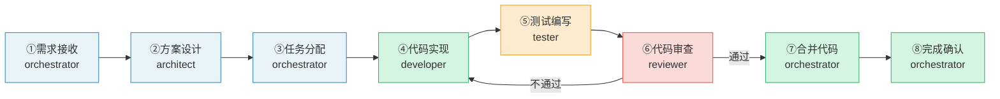

# 02 标准阶段序列

功能开发遵循以下8个标准阶段，顺序不可跳过：

### 阶段概览表

| 阶段 | 负责角色 | 核心目标 | 进入条件 | 退出标准 |
|------|---------|---------|---------|---------|
| ①需求接收 | orchestrator | 明确需求边界与验收标准 | 收到用户/产品方需求描述 | 任务分解清单已创建并分配 |
| ②方案设计 | architect | 产出可执行的技术方案 | 收到任务分解清单 | 技术方案经orchestrator确认 |
| ③任务分配 | orchestrator | 匹配角色、明确交付要求 | 技术方案已确认 | 任务分配通知已发送至各角色 |
| ④代码实现 | developer | 按方案完成编码与单元测试 | 收到任务分配+技术方案 | PR已创建，本地测试通过 |
| ⑤测试编写 | tester | 验证功能正确性、发现缺陷 | 代码已提交PR | 测试报告已生成，缺陷已记录 |
| ⑥代码审查 | reviewer | 质量把关、改进建议 | 收到代码实现与测试报告 | 审查报告已输出，合并决策明确 |
| ⑦合并代码 | orchestrator | 合入主干、触发CI | 审查通过，无阻塞问题 | CI流程通过，代码已合并 |
| ⑧完成确认 | orchestrator | 验收确认、关闭任务 | 合并结果+测试报告 | 任务状态已更新，相关方已通知 |

---

---

## 相关模式

- [三层检查工具模式](../../../docs/retrospective/patterns/code-patterns/three-tier-check-tool.md)
- [Spec即代码自动门禁](../../../docs/retrospective/patterns/methodology-patterns/tools-automation/spec-as-code-automated-gates.md)
---

← 上一章: [01 核心原则与治理基建模型](01-principles-governance.md) | **[返回索引](../stage-guardrails.md)** | 下一章: [03 各阶段操作边界](03-stage-boundaries.md) →
