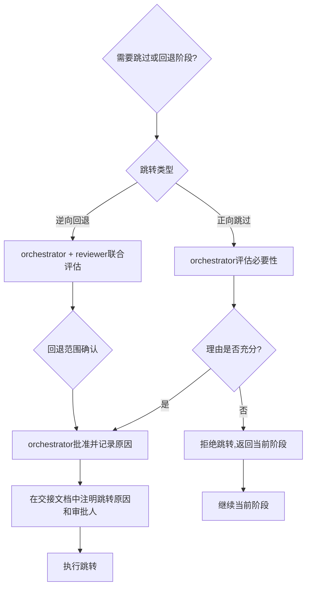

# 04 跨阶段拦截与跳转审批


当智能体在某个阶段尝试执行其他阶段的操作时，必须**显式拦截**，不得执行越界操作。

### 拦截输出格式

拦截时必须使用以下标准格式输出：

```
⚠️ 阶段守卫拦截：当前为【X阶段】，【Y操作】属于【Z阶段】的职责。
请先完成当前阶段：[当前阶段的退出标准]
如需跳过或回退阶段，请参考"阶段跳转审批流程"。
```

### 拦截行为规范

1. **立即停止**：检测到跨阶段操作后，立即停止当前越界操作的执行
2. **明确告知**：清晰说明当前阶段、越界操作、正确阶段
3. **给出出路**：提示当前阶段的退出标准，或跳转审批流程
4. **不替用户决策**：不得自行判断"这个越界没关系"而放行
5. **记录拦截**：拦截事件应在交接文档或任务状态中记录

### 拦截示例

**场景**：在需求讨论中，用户说"这个用Redis做缓存吧"，developer角色的AI直接开始写Redis配置代码。

**正确拦截输出**：
```
⚠️ 阶段守卫拦截：当前为【①需求接收】阶段，【编写Redis配置代码】属于【④代码实现】阶段的职责。
请先完成当前阶段：明确功能边界与验收标准，输出任务分解清单。
如需在需求阶段讨论技术可行性，可转由architect进行技术预研，但不得直接编写代码。
```

---

正常情况下阶段必须按顺序执行。因特殊原因需要跳过阶段或逆向回退时，必须经过审批。



### 正向跳过

**定义**：跳过某个尚未执行的阶段，直接进入后续阶段。

**适用场景示例**：
- 功能极其简单（如修改一个文案），可以跳过方案设计阶段
- Bug修复且影响范围极小，可以跳过任务分配阶段

**审批要求**：
- 必须由orchestrator明确批准
- 跳过原因必须记录在交接文档中
- 跳过方案设计时，developer必须自行确认影响范围

### 逆向回退

**定义**：从当前阶段返回到之前的阶段（如从代码实现回到方案设计）。

**适用场景示例**：
- 编码过程中发现技术方案有重大缺陷，需要重新设计
- 测试过程中发现需求理解有误，需要重新澄清需求
- 审查过程中发现架构性问题，需要回到方案阶段

**审批要求**：
- 必须由orchestrator批准
- **必须由reviewer确认回退范围**（哪些已完成的工作需要作废/修改）
- 回退原因必须记录
- 如果涉及代码回退，必须包含回滚策略
- 回退后重新推进时，所有经过的阶段必须重新执行（不能跳过）

### 禁止跳转场景

以下情况不得跳转：
- 任何阶段跳至完成确认（不得跳过验证直接标记完成）
- 代码审查不通过时跳过修复直接合并（必须退回developer修复）
- 测试发现严重缺陷时跳过修复直接进入审查
- 未经审批自行决定跳过阶段

---

---

## 相关模式

- [三层检查工具模式](../../../docs/retrospective/patterns/code-patterns/three-tier-check-tool.md)
- [Spec即代码自动门禁](../../../docs/retrospective/patterns/methodology-patterns/tools-automation/spec-as-code-automated-gates.md)
---

← 上一章: [03 各阶段操作边界](03-stage-boundaries.md) | **[返回索引](../stage-guardrails.md)** | 下一章: [05 关键节点日志规范](05-logging-spec.md) →
