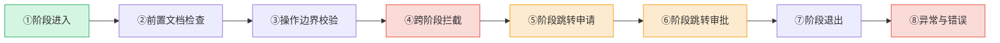

# 05 关键节点日志规范


为便于排查阶段守卫执行过程中的潜在问题（误拦截、漏拦截、审批缺失、上下文断裂等），所有智能体在执行阶段守卫相关操作时必须输出结构化日志。

### 日志级别定义

| 级别 | 标识 | 使用场景 | 示例 |
|------|------|---------|------|
| `DEBUG` | 🔍 | 细粒度调试信息，用于排查具体问题 | 文档内容匹配详情、条件判断分支 |
| `INFO` | ℹ️ | 正常流程节点事件 | 阶段进入/退出、文档读取完成、审批通过 |
| `WARN` | ⚠️ | 异常但可恢复的情况，需关注 | 拦截事件、文档缺失但已标注风险、条件满足度不足 |
| `ERROR` | ❌ | 严重错误，必须人工介入 | 未经审批的阶段跳转、关键前置文档缺失且无法获取、越界操作已执行 |

### 关键事件节点

以下8类关键事件必须输出日志：



### 结构化日志格式

每条日志必须包含以下字段，以`|`分隔的键值对格式输出，便于机器解析：

```
[SG-LOG] | level=<LEVEL> | event=<EVENT_TYPE> | stage=<STAGE_ID> | role=<ROLE> | session=<SESSION_ID> | msg=<MESSAGE> | ctx=<CONTEXT_JSON>
```

**字段说明**：

| 字段 | 必填 | 说明 |
|------|-----|------|
| `level` | ✅ | 日志级别：DEBUG/INFO/WARN/ERROR |
| `event` | ✅ | 事件类型（见下文事件类型枚举） |
| `stage` | ✅ | 当前阶段ID：S1~S8，如 `S4`（代码实现） |
| `role` | ✅ | 执行角色：orchestrator/architect/developer/tester/reviewer |
| `session` | ✅ | 会话标识：使用当前会话/任务ID |
| `msg` | ✅ | 人类可读的日志消息 |
| `ctx` | ❌ | 附加上下文JSON（目标阶段、缺失文档、审批人等），无额外上下文时省略 |

**事件类型枚举**：

| event值 | 对应节点 | 触发时机 |
|---------|---------|---------|
| `STAGE_ENTER` | ①阶段进入 | 智能体开始执行新阶段任务时 |
| `DOC_CHECK` | ②前置文档检查 | 检查前置文档是否已读取时 |
| `DOC_READ` | ②前置文档检查 | 实际读取每份前置文档后 |
| `DOC_MISSING` | ②前置文档检查 | 发现前置文档缺失时 |
| `BOUNDARY_CHECK` | ③操作边界校验 | 执行操作合法性校验时 |
| `BOUNDARY_PASS` | ③操作边界校验 | 操作通过边界检查时 |
| `INTERCEPT` | ④跨阶段拦截 | 检测到跨阶段操作并拦截时 |
| `BYPASS_DETECTED` | ④跨阶段拦截 | 检测到疑似绕过拦截的行为时 |
| `JUMP_REQUEST` | ⑤阶段跳转申请 | 角色提出阶段跳转请求时 |
| `JUMP_APPROVED` | ⑥阶段跳转审批 | 跳转获得批准时 |
| `JUMP_REJECTED` | ⑥阶段跳转审批 | 跳转被拒绝时 |
| `STAGE_EXIT` | ⑦阶段退出 | 阶段完成准备进入下一阶段时 |
| `ERROR` | ⑧异常与错误 | 发生严重错误时 |

### 各节点日志输出模板

#### ① 阶段进入（STAGE_ENTER）

```
[SG-LOG] | level=INFO | event=STAGE_ENTER | stage=<阶段ID> | role=<角色> | session=<会话ID> | msg=进入<阶段名称>阶段，开始执行<核心目标> | ctx={"entry_condition":"<进入条件满足情况>","prev_stage":"<上一阶段ID或null>"}
```

**示例**：
```
[SG-LOG] | level=INFO | event=STAGE_ENTER | stage=S4 | role=developer | session=task-20260629-auth | msg=进入代码实现阶段，开始按方案完成编码与单元测试 | ctx={"entry_condition":"任务分配通知已收到,技术方案已确认","prev_stage":"S3"}
```

#### ② 前置文档检查（DOC_CHECK / DOC_READ / DOC_MISSING）

```
[SG-LOG] | level=INFO | event=DOC_CHECK | stage=<阶段ID> | role=<角色> | session=<会话ID> | msg=开始前置文档检查，共<N>份必读文档 | ctx={"required_docs":["<doc1>","<doc2>"]}

[SG-LOG] | level=INFO | event=DOC_READ | stage=<阶段ID> | role=<角色> | session=<会话ID> | msg=已读取前置文档: <文档路径> | ctx={"doc_path":"<路径>","doc_summary":"<文档要点摘要>"}

[SG-LOG] | level=WARN | event=DOC_MISSING | stage=<阶段ID> | role=<角色> | session=<会话ID> | msg=前置文档缺失: <文档路径或描述> | ctx={"missing_doc":"<缺失文档>","risk":"<风险描述>","action":"<已采取的处理措施>"}
```

**示例**：
```
[SG-LOG] | level=INFO | event=DOC_CHECK | stage=S4 | role=developer | session=task-20260629-auth | msg=开始前置文档检查，共4份必读文档 | ctx={"required_docs":["技术方案文档","任务分解清单","docs/development-standards.md","相关模块现有代码"]}
[SG-LOG] | level=INFO | event=DOC_READ | stage=S4 | role=developer | session=task-20260629-auth | msg=已读取前置文档: docs/development-standards.md | ctx={"doc_path":"docs/development-standards.md","doc_summary":"代码风格:Conventional Commits,测试覆盖率>=80%"}
[SG-LOG] | level=WARN | event=DOC_MISSING | stage=S4 | role=developer | session=task-20260629-auth | msg=前置文档缺失: 相关模块现有代码auth.py | ctx={"missing_doc":"src/auth.py","risk":"可能不了解现有认证逻辑导致实现不一致","action":"正在请求获取文件路径,标注风险后继续"}
```

#### ③ 操作边界校验（BOUNDARY_CHECK / BOUNDARY_PASS）

```
[SG-LOG] | level=DEBUG | event=BOUNDARY_CHECK | stage=<阶段ID> | role=<角色> | session=<会话ID> | msg=校验操作合法性: <操作描述> | ctx={"operation":"<操作>","allowed_ops":["<该阶段允许操作列表>"]}

[SG-LOG] | level=DEBUG | event=BOUNDARY_PASS | stage=<阶段ID> | role=<角色> | session=<会话ID> | msg=操作通过边界检查: <操作描述> | ctx={"operation":"<操作>"}
```

**示例**：
```
[SG-LOG] | level=DEBUG | event=BOUNDARY_CHECK | stage=S2 | role=architect | session=task-20260629-auth | msg=校验操作合法性: 设计用户认证模块分层架构 | ctx={"operation":"架构设计","allowed_ops":["技术可行性分析","架构设计","技术选型","接口定义","风险评估"]}
[SG-LOG] | level=DEBUG | event=BOUNDARY_PASS | stage=S2 | role=architect | session=task-20260629-auth | msg=操作通过边界检查: 设计用户认证模块分层架构 | ctx={"operation":"架构设计"}
```

**L0 探针豁免日志示例**（`baby_code: true` 标记探针代码豁免）：
```
[SG-LOG] | level=DEBUG | event=BOUNDARY_CHECK | stage=S1 | role=developer | session=task-20260707-sidebar | msg=校验操作合法性: 编写侧边栏探针代码 | ctx={"operation":"write_code","baby_code":true,"file_path":"baby-sidebar-chat-probe.tsx"}
[SG-LOG] | level=DEBUG | event=BOUNDARY_PASS | stage=S1 | role=developer | session=task-20260707-sidebar | msg=操作通过边界检查（L0 探针豁免）: 编写侧边栏探针代码 | ctx={"operation":"write_code","baby_code":true}
```

> **说明**：当 `ctx.baby_code` 为 `true` 时，表示该操作为 L0 探索级探针代码，享有阶段守卫豁免权。识别规则与豁免范围详见 [04 跨阶段拦截与跳转审批 → L0 探针豁免规则](04-interception-approval.md#l0-探针豁免规则)。

#### ④ 跨阶段拦截（INTERCEPT / BYPASS_DETECTED）

```
[SG-LOG] | level=WARN | event=INTERCEPT | stage=<当前阶段ID> | role=<执行角色> | session=<会话ID> | msg=阶段守卫拦截: <违规操作>属于<目标阶段>职责 | ctx={"current_stage":"<当前阶段>","violating_operation":"<违规操作>","target_stage":"<目标阶段>","exit_criteria":"<当前阶段退出标准>"}

[SG-LOG] | level=ERROR | event=BYPASS_DETECTED | stage=<阶段ID> | role=<角色> | session=<会话ID> | msg=疑似绕过阶段守卫: <描述> | ctx={"detection_reason":"<检测原因>","evidence":"<证据摘要>"}
```

**示例**：
```
[SG-LOG] | level=WARN | event=INTERCEPT | stage=S1 | role=developer | session=task-20260629-auth | msg=阶段守卫拦截: 编写Redis配置代码属于S4代码实现阶段职责 | ctx={"current_stage":"S1","violating_operation":"编写Redis配置代码","target_stage":"S4","exit_criteria":"明确功能边界与验收标准,输出任务分解清单"}
```

#### ⑤⑥ 阶段跳转申请与审批（JUMP_REQUEST / JUMP_APPROVED / JUMP_REJECTED）

```
[SG-LOG] | level=INFO | event=JUMP_REQUEST | stage=<当前阶段ID> | role=<申请角色> | session=<会话ID> | msg=申请阶段跳转: <跳转描述> | ctx={"jump_type":"<skip/rollback>","from_stage":"<起始阶段>","to_stage":"<目标阶段>","reason":"<跳转理由>","requested_by":"<申请人>"}

[SG-LOG] | level=INFO | event=JUMP_APPROVED | stage=<当前阶段ID> | role=<审批角色> | session=<会话ID> | msg=阶段跳转已批准: <跳转描述> | ctx={"jump_type":"<skip/rollback>","approved_by":"<审批人>","rollback_scope":"<回退范围（仅回退时）>","conditions":"<附加条件>"}

[SG-LOG] | level=WARN | event=JUMP_REJECTED | stage=<当前阶段ID> | role=<审批角色> | session=<会话ID> | msg=阶段跳转被拒绝: <跳转描述> | ctx={"jump_type":"<skip/rollback>","rejected_by":"<拒绝人>","reject_reason":"<拒绝理由>"}
```

**示例**：
```
[SG-LOG] | level=INFO | event=JUMP_REQUEST | stage=S2 | role=developer | session=task-20260629-typo | msg=申请阶段跳转: 从S2方案设计正向跳至S4代码实现 | ctx={"jump_type":"skip","from_stage":"S2","to_stage":"S4","reason":"修改文案为极简单点修复,无需独立方案设计","requested_by":"developer"}
[SG-LOG] | level=INFO | event=JUMP_APPROVED | stage=S2 | role=orchestrator | session=task-20260629-typo | msg=阶段跳转已批准: S2→S4跳过方案设计 | ctx={"jump_type":"skip","approved_by":"orchestrator","conditions":"developer自行确认影响范围不超过文案修改"}
[SG-LOG] | level=INFO | event=JUMP_REQUEST | stage=S4 | role=architect | session=task-20260629-auth | msg=申请阶段跳转: 从S4代码实现逆向回退至S2方案设计 | ctx={"jump_type":"rollback","from_stage":"S4","to_stage":"S2","reason":"编码中发现JWT方案不适合微服务架构需重新设计","requested_by":"architect"}
[SG-LOG] | level=INFO | event=JUMP_APPROVED | stage=S4 | role=orchestrator | session=task-20260629-auth | msg=阶段跳转已批准: S4→S2逆向回退 | ctx={"jump_type":"rollback","approved_by":"orchestrator","rollback_scope":"auth.py已实现的50行JWT代码作废,service层接口需重新定义","conditions":"回退后重新推进时S3/S4必须重新执行"}
```

#### ⑦ 阶段退出（STAGE_EXIT）

```
[SG-LOG] | level=INFO | event=STAGE_EXIT | stage=<阶段ID> | role=<角色> | session=<会话ID> | msg=阶段<阶段名称>已完成,退出标准满足 | ctx={"exit_criteria_met":["<满足的退出标准>"],"duration":"<阶段耗时>","output_artifacts":["<产出物清单>"],"next_stage":"<下一阶段ID>"}
```

**示例**：
```
[SG-LOG] | level=INFO | event=STAGE_EXIT | stage=S2 | role=architect | session=task-20260629-auth | msg=阶段方案设计已完成,退出标准满足 | ctx={"exit_criteria_met":["技术方案已完成","风险评估已覆盖","接口定义已明确"],"duration":"15min","output_artifacts":["技术方案文档","接口定义文档","风险评估报告"],"next_stage":"S3"}
```

#### ⑧ 异常与错误（ERROR）

```
[SG-LOG] | level=ERROR | event=ERROR | stage=<阶段ID> | role=<角色> | session=<会话ID> | msg=<错误描述> | ctx={"error_type":"<错误类型>","error_detail":"<错误详情>","impact":"<影响范围>","recovery_hint":"<建议恢复措施>"}
```

**错误类型枚举**：
- `UNAUTHORIZED_JUMP`：未经审批的阶段跳转已发生
- `CRITICAL_DOC_MISSING`：关键前置文档缺失且无法获取
- `VIOLATION_EXECUTED`：越界操作已被执行（拦截失败）
- `INVALID_STATE`：阶段状态不一致（如同时处于多个阶段）
- `APPROVAL_CONFLICT`：审批意见冲突无法仲裁

**示例**：
```
[SG-LOG] | level=ERROR | event=ERROR | stage=S4 | role=developer | session=task-20260629-auth | msg=检测到未经审批的阶段跳转: 代码实现阶段跳过测试直接进入审查 | ctx={"error_type":"UNAUTHORIZED_JUMP","error_detail":"S4→S6跳转无orchestrator批准记录","impact":"代码未经测试可能引入缺陷","recovery_hint":"退回S5测试编写阶段,补充测试用例后重新提交审查"}
```

### 日志输出要求

1. **必须输出**：上述8类关键事件，只要发生就必须输出对应级别的日志，不得省略
2. **即时输出**：日志应在事件发生时立即输出，不得延迟到阶段结束批量输出
3. **信息完整**：必填字段（level/event/stage/role/session/msg）必须全部填写，不得为空
4. **中文消息**：`msg`字段使用中文描述，便于人类阅读；`ctx`中的键名使用英文，便于机器解析
5. **单行输出**：每条日志必须在单行内完成，不得换行（ctx中的JSON必须压缩为单行）
6. **不替代交互**：日志是辅助排查工具，不替代面向用户的正式输出（如拦截警告、审批结果通知）
7. **交接文档联动**：WARN及以上级别的日志事件（INTERCEPT、JUMP_REQUEST/REJECTED、ERROR）必须在任务交接文档中记录

### 自动化检查脚本

可使用 `.agents/scripts/check-stage-guardrails.py` 对开发过程输出的日志进行离线分析，检测以下问题：
- 是否存在未输出STAGE_ENTER直接输出STAGE_EXIT的阶段
- INTERCEPT事件后是否仍继续执行了越界操作
- JUMP_REQUEST是否有对应的JUMP_APPROVED/JUMP_REJECTED
- ERROR类型日志是否有对应的恢复处理记录
- 关键文档缺失（DOC_MISSING）是否标注了风险

检查脚本使用方式：
```bash
python .agents/scripts/check-stage-guardrails.py --log-file <session_log_path> [--json]
```

---

## 相关模式

- [三层检查工具模式](../../docs/retrospective/patterns/code-patterns/three-tier-check-tool.md)
- [Spec即代码自动门禁](../../docs/retrospective/patterns/methodology-patterns/tools-automation/spec-as-code-automated-gates.md)
---

← 上一章: [04 跨阶段拦截与跳转审批](04-interception-approval.md) | **[返回索引](../stage-guardrails.md)**
