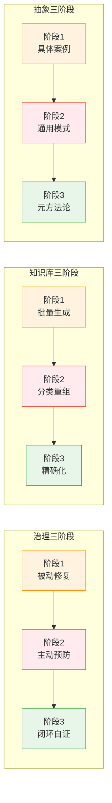

# 三阶段普遍规律：递进式演化原则

> 欲速则不达。顺序不可颠倒，跳过中间阶段必然导致返工或问题复发。

---

## 一、规律概述

在SpecWeave 13天实践中，多个独立领域都呈现出相同的三阶段递进演化模式：治理体系建设、知识库构建、抽象层级提升都严格遵循"第一阶段→第二阶段→第三阶段"的顺序，**任何阶段都不可跳过，顺序不可颠倒**。



**共同规律**：
- 第一阶段：解决"有没有"的问题——快速覆盖、建立基础、响应眼前需求
- 第二阶段：解决"好不好"的问题——建立结构、形成体系、防止问题复发
- 第三阶段：解决"能不能自举"的问题——形成闭环、可验证、可复用、可持续演化
- **核心铁律**：跳过第二阶段直接从第一阶段跳到第三阶段，必然导致返工或问题以变体形式复发

---

## 二、三个领域的三阶段模型

### 2.1 治理三阶段：修复→预防→闭环

| 阶段 | 目标 | 典型行为 | 跳过后果 |
|------|------|---------|---------|
| **阶段1：被动修复** | 解决当前暴露的问题 | 修复Bug、纠正错误、恢复正常状态 | — |
| **阶段2：主动预防** | 建立防复发机制 | 写检查脚本、加规则、加测试、更新反模式清单 | 问题以变体形式复发（如Mermaid治理经历回归） |
| **阶段3：闭环自证** | 证明治理有效 | 一站式入口、定期审计、验证预防机制生效 | 治理规则膨胀但无法验证有效性（治理熵增） |

**支撑证据**：
- Mermaid治理：修复渲染问题（阶段1）→ 安全编码五规则+检查脚本（阶段2）→ 一站式入口+治理闭环复盘（阶段3）
- 断链治理：批量修复断链（阶段1）→ check-links脚本（阶段2）→ 重构前影响范围分析+finalize-atomization工具（阶段3）

**详细SOP**：详见 [fix-prevent-close-loop.md](fix-prevent-close-loop.md)

### 2.2 知识库三阶段：生成→重组→精确化

| 阶段 | 目标 | 典型行为 | 跳过后果 |
|------|------|---------|---------|
| **阶段1：批量生成** | 快速覆盖广度 | 主题分组并行写作、接受不完美、快速产出 | — |
| **阶段2：分类重组** | 建立MECE结构 | 建立分类体系、导航索引、决策树 | 内容无法被发现、可复用性为零 |
| **阶段3：精确化** | 提升引用质量 | 将泛化引用精确化、修复断链、跨Wiki精确引用 | 导航链接失效、知识孤岛、引用可信度下降 |

**支撑证据**：
- 59个Wiki建设：先生成内容（阶段1，59个Wiki并行产出）→ 按8主题分类（阶段2，建立CATEGORIES.md和导航）→ 应用cross-wiki-reference-directory-first模式精确化引用（阶段3）

**反模式**：颠倒顺序"先精确再求广"——在批量生成阶段就追求引用精确化，会导致产出速度过慢，广度无法覆盖。

### 2.3 抽象三阶段：具体→通用→元方法

| 阶段 | 目标 | 典型行为 | 跳过后果 |
|------|------|---------|---------|
| **阶段1：具体案例** | 解决具体问题 | 针对单个事件复盘、解决特定场景问题 | — |
| **阶段2：通用模式** | 提炼可复用模式 | 从多个案例中萃取共性、形成模式文档 | 经验无法复用、每次都从零开始 |
| **阶段3：元方法论** | 方法论的方法论 | 萃取模式的模式、建立模式入库标准、自举能力 | 模式库膨胀但质量无法保证、无法自我演化 |

**支撑证据**：
- 复盘体系演化：事件级复盘（阶段1）→ 主题级复盘+模式萃取（阶段2）→ 项目级元方法论复盘（阶段3，本复盘即元方法论阶段产物）
- 模式成熟度：L1观察→L2验证→L3标准化（详见 [methodology-five-level-maturity.md](../docs/retrospective/patterns/methodology-patterns/retrospective-knowledge/methodology-five-level-maturity.md)）

---

## 三、为什么顺序不可颠倒？

### 3.1 跳过第二阶段的后果

**治理领域**：只修复不预防→"点修复偏误"——每次都在救火，同类问题反复出现，时间被耗尽。

**知识库领域**：只生成不重组→"信息垃圾堆"——内容很多但找不到、无法复用、读者迷失。

**抽象领域**：只解决具体问题不提炼模式→"重复劳动陷阱"——每次遇到类似问题都要重新思考，知识无法复利。

### 3.2 急于进入第三阶段的后果

**治理领域**：没有预防机制就想做"治理闭环"→"空中楼阁"——闭环需要能验证预防机制生效，没有预防机制就没有东西可以验证。

**知识库领域**：没有分类结构就想做精确引用→"无源之水"——引用精确化需要知道目标文档在哪一章，没有分类体系就无法定位。

**抽象领域**：没有足够案例就想做元方法论→"空洞理论"——元方法论是从多个通用模式中再萃取共性，案例不足时提炼的元方法缺乏支撑。

### 3.3 为什么必须按顺序？

1. **信息基础**：后一阶段需要前一阶段提供足够的"素材"——没有足够多的修复案例就不知道要预防什么；没有足够多的内容就不知道如何分类；没有足够多的模式就提炼不出元方法。
2. **认知成本**：第一阶段是"无意识的胜任"（做了但不知道为什么对），第二阶段是"有意识的胜任"（总结出规律），第三阶段是"元认知"（知道规律为什么成立、在什么条件下成立）。认知层级必须逐级提升。
3. **验证反馈**：每个阶段都为下一阶段提供验证反馈——第二阶段的预防措施来自第一阶段暴露的问题；第三阶段的精确化引用基于第二阶段的分类结构。

---

## 四、判断当前阶段的检查清单

### 判断你在哪个阶段

```
当前目标是什么？
├─ 解决眼前问题/快速产出/覆盖广度 → 第一阶段（不要急于进入第二阶段）
├─ 建立结构/防止复发/形成体系 → 第二阶段（不要跳过）
└─ 验证有效性/精确化/形成元方法 → 第三阶段（前两阶段完成后再进入）
```

### 第一阶段质量门（何时可以进入第二阶段？）

- [ ] 核心问题已解决/核心内容已覆盖
- [ ] 有足够多的案例/素材/样本供第二阶段提炼结构
- [ ] 不是"完美主义"导致停留在第一阶段——如果已经产出了足够多的内容，就该进入第二阶段

### 第二阶段质量门（何时可以进入第三阶段？）

- [ ] 结构/规则/体系已经建立
- [ ] 结构经过验证——按结构能找到东西、规则能拦截问题
- [ ] 不是"过度设计"导致停留在第二阶段——如果体系已经能工作，就该进入第三阶段验证

### 反模式识别

| 反模式 | 表现 | 纠正 |
|--------|------|------|
| **阶段1拖延症** | "还不够完美，再加点内容"——永远在生成/修复，不建立结构 | 设定阈值：同类问题出现≥3次必须建立预防；内容≥10篇必须分类 |
| **阶段2跳过症** | "这个问题我修好了"——只修复不预防；"内容写完了"——不建立分类导航 | 强制执行SOP：修复必须加预防；生成超过N篇必须重组 |
| **阶段3急躁症** | "我们需要一个完美的体系"——还没足够案例就想设计元方法论 | 先积累案例：至少3个独立场景验证后再提炼元方法 |

---

## 五、关联规范与模式

- [fix-prevent-close-loop.md](fix-prevent-close-loop.md)：治理三阶段在Bug修复领域的具体落地SOP
- [knowledge-base-three-stage.md](../docs/retrospective/patterns/methodology-patterns/document-architecture/knowledge-base-three-stage.md)：知识库三阶段模式文档
- [governance-three-stage-evolution.md](../docs/retrospective/patterns/methodology-patterns/governance-strategy/governance-three-stage-evolution.md)：治理三阶段模式文档
- [bootstrap-driven-self-evolution.md](../docs/retrospective/patterns/methodology-patterns/governance-strategy/bootstrap-driven-self-evolution.md)：规范自举性驱动持续演化（第三阶段"闭环自证"后的持续演化阶段）
- [global-core-rules.md](../global-core-rules.md)：全局核心规则（本原则作为全局规则引用）

---

## 六、Changelog

<!-- changelog -->
- 2026-07-05 | docs | 初始版本，基于SpecWeave 13天全生命周期复盘认知升级#6创建
