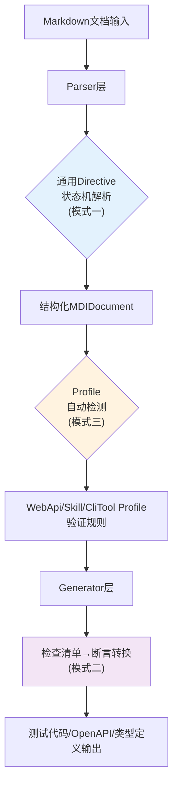

# MDI 模式应用指南

本指南说明MDI项目中应用的三个核心代码模式：Directive状态机解析、检查清单→断言转换、Profile自动检测。每个模式包含MDI中的具体实现位置、扩展方法、常见陷阱。

## 目录

1. [模式一：Directive参数状态机解析](#模式一directive参数状态机解析)
2. [模式二：检查清单→断言转换](#模式二检查清单断言转换)
3. [模式三：Profile自动检测](#模式三profile自动检测)
4. [扩展指南：新增Profile类型](#扩展指南新增profile类型)
5. [扩展指南：新增Directive类型](#扩展指南新增directive类型)
6. [扩展指南：自定义测试断言模板](#扩展指南自定义测试断言模板)

---

## 模式一：Directive参数状态机解析

> **模式文档**：[directive-state-machine-parsing.md](../../../docs/retrospective/patterns/code-patterns/directive-state-machine-parsing.md)

### MDI中的实现位置

| 文件 | 函数/类 | 职责 |
|------|---------|------|
| [parser.py](parser.py) | `_parse_directive_content()` (L649-L726) | 通用directive三阶段状态机解析 |
| [parser.py](parser.py) | `_DIRECTIVE_RE` (L25) | 首行匹配正则 |
| [parser.py](parser.py) | `_OPTION_LINE_RE` (L27) | 选项行匹配正则 |
| [parser.py](parser.py) | `BlockType.DIRECTIVE` | Directive块类型枚举 |

### MDI中支持的Directive类型

| Directive | 所属Profile | 选项键 | 说明 |
|-----------|-------------|--------|------|
| `{endpoint}` | webapi | `:summary :query :path :body :response` | REST API端点定义 |
| `{command}` | clitool | `:summary :arg :flag :option :exit` | CLI命令定义 |
| `{note}/{warning}/{tip}` | 通用 | `:warning:（可选标记）` | 提示块 |

### 实际应用示例

以user-api.md中的endpoint directive为例：

````markdown
```{endpoint} POST /auth/login
:summary: 用户登录获取access_token
:body username: string - Username or email (required)
:body password: string - Account password (required)
:response 200: AuthToken - Authentication successful
:response 401: ErrorResponse - Invalid credentials
```
````

解析过程：

1. **首行匹配**：`_DIRECTIVE_RE`匹配`{endpoint}`，提取`directive_name="endpoint"`，`args="POST /auth/login"`
2. **选项状态机**：逐行处理
   - 行`:summary: 用户登录...` → `options["summary"] = "用户登录获取access_token"`
   - 行`:body username: string - ...` → `options["body"]`列表追加参数
   - 行`:response 200: AuthToken - ...` → `options["response"]`列表追加响应
3. **空行结束**：遇到空行后body_start标记位置，剩余行拼接为body

### 新增Directive类型的正确做法

```python
# 在parser.py中特定directive处理部分添加新类型
def _parse_endpoint_directive(options, body):
    """webapi endpoint特定解析"""
    method, path = args.split(None, 1)
    # 处理:query/:path/:body前缀
    # 处理?可选标记
    return EndpointDirective(method=method, path=path, ...)

# 通用状态机不修改，保持三阶段结构
```

### 常见陷阱

❌ **错误**：修改`_parse_directive_content`通用状态机加入endpoint特定逻辑
```python
# 不要这样做！违反单一职责
if key == "body" and directive_name == "endpoint":
    # endpoint特定的body处理...
```

✅ **正确**：在状态机返回通用`(options, body)`后，由调用方做特定directive类型的二次解析

❌ **错误**：用单个大正则匹配所有内容
```python
# 不要这样做！无法处理多行、空行分隔、可选标记
_BAD_DIRECTIVE_RE = re.compile(
    r"^{(\w+)}\s+(\w+)\s+(\S+)\s+"
    r"((?::[\w]+\??:\s*.*\n)+)"  # 这无法正确处理边界
)
```

✅ **正确**：首行用简单正则，选项逐行状态机处理

---

## 模式二：检查清单→断言转换

> **模式文档**：[checklist-to-assertion-conversion.md](../../../docs/retrospective/patterns/code-patterns/checklist-to-assertion-conversion.md)

### MDI中的实现位置

| 文件 | 函数/类 | 职责 |
|------|---------|------|
| [checklist_converter.py](checklist_converter.py) | `convert_checklist_to_steps()` (L64-L93) | 主转换入口：分类+排序+生成 |
| [checklist_converter.py](checklist_converter.py) | `_classify_item()` (L36-L61) | 四级关键词分类器 |
| [checklist_converter.py](checklist_converter.py) | `_generate_assertion()` (L96-L160) | 专项正则断言代码生成 |
| [checklist_converter.py](checklist_converter.py) | `CheckItem`/`ChecklistStep` 数据类 | 结构化检查项/测试步骤 |
| [generators/pytest_gen.py](generators/pytest_gen.py) | pytest测试生成器 | 调用checklist_converter生成断言 |

### 四级分类关键词（MDI中文版）

```python
_PRE_KEYWORDS = ("前置", "准备", "before", "setup", "given", "前提", "登录", "认证")
_ASSERT_KEYWORDS = ("验证", "确认", "断言", "assert", "expect", "返回", "状态码", "包含", "字段")
_POST_KEYWORDS = ("后置", "清理", "teardown", "after", "cleanup")
# 其他 → note（注释）
```

### 专项正则提取（真实代码生成）

| 正则 | 匹配示例 | 生成Python代码 |
|------|---------|---------------|
| `(?:状态码\|status\s*code)[^\d]*?(\d{3})` | "验证返回状态码200" | `assert response.status_code == 200` |
| `(?:包含\|存在\|has\|contain)[^，。；]*?(?:字段\|field)[^，。；]*?([a-zA-Z_]\w*)` | "响应包含id字段" | `assert "id" in data` |
| `([a-zA-Z_]\w*)\s*(?:字段)?\s*(?:等于\|为\|是\|==?)\s*([^\`'"，。；]+)` | "status为success" | `assert data["status"] == "success"` |

### 实际应用示例

user-api.md中的checklist：

```markdown
## Checklist

- [x] Login endpoint returns 200 with valid credentials
- [x] Login endpoint returns 401 with invalid credentials
- [x] Register endpoint creates user with valid data
- [ ] Password reset flow
- [ ] Email verification after registration
```

转换后的pytest测试片段：

```python
# 前置步骤
# TODO: 实现前置步骤: prepare valid test user credentials

# 断言步骤
# [x] Login endpoint returns 200 with valid credentials
assert response.status_code == 200
# [x] Login endpoint returns 401 with invalid credentials
assert response.status_code == 401
# [x] Register endpoint creates user with valid data
# TODO: 实现断言逻辑: Register endpoint creates user with valid data

# 后置步骤
# TODO: 实现后置清理步骤

# 注释
# [ ] Password reset flow
# [ ] Email verification after registration
```

### 扩展断言提取规则

在`_generate_assertion()`中添加新的专项正则：

```python
# 新增：Content-Type断言
_content_type_re = re.compile(r"content-type[为是=:]\s*([\w/\-]+)", re.I)
m = _content_type_re.search(text)
if m:
    ct = _convert_python_value(m.group(1).strip())
    return f'assert response.headers.get("content-type") == "{ct}"'
```

### 常见陷阱

❌ **错误**：分类顺序错误——先匹配assert再匹配pre
```python
# 错误："前置条件应验证状态码"会被误分类为assert
for kw in _ASSERT_KEYWORDS:  # 错误顺序！
    if kw in text:
        return "assert"
```

✅ **正确**：按pre→post→assert顺序匹配，避免assert范围过宽误分类

❌ **错误**：所有检查项都生成assert，不做分类
- "前置登录"变成 `assert "登录" in response`（无意义）
- "清理测试数据"变成 `assert "清理" in response`（荒谬）

✅ **正确**：前置/后置生成TODO注释，只有明确断言关键词才生成assert代码

❌ **错误**：不做值类型转换
```python
# 错误："is_active为true" → assert data["is_active"] == "true"（字符串！）
return f'assert data["{field}"] == "{value}"'
```

✅ **正确**：通过`_convert_python_value()`转换为正确的Python字面量（True/False/None/int/float）

---

## 模式三：Profile自动检测

> **模式文档**：[profile-auto-detection.md](../../../docs/retrospective/patterns/code-patterns/profile-auto-detection.md)

### MDI中的实现位置

| 文件 | 函数 | 职责 |
|------|------|------|
| [profiles/__init__.py](profiles/__init__.py) | `detect_profile_type()` (L53-L103) | 五级优先级自动检测 |
| [profiles/__init__.py](profiles/__init__.py) | `get_profile()` (L33-L50) | 按类型获取Profile实例 |
| [profiles/__init__.py](profiles/__init__.py) | `_PROFILE_MAP` (L26-L30) | Profile类型注册表 |

### 五级检测优先级（MDI实现）

| 优先级 | 检测逻辑 | 置信度 | MDI代码位置 |
|--------|---------|--------|------------|
| P1 | frontmatter `type`字段显式声明 | 极高 | L74-L78 |
| P2 | frontmatter特征字段：`baseUrl`→webapi, `argument-hint/user-invocable/paths`→skill | 高 | L80-L86 |
| P3 | 文件名/路径：`SKILL.md`→skill, 含`cli/command`→clitool | 中 | L88-L95 |
| P4 | 内容正则：`` `(GET\|POST\|PUT\|PATCH\|DELETE)\s+/ `` → webapi | 低 | L97-L101 |
| P5 | 默认值 → skill | - | L103 |

### 实际检测案例

| 文件 | 命中优先级 | 检测结果 | 命中原因 |
|------|-----------|---------|---------|
| user-api.md | P1→webapi | ✅ webapi | frontmatter有`type: webapi` |
| todo-api-v1.md | P4→webapi | ✅ webapi | 内容有`GET /todos` |
| file-cli.md | P1→clitool/P3→clitool | ✅ clitool | frontmatter有`type: clitool`且文件名含cli |
| SKILL.md（假设） | P3→skill | ✅ skill | 文件名为SKILL.md大写 |

### 新增Profile类型的扩展点

1. **在`profiles/`下创建新Profile类**：
```python
# profiles/graphql_profile.py
from .base import BaseProfile

class GraphQLProfile(BaseProfile):
    name = "graphql"
    # 实现section_patterns、validation_rules等
```

2. **在`_PROFILE_MAP`中注册**：
```python
from .graphql_profile import GraphQLProfile

_PROFILE_MAP: dict[str, type[BaseProfile]] = {
    "skill": SkillProfile,
    "webapi": WebApiProfile,
    "clitool": CliToolProfile,
    "graphql": GraphQLProfile,  # 新增
}
```

3. **在`detect_profile_type()`中添加检测规则**：
```python
# P2: frontmatter特征字段
graphql_indicators = {"schema", "query-type", "mutation-type"}
if graphql_indicators & fm_keys_lower:
    return "graphql"

# P3: 文件名特征
if "graphql" in name_lower or "gql" in name_lower:
    return "graphql"

# P4: 内容特征
if "type Query {" in full_text_lower or "type Mutation {" in full_text_lower:
    return "graphql"
```

### 常见陷阱

❌ **错误**：检测优先级顺序错误——P4内容特征在P1显式声明之前
```python
# 错误：内容里偶然出现GET单词就覆盖用户显式声明
if re.search(r"GET\s+/", full_text):  # 放在最前面！
    return "webapi"
fm_type = doc.frontmatter.get("type", "")  # 用户声明被忽略
```

✅ **正确**：P1（显式声明）必须在最前面，用户意图高于一切自动推断

❌ **错误**：所有信号同等权重投票
```python
# 错误：简单计数——1个弱信号推翻3个强信号
votes = {"webapi": 0, "skill": 0, "clitool": 0}
if "baseUrl" in fm: votes["webapi"] += 1
if "GET" in content: votes["webapi"] += 1  # 偶然出现也投票
if "cli" in filename: votes["clitool"] += 1
# 多数决，但弱信号可能决定结果
```

✅ **正确**：严格优先级链，高优先级命中立即返回，不继续检查低优先级

❌ **错误**：没有默认值兜底，所有信号都不匹配时直接报错
- 用户写了一个全新格式的文档
- 没有任何已知特征
- 工具直接崩溃退出

✅ **正确**：返回最通用的默认类型（MDI默认skill），保证工具能继续运行，可输出警告提示用户显式指定

❌ **错误**：检测逻辑散落在parser/validator/generator各处
- parser里写了一份类型判断
- validator里又写了一份
- generator里再写一份
- 新增类型时改不全，行为不一致

✅ **正确**：`detect_profile_type()`是唯一检测入口，所有组件统一调用

---

## 扩展指南：新增Profile类型

本章节提供新增Profile类型的完整checklist。假设要新增`graphql`Profile支持GraphQL Schema文档。

### Step 1：创建Profile类

```
profiles/graphql_profile.py
```

继承`BaseProfile`，实现：
- `name`类属性
- `section_patterns`：章节识别正则
- `validation_rules`：验证规则列表

参考：[webapi_profile.py](profiles/webapi_profile.py)、[clitool_profile.py](profiles/clitool_profile.py)

### Step 2：注册到Profile Map

编辑 [profiles/__init__.py](profiles/__init__.py)：

1. 添加import
2. 在`_PROFILE_MAP`添加条目
3. 在`detect_profile_type()`中添加检测规则（按P1-P5优先级）

### Step 3：创建Directive解析（如需要）

如果GraphQL需要新的directive类型（如`{query}`、`{mutation}`）：
- 在parser.py中添加directive_name识别
- 创建对应的解析函数处理特定选项
- **不要修改通用`_parse_directive_content`状态机**

### Step 4：创建Generator（如需要）

如果需要生成GraphQL特定的输出格式：
- 在`generators/`下创建新生成器
- 继承`BaseGenerator`
- 在`generator.py`中注册

### Step 5：创建测试示例

在`examples/`下添加示例文档：
- `examples/graphql-schema.md`
- 包含directive和checklist
- 运行 `python -m mdi validate examples/graphql-schema.md` 验证

### Step 6：扩展Checklist分类（如需要）

如果GraphQL测试有特殊的前置/断言关键词，在 [checklist_converter.py](checklist_converter.py) 中添加：
- 更新`_PRE_KEYWORDS`/`_ASSERT_KEYWORDS`
- 在`_generate_assertion()`中添加GraphQL特定断言正则

---

## 扩展指南：新增Directive类型

假设要在webapi profile中新增`{websocket}`directive支持WebSocket端点。

### Step 1：确定Directive语法

````markdown
```{websocket} /ws/chat
:summary: 实时聊天WebSocket连接
:query token: string - 认证token (required)
:message ChatMessage: 发送消息格式
:message UserTyping: 用户输入中状态
:close 1000: 正常关闭
:close 1008: 认证失败
```
````

### Step 2：使用通用状态机解析

**不需要修改**`_parse_directive_content()`！该函数返回的通用结构已经足够：

```python
options, body = self._parse_directive_content(content, start_line)
# options = {
#   "summary": "实时聊天WebSocket连接",
#   "query": [("token", "string", "认证token", False)],
#   "message": [("ChatMessage", "发送消息格式"), ("UserTyping", ...)],
#   "close": [("1000", "正常关闭"), ("1008", "认证失败")],
# }
# body = 空行后的正文内容
```

### Step 3：在特定解析层处理新类型

在endpoint解析逻辑处添加websocket分支：

```python
if directive_name == "websocket":
    return self._parse_websocket_directive(args, options, body)
```

创建`_parse_websocket_directive()`处理`:message :close`等特定选项。

### Step 4：更新Validator规则

在webapi_profile的validation_rules中添加websocket验证规则。

### Step 5：更新Generators

在生成器（openapi_gen、typescript_gen等）中添加WebSocket端点的代码生成逻辑。

---

## 扩展指南：自定义测试断言模板

### 添加新的专项断言正则

在 [checklist_converter.py](checklist_converter.py) `_generate_assertion()`函数中添加：

```python
# 示例：响应时间断言
_RESPONSE_TIME_RE = re.compile(
    r"响应时间[<少于]\s*(\d+)\s*ms", re.I
)
m = _RESPONSE_TIME_RE.search(text)
if m:
    ms = int(m.group(1))
    return f"assert response.elapsed.total_seconds() < {ms / 1000}"

# 示例：响应头存在
_HEADER_EXISTS_RE = re.compile(
    r"响应[包含]?(?:头|header)\s*[`\"']?([\w-]+)[`\"']?", re.I
)
m = _HEADER_EXISTS_RE.search(text)
if m:
    header = m.group(1)
    return f'assert "{header}" in response.headers'
```

### 为不同语言生成器扩展

pytest_gen.py当前调用`convert_checklist_to_steps(text)`后直接用`step.code`。如果要为Jest/TypeScript等其他语言生成断言：

1. 在`checklist_converter.py`中添加`language`参数
2. 在`_generate_assertion()`中根据language选择代码模板
3. 或者在各generator中对ChecklistStep做二次转换（推荐：保持核心逻辑语言无关）

---

## 模式间协作关系

三个模式在MDI中不是孤立存在的，它们协作形成完整的解析→验证→生成链：



**协作示例**：解析user-api.md时：
1. 模式一解析所有`{endpoint}` directive为结构化参数
2. 模式三通过frontmatter `type: webapi`（P1优先级）检测为webapi profile
3. webapi profile验证规则检查endpoint定义完整性
4. 生成pytest测试时，模式二将Checklist转换为真实断言代码

---

## 快速Reference Card

### 三模式一句话总结

| 模式 | 一句话 | 不要做 |
|------|--------|--------|
| Directive状态机 | 首行正则+逐行选项状态机+空行分隔正文 | 单一大正则，在通用层写特定逻辑 |
| Checklist→Assertion | 四级关键词分类+专项正则提取+TODO兜底 | 全转assert，不分类，不做类型转换 |
| Profile自动检测 | 五级优先级链（显式→强特征→路径→内容→默认） | 投票制，用户声明被覆盖，无默认值 |

### 扩展MDI时的关键检查点

- [ ] 新增directive类型是否保持了通用状态机不变？
- [ ] 新增Profile类型是否在5个优先级都添加了检测规则？
- [ ] 新增断言正则是否考虑了中英文混合？
- [ ] 是否保留了TODO兜底机制，不会因为无法解析就崩溃？
- [ ] 检测/分类/解析逻辑是否集中在单一入口，没有散落到多处？
- [ ] 是否添加了examples/下的测试文档？

---

## Changelog

<!-- changelog -->
- 2026-07-02 | docs | v1.0：初始版本，包含三个模式的MDI具体应用、扩展指南、参考卡片

## 相关模式

- [Mermaid分层可视化](../../../docs/retrospective/patterns/methodology-patterns/document-architecture/mermaid-layered-visualization.md)
- [Mermaid安全编码规则](../../../docs/retrospective/patterns/code-patterns/mermaid-safe-coding-rules.md)
