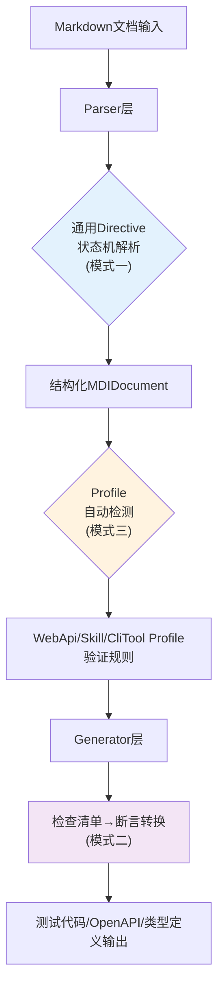

# MDI 模式应用指南

本指南说明MDI项目中应用的三个核心代码模式：Directive状态机解析、检查清单→断言转换、Profile自动检测。每个模式包含MDI中的具体实现位置、扩展方法、常见陷阱。

## 文档导航

| 文档 | 主题 | 行数 |
|------|------|------|
| [docs/01-pattern-directive-state-machine.md](docs/01-pattern-directive-state-machine.md) | 模式一：Directive参数状态机解析 | ~85 |
| [docs/02-pattern-checklist-to-assertion.md](docs/02-pattern-checklist-to-assertion.md) | 模式二：检查清单→断言转换 | ~110 |
| [docs/03-pattern-profile-auto-detection.md](docs/03-pattern-profile-auto-detection.md) | 模式三：Profile自动检测 | ~115 |
| [docs/04-extending-profiles.md](docs/04-extending-profiles.md) | 扩展指南：新增Profile类型 | ~55 |
| [docs/05-extending-directives.md](docs/05-extending-directives.md) | 扩展指南：新增Directive类型 | ~55 |
| [docs/06-custom-assertion-templates.md](docs/06-custom-assertion-templates.md) | 扩展指南：自定义测试断言模板 | ~40 |

---

## 模式间协作关系

三个模式在MDI中不是孤立存在的，它们协作形成完整的解析→验证→生成链：

**协作示例**：解析user-api.md时：
1. 模式一解析所有`{endpoint}` directive为结构化参数
2. 模式三通过frontmatter `type: webapi`（P1优先级）检测为webapi profile
3. webapi profile验证规则检查endpoint定义完整性
4. 生成pytest测试时，模式二将Checklist转换为真实断言代码

---

## 快速Reference Card

### 三模式一句话总结

| 模式 | 一句话 | 不要做 |
|------|--------|--------|
| Directive状态机 | 首行正则+逐行选项状态机+空行分隔正文 | 单一大正则，在通用层写特定逻辑 |
| Checklist→Assertion | 四级关键词分类+专项正则提取+TODO兜底 | 全转assert，不分类，不做类型转换 |
| Profile自动检测 | 五级优先级链（显式→强特征→路径→内容→默认） | 投票制，用户声明被覆盖，无默认值 |

### 扩展MDI时的关键检查点

- [ ] 新增directive类型是否保持了通用状态机不变？
- [ ] 新增Profile类型是否在5个优先级都添加了检测规则？
- [ ] 新增断言正则是否考虑了中英文混合？
- [ ] 是否保留了TODO兜底机制，不会因为无法解析就崩溃？
- [ ] 检测/分类/解析逻辑是否集中在单一入口，没有散落到多处？
- [ ] 是否添加了examples/下的测试文档？

---

## Changelog

<!-- changelog -->
- 2026-07-02 | refactor | 原子化拆分：将527行单文件拆分为索引+6个原子文档（docs/01~06），每个文档单一主题
- 2026-07-02 | docs | v1.0：初始版本，包含三个模式的MDI具体应用、扩展指南、参考卡片

## 相关模式

- [Mermaid分层可视化](../../../docs/retrospective/patterns/methodology-patterns/document-architecture/mermaid-layered-visualization.md)
- [Mermaid安全编码规则](../../../docs/retrospective/patterns/code-patterns/mermaid-safe-coding-rules.md)
