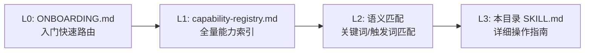

# .agents/skills/ 目录索引

本目录存放 SpecWeave 项目中所有 Skill 定义。Skill 分为三类：

- **完整Skill**：包含完整的自动化操作能力（脚本、MCP工具调用等），可独立完成任务
- **命令集门面**：对 `.agents/commands/` 命令集的轻量封装，提供触发词、决策树、快速开始和安全检查
- **脚本命令门面**：对 `.agents/scripts/` 高频自动化脚本的封装，提供参数说明、dry-run安全机制和错误处理

## Skill 列表

### 命令集门面（7个）

| Skill名称 | 类型 | 对应命令集 | 核心触发词 | SKILL.md路径 |
|-----------|------|-----------|-----------|-------------|
| retrospective-cmd | 命令门面 | 复盘 | 复盘、retrospective、回顾、总结经验、项目总结 | [retrospective-cmd/SKILL.md](retrospective-cmd/SKILL.md) |
| insight-cmd | 命令门面 | 洞察 | 洞察、insight、分析问题、诊断问题、找原因、根因分析 | [insight-cmd/SKILL.md](insight-cmd/SKILL.md) |
| pattern-extraction-cmd | 命令门面 | 模式萃取 | 模式沉淀、萃取模式、模式入库、可复用模式、pattern extraction | [pattern-extraction-cmd/SKILL.md](pattern-extraction-cmd/SKILL.md) |
| export-report-cmd | 命令门面 | 导出报告 | 导出、export、生成报告、导出报告、输出报告 | [export-report-cmd/SKILL.md](export-report-cmd/SKILL.md) |
| atomization-cmd | 命令门面 | 原子化 | 原子化、atomization、拆分文件、拆分文档、整理文件 | [atomization-cmd/SKILL.md](atomization-cmd/SKILL.md) |
| atomic-commit-cmd | 命令门面 | 原子提交 | 提交、commit、原子提交、提交代码、保存更改 | [atomic-commit-cmd/SKILL.md](atomic-commit-cmd/SKILL.md) |
| mermaid-cmd | 命令门面 | Mermaid图表管理 | mermaid、流程图、时序图、状态图、画个图、图表、架构图、思维导图 | [mermaid-cmd/SKILL.md](mermaid-cmd/SKILL.md) |

### 完整Skill（2个）

| Skill名称 | 类型 | 功能描述 | 核心触发词 | SKILL.md路径 |
|-----------|------|---------|-----------|-------------|
| forum-posting | 完整Skill | Discourse论坛自动化操作（发帖、编辑、回复、清理草稿等），支持双方案（MCP+Playwright脚本） | 发帖、编辑帖子、回复帖子、forum.trae.cn、forum-bot | [forum-posting/SKILL.md](forum-posting/SKILL.md) |
| home-assistant | 完整Skill | Home Assistant智能家居系统集成（设备控制、状态查询、服务调用），REST API交互 | 智能家居、控制设备、查询状态、home assistant、ha_api | [home-assistant/SKILL.md](home-assistant/SKILL.md) |

### 脚本命令门面（5个）

| Skill名称 | 类型 | 对应脚本 | 核心触发词 | SKILL.md路径 |
|-----------|------|---------|-----------|-------------|
| link-check-cmd | 脚本门面 | check-links.py | 链接检查、断链修复、验证链接、提交前检查 | [link-check-cmd/SKILL.md](link-check-cmd/SKILL.md) |
| atomization-finalize-cmd | 脚本门面 | finalize-atomization.py | 原子化收尾、一键收尾、文件移动后处理、断链修复导航更新 | [atomization-finalize-cmd/SKILL.md](atomization-finalize-cmd/SKILL.md) |
| docgen-cmd | 脚本门面 | docgen.py | 更新导航、刷新看板、生成文档索引、docgen、更新README | [docgen-cmd/SKILL.md](docgen-cmd/SKILL.md) |
| ci-check-cmd | 脚本门面 | ci-check.ps1/ci-check.sh | CI检查、提交前检查、综合检查、流水线检查、全量检查、pre-commit | [ci-check-cmd/SKILL.md](ci-check-cmd/SKILL.md) |
| check-duplication-cmd | 脚本门面 | check-duplication.py | 重复代码、重复检查、代码重复、提取共享库、DRY检查、脚本重复 | [check-duplication-cmd/SKILL.md](check-duplication-cmd/SKILL.md) |

## 模板

| 文件 | 用途 | 路径 |
|------|------|------|
| SKILL-TEMPLATE.md | Skill创建模板，包含五要素模型骨架 | [SKILL-TEMPLATE.md](SKILL-TEMPLATE.md) |

## Skill 结构规范

每个Skill遵循以下目录结构（遵循 vendor skill-creator 规范）：

```
.agents/skills/<skill-name>/
├── SKILL.md          # 必需：技能定义（YAML frontmatter + Markdown）
├── scripts/          # 可选：可执行脚本
├── references/       # 可选：参考文档（按需加载）
└── assets/           # 可选：模板、图标等资源
```

SKILL.md 必须包含五要素：
1. **Trigger-Ready Description**：触发就绪描述（YAML frontmatter 中的 description）
2. **Decision Tree**：方案决策树（多方案时必须提供）
3. **Progressive Disclosure**：渐进式披露（正文≤500行，低频内容引用外部文档）
4. **Why-Explanation**：设计意图解释（关键规则后用 `> **为什么？**` 说明）
5. **Safety Checklist**：安全检查清单（写操作必须包含dry-run/幂等/验证）

## 发现机制（L0-L3）

Skill通过四层发现机制被Agent发现：



- **L0 入口**：[ONBOARDING.md](../ONBOARDING.md) — 新会话快速开始
- **L1 索引**：[capability-registry.md](../capability-registry.md) — 全量能力静态索引
- **L3 详情**：各SKILL.md — 具体操作步骤与安全检查

## 创建新 Skill

1. 复制 [SKILL-TEMPLATE.md](SKILL-TEMPLATE.md) 到 `<skill-name>/SKILL.md`
2. 阅读 [skill-development.md](../rules/skill-development.md) 了解SpecWeave补充规范
3. 阅读 vendor [skill-creator/SKILL.md](../../vendor/flexloop/apps/chaos/.agents/skills/skill-creator/SKILL.md) 了解权威方法论
4. 完成后运行 `python .agents/scripts/check-skill-quality.py <skill-name>` 验证质量
5. 更新本索引和 [capability-registry.md](../capability-registry.md)

## Changelog

- **v1.4** (2026-07-01): 新增pattern-extraction-cmd命令集门面（第7个），基于markdown-as-interface五要素模型，封装从复盘/洞察中萃取可复用模式的标准化流程，整合pattern-maturity.py/check-pattern-quality.py/pattern-maturity-stats.py三个现有自动化脚本，提供可复用三标准质量门、目录分类决策树、标准frontmatter模板和12项安全检查清单。
- **v1.3** (2026-06-30): 新增2个脚本命令门面（ci-check-cmd、check-duplication-cmd），完成第一批5个高频脚本Skill化。ci-check-cmd封装CI/CD流水线8步综合检查（跨平台.ps1/.sh双版本）；check-duplication-cmd封装跨文件重复代码检测（N元语法指纹算法）。
- **v1.2** (2026-06-30): 新增3个脚本命令门面（link-check-cmd、atomization-finalize-cmd、docgen-cmd），补充home-assistant完整Skill索引；Skill分类从两类扩展为三类（增加脚本命令门面）。
- **v1.1** (2026-06-30): 新增mermaid-cmd命令门面（第6个），提供Mermaid图表生成/检查/修复/协作全流程能力。
- **v1.0** (2026-06-29): 初始版本，包含5个命令集门面 + 1个完整Skill + SKILL-TEMPLATE模板。基于Skill发现协议SOP的P0实施路径创建。
