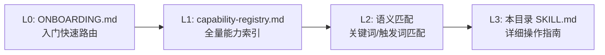

# .agents/skills/ 目录索引

本目录存放 SpecWeave 项目中所有 Skill 定义。Skill 分为六类：

- **完整Skill**：包含完整的自动化操作能力（脚本、MCP工具调用等），可独立完成任务
- **工作流门面**：对 `docs/retrospective/patterns/` 方法论模式的触发封装（L1 门面 + L2 模式文档），提供触发词、阶段流程、质量门与安全清单
- **命令集门面**：对 `.agents/commands/` 命令集的轻量封装，提供触发词、决策树、快速开始和安全检查
- **脚本命令门面**：对 `.agents/scripts/` 高频自动化脚本的封装，提供参数说明、dry-run安全机制和错误处理
- **内置镜像 Skill**：Trae IDE 内置技能的镜像入库（原貌保留，frontmatter source 溯源），用于项目自托管与统一发现
- **设计库镜像 Skill**：Trae IDE 内置设计系统库的完整归档（token CSS/组件 JSON/预览 HTML/UI Kit 全量自包含，frontmatter source 溯源），不依赖外部源目录

## Skill 列表

### 命令集门面（10个）

| Skill名称 | 类型 | 对应命令集 | 核心触发词 | SKILL.md路径 |
|-----------|------|-----------|-----------|-------------|
| ⭐ seven-concepts-cmd | 命令门面 | 方法论编排（基于七概念） | 方法论编排、用方法论、系统性分析、完整流程、七概念（别名） | [seven-concepts-cmd/SKILL.md](seven-concepts-cmd/SKILL.md) |
| retrospective-cmd | 命令门面 | 复盘 | 复盘、retrospective、回顾、总结经验、项目总结 | [retrospective-cmd/SKILL.md](retrospective-cmd/SKILL.md) |
| insight-cmd | 命令门面 | 洞察 | 洞察、insight、分析问题、诊断问题、找原因、根因分析 | [insight-cmd/SKILL.md](insight-cmd/SKILL.md) |
| extraction-cmd | 命令门面 | 萃取 | 萃取、extraction、模式沉淀、模式入库、可复用模式、沉淀为模式 | [extraction-cmd/SKILL.md](extraction-cmd/SKILL.md) |
| export-report-cmd | 命令门面 | 导出报告 | 导出、export、生成报告、导出报告、输出报告 | [export-report-cmd/SKILL.md](export-report-cmd/SKILL.md) |
| atomization-cmd | 命令门面 | 原子化 | 原子化、atomization、拆分文件、拆分文档、整理文件 | [atomization-cmd/SKILL.md](atomization-cmd/SKILL.md) |
| atomic-commit-cmd | 命令门面 | 原子提交 | 提交、commit、原子提交、提交代码、保存更改 | [atomic-commit-cmd/SKILL.md](atomic-commit-cmd/SKILL.md) |
| mermaid-cmd | 命令门面 | Mermaid图表管理 | mermaid、流程图、时序图、状态图、画个图、图表、架构图、思维导图 | [mermaid-cmd/SKILL.md](mermaid-cmd/SKILL.md) |
| token-optimize-cmd | 命令门面 | Token优化 | Token优化、降本、成本优化、缓存命中率、上下文压缩、Prompt优化、LLM成本 | [token-optimize-cmd/SKILL.md](token-optimize-cmd/SKILL.md) |
| ~~pattern-extraction-cmd~~ | ~~命令门面~~ | ~~模式萃取（已废弃，由extraction-cmd替代）~~ | ~~模式沉淀、萃取模式~~ | ~~[pattern-extraction-cmd/SKILL.md](pattern-extraction-cmd/SKILL.md)~~ |

### 完整Skill（3个）

| Skill名称 | 类型 | 功能描述 | 核心触发词 | SKILL.md路径 |
|-----------|------|---------|-----------|-------------|
| forum-posting | 完整Skill | Discourse论坛自动化操作（发帖、编辑、回复、清理草稿等），支持双方案（MCP+Playwright脚本） | 发帖、编辑帖子、回复帖子、forum.trae.cn、forum-bot | [forum-posting/SKILL.md](forum-posting/SKILL.md) |
| home-assistant | 完整Skill | Home Assistant智能家居系统集成（设备控制、状态查询、服务调用），REST API交互 | 智能家居、控制设备、查询状态、home assistant、ha_api | [home-assistant/SKILL.md](home-assistant/SKILL.md) |
| git-commit-helper | 完整Skill | Git原子化提交规范执行（三查暂存法→预提交验证→构建提交信息→执行提交→验证结果），含validate_commit.py | 提交、commit、原子提交、代码提交、提交变更、git commit、保存更改 | [git-commit-helper/SKILL.md](git-commit-helper/SKILL.md) |

### 工作流门面（2个）

| Skill名称 | 类型 | 功能描述 | 核心触发词 | SKILL.md路径 |
|-----------|------|---------|-----------|-------------|
| source-code-to-okf-wiki | 工作流门面 | 源码阅读→OKF Wiki 生成（R→I→E→V→C 五阶段，信源先行、分批生成、Grep级API验证，杜绝虚构API） | 源码学习、读源码、源码阅读、生成Wiki、OKF Wiki、源码转文档、深度学一个库 | [source-code-to-okf-wiki/SKILL.md](source-code-to-okf-wiki/SKILL.md) |
| blog-article-to-okf-wiki | 工作流门面 | 博文/资讯文章→OKF 知识包转化（七阶段：敏感度预检→骨架两问→归属决策树→F编号事实+P0核验勘误四清单→三层拆分→信源先生成→对抗审查），13篇实战验证 | 博文转化、公众号文章、微信文章、转知识包、OKF bundle、OKF wiki、文章转文档、资讯转知识库 | [blog-article-to-okf-wiki/SKILL.md](blog-article-to-okf-wiki/SKILL.md) |

### 应用内置完整Skill（2个，来自 apps/zhujian-wudao）

| Skill名称 | 类型 | 功能描述 | 核心触发词 | SKILL.md路径 |
|-----------|------|---------|-----------|-------------|
| zhujian-insight-writer | 应用完整Skill | 为竹简悟道撰写基于帛书《老子》的哲学洞察（编号递增、结构规范、交叉引用完整），遵循三不铁律 | 撰写洞察、生成洞察、分析概念、补充洞察库、体道四法 | [apps/zhujian-wudao/.agents/skills/zhujian-insight-writer/SKILL.md](../../apps/zhujian-wudao/.agents/skills/zhujian-insight-writer/SKILL.md) |
| dao-scholar-illustrations | 应用完整Skill | 生成道德经学者风格的中文哲学正文配图（极简手绘、墨色线条、留白美学），含九种构图模式 | 配图、文章插图、道德经学者、手绘、shot list、道家哲学配图 | [apps/zhujian-wudao/.agents/skills/dao-scholar-illustrations/SKILL.md](../../apps/zhujian-wudao/.agents/skills/dao-scholar-illustrations/SKILL.md) |

### Trae 内置工作流 Skill（2个，来自 external/doutops）

| Skill名称 | 类型 | 功能描述 | 核心触发词 | SKILL.md路径 |
|-----------|------|---------|-----------|-------------|
| TRAE-plan-mode | 内置工作流 | 有界仓库变更的规划-批准-执行工作流（单一实施计划+一次批准门，批准前禁写），计划落盘 `.trae/documents/` | 规划、实施计划、plan mode、计划批准、先规划后执行、有界变更 | [TRAE-plan-mode/SKILL.md](TRAE-plan-mode/SKILL.md) |
| TRAE-spec-mode | 内置工作流 | 复杂变更端到端规范工作流（Specify→Plan→Approve→Implement→Review 五阶段，spec/tasks/review 三产物落盘 `.trae/specs/`，rule/rubric 验收词汇+独立 Review 门，支持中断恢复） | 规范模式、spec mode、需求澄清、验收标准、任务队列、独立审查、恢复中断工作流 | [TRAE-spec-mode/SKILL.md](TRAE-spec-mode/SKILL.md) |

> 两者互为选型路由：有界变更→plan，复杂/高影响/跨会话→spec。派生自 Trae 内置 doutops skill（`external/` 非 git 目录），已适配为中文五要素版，source 字段记录原始路径；Trae 同步覆盖后以本仓库版本为准。

### 内置镜像 Skill（21个，来自 Trae IDE builtin 镜像）

Trae IDE 内置通用技能镜像入库（扁平去重取最全版，2026-09-03 导入）。来源目录 external/dao/xinzo/.trae-cn/builtin/{work,global,design,code}，每个 SKILL.md 的 frontmatter `source` 字段标注原始路径；镜像保留技能包原貌（含 LICENSE/scripts/assets），不随 Trae 同步改写。导入清单见 .trae/specs/import-builtin-skills/migration-manifest.md。

**work 家族：办公文档（8个）**

| 技能名 | 来源家族 | 功能描述 | SKILL.md路径 |
|--------|---------|---------|-------------|
| doc-writing-guide | work（办公文档） | 文档/内容写作主技能（PRD、技术提案、研究报告、竞品分析、手册等），管理意图解读、体裁格式选择、写作风格校准、内容结构编排与子场景路由 | [SKILL.md](doc-writing-guide/SKILL.md) |
| docx | work（办公文档） | .docx 专业文档创建/编辑/分析：修订追踪（tracked changes）、批注、格式保留与文本提取 | [SKILL.md](docx/SKILL.md) |
| html-deck | work（办公文档） | 从零创建动画丰富的 HTML 演示文稿（自包含单 HTML 文件、多端像素级一致）；用户说 PPT/ppt 时路由至 pptx，交付物恒为 HTML | [SKILL.md](html-deck/SKILL.md) |
| html-report | work（办公文档） | 创建除幻灯片外的任意自包含 HTML 交付物：研究报告、白皮书、PRD、仪表盘、作品集、简历、邮件模板、数据可视化等，零外部依赖 | [SKILL.md](html-report/SKILL.md) |
| pdf | work（办公文档） | PDF 综合处理工具包：提取文本与表格、创建新 PDF、合并/拆分文档、表单处理，支撑规模化程序化处理与分析 | [SKILL.md](pdf/SKILL.md) |
| pptx | work（办公文档） | .pptx 演示文稿创建、编辑与分析：新建、内容修改、版式调整、批注与演讲者备注等 | [SKILL.md](pptx/SKILL.md) |
| research-guide | work（办公文档） | 研究/分析场景主技能：检索查证、技术/产品对比、竞品分析、研究报告撰写，提供信源分级、交叉验证方法论、搜索范式与子场景路由 | [SKILL.md](research-guide/SKILL.md) |
| xlsx | work（办公文档） | 电子表格为主输入/输出时的技能：读写/编辑/修复 .xlsx/.xlsm/.csv/.tsv、新建表格、格式转换、清洗杂乱数据；交付物必须为表格文件 | [SKILL.md](xlsx/SKILL.md) |

**global 家族：通用（6个）**

| 技能名 | 来源家族 | 功能描述 | SKILL.md路径 |
|--------|---------|---------|-------------|
| digital-avatar-creator | global（通用） | 创建数字分身（Avatar）技能的强制工具：生成以自主 SubAgent 运行、按专长独立处理用户请求的虚拟角色/助手 | [SKILL.md](digital-avatar-creator/SKILL.md) |
| dynamic-ui | global（通用） | 在文字回答旁内联展示可视化内容（图表、架构图、交互 demo、对比分析），仅当紧凑可视化使回答更清晰时使用；不用于网站/应用/报告/看板/幻灯片 | [SKILL.md](dynamic-ui/SKILL.md) |
| TRAE-browseruse | global（通用） | 浏览器自动化指南：浏览网站、访问 URL、抓取网页内容、测试前端 UI 及多步交互（点击、验证元素、填写表单） | [SKILL.md](TRAE-browseruse/SKILL.md) |
| TRAE-browseruse-external | global（通用） | 在用户本机 Chrome（外部浏览器）中自动化任务（经 TRAE Chrome 扩展路由 native 模式），响应「用我的浏览器打开」类请求 | [SKILL.md](TRAE-browseruse-external/SKILL.md) |
| TRAE-code-mode-orchestrator | global（通用） | Code Mode（Exec）使用模式：并行扇出、JS 变换流水线、条件分支、循环直到条件、多源聚合等单脚本多工具编排场景 | [SKILL.md](TRAE-code-mode-orchestrator/SKILL.md) |
| TRAE-computer-use | global（通用） | 通过 Computer Use 控制本地应用 UI：读取屏幕并点击、输入、滚动、拖拽、按键、设置值，高风险操作前需用户确认 | [SKILL.md](TRAE-computer-use/SKILL.md) |

**design 家族：设计（4个）**

| 技能名 | 来源家族 | 功能描述 | SKILL.md路径 |
|--------|---------|---------|-------------|
| design-library-creator | design（设计） | 创建/扩展/精炼专业设计库与设计系统（结构化 token 架构、主题创建）；仅显式提及设计系统术语或提供 design-spec bundle 时触发，素材/页面类意图路由至 solo-design | [SKILL.md](design-library-creator/SKILL.md) |
| solo-design | design（设计） | 设计网站页面、UI 界面、原型、页面级视觉系统及既有 .design 项目改版；位图编辑/海报生成/设计库分别路由至三姊妹技能 | [SKILL.md](solo-design/SKILL.md) |
| solo-graphic-generation | design（设计） | 位图优先静态视觉资产生成（海报、横幅、KV、封面、插画、产品图、图片批次，无需 HTML）；生成前须确认输出尺寸 | [SKILL.md](solo-graphic-generation/SKILL.md) |
| solo-image-edit | design（设计） | 以图生图（image-to-image）编辑既有位图，所有保留结果写回所属 .design 画布 | [SKILL.md](solo-image-edit/SKILL.md) |

**code 家族：基建（3个）**

| 技能名 | 来源家族 | 功能描述 | SKILL.md路径 |
|--------|---------|---------|-------------|
| feedback | code（基建） | 仅用于显式 TRAE 反馈提交意图（/feedback 或宿主注入 Use Skill: feedback），将反馈转化为最小 feedback JSON；仅提及 feedback/bug 不触发 | [SKILL.md](feedback/SKILL.md) |
| skill-creator | code（基建） | 创建 SKILL 的强制工具：用户想创建/新增任何技能时必须立即调用 | [SKILL.md](skill-creator/SKILL.md) |
| TRAE-product-knowledge | code（基建） | TRAE 品牌与官方产品知识问答：产品差异、TraeCode/TraeWork/CLI/Plugin 入口、能力、MCP、Skills、官方文档链接；不用于普通编码问题 | [SKILL.md](TRAE-product-knowledge/SKILL.md) |

### 设计库镜像 Skill（16个，来自 Trae IDE design_libraries 镜像）

Trae IDE 内置设计系统库完整归档（2026-09-03 导入），来源目录 external/dao/xinzo/.trae-cn/design_libraries（只读）。每个库整目录自包含（token CSS/组件 JSON/预览 HTML/UI Kit 全量内嵌），SKILL.md frontmatter `source` 字段标注原始路径；`__MACOSX/` 元数据与 `.DS_Store` 已排除。归档清单见 .trae/specs/design-library-archive/migration-manifest.md。

| 技能名 | 品牌/系统 | 功能描述 | SKILL.md路径 |
|--------|---------|---------|-------------|
| 21th-design | 21th | 21th 分析仪表盘设计系统（明/暗双主题、mono 排版、方形几何、偏移阴影、电光蓝点缀）：生成仪表盘界面与资产的品牌化 UI | [SKILL.md](21th-design/SKILL.md) |
| barbie-design | Barbie | Barbie 俏皮光泽仪表盘设计系统：品牌化界面生成（色彩/字体/阴影/间距/组件规格） | [SKILL.md](barbie-design/SKILL.md) |
| claude-design-system-design | Claude | Claude 设计系统（Anthropic 美学，暖调编辑风、对话优先 UI）：完整主题 token、组件规格、预览与 UIKit 引用 | [SKILL.md](claude-design-system-design/SKILL.md) |
| doubao-design | Doubao | 豆包极简冷调 AI 仪表盘设计系统：token/组件规格/预览/UI kit 引用 | [SKILL.md](doubao-design/SKILL.md) |
| golden-time-design | Golden Time | Golden Time 暖调编辑风高端仪表盘设计系统：完整 token/组件/预览/UI kit，已修复为自包含相对路径 | [SKILL.md](golden-time-design/SKILL.md) |
| google-design | Google | Google 简洁分析型仪表盘设计系统：设计准则/色彩/字体/组件参考 | [SKILL.md](google-design/SKILL.md) |
| minimal-dashboard-design | Minimal Dashboard | 极简仪表盘设计系统：色彩/字体/token/组件参考/预览/dashboard UI kit | [SKILL.md](minimal-dashboard-design/SKILL.md) |
| motionfit-design | MotionFit | MotionFit 设计系统：色彩/字体/字体族/组件参考/UI kit（dashboard 原型） | [SKILL.md](motionfit-design/SKILL.md) |
| nerv-design | Nerv | Nerv 未来感高对比运维仪表盘品牌：设计准则/色彩/字体/组件参考/UI kit | [SKILL.md](nerv-design/SKILL.md) |
| nimbus-core-design | Nimbus Core（TraeCode） | TraeCode/Nimbus Core 暗色优先产品设计系统（23 组件/2 UI Kit/115 SVG 图标）：token、组件契约、预览与架构文档 | [SKILL.md](nimbus-core-design/SKILL.md) |
| pinguo-apple-design | Pinguo（苹果） | Pinguo 消费影像产品生态（Apple 启发克制美学）：设计准则/色彩/字体/组件参考/UI kit 模式 | [SKILL.md](pinguo-apple-design/SKILL.md) |
| tiktok-design | TikTok | 抖音社交视频平台设计：按场景（移动 feed/网页/编辑）或复用内置 UI kit/组件，token-first & icon-first | [SKILL.md](tiktok-design/SKILL.md) |
| trae-work-design | TraeWork | TraeWork 专业工作台设计系统：完整 token/组件/UI kit（scaffold/组件 CSS/图标渲染器） | [SKILL.md](trae-work-design/SKILL.md) |
| vercel-design-library-design | Vercel | Vercel 设计系统：色彩/字体/资产/UI kit（dashboard 原型） | [SKILL.md](vercel-design-library-design/SKILL.md) |
| yuanli-design-system | Yuanli（源力） | 源力设计系统（Volcengine，PRD 驱动中文生成）：PRD→页面生成规则 + 完整 token/组件/UI kit | [SKILL.md](yuanli-design-system/SKILL.md) |
| vibecamp-design | Vibecamp | Vibecamp 大胆编辑风 dashboard 产品：设计准则/色彩/字体/组件参考/UI kit | [SKILL.md](vibecamp-design/SKILL.md) |

### 脚本命令门面（10个）

| Skill名称 | 类型 | 对应脚本 | 核心触发词 | SKILL.md路径 |
|-----------|------|---------|-----------|-------------|
| jpman-podman-ops | 应用CLI门面 | jpman（apps/containers/jupyter-podman-rootless/bin，bash/cmd/ps1 三版本） | jpman、启动jupyter容器、podman machine、工作区挂载、容器WARN分诊、fuse device、rootless排障、WSL保活、rebuild | [jpman-podman-ops/SKILL.md](jpman-podman-ops/SKILL.md) |
| docker-cache-cmd | 脚本门面 | docker-cache（bash） | 保存镜像、缓存Docker镜像、docker缓存、镜像缓存、加载镜像、WSL重置恢复、docker save/load、镜像本地缓存 | [docker-cache-cmd/SKILL.md](docker-cache-cmd/SKILL.md) |
| docker-wsl-bridge-cmd | 跨Shell编排 | wsl+podman命令编排 | 镜像转WSL、docker镜像导入WSL、镜像转rootfs、podman export转wsl、WSL重置后恢复开发环境、docker-wsl-bridge | [docker-wsl-bridge-cmd/SKILL.md](docker-wsl-bridge-cmd/SKILL.md) |
| wsl-ops-cmd | 脚本门面 | compress-wsl-vhdx.ps1、Restart-WslDockerGpu.ps1、setup-wsl-docker-gpu.sh、cleanup-trae-cache.ps1 | WSL磁盘清理、vhdx压缩、盘爆红、Docker GPU不可用、--gpus报错、nvidia-container-toolkit、wsl --shutdown后Docker不自启、wsl.conf boot、setsid dockerd、Trae缓存清理、fstrim、孤儿卷/build cache清理 | [wsl-ops-cmd/SKILL.md](wsl-ops-cmd/SKILL.md) |
| link-check-cmd | 脚本门面 | check-links.py | 链接检查、断链修复、验证链接、提交前检查 | [link-check-cmd/SKILL.md](link-check-cmd/SKILL.md) |
| atomization-finalize-cmd | 脚本门面 | finalize-atomization.py | 原子化收尾、一键收尾、文件移动后处理、断链修复导航更新 | [atomization-finalize-cmd/SKILL.md](atomization-finalize-cmd/SKILL.md) |
| docgen-cmd | 脚本门面 | docgen.py | 更新导航、刷新看板、生成文档索引、docgen、更新README | [docgen-cmd/SKILL.md](docgen-cmd/SKILL.md) |
| ci-check-cmd | 脚本门面 | ci-check.ps1/ci-check.sh | CI检查、提交前检查、综合检查、流水线检查、全量检查、pre-commit | [ci-check-cmd/SKILL.md](ci-check-cmd/SKILL.md) |
| check-duplication-cmd | 脚本门面 | check-duplication.py | 重复代码、重复检查、代码重复、提取共享库、DRY检查、脚本重复 | [check-duplication-cmd/SKILL.md](check-duplication-cmd/SKILL.md) |
| knowledge-graph-generator | 脚本门面 | generate-graph.py | 知识图谱、knowledge graph、概念关系可视化、交互式知识图谱、节点关系网络 | [knowledge-graph-generator/SKILL.md](knowledge-graph-generator/SKILL.md) |

## 模板

| 文件 | 用途 | 路径 |
|------|------|------|
| SKILL-TEMPLATE.md | Skill创建模板，包含五要素模型骨架 | [SKILL-TEMPLATE.md](SKILL-TEMPLATE.md) |

## Skill 结构规范

每个Skill遵循以下目录结构（遵循 vendor skill-creator 规范）：

```
.agents/skills/<skill-name>/
├── SKILL.md          # 必需：技能定义（YAML frontmatter + Markdown）
├── scripts/          # 可选：可执行脚本
├── references/       # 可选：参考文档（按需加载）
└── assets/           # 可选：模板、图标等资源
```

SKILL.md 必须包含五要素：
1. **Trigger-Ready Description**：触发就绪描述（YAML frontmatter 中的 description）
2. **Decision Tree**：方案决策树（多方案时必须提供）
3. **Progressive Disclosure**：渐进式披露（正文≤500行，低频内容引用外部文档）
4. **Why-Explanation**：设计意图解释（关键规则后用 `> **为什么？**` 说明）
5. **Safety Checklist**：安全检查清单（写操作必须包含dry-run/幂等/验证）

## 发现机制（L0-L3）

Skill通过四层发现机制被Agent发现：


```mermaid
flowchart LR
    L0["L0: ONBOARDING.md<br/>入门快速路由"] --> L1["L1: capability-registry.md<br/>全量能力索引"]
    L1 --> L2["L2: 语义匹配<br/>关键词/触发词匹配"]
    L2 --> L3["L3: 本目录 SKILL.md<br/>详细操作指南"]
```

- **L0 入口**：[ONBOARDING.md](../ONBOARDING.md) — 新会话快速开始
- **L1 索引**：[capability-registry.md](../capability-registry.md) — 全量能力静态索引
- **L3 详情**：各SKILL.md — 具体操作步骤与安全检查

## 创建新 Skill

1. 复制 [SKILL-TEMPLATE.md](SKILL-TEMPLATE.md) 到 `<skill-name>/SKILL.md`
2. 阅读 [skill-development.md](../rules/skill-development.md) 了解SpecWeave补充规范
3. 阅读 vendor [skill-creator/SKILL.md](../../vendor/flexloop/apps/chaos/.agents/skills/skill-creator/SKILL.md) 了解权威方法论
4. 完成后运行 `python .agents/scripts/check-skill-quality.py <skill-name>` 验证质量
5. 更新本索引和 [capability-registry.md](../capability-registry.md)

## Changelog

- **v1.16** (2026-09-03): 新增「设计库镜像 Skill」分类（16个，Skill 分类从五类扩展为六类），自 external/dao/xinzo/.trae-cn/design_libraries 完整归档 16 个 Trae 内置设计系统库（21th/Barbie/Claude/Doubao/Golden Time/Google/Minimal Dashboard/MotionFit/Nerv/Nimbus Core/Pinguo/TikTok/TraeWork/Vercel/Yuanli/Vibecamp）至 .agents/skills/；每库整目录自包含（token CSS/组件 JSON/预览 HTML/UI Kit），SKILL.md frontmatter 增补 source 溯源，排除 __MACOSX/ 与 .DS_Store，golden-time-design 内部绝对路径修复为相对路径。归档清单见 .trae/specs/design-library-archive/migration-manifest.md。
- **v1.15** (2026-09-03): 新增「内置镜像 Skill」分类（21个：work 办公文档 8 / global 通用 6 / design 设计 4 / code 基建 3），自 external/dao/xinzo/.trae-cn/builtin 扁平去重取最全版导入并登记索引；每个 SKILL.md 增补 source 溯源；TRAE-plan-mode/TRAE-spec-mode/TRAE-computer-use-ptc 既有同名保留不覆盖。导入清单见 .trae/specs/import-builtin-skills/migration-manifest.md。
- **v1.14** (2026-09-01): TRAE-plan-mode/TRAE-spec-mode 目录名回归大写——实测 Trae 内置 doutops 同步会以 TRAE-* 大写路径回写 .agents/skills/ 并覆盖为英文原版（3 文件被还原），为终止命名拉锯，以同步路径为权威位置；内容恢复为中文独立适配版并在 SKILL.md 顶部固化"同步覆盖后按 git 历史恢复"指引。质量分 90/100（大写 name 触发开放标准 name.format/compliance 2 项 WARN，主动接受并文档化）。
- **v1.13** (2026-09-01): 新增「Trae 内置工作流 Skill」分类（2个：TRAE-plan-mode/TRAE-spec-mode），自 external/dao/xinzo/.trae-cn/builtin/trae/doutops/skills 集成并适配为中文五要素版（保留原始工作流语义与产物模板骨架，frontmatter 补全 version/paths/source 溯源，description 改单行单引号触发式标量）。TRAE-plan-mode 承载有界变更"规划→批准→执行"（计划落盘 .trae/documents/，批准前禁写）；TRAE-spec-mode 承载复杂变更五阶段规范工作流（spec/tasks/review 三产物落盘 .trae/specs/，rule/rubric 验收词汇+独立 Review 门，支持中断恢复）。两者互为选型路由（有界→plan，复杂→spec）。同步注册 .agents/capability-registry/02-skills.md 与 .meta/toml 镜像。
- **v1.12** (2026-08-29): 新增 wsl-ops-cmd 脚本命令门面（脚本门面从9个→10个），封装 WSL2 主机层运维四大 SOP：Docker GPU 三层分诊修复（Restart-WslDockerGpu.ps1 四层验证 + setup-wsl-docker-gpu.sh 幂等配置，L1/L2/L3 失败层路由）、Docker 存储清理五步法（L2-validated 模式：快照预检→三层保护带→按序清理→三重存活验证→VHDX 压缩收尾）、VHDX 物理压缩（compress-wsl-vhdx.ps1，fstrim→shutdown→Hyper-V/diskpart 双路径）、Trae 五变体缓存安全清理（cleanup-trae-cache.ps1，含"AI 会话在 Trae 内不可自清理"操作悖论警示）。核心铁律：三层 Shell 跨界禁止 PowerShell 展开 `$()`、daemon 不可达必须 ABORT、setsid 而非 nohup 持久化 dockerd。含 9 项安全清单、11 行错误表、15 条 Gotchas、5 处 Why 解释；基于 44 条事实与 4 条洞察、4 视角对抗审查（3 条意见采纳），质量分 100/100。与 jpman-podman-ops/docker-cache-cmd/docker-wsl-bridge-cmd 形成 WSL/容器运维家族边界路由。
- **v1.11** (2026-08-29): 新增 jpman-podman-ops 脚本命令门面（脚本门面从8个→9个；首个"应用CLI门面"类型，封装 apps/containers/jupyter-podman-rootless 的 jpman CLI 而非 .agents/scripts/），萃取 jupyter-podman-rootless 容器日常驾驶工作流：podman machine 就绪纪律（machine ssh/保活/禁 systemd=true）、jpman 幂等 start 与 Mounting 行核对、healthcheck 验证、WARN 警告先验法分诊（hello-world 最小验证→三板斧）、rootless 三必需参数与容器内 root 运行模型、rebuild/rebuild-all/save/load/wsl-export 场景路由。含 15 条反模式、9 项安全检查清单、12 条 Gotchas、10 处 Why 解释；基于 42 条事实与 4 条跨案例洞察、4 视角对抗审查，质量分 100/100。与 docker-cache-cmd（灾备缓存）、docker-wsl-bridge-cmd（WSL 转换）形成"日常驾驶↔灾备↔转换"边界路由。
- **v1.10** (2026-08-29): 新增 blog-article-to-okf-wiki 工作流门面，封装博文/资讯文章→OKF 知识包转化七阶段工作流（敏感度预检→操作可复现性两问→归属决策树→F编号事实采集+P0权威核验勘误四张清单→三层知识拆分→信源先行生成→对抗审查与索引收尾），含13条反模式、8项机械门禁清单、双份F编号一致性核对、flagged状态管理；经13篇异质博文（7类内容形态）实战验证（492条事实/90项P0核验/拦截4项源文硬错误），对应L3模式文档 blog-article-to-okf-bundle。同步补登 source-code-to-okf-wiki（此前已存在但未入索引），新增"工作流门面"分类（2个），Skill 分类从三类扩展为四类。
- **v1.9** (2026-08-18): 新增docker-wsl-bridge-cmd脚本命令门面（脚本门面从7个→8个），封装Docker镜像tar.gz→WSL2发行版的Podman桥接转换流程，支持convert/setup-workspace/verify/cleanup四个子命令，包含跨Shell路径映射、UID=1000用户自动探测、wsl.conf配置、conda非交互shell初始化、Smoke Test验证清单、12项错误处理、10个Gotchas陷阱。与docker-cache-cmd形成缓存→转换链路。基于oci-image-wsl-rootfs-bridge模式和实战验证（devcontainer-base:latest，26层/1.41GB）。
- **v1.8** (2026-08-01): 新增token-optimize-cmd命令集门面（第10个），封装LLM Token使用优化全生命周期指导能力，支持六种操作方案（P0速赢/浪费审计/方案设计/方案评审/路线图/效果评估）。配套check_token_p0.py自动化P0约束预检脚本（15项P0禁令自动检测），含48个单元测试覆盖率100%。基于llm-token-optimization知识库（35种优化技术、5种可复用模式、27条约束清单）构建。
- **v1.7** (2026-07-13): seven-concepts-cmd品牌名称更新——对外名称从"七概念方法论编排"改为"方法论编排（Method Orchestrator）"，强调"编排"核心定位；"七概念"保留为底层方法论基础名称和兼容别名，SKILL.md升级至v1.1.0。
- **v1.6** (2026-07-13): 新增seven-concepts-cmd和extraction-cmd两个命令集门面（命令门面从7个→9个）。seven-concepts-cmd封装七概念元编排指令（5种场景自动识别、概念组合链路决策树、G1-G4质量门串联），作为R-I-E-C-A-F-V七概念方法论的统一入口；extraction-cmd替代旧的pattern-extraction-cmd，新增反模式对等原则、多案例支撑、迁移验证、抽象层次适配四原则，升级为正式萃取指令集（commands/extraction.md）。
- **v1.5** (2026-07-10): 新增knowledge-graph-generator脚本命令门面（第6个），封装generate-graph.py/knowledge_graph_core.py，从结构化Markdown文档集中自动提取节点和关系，生成交互式vis-network知识图谱。支持多类型节点（concept/bias/tool/methodology/document等）、自动关系构建（belongs_to/preceded/defined_in）、TOML声明式配置。该Skill从.trae/skills/迁移至.agents/skills/以统一项目Skill管理。
- **v1.4** (2026-07-01): 新增pattern-extraction-cmd命令集门面（第7个），基于markdown-as-interface五要素模型，封装从复盘/洞察中萃取可复用模式的标准化流程，整合pattern-maturity.py/check-pattern-quality.py/pattern-maturity-stats.py三个现有自动化脚本，提供可复用三标准质量门、目录分类决策树、标准frontmatter模板和12项安全检查清单。
- **v1.3** (2026-06-30): 新增2个脚本命令门面（ci-check-cmd、check-duplication-cmd），完成第一批5个高频脚本Skill化。ci-check-cmd封装CI/CD流水线8步综合检查（跨平台.ps1/.sh双版本）；check-duplication-cmd封装跨文件重复代码检测（N元语法指纹算法）。
- **v1.2** (2026-06-30): 新增3个脚本命令门面（link-check-cmd、atomization-finalize-cmd、docgen-cmd），补充home-assistant完整Skill索引；Skill分类从两类扩展为三类（增加脚本命令门面）。
- **v1.1** (2026-06-30): 新增mermaid-cmd命令门面（第6个），提供Mermaid图表生成/检查/修复/协作全流程能力。
- **v1.0** (2026-06-29): 初始版本，包含5个命令集门面 + 1个完整Skill + SKILL-TEMPLATE模板。基于Skill发现协议SOP的P0实施路径创建。
