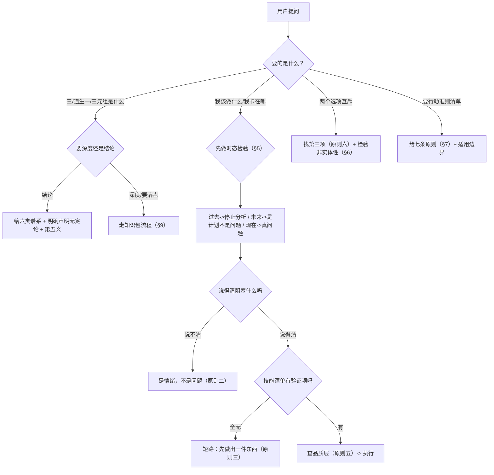

# 「三」之本体论与三元组诊断工作流 Skill

> **渐进式披露**：L0 [ONBOARDING](../../ONBOARDING.md) → L1 本文件（触发词 + 场景决策树 + 六类谱系 + 诊断法 + 七条原则 + 模式 + 门禁 + 安全清单）→ L2 完整探究过程 [知识包 `projects/awesome-okf-xs/doc/bundles/guoxue/laozi/dao-san-triads/`](../../../projects/awesome-okf-xs/doc/bundles/guoxue/laozi/dao-san-triads/index.md)（50 条事实 / 4 洞察 / 1 模式 / 9 条对抗审查；2026-10-03 起为唯一可信源）。
>
> **术语速查**：三之位（「三」不是第三个实体，而是「一」与「二」之间的关系位）；实体链（三元组三项都是东西）；关系位（让二构成整体的第三项）；时态检验（用过去/现在/未来筛选问题清单）；短路规则（技能清单全无验证时，框架不适用，先做出一件东西）；版本纪律（《老子》引文须标甲本/乙本/今本/郭店楚简本，不得笼统称「帛书本」）。

## 1. Skill ID

`dao-san-triads`

## 2. 功能描述

把「三是什么」与「我该怎么活」这两个问题接到同一条结构上。**本技能解决三类失败**：

| 失败模式 | 表现 | 拦截机制 |
|---|---|---|
| **单一权威口吻** | 随口断言「三就是和气/天地人」，把两千年无定论的问题说成有定论 | §3 六类谱系 + 证据强度评级 + 不可裁决边界声明 |
| **附会古人** | 用「《老子》早就说了」包装现代重构；或反向声称中西思想互相影响 | §6 版本纪律 + 类比≠影响声明 |
| **正确的废话** | 「要接纳自己」「要坚持」——无可判定判据，无法执行 | §4 七条原则，每条含判据 + 反例 + ≤5 分钟动作 |

**核心能力**：六类解释谱系 → 第五义统一模型 → 时态检验 → 两组三元组关联 → 七条生存指南 →「三之位」可迁移模式。

> **为什么核心约束是「无定论是问题本身的性质」？** 「三」指某个具体事物（名词），还是表示递进关系的序数？**文本本身不提供元语言，无法自我裁决**。任何宣称已定论的说法都在可疑地扩大文本的承诺范围。**给出「模型 + 判据 + 边界」比给出假答案更有用**——因为前者可复用、可修正、且标明了自己的置信度。
>
> **为什么「三」必须是关系位而不是实体？** 若「三」是第三个实体，则「二生三」就只是数量递增，无需解释——但**「二生三」恰恰是全句唯一不可直接理解的一步**（2 不生 3）。形式上它标记的是**质的跃迁**：「一」重新出现在「二」之中。**追问「第三个是什么」问错了对象**，正确的问题是「为什么两个能构成一个整体」。
>
> **为什么时态检验放在最前面？** 因为它是**成本最低、误判代价最大**的过滤器：把「我父母从小管得太严」当问题分析，会产生大量无力感却不产生任何行动。**先划掉不可改变项，再谈其余**，比任何分析技巧都更省时间。
>
> **为什么七条原则要「极简」？** 判据的强度不来自条数，而来自**每条能否当场回答是/否**。七条已覆盖诊断层 + 能力层 + 关系位三层；再加条目会开始出现「说了等于没说」的安全条款，反而降低整体可用性。

## 3. 何时使用本技能

**触发词命中即用**，尤其以下四类场景：

* **概念探究**：「三生万物」「道生一」「二生三」的含义、「三」指什么、三元组的哲学根据
* **自我诊断**：我卡在哪、该做什么、我是不是有问题、要不要做这件事、我到底想要什么
* **行动准则**：要极简原则、生存指南、可操作的判断标准、能今天就用的方法
* **二元僵持**：两个选项互斥、怎么都选不了、想跳出非此即彼
* **知识沉淀**：把古典哲学概念探究做成可审计的知识包/ Wiki

**不适用**（须转其他路径）：

| 场景 | 转|
|---|---|
| 需要医疗/心理/法律/财税/投资的专业判断 | 拒绝作答，转专业机构（见 §8 安全清单） |
| 要逐章校勘或全书记载 | 不做，范围限于第四十二章及必要对照章句 |
| 纯头脑风暴（无落盘需求） | 直接答，不走本工作流 |
| 单个概念的一句话解释 | 答结论即可，不必启动全流程 |

## 4. 场景决策树

## 5. 六类「三」解释谱系（回答「三是什么」）

> **使用纪律**：给结论时**必须同时给出「学界未定论」这一事实**，不得单方面采信一说。

| # | 解释 | 代表 | 主张 | 证据强度 |
|---|---|---|---|---|
| 1 | **和气说** | 《淮南子·天文训》、司马光、冯友兰 | 三 = 阴阳交合产生的和气 | 中高 |
| 2 | **天地人三才说** | 河上公、成玄英 | 三 = 天地人 | 中 |
| 3 | **二与一为三说** | 王弼思路、庄子路径、**冯国超 2024 新解** | 三 = 一 + 天地（2+1=3） | 高（结构逻辑） |
| 4 | **模式说/虚指说** | 蒋锡昌、刘笑敢、池田知久 | 一二三只是「愈生愈多」的模式标记，无具体所指 | 高（作为方法论警告） |
| 5 | **三合生物观** | 《穀梁传》《楚辞·天问》《文子》 | 三 = 阴 + 阳 + 天，三方共成才能生 | 中高（先秦生物观） |
| 6 | **本体显现说** | 冯国超（2024-12） | 三 = 本体在作用中的展开，「一」重新出现 | 中（新近提出，待检验） |

**可排除**：「三 = 天地人」的完整形态（与《老子》他处贬低「人」的立场冲突）；「三 = 精气神」（时代错置）。
**不可排除**：1 vs 3（本体论分歧：三是新物 vs 原物+新分化）、4 vs具体所指（方法论警告与可检验主张可并存）、「中气 vs 冲气」（整理者明言「尚待研究」）。

### 第五义：「三」是关系位（本技能原创模型）

> **「三」不是第三个实体，而是「一」与「二」之间的关系位本身——是维持分化中的系统仍保持完整性的那个结构。**

| 支撑 | 内容 |
|---|---|
| **算术** | 「二生三」是三段跳中**唯一不可直接理解**的一步（2 不生 3）——形式上标记了质的跃迁而非数量递增 |
| **文本** | 「万物负阴而抱阳」——「负」与「抱」是**双向持守**，万物同时持守着一个不分的状态 |
| **比较** | 庞朴：分成对立的两还是不稳定状态，**只有变成三才最稳定**（三角形最稳定） |

**四条不可声称**（防止附会）：

1. 不主张「老子原意就是关系优先」——《老子》全书无「关系」范畴，此为现代重构
2. 不主张第五义优于冯国超新解——**二者互补**（他给机制，本模型给一般化形式）
3. 不主张六类解释已被统一——统一模型**容纳**六类，不**消解**六类
4. 不主张可据此建立工程原则而不区分类比与推导

## 6. 时态检验与两组三元组关联

### 6.1 时态检验（最快的诊断）

> **「我现在纠结的事，属于哪个时态？」**

| 时态 | 处置 | 典型误判 |
|---|---|---|
| **过去**（已发生、不可改） | **停止分析**，接受它 | 「我父母从小管得太严」——分析它产生不了行动 |
| **现在**（正在发生、可干预） | **这是真问题所在** | — |
| **未来**（还没发生、可预防） | **这是计划，不是问题**，不进问题清单 | 用「分析未来可能性」替代「解决当下问题」 |

> **这是 `role-model-methodology` 的补充**：该技能只给了「不可逆」一个维度；**时态维度**进一步把「还没发生的事」也排除出问题清单。

### 6.2 两组三元组（单一来源：`role-model-methodology`）

| 框架 | 项 | 定义 | 判据 |
|---|---|---|---|
| **诊断层** | 真目标 | 真正想去的方向 | 能回答，答案通常会变 |
| | 真需求 | 目标必须具备的**能力/状态** | 能——唯一的客观判据 |
| | 真问题 | 阻碍到达目标的**具体障碍** | 能——必须具体到可观察 |
| **能力层** | 品质 | 你的选择倾向 | 无收益、无人监督时你怎么选？ |
| | 技能 | 可重复产出的能力 | 你能在什么条件下稳定做出什么？ |
| | 身份 | 你的自我叙事 | 你的行为与这个叙事一致吗？ |

**与时间的三元映射**：

| 时态 | 诊断层 | 能力层 |
|---|---|---|
| 过去 | 伪问题（对过去的解释） | 品质（已累积的选择倾向，不可现在改写） |
| 现在 | 真问题（当前可观察） | 技能（当下可展示的产出） |
| 未来 | 真目标（方向） | 身份（尚未被证据支撑的叙事） |

**关键不对称（本技能发现）**：生成论的「三」是**关系位**（不是实体），而两组三元组的第三项**放的都是实体**（真需求是能力、身份是叙事）。**把「三」误认为实体，是「表演」的生成论根源**——身份本应是关系位，一旦被当成可独立声称的实体（「我是一个终身学习者」），就退化为表演。

**三条失败模式的生成论诊断**：

| 症状 | 阶段 | 解读 |
|---|---|---|
| 只有品质没有技能 = 空谈 | 停在「一」 | 「一」不含差异，不能产生具体行动 |
| 只有技能没有身份 = 工具 | 停在「二」 | 二的对立无法自行产生意义 |
| 只有身份没有技能 = 表演 | 跳过「二」 | 「三」不能被跳过，它是「二」整合后才出现的 |

> **实践含义**：遇「空谈/工具感/表演感」**不必自我批评**，只需检查自己在哪个阶段。

**已知定义分叉（只登记，不擅改）**：`role-model-methodology` SKILL.md 第 159 行作「能力/缺口」，案例包 `03-framework-problem-need-goal.md:22` 作「能力/状态（缺口）」。采用后者更合理（「能吸引学生」不是可练习的技能，而是某种局面），但**修改需升版本，超出本技能范围**。

## 7. 七条生存指南（收敛产物）

> **7 条，正文 ≤1200 字，每条判据都能当场回答是/否。**

| # | 原则 | 一句话判据 | 动作 |
|---|---|---|---|
| 一 | 切掉不可逆项 | 这件事我能改变吗？不能就划掉 | 写下最纠结的事，标时态 |
| 二 | 说不清阻塞就不是问题 | 它阻塞了什么具体结果？ | 改写成「我不能\_\_\_，因为\_\_\_受阻」 |
| 三 | 先做出一件东西 | 技能清单里有实际验证的项吗？ | 写出过去 30 天产出的一件他人能看到的东西 |
| 四 | 真需求是能力/状态 | 能写成「能 X」或「处于 X 状态」吗？ | 把「我需要 X」改写为「我需要能 X」 |
| 五 | 拒绝对你有利的 | 上月拒绝过一次诱惑吗？ | 今天做一件不告诉任何人、短期无回报的事 |
| 六 | 二元对立必有第三项 | 找 30 秒，问「有没有第三项」 | 写下最大的二选，旁补一行「第三项是什么」 |
| 七 | 先设计连接，再设计两端 | 谁给谁、给什么、什么格式？ | 在正在做的协作里写下这三句 |

**结构**：一、二 = 诊断层；三、四、五 = 能力层；六 = 「二生三」的行动版；七 = 「三 = 关系位」的行动版。**顺序不可颠倒**——跳过一二直接做三四即空谈。

**适用边界**：适用于个人成长、职业决策、关系处理、协作与系统设计、复盘自我诊断。
**不适用于**：① 临床心理健康问题（须转专业干预）；② 需即时行动的安全场景（**先处理事**）；③ 医疗/法律/财税/投资专业判断；④ 「等状态好了再开始」的情形。

## 8. 「三之位」可迁移模式

> **成熟度 L2**（2026-10-05 由 L1-draft 升级；已在哲学、工程、先秦生物观、现世社群、现世修行社群五个语境出现结构重现，见知识包 §6 与 examples/02 §5.2）。**⚠️ 五域均为本工作流自行认定，缺外部独立复查**；证据为跨域结构重现而非应用成功统计，待外部复查或他任务复用后再议升级。

**定义**：当任何系统出现「二」的僵持时，**不增加实体，而在二分之间寻找使其成为一个整体的关系位。**

**触发场景**：思维僵持在二选一；社群部门各自成群不相通；关系走到「先定关系还是先定人」的岔路口；两个概念争抢唯一解释权。

**五步**：

1. **命名二**——把僵持两方各写成一个词（不用反义词）
2. **找关系位**——问「第三项是一个东西，还是『为什么这两个构成一个整体』？」
3. **检验非实体性**——若第三项能独立被指出是什么，它大概率是实体（**找错了位**）
4. **表述为关系**——用「如何连接/如何整合/为何构成整体」重述冲突
5. **落地动作**——只设计连接方式，不动两端

**五个反模式**：

| # | 反模式 | 诊断 |
|---|---|---|
| 1 | 把第三项当实体（找一个「又 A 又 B 的东西」） | 过不了检验 3 |
| 2 | 跳过二直接谈三（只有愿景无产出） | 停在「一」 |
| 3 | 停在二无限细分，永不整合 | 二的对立不自行产生意义 |
| 4 | 用「第三项」回避选择（「都要」） | 整合不是取消选择 |
| 5 | 把结构类比当史实来源（「《老子》早说了」） | 结构相似 ≠ 来源相同 |

**三问检验**（任一为否即未落地）：

1. 第三项能否用「如何连接/为何整体」表述？
2. 是否已识别并规避至少一个反模式？
3. 连接方式是否已写成具体动作（谁给谁、给什么、什么格式）？

**跨域迁移记录**：庞朴「一分为三」（哲学）｜`vendor/flexloop` Ψ=Ψ(Ψ) → 三=等号（工程）｜《穀梁传》三合而后生（先秦）｜daoapps 四站 → 结伴（现世社群·系统层连接）｜「明君翻牌」单点聚焦（现世修行社群·决策层连接；第五域，证据为 AI 会议纪要走查非逐字稿）。**五个领域各自浮现「三 = 关系/整合位」的结构**——这是本模式最有力的证据；但五域均为自行认定，待外部独立复查。**方法论模式库条目**：[three-as-relation-position](../../../docs/retrospective/patterns/methodology-patterns/governance-strategy/three-as-relation-position.md)（L2，2026-10-05 入库）。

## 9. 知识包沉淀流程（需落盘时）

深度探究按七概念编排执行，**depth=deep 时的产物落盘清单**：

| 阶段 | 产出 | 硬约束 |
|---|---|---|
| **F** 第一性原理 | 5 条待检验假设 + 4 条公理 | 假设须含「若不成立会怎样 / 检验方式 / 检验结论」 |
| **R** 事实采集 | F-001~F-0xx 事实清单 + 来源键 S01~Sxx + 信源分级 | **≥25 条；无因果推断词**（因为/导致/因此/所以/使得/从而）；推断不得混入 |
| **I** 洞察 | ≥3 条四元组（陈述+证据+反常识+行动） | 维度互不重叠；**≥2 条挑战默认假设** |
| **E** 模式 | 「三之位」等可迁移模式 | 触发 + 步骤 + **≥3 反模式** + 检验标准 + 跨域迁移 + 成熟度 |
| **V** 对抗审查 | 4 视角 × ≥5 条具体意见 | 采纳 ≥2 并**回归确认**；被推翻假设显式记录；**禁表演式审查** |
| **A/C** 原子化+结晶 | 知识包 + Skill 萃取 | 双索引登记 + 门禁脚本通过 |

**落盘位置**（按内容敏感度）：

| 内容级别 | 判定 | 位置 |
|---|---|---|
| **公开** | 公版古籍、公开学术、公开网页 | 根 `docs/knowledge/<theme>/` |
| **私域** | 内部会议、私域链接、个人笔记 | `playground/<user>/` |

> **禁止**写入 `.agents/docs/`（已于 2026-08-31 废止）。
> **子模块只读**：`projects/` 与 `vendor/` 下的 submodule 只能读取引用，**零写入**，须以 `git status` 验证。

## 10. 质量门自检

| 门 | 要求 |
|---|---|
| **G1** | 事实 ≥20 条（深度 ≥25），**无因果推断词**，每条可溯源 |
| **G2** | 洞察为完整四元组，维度互不重叠，≥2 条反常识 |
| **G3** | 模式含触发 + 步骤 + ≥3 反模式 + 检验 + 跨域迁移 |
| **G4** | 行动原子化，每条含判据 + 反例 + ≤5 分钟动作 |
| **V** | 4 视角、意见 ≥5、采纳 ≥2、推翻假设显式 |

**交付前必查**：

- [ ] 是否把「学界未定论」说成了「有定论」？
- [ ] 是否每条《老子》引文都标了版本（甲本/乙本/今本/郭店楚简本）？
- [ ] 是否把结构类比说成了史实影响？
- [ ] 生存指南是否 ≤1200 字、≤7 条、每条含判据与反例？
- [ ] 原则六是否可能被读成「一切矛盾都能调和」？（须带边界）

## 11. 安全检查清单

> **本技能输出哲学与行动框架，不提供专业建议。**
>
> **逐项确认后方可输出涉及以下任一项的建议**：

- [ ] **非医疗/心理/法律/财税/投资建议**——涉及上述领域一律转专业机构
- [ ] **危机识别**——若用户表达自伤、绝望或严重心理困扰，**停止框架分析**，先转介专业帮助
- [ ] **不代替治疗**——本技能不是心理治疗，临床问题须由专业人员处理
- [ ] **即时安全优先**——需要即时行动的安全场景，**先处理事，再处理问题清单**
- [ ] **不做命运断言**——不预测个人结果，不宣称某选择必导向某结局
- [ ] **引用纪律**——引文须标版本；**不得伪造出处**（「结伴」不见于今本与帛书本《老子》，该站公开声明不宣称典出《道德经》——伪造出处一次即毁掉全部信任）
- [ ] **只读边界**——`projects/`、`vendor/` 子模块零写入
- [ ] **不修改他方资产**——定义分叉只登记，回写需另行授权与升版本
- [ ] **类比不升格**——输出「与《老子》相似」前，须确认已标注「结构类比，非影响关系」

### 幂等性与重复执行

本技能**天然幂等**：全部产出为只读推理与文档，**不写业务数据、不调外部API、不改用户文件状态**。

| 场景 | 重复执行的行为 |
|---|---|
| 概念问答 | 每次独立推理，结论一致；不产生副作用 |
| 自我诊断 | 每次基于用户当次输入重新判定，**不缓存用户状态、不累积画像** |
| 知识包沉淀 | 覆盖同路径文件；**不追加重复条目**，重跑前先确认是否需保留旧版本 |
| 索引登记 | `README.md` / `02-skills.md` 各一行，**重跑须先检索是否已登记**（避免重复行） |

> **注意**：文档覆盖属破坏性操作。若目标知识包已存在且内容不同，**先询问用户是覆盖还是另开版本**，不得静默覆盖。

## 12. Gotchas（隐性陷阱，无错误码）

> 这些坑不会报错，只会让输出「看起来对」但实质错。

| # | 陷阱 | 症状 | 规避 |
|---|---|---|---|
| G1 | **把「三」当实体找第三极** | 给出一个「又 A 又 B 的东西」 | 过§8 检验 3：能独立指出是什么 → 找错了位 |
| G2 | **版本混称** | 笼统写「帛书本说……」 | 甲本/乙本/今本/楚简本**四者不得混称**；甲本损掩处须标出 |
| G3 | **结构类比升级为影响论** | 「《老子》的思想传到西方影响了奥古斯丁」 | 无传递链条 → 只能写「结构类比」，并显式声明 |
| G4 | **旁证当定论** | 把庞朴/vendor 的印证说成「学术界公认」 | 这些是**独立印证**（L1-draft），不是权威结论 |
| G5 | **反常识当反直觉** | 为标新立异而标新立异 | 反常识点须有F-xxx 证据支撑，否则删掉 |
| G6 | **原则六被读成「什么都能调和」** | 用户据此放弃真实冲突 | 必须带边界：**有些对立是真实互斥，找不到第三项就该接受** |
| G7 | **时态检验越权** | 把「未来」的计划当成问题去分析 | 计划不进问题清单；但**预警性风险除外**（真会发生的须处理） |
| G8 | **短路规则误用** | 「先做出一件东西」被读成「反对规划」 | 短路只针对**技能清单全无验证**的情形，不是普遍建议 |
| G9 | **用子模块内容反推设计意图** | 「该站显然是按《老子》设计的」 | `origin.md` 未提哲学框架；**结构相似 ≠ 来源相同** |

## 13. 相关资产

| 资产 | 关系 |
|---|---|
| [`projects/awesome-okf-xs/doc/bundles/guoxue/laozi/dao-san-triads/`](../../../projects/awesome-okf-xs/doc/bundles/guoxue/laozi/dao-san-triads/index.md) | L2 知识底座（50 事实 / 4 洞察 / 1 模式 / 9 条审查；只读 submodule，唯一可信源） |
| [`.agents/skills/role-model-methodology/SKILL.md`](../role-model-methodology/SKILL.md) | 两组三元组的**定义本体唯一来源**（v1.1.0，471 行） |
| [`.agents/skills/seven-concepts-cmd/SKILL.md`](../seven-concepts-cmd/SKILL.md) | 本技能 §9 的编排引擎 |
| `vendor/flexloop/docs/general/philosophy/engineering/three-as-interface.md` | 「三 = 关系」的工程独立印证（只读） |
| `projects/awesome-okf-xs/doc/bundles/guoxue/laozi/boshu-reading/` | 甲乙本异文对照范式（只读） |
| `projects/daoapps.github.io/doc/jieban/origin.md` | 四站现世样本（只读） |

## 14. Changelog

| 版本 | 日期 | 变更 |
|---|---|---|
| v1.0.2 | 2026-10-05 | 修复章节重复编号：两个「## 12」改为 §12 Gotchas / §13 相关资产 / §14 Changelog（编号连续，无交叉引用受影响） |
| v1.0.1 | 2026-10-05 | §8「三之位」随知识包升级 L1-draft→L2（第五迁移域「现世修行社群·单点聚焦」，见 bundle examples/02 §5.2）；跨域迁移记录补第五域、自认定 caveat 与模式库条目回链；模式正式入库 `docs/retrospective/patterns/methodology-patterns/governance-strategy/three-as-relation-position.md` |
| v1.0.0 | 2026-10-03 | 首次创建。萃取自 `docs/knowledge/dao-san-triads/` 知识包（session sc-20261003-dao-san-yuan）：六类「三」解释谱系 + 第五义关系位模型 + 时态检验 + 两组三元组关联 + 七条生存指南 + 「三之位」模式（L1-draft） |
