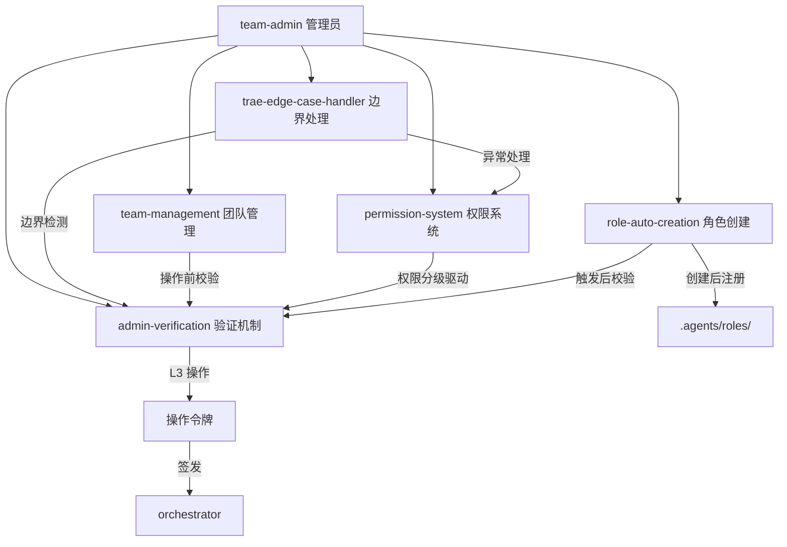

# 团队管理模块索引

本目录是团队管理功能模块的容器，存放团队管理员角色定义、团队生命周期管理、角色权限系统、管理员验证机制与新角色自动创建流程。模块遵循最小权限原则与操作留痕原则，确保团队治理安全、合规、可追溯。

## 目录结构

```
.agents/teams/
├── README.md                      # 本文件，模块索引
├── team-admin.md                  # 团队管理员角色定义
├── team-management.md             # 团队创建与管理核心功能
├── permission-system.md           # 角色权限系统设计
├── admin-verification.md          # 管理员权限验证机制
├── role-auto-creation.md          # 新角色自动创建触发与执行流程
├── trae-edge-case-handler.md      # Trae 边界情况处理规范
├── flexloop-team.md               # flexloop 子模块治理团队定义
├── flexloop-team-operations.md    # flexloop 团队工作流操作手册
├── mermaid-team.md                # Mermaid图表管理专项团队定义
└── data/                          # 团队数据文件目录
    └── team-flexloop.yaml         # flexloop 团队配置数据
```

## 模块职责矩阵

| 文件 | 职责 | 核心内容 |
|---|---|---|
| team-admin.md | 团队管理员角色定义 | 角色定位、特权清单、能力边界 |
| team-management.md | 团队生命周期管理 | 团队数据模型、创建/成员/配置/解散流程 |
| permission-system.md | 角色权限体系 | RBAC 模型、权限分级、分配与回收规则 |
| admin-verification.md | 管理员验证机制 | V1/V2/V3 验证分级、操作令牌、日志规范 |
| role-auto-creation.md | 新角色自动创建 | 触发条件、执行流程、角色文件模板 |
| trae-edge-case-handler.md | Trae 边界情况处理 | 四大边界场景分类、三级判断标准、异常处理流程、特殊场景适配 |
| flexloop-team.md | flexloop 子模块治理团队 | 治理范围、协作四原则、标准工作流、合规检查、应急处理 |
| flexloop-team-operations.md | flexloop 团队操作手册 | 三大工作流详细步骤、验证清单、命令参考、应急方案、检查清单 |
| mermaid-team.md | Mermaid图表管理专项团队 | 治理范围、安全编码六规则、三大工作原则、协作工作流、合规检查 |

## 核心概念关系



## 权限分级速查

| 级别 | 验证级别 | 典型操作 | 校验要求 |
|---|---|---|---|
| L1 公开 | V1 基础验证 | 查看团队信息 | 角色标识合法性 |
| L2 内部 | V2 身份验证 | 分配角色、修改配置 | 管理员身份 + 权限校验 |
| L3 特权 | V3 双重验证 | 创建角色、解散团队 | 管理员身份 + 操作令牌 |

## 使用流程

### 创建新团队

1. team-admin 接收 orchestrator 的团队组建指令。
2. 执行 V2 身份验证，确认 `create_team` 权限。
3. 按 `team-management.md` 的团队数据模型生成团队文件。
4. 通知 orchestrator 登记全局团队信息。

### 创建新角色

1. 识别需求并判定是否满足 `role-auto-creation.md` 的触发条件。
2. 生成触发报告，提交 team-admin 评估。
3. 向 orchestrator 申请操作令牌。
4. 执行 V3 双重验证。
5. 在 `.agents/roles/` 下创建角色文件，同步更新索引。
6. 通知相关方并归档日志。

### 分配成员角色

1. team-admin 接收角色分配请求。
2. 执行 V2 身份验证，确认 `assign_role` 权限。
3. 按 `permission-system.md` 校验权限互斥规则。
4. 更新团队成员列表，记录操作日志。
5. 通知受影响成员。

## 现有团队清单

| 团队 ID | 团队名称 | 治理领域 | 成员角色 | 定义文件 | 操作手册 | 数据文件 |
|---|---|---|---|---|---|---|
| team-flexloop | flexloop 子模块治理团队 | vendor/flexloop 自有协作子模块全生命周期治理 | architect, developer, reviewer, tester | [flexloop-team.md](flexloop-team.md) | [flexloop-team-operations.md](flexloop-team-operations.md) | [data/team-flexloop.yaml](data/team-flexloop.yaml) |
| team-mermaid | Mermaid图表管理专项团队 | 全项目Mermaid图表质量标准、模板维护、检查脚本、复杂图表协作创建、批量质量扫描 | architect, developer, reviewer, tester | [mermaid-team.md](mermaid-team.md) | - | - |
| team-home-assistant | Home Assistant 集成治理团队 | Home Assistant智能家居系统集成、设备控制、状态查询、服务调用（可选模块） | orchestrator, developer, tester, reviewer, architect | [home-assistant-team.md](home-assistant-team.md) | - | - |

## 与其他模块的关系

| 关联模块 | 关系 | 说明 |
|---|---|---|
| `.agents/roles/` | 下游 | 新角色文件创建于此目录 |
| `.agents/prompts/` | 下游 | 新角色须同步创建系统提示词 |
| `.agents/protocols/` | 引用 | 遵循交接与消息传递协议 |
| `.agents/workflows/` | 协作 | 团队管理流程与标准工作流衔接 |
| `AGENTS.md` | 上游 | 角色定义索引须同步更新 |
| `.agents/scripts/` | 下游 | 脚本须遵循边界处理规范，核心分支调用边界检查 |

## 使用约束

1. **权限前置**：所有管理操作须先完成对应级别的验证。
2. **操作留痕**：所有 L2/L3 操作须记录审计日志。
3. **最小权限**：权限分配遵循最小权限原则，禁止过度授权。
4. **触发条件强制**：新角色创建必须满足触发条件，禁止凭空创建。
5. **索引同步**：角色或团队变更后须同步更新所有相关索引。
6. **归档留存**：触发报告与操作日志须归档保存，便于追溯。
