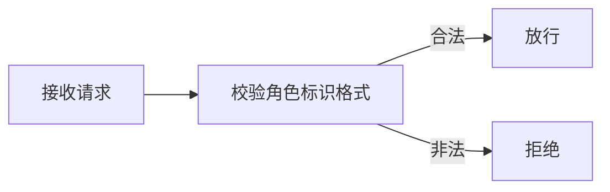
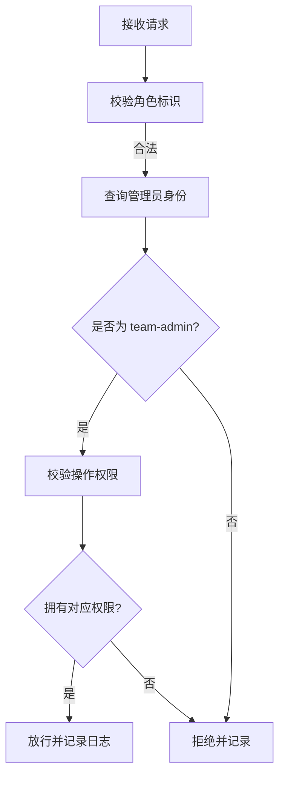
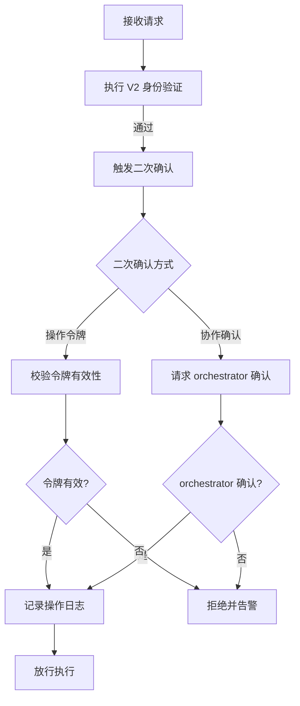

# 管理员权限验证机制

本规范定义 team-admin 角色的身份验证与权限校验流程，确保管理操作由合法管理员发起，防止越权操作与权限滥用。验证机制按操作敏感度分级，平衡安全性与执行效率。

## 验证分级

| 验证级别 | 适用操作 | 校验内容 | 执行频率 |
|---|---|---|---|
| V1 基础验证 | L1 公开权限操作 | 角色标识合法性 | 每次操作 |
| V2 身份验证 | L2 内部权限操作 | 角色标识 + 管理员身份 | 每次操作 |
| V3 双重验证 | L3 特权权限操作 | 角色标识 + 管理员身份 + 二次确认 | 每次操作 |

## V1 基础验证流程

适用于读取团队信息、查看成员列表等公开操作。



**校验内容**：
1. 角色标识符合命名规范（`{role}-{序号}` 或预定义 ID）。
2. 角色存在于当前团队成员列表中。

## V2 身份验证流程

适用于角色分配、配置修改等内部操作。



**校验内容**：
1. 通过 V1 基础验证。
2. 发起方角色为 `team-admin`。
3. 发起方拥有请求操作对应的权限（见 `permission-system.md`）。

## V3 双重验证流程

适用于角色创建、团队解散、权限回收等特权操作。



**二次确认方式**：
- **操作令牌**：team-admin 须提供一次性操作令牌，令牌由 orchestrator 签发，有效期 5 分钟。
- **协作确认**：涉及团队解散或大规模权限变更时，须由 orchestrator 显式确认。

## 操作令牌机制

操作令牌用于 V3 验证的二次确认，采用 YAML 格式定义。

```yaml
token:
  id: "token-{uuid}"
  issuer: "orchestrator"
  grantee: "team-admin"
  operation: "create_role"
  target: "role-data-scientist"
  issued_at: "2026-06-23T10:00:00Z"
  expires_at: "2026-06-23T10:05:00Z"
  signature: "{签名}"
```

**令牌规则**：
1. 令牌须由 orchestrator 签发，team-admin 不得自行生成。
2. 令牌一次性使用，执行后立即失效。
3. 令牌有效期 5 分钟，超时自动作废。
4. 令牌须包含签名，防止伪造。
5. 令牌须绑定具体操作与目标，禁止跨操作复用。

## 验证失败处理

| 失败场景 | 处理方式 | 告警级别 |
|---|---|---|
| 角色标识非法 | 拒绝操作，记录日志 | low |
| 非管理员发起 L2 操作 | 拒绝操作，记录日志 | medium |
| 非管理员发起 L3 操作 | 拒绝操作，告警 orchestrator | high |
| 令牌无效或过期 | 拒绝操作，要求重新申请 | medium |
| 短时间多次失败 | 暂停该角色操作权限 5 分钟 | high |

## 操作日志规范

所有 V2/V3 验证的操作须记录日志，采用 YAML 格式。

```yaml
log:
  timestamp: "2026-06-23T10:00:00Z"
  actor: "team-admin"
  operation: "assign_role"
  target: "developer-001"
  verification_level: "V2"
  result: "success"
  details: "为 developer-001 分配 developer 角色"
```

**日志字段**：

| 字段 | 类型 | 是否必填 | 说明 |
|---|---|---|---|
| timestamp | string | 是 | 操作时间戳，ISO 8601 格式，UTC 时区 |
| actor | string | 是 | 操作发起方角色标识 |
| operation | string | 是 | 操作类型，对应权限清单 |
| target | string | 是 | 操作目标 |
| verification_level | string | 是 | 验证级别：V1/V2/V3 |
| result | string | 是 | 操作结果：success / failure |
| details | string | 否 | 操作详情 |

## 使用约束

1. **验证前置**：所有管理操作须先完成对应级别的验证，禁止跳过验证直接执行。
2. **令牌不可复用**：操作令牌一次性使用，禁止复用已使用的令牌。
3. **失败重试限制**：同一角色短时间（5 分钟）内验证失败超过 3 次，暂停其操作权限。
4. **日志不可篡改**：操作日志一经写入不得修改，仅可追加。
5. **告警及时**：high 级别告警须立即通知 orchestrator，不得延迟。
6. **令牌申请留痕**：team-admin 申请操作令牌须说明操作目的，orchestrator 签发时记录申请理由。
